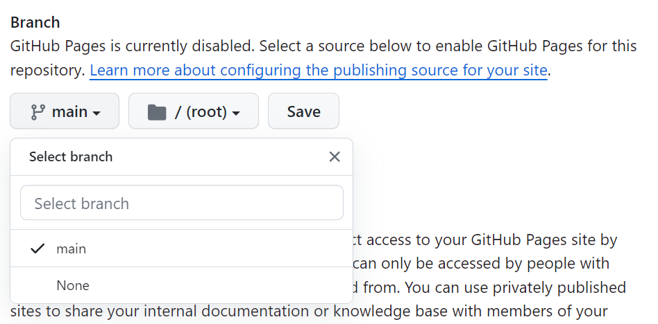

### 1. GitHub에서 리파지토리 생성(생성되어 있는 리파지토리로 작업할 경우 건너뜀)
- Public 체크
- add a README file 체크
- 리파지토리명을 *아이디.github.io* 

### 2. 해당 리파지토리 clone하여 html파일 등 작성하고 github에 올린다.

### 3. 해당 리파지토리 setting - Pages탭에서 브랜치를 선택하고 save

### 4. https://아이디.github.io/ 으로 접속(적용될 때까지 시간이 몇분 소요됨)

