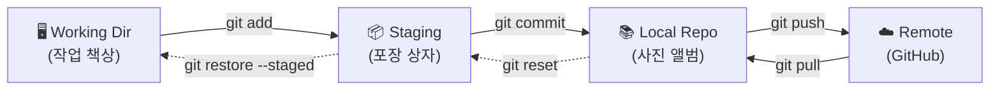



## 학습 목표

- 버전 관리가 왜 필요한지 이해하고, Git과 GitHub의 차이를 설명할 수 있다
- 4-Zone 멘탈 모델(Remote ↔ Local Repo ↔ Staging ↔ Working Dir)로 모든 Git 명령어의 흐름을 파악할 수 있다

<a id="toc"></a>

## 진행 순서

1. [과정 소개](#intro) - 학습 대상, 사용 도구
2. [과정 구조](#structure) - 4 Parts, 12 chapters
3. [4-Zone 멘탈 모델](#zones) - 모든 명령어의 지도
4. [핵심 비유 미리보기](#analogies) - 각 개념을 쉽게 기억하는 방법
5. [전체 흐름](#flow) - 학습 로드맵

---

# Git & GitHub — 비전공자를 위한 버전 관리

<a id="intro"></a>

## 1️⃣ 과정 소개 [↑](#toc)

### 학습 대상

이 과정은 **프로그래밍을 처음 배우는 비전공자**를 위한 과정입니다.
터미널을 처음 열어보는 분도, Git이 무엇인지 모르는 분도 처음부터 함께 시작합니다.

> "파일 이름에 '최종_진짜최종_v3'를 붙여본 적 있다면, 이 과정이 그 문제를 해결해 줍니다."

### 사용 도구

| 도구 | 버전 | 용도 |
|------|------|------|
| Git | 2.49+ | 버전 관리 도구 |
| GitHub | 최신 | 클라우드 코드 저장소 |
| VS Code | 최신 | 코드 편집기 |
| Git Bash (Windows) / 터미널 (Mac) | - | 명령어 입력 환경 |

### 이 과정을 마치면

- 내 컴퓨터에서 Git으로 버전을 관리하고 GitHub에 올릴 수 있다
- 브랜치를 만들어 실험하고, 팀원과 Pull Request로 협업할 수 있다
- 실수를 되돌리고, 과거 버전을 복구할 수 있다

---

<a id="structure"></a>

## 2️⃣ 과정 구조 [↑](#toc)

### Part 1 — 기초 (1~2일차)

| 장 | 제목 | 핵심 개념 |
|----|------|-----------|
| [01](/git-new/what-is-vcs) | 버전 관리란? | 타임머신, 게임 세이브, 4-Zone 소개 |
| [02](/git-new/setup) | 설치와 초기 설정 | git config, 터미널 기초, GitHub 가입 |
| [03](/git-new/first-commit) | 첫 번째 커밋 | init, add, commit, log — 핵심 사이클 |
| [04](/git-new/history) | 변경 이력 관리 | diff, log 심화, .gitignore |

### Part 2 — 협업 기초 (3일차)

| 장 | 제목 | 핵심 개념 |
|----|------|-----------|
| 05 | GitHub 연결 | remote, push, clone, pull, SSH 인증 |
| 06 | 브랜치 기초 | switch, merge, 브랜치 전략 |
| 07 | Pull Request | Fork, PR 생성, 코드 리뷰 |

### Part 3 — 실수 복구 (4일차)

| 장 | 제목 | 핵심 개념 |
|----|------|-----------|
| 08 | 되돌리기 기초 | restore, revert, reset soft/mixed |
| 09 | 고급 복구 | reset hard, reflog, cherry-pick |

### Part 4 — 실전 (5일차)

| 장 | 제목 | 핵심 개념 |
|----|------|-----------|
| 10 | 충돌 해결 | 머지 충돌, VS Code 충돌 해결 |
| 11 | 협업 워크플로우 | GitHub Flow, 팀 규칙 |
| 12 | 실전 미니 프로젝트 | 전체 흐름 종합 실습 |

---

<a id="zones"></a>

## 3️⃣ 4-Zone 멘탈 모델 [↑](#toc)

> 이 그림 하나만 이해하면 Git의 모든 명령어가 보입니다.
> "어떤 명령어가 데이터를 어디에서 어디로 옮기는가?"



| 구역 | 비유 | 저장 여부 | 관련 명령어 |
|------|------|----------|------------|
| Working Dir | 작업 책상 | 임시 | `git status`, `git diff` |
| Staging Area | 택배 포장 상자 | 임시 | `git add`, `git restore --staged` |
| Local Repo | 사진 앨범 | 영구 | `git commit`, `git log`, `git reset` |
| Remote | 클라우드 백업 | 영구 | `git push`, `git pull`, `git clone` |

---

<a id="analogies"></a>

## 4️⃣ 핵심 비유 미리보기 [↑](#toc)

| Git 개념 | 비유 | 한 줄 설명 |
|---------|------|----------|
| 버전 관리 | 타임머신 | 언제든 과거로 돌아갈 수 있는 자동 저장 |
| 커밋 | 게임 세이브 포인트 | 실수하면 마지막 세이브로 복구 |
| Working Dir | 작업 책상 | 현재 편집 중인 파일들 |
| Staging Area | 택배 포장 상자 | 커밋에 담을 파일을 골라 담는 단계 |
| Local Repo | 사진 앨범 | 앨범에 붙인 사진은 영구 보존 |
| 브랜치 | 평행 세계 | 메인 타임라인에 영향 없이 실험 가능 |
| 머지 | 두 평행 세계 합치기 | 각자의 변경을 하나로 결합 |
| GitHub | 클라우드 백업 | Google Drive처럼 온라인에 코드 저장 |
| Pull Request | 검토 요청서 | "제 변경사항을 확인하고 승인해주세요" |
| `.gitignore` | 비밀 서류함 | 택배 상자에 절대 넣으면 안 되는 것들 |

---

<a id="flow"></a>

## 5️⃣ 전체 흐름 [↑](#toc)

```
시작: Git이 무엇인지 모르는 상태
     ↓
[Part 1] 기초
  01장 개념(왜?) → 02장 설치/설정 → 03장 첫 커밋 → 04장 이력 관리
     ↓
[Part 2] GitHub + 협업
  05장 원격 저장소 → 06장 브랜치 → 07장 Pull Request
     ↓
[Part 3] 실수 복구
  08장 안전한 되돌리기 → 09장 고급 복구
     ↓
[Part 4] 실전
  10장 충돌 해결 → 11장 팀 워크플로우 → 12장 미니 프로젝트
     ↓
완성: 혼자서도, 팀에서도 Git으로 협업할 수 있는 상태
```

---

> 💡 **학습 팁**: 각 장을 읽을 때 위의 4-Zone 그림을 머릿속에 떠올리세요.
> "지금 실행하는 명령어가 어느 구역에서 어느 구역으로 파일을 옮기는가?"
> 이 질문 하나로 Git의 모든 명령어가 이해됩니다.


