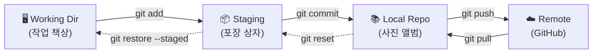



## 학습 목표

- 버전 관리가 없을 때 어떤 문제가 발생하는지 설명할 수 있다
- Git과 GitHub의 차이를 한 문장으로 구분할 수 있다
- 4-Zone 멘탈 모델의 4가지 구역 이름과 역할을 말할 수 있다

<a id="toc"></a>

## 진행 순서

1. [문제: "최종_진짜최종_v3_수정본.docx"](#part1) - 버전 관리 없이 파일을 관리할 때의 고통
2. [해결: 버전 관리 = 타임머신](#part2) - 자동 저장, 언제든 과거로
3. [Git = 게임 세이브 포인트](#part3) - 커밋이라는 저장 지점
4. [Git vs GitHub](#part4) - 내 컴퓨터의 타임머신 vs 클라우드 백업
5. [4-Zone 멘탈 모델 소개](#part5) - 앞으로 모든 명령어를 이해하는 지도
6. [Git은 어디에 쓰이나?](#part6) - 코딩 너머의 활용 분야
7. [정리](#part7) - 핵심 개념 요약

---

# 01장. 버전 관리란? — 타임머신과 게임 세이브

<a id="part1"></a>

## 1️⃣ 문제: "최종_진짜최종_v3_수정본.docx" [↑](#toc)

### 누구나 한 번쯤 겪어본 그 상황

> 당신의 바탕화면에는 지금 이런 파일이 있지 않나요?

```
📁 바탕화면
├── 보고서.docx
├── 보고서_수정.docx
├── 보고서_최종.docx
├── 보고서_최종_수정.docx
├── 보고서_진짜최종.docx
├── 보고서_진짜최종_v2.docx
├── 보고서_진짜최종_v2_팀장검토후.docx
└── 보고서_진짜최종_진짜_이번엔진짜.docx
```

이렇게 하는 이유는 딱 하나입니다.

**"실수했을 때 이전 버전으로 돌아가고 싶어서."**

그런데 이 방식에는 여러 문제가 있습니다.

---

### 파일 이름 방식의 문제점

| 문제 | 설명 |
|------|------|
| 어떤 파일이 최신인지 모른다 | "최종"이 5개인데, 어느 게 진짜 최종? |
| 무엇이 바뀌었는지 모른다 | v1과 v2의 차이가 뭔지 열어봐야 안다 |
| 용량을 낭비한다 | 비슷한 파일 8개가 각각 10MB라면 80MB 낭비 |
| 협업이 불가능하다 | 두 사람이 동시에 수정하면 한 명의 작업이 사라진다 |
| 실수 복구가 불확실하다 | "최종_수정"으로 돌아가면 어디까지 돌아가는 건지 불분명 |

---

### 코드 파일도 같은 문제

개발자들도 Git을 배우기 전에는 똑같이 합니다.

```
📁 내 프로젝트
├── index.html
├── index_backup.html
├── index_이거쓰세요.html
├── index_수정전.html
└── index_진짜최종.html
```

이 파일들 중 어떤 게 실제 운영 중인 파일인지, 팀원에게 설명할 수 있을까요?

---

<a id="part2"></a>

## 2️⃣ 해결: 버전 관리 = 타임머신 [↑](#toc)

> **버전 관리 시스템(VCS, Version Control System)**은 파일의 **모든 변경 기록을 자동으로 저장**합니다.
> 언제든 과거의 특정 시점으로 되돌아갈 수 있습니다 — 마치 타임머신처럼.

### 타임머신 비유

상상해 보세요. 보고서를 쓰다가 실수로 중요한 내용을 지웠습니다.

- **파일 이름 방식**: "아, 어제 저장한 파일이 어디 있더라... '최종'인가, '수정'인가?" 찾다가 포기
- **버전 관리 방식**: `git log`로 기록을 확인하고, 어제 오후 3시 버전으로 즉시 복구

버전 관리 시스템이 해주는 것:

| 기능 | 설명 |
|------|------|
| 변경 기록 보존 | 누가, 언제, 무엇을, 왜 바꿨는지 자동 저장 |
| 과거 복구 | 특정 시점의 파일 상태로 언제든 되돌아갈 수 있음 |
| 차이 비교 | 어제와 오늘의 파일이 어떻게 달라졌는지 한눈에 확인 |
| 동시 작업 | 여러 사람이 같은 파일을 수정해도 충돌을 관리해줌 |

---

<a id="part3"></a>

## 3️⃣ Git = 게임 세이브 포인트 [↑](#toc)

> 게임에서 보스 몬스터 앞에 도달했을 때 세이브 버튼을 누릅니다.
> 혹시 질 것 같으면 "마지막 세이브 포인트"로 돌아갑니다.
> Git의 **커밋(commit)**이 바로 그 세이브 포인트입니다.

### 게임 세이브 vs Git 커밋

| 게임 | Git |
|------|-----|
| 세이브 포인트 | 커밋 (commit) |
| "게임 불러오기" | `git switch` + `git restore` |
| 세이브 파일 목록 | `git log` |
| 저장 시점 메모 | 커밋 메시지 |

---

### 커밋의 특징

- **언제든 남길 수 있습니다**: "기능 A 완성", "버그 수정", "디자인 변경" 등 의미 있는 시점마다
- **되돌아갈 수 있습니다**: 어떤 커밋 시점으로도 복구 가능
- **기록이 쌓입니다**: 프로젝트의 전체 역사가 남습니다

```
커밋 1: "프로젝트 시작 — 빈 파일 생성"       ← 언제든 여기로 돌아갈 수 있음
커밋 2: "메인 페이지 레이아웃 완성"
커밋 3: "로그인 기능 추가"
커밋 4: "버그 수정 — 모바일 화면 깨짐"
커밋 5: "팀장 피드백 반영"                    ← 현재 시점
```

---

<a id="part4"></a>

## 4️⃣ Git vs GitHub [↑](#toc)

> 이 두 가지를 같은 것으로 혼동하는 경우가 많습니다.
> 완전히 다른 것입니다.

### 핵심 구분

> **Git** = 내 컴퓨터에 설치하는 **타임머신 소프트웨어**  
> **GitHub** = 그 타임머신 기록을 **클라우드에 백업**하고 **다른 사람과 공유**하는 곳

### 비유: 다이어리와 복사본

- **Git**: 내 손에 들고 있는 다이어리 — 혼자 쓰는 타임머신
- **GitHub**: 다이어리를 복사해서 인터넷 창고에 보관 + 팀원과 공유

| | Git | GitHub |
|---|-----|--------|
| 위치 | 내 컴퓨터 | 인터넷 서버 (마이크로소프트 소유) |
| 인터넷 필요 | 필요 없음 | 필요함 |
| 역할 | 버전 기록 관리 | 백업, 공유, 협업 |
| 유사 서비스 | - | GitLab, Bitbucket |
| 비용 | 무료 | 기본 무료 (유료 플랜 있음) |

---

### 중요한 사실

Git 없이 GitHub만 사용할 수 없습니다.  
**Git을 먼저 배우고, GitHub는 나중에 연결합니다.**

이 과정에서도 처음 3장은 GitHub 없이 Git만 사용합니다.

---

<a id="part5"></a>

## 5️⃣ 4-Zone 멘탈 모델 소개 [↑](#toc)

> Git을 처음 배울 때 가장 혼란스러운 것은 "명령어를 치면 뭔가 되는데, 도대체 어디서 어디로 가는 거지?" 하는 느낌입니다.
> 4-Zone 모델은 이 혼란을 해결하는 **지도**입니다.

### 4개의 구역



### 각 구역의 역할

| 구역 | 한국어 이름 | 비유 | 역할 |
|------|-----------|------|------|
| **Working Directory** | 작업 디렉토리 | 작업 책상 | 파일을 직접 편집하는 공간 |
| **Staging Area** | 스테이징 영역 | 택배 포장 상자 | 커밋에 담을 파일을 모아두는 공간 |
| **Local Repository** | 로컬 저장소 | 사진 앨범 | 커밋 이력이 영구 저장되는 공간 |
| **Remote** | 원격 저장소 | 클라우드 백업 | GitHub 등 인터넷 서버의 저장소 |

---

### 앞으로 이 그림을 계속 씁니다

이 과정의 모든 명령어 설명에서 "지금 이 명령어는 어느 구역에서 어느 구역으로 이동시킵니다"를 함께 알려드립니다.

예를 들어:
- `git add` → **Working Dir** → **Staging Area**로 이동
- `git commit` → **Staging Area** → **Local Repo**로 이동
- `git push` → **Local Repo** → **Remote**로 이동

"명령어 = 어느 방향으로 이동하는가" — 이것만 기억하면 됩니다.

---

<a id="part6"></a>

## 6️⃣ Git은 어디에 쓰이나? [↑](#toc)

> Git은 프로그래머만 쓰는 도구가 아닙니다.

### 코딩 이외의 활용 분야

| 분야 | 활용 방법 |
|------|----------|
| **문서 관리** | 계약서, 보고서, 논문의 버전 관리 |
| **디자인** | 피그마 대신 SVG, 폰트 파일의 변경 추적 |
| **데이터 과학** | Jupyter Notebook(.ipynb) 버전 관리 |
| **법률** | 계약서 수정 이력 관리 |
| **글쓰기** | 책 원고의 버전 관리 (작가들도 씁니다) |
| **설정 파일** | 서버 설정 파일의 변경 이력 추적 |

### 실제로 Git으로 관리되는 것들

- **리눅스 커널** — Git을 만든 리누스 토르발스가 직접 관리
- **VS Code** — 마이크로소프트가 GitHub에 공개
- **이 강의 교재** — 이 파일들도 Git으로 관리됩니다

---

<a id="part7"></a>

## 7️⃣ 정리 [↑](#toc)

### 핵심 개념 요약

| 개념 | 설명 | 비유 |
|------|------|------|
| 버전 관리 | 파일의 모든 변경 기록을 자동 저장하는 시스템 | 타임머신 |
| Git | 내 컴퓨터에 설치하는 버전 관리 소프트웨어 | 개인용 타임머신 |
| 커밋 | 특정 시점의 파일 상태를 저장하는 행위 | 게임 세이브 포인트 |
| GitHub | Git 이력을 클라우드에 백업하고 공유하는 서비스 | 클라우드 백업 |
| Working Directory | 현재 파일을 편집하는 공간 | 작업 책상 |
| Staging Area | 커밋에 담을 파일을 선택하는 공간 | 택배 포장 상자 |
| Local Repository | 커밋 이력이 저장되는 내 컴퓨터의 저장소 | 사진 앨범 |
| Remote | 인터넷 서버의 저장소 (GitHub 등) | 클라우드 창고 |

---

### 다음 장 미리보기

| 장 | 내용 |
|---|---|
| 2장 | Git 설치와 초기 설정 — Windows/Mac 설치, 터미널 기초, 사용자 정보 설정 |
| 3장 | 첫 번째 커밋 — init, add, commit, log로 이루어진 핵심 사이클 |

---

### 실습 과제

**기본**: 지금 내 컴퓨터의 바탕화면이나 폴더에서 "최종", "수정본", "backup" 같은 이름이 붙은 파일을 찾아보세요. 몇 개나 있나요?

**중급**: 4-Zone 멘탈 모델의 4개 구역을 종이에 그려보세요. 각 구역의 이름과 비유(작업 책상, 포장 상자, 사진 앨범, 클라우드 백업)를 옆에 적어보세요.

**심화**: Git과 GitHub 외에 버전 관리 시스템에는 무엇이 있는지 검색해보세요. SVN, Mercurial과 Git의 차이가 무엇인지 간단히 정리해보세요.


