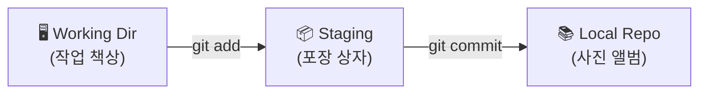



## 학습 목표

- `git init` → `git add` → `git commit` → `git log`의 핵심 사이클을 반복할 수 있다
- Staging Area(스테이징 영역)가 왜 필요한지 설명할 수 있다
- 좋은 커밋 메시지의 형식을 알고 작성할 수 있다

<a id="toc"></a>

## 진행 순서

1. [4-Zone 복습](#part1) - 오늘 다루는 3개 구역
2. [git init](#part2) - 타임머신 활성화
3. [git status](#part3) - 현재 상태 확인 (가장 자주 쓰는 명령어)
4. [git add](#part4) - 포장 상자에 담기
5. [git commit](#part5) - 앨범에 붙이기
6. [git log](#part6) - 앨범 넘겨보기
7. [전체 사이클 반복 실습](#part7) - 3번 반복으로 손에 익히기
8. [VS Code에서 확인](#part8) - 소스 제어 패널 사용법
9. [git commit -am 단축키](#part9) - 실무에서 쓰는 빠른 방법
10. [정리](#part10) - 핵심 개념 요약

---

# 03장. 첫 번째 커밋 — 사진 찍고 앨범에 넣기

> 사진을 찍는다고 자동으로 앨범에 들어가지 않습니다.
> 사진(Working Dir의 파일) 중에서 **보관할 것을 골라** 봉투에 담고(Staging),
> 봉투를 **앨범에 붙여야**(Commit) 비로소 영구 보존됩니다.
> 이 3단계가 Git의 핵심 사이클입니다.

---

<a id="part1"></a>

## 1️⃣ 4-Zone 복습 [↑](#toc)

오늘은 아래 3개 영역을 중심으로 작업합니다. (Remote는 5장에서 다룹니다.)



**오늘의 흐름**: 파일 만들기 → `git add` → `git commit` → `git log`

---

<a id="part2"></a>

## 2️⃣ git init [↑](#toc)

> **Working Dir에 영향을 줍니다.**

> `git init`은 일반 폴더를 "Git이 관리하는 폴더"로 변환합니다.
> 타임머신을 켜는 버튼과 같습니다. 한 번만 실행하면 됩니다.

### 프로젝트 폴더 만들기

```bash
# 홈 폴더로 이동
cd ~

# 실습 폴더 생성
mkdir my-first-git

# 폴더로 이동
cd my-first-git

# 현재 위치 확인
pwd
```

실행 결과:
```
/Users/sunny/my-first-git
```

---

### git init 실행

```bash
git init
```

실행 결과:
```
Initialized empty Git repository in /Users/sunny/my-first-git/.git/
```

---

### .git 폴더 확인

`git init`을 실행하면 숨김 폴더 `.git`이 생성됩니다. 이 폴더가 "타임머신의 본체"입니다.

```bash
ls -la
```

실행 결과:
```
total 0
drwxr-xr-x   3 sunny  staff   96 Apr 10 09:00 .
drwxr-xr-x  20 sunny  staff  640 Apr 10 09:00 ..
drwxr-xr-x   9 sunny  staff  288 Apr 10 09:00 .git
```

> ⚠️ `.git` 폴더를 **절대로 직접 수정하거나 삭제하지 마세요.**
> 이 폴더를 삭제하면 모든 커밋 기록이 사라집니다.
> Git 관리를 완전히 중단하려면 `rm -rf .git`으로 삭제할 수 있지만, 신중하게 결정해야 합니다.

### VS Code에서 확인

VS Code에서 확인: 폴더를 VS Code로 열면 왼쪽 하단에 `main` (또는 브랜치 이름)이 표시됩니다. 이것이 Git이 활성화된 표시입니다.

---

<a id="part3"></a>

## 3️⃣ git status [↑](#toc)

> `git status`는 "지금 이 폴더의 상태가 어떤가요?"를 Git에게 묻는 명령어입니다.
> 작업 중에 가장 자주 실행하게 될 명령어입니다. 언제든 실행해도 괜찮습니다.

### 첫 번째 파일 만들기

```bash
# index.html 파일 생성 (Mac/Linux)
echo "<!DOCTYPE html><html><body><h1>안녕하세요!</h1></body></html>" > index.html

# 또는 VS Code로 파일 생성 후 저장
```

---

### 상태 확인

```bash
git status
```

실행 결과:
```
On branch main

No commits yet

Untracked files:
  (use "git add <file>..." to include in what will be committed)
        index.html

nothing added to commit but untracked files present (use "git add" to track)
```

---

### 출력 해석

| 메시지 | 의미 |
|--------|------|
| `On branch main` | 현재 main 브랜치에서 작업 중 |
| `No commits yet` | 아직 한 번도 커밋하지 않음 |
| `Untracked files` | Git이 아직 추적하지 않는 새 파일 |
| `index.html` | 추적되지 않는 파일 목록 (빨간색) |

> 💡 실무 팁: 무언가 이상하다 싶으면 가장 먼저 `git status`를 실행하세요.
> 현재 상황을 한눈에 보여주므로 다음 할 일을 파악할 수 있습니다.

---

<a id="part4"></a>

## 4️⃣ git add [↑](#toc)

> **Working Dir → Staging Area로 이동합니다.**

> 택배를 보내기 전에, 책상 위의 물건 중 보낼 것만 골라 포장 상자에 담습니다.
> `git add`는 변경된 파일 중 다음 커밋에 포함할 것을 "상자에 담는" 작업입니다.

### 파일 하나 추가

```bash
# 특정 파일만 스테이징
git add index.html
```

---

### 상태 확인 (add 후)

```bash
git status
```

실행 결과:
```
On branch main

No commits yet

Changes to be committed:
  (use "git rm --cached <file>..." to unstage)
        new file:   index.html
```

`Untracked files` → `Changes to be committed`로 바뀌었습니다. 이제 `index.html`이 포장 상자 안에 들어간 상태입니다. VS Code에서는 초록색으로 표시됩니다.

---

### 여러 파일 추가하는 방법

```bash
# 현재 폴더의 모든 변경 파일을 한 번에 추가
git add .

# 특정 확장자만 추가
git add *.html

# 여러 파일을 이름으로 나열
git add index.html style.css
```

---

> ⚠️ `git add .`는 편리하지만, `.env` 파일(비밀번호, API 키 등)이나 `node_modules/` 같은
> 불필요한 파일도 함께 스테이징될 수 있습니다.
> 스테이징 전에 반드시 `git status`로 목록을 확인하세요.
> 5장에서 `.gitignore`로 이런 파일을 미리 제외하는 방법을 배웁니다.

---

### 스테이징 취소 (실수했을 때)

```bash
# 스테이징에서 다시 Working Dir로 내리기
git restore --staged index.html
```

> **Zone 이동**: Staging Area → Working Dir (반대 방향)

---

<a id="part5"></a>

## 5️⃣ git commit [↑](#toc)

> **Staging Area → Local Repo로 이동합니다.**

> 포장 상자에 물건을 담았으면, 이제 상자를 밀봉하고 앨범에 붙입니다.
> 커밋하면 이 시점의 파일 상태가 영구 보존됩니다.

### 첫 번째 커밋

```bash
git commit -m "첫 번째 페이지 완성"
```

실행 결과:
```
[main (root-commit) a1b2c3d] 첫 번째 페이지 완성
 1 file changed, 1 insertion(+)
 create mode 100644 index.html
```

---

### 출력 해석

| 항목 | 의미 |
|------|------|
| `main` | 현재 브랜치 이름 |
| `root-commit` | 이 저장소의 첫 번째 커밋 |
| `a1b2c3d` | 커밋 해시 (고유 ID, 7자리 약식) |
| `첫 번째 페이지 완성` | 커밋 메시지 |
| `1 file changed` | 변경된 파일 수 |
| `1 insertion(+)` | 추가된 줄 수 |

---

### 좋은 커밋 메시지 작성법

> 💡 실무 팁: 커밋 메시지는 **"이 커밋으로 무엇이 어떻게 바뀌었는가"**를 설명해야 합니다.
> 6개월 후의 나, 또는 팀원이 `git log`에서 이 메시지를 보고 내용을 이해할 수 있어야 합니다.

**권장 형식 (Conventional Commits 간소화):**

```
타입: 한 줄 요약 (50자 이내)
```

| 타입 | 사용 상황 | 예시 |
|------|----------|------|
| `Add` | 새 기능, 새 파일 추가 | `Add: 메인 페이지 레이아웃` |
| `Fix` | 버그 수정 | `Fix: 모바일에서 버튼 깨짐 수정` |
| `Update` | 기존 기능 개선/수정 | `Update: 로그인 폼 유효성 검사 강화` |
| `Remove` | 파일/코드 삭제 | `Remove: 사용하지 않는 이미지 파일 삭제` |
| `Docs` | 문서, 주석 변경 | `Docs: README 설치 방법 업데이트` |

**나쁜 커밋 메시지 예시:**

```
수정
ㅎㅎ
asdfg
작업중
```

**좋은 커밋 메시지 예시:**

```
Add: 메인 페이지 네비게이션 바 추가
Fix: IE11에서 flex 레이아웃 깨짐 수정
Update: 상품 목록 페이지 로딩 속도 개선
Remove: 배포 환경에서 불필요한 console.log 제거
```

---

<a id="part6"></a>

## 6️⃣ git log [↑](#toc)

> **Local Repo의 내용을 확인합니다.**

> `git log`는 지금까지 만든 커밋 기록을 보여줍니다.
> 사진 앨범을 넘겨보듯, 과거의 모든 저장 시점을 확인할 수 있습니다.

```bash
git log
```

실행 결과:
```
commit a1b2c3d4e5f6789012345678901234567890abcd (HEAD -> main)
Author: 홍길동 <honggildong@example.com>
Date:   Thu Apr 10 09:00:00 2026 +0900

    첫 번째 페이지 완성
```

---

### 출력 해석

| 항목 | 의미 |
|------|------|
| `commit a1b2c3d...` | 커밋 해시 — 이 커밋의 고유 ID (40자리) |
| `HEAD -> main` | 현재 내가 있는 위치 (main 브랜치의 최신 커밋) |
| `Author` | 커밋한 사람의 이름과 이메일 |
| `Date` | 커밋한 날짜와 시간 |
| (빈 줄 + 들여쓰기) | 커밋 메시지 |

---

### `git log` 종료

`git log` 출력이 많을 때는 스크롤 모드로 진입합니다.

- `j` 또는 `↓`: 아래로 스크롤
- `k` 또는 `↑`: 위로 스크롤
- `q`: 종료 (quit)

---

<a id="part7"></a>

## 7️⃣ 전체 사이클 반복 실습 [↑](#toc)

> Git의 핵심 사이클은 **손에 익혀야** 합니다.
> 아래 과정을 3번 반복하면서 자연스럽게 익혀보세요.

---

### 반복 1회: style.css 추가

```bash
# 새 파일 생성
echo "body { font-family: sans-serif; }" > style.css

# 상태 확인
git status
```

실행 결과:
```
On branch main
Untracked files:
  (use "git add <file>..." to include in what will be committed)
        style.css

nothing added to commit but untracked files present
```

```bash
# 스테이징
git add style.css

# 상태 확인 (add 후)
git status
```

실행 결과:
```
On branch main
Changes to be committed:
  (use "git rm --cached <file>..." to unstage)
        new file:   style.css
```

```bash
# 커밋
git commit -m "Add: 기본 CSS 스타일 추가"
```

실행 결과:
```
[main b2c3d4e] Add: 기본 CSS 스타일 추가
 1 file changed, 1 insertion(+)
 create mode 100644 style.css
```

---

### 반복 2회: index.html 수정

```bash
# 파일 수정 (VS Code로 열거나 아래 명령어 사용)
echo "<link rel='stylesheet' href='style.css'>" >> index.html

# 상태 확인
git status
```

실행 결과:
```
On branch main
Changes not staged for commit:
  (use "git add <file>..." to update what will be committed)
  (use "git restore <file>..." to discard changes in working directory)
        modified:   index.html
```

> "Untracked" (추적 안 됨) vs "modified" (수정됨)의 차이:
> - **Untracked**: Git이 한 번도 본 적 없는 새 파일
> - **modified**: Git이 알고 있는 파일인데 변경된 상태

```bash
git add index.html
git commit -m "Update: index.html에 CSS 링크 추가"
```

실행 결과:
```
[main c3d4e5f] Update: index.html에 CSS 링크 추가
 1 file changed, 1 insertion(+)
```

---

### 반복 3회: README.md 추가

```bash
echo "# 나의 첫 Git 프로젝트" > README.md

git add README.md
git commit -m "Docs: README 파일 추가"
```

실행 결과:
```
[main d4e5f6a] Docs: README 파일 추가
 1 file changed, 1 insertion(+)
 create mode 100644 README.md
```

---

### 전체 로그 확인

```bash
git log
```

실행 결과:
```
commit d4e5f6a... (HEAD -> main)
Author: 홍길동 <honggildong@example.com>
Date:   Thu Apr 10 09:10:00 2026 +0900

    Docs: README 파일 추가

commit c3d4e5f...
Author: 홍길동 <honggildong@example.com>
Date:   Thu Apr 10 09:08:00 2026 +0900

    Update: index.html에 CSS 링크 추가

commit b2c3d4e...
Author: 홍길동 <honggildong@example.com>
Date:   Thu Apr 10 09:05:00 2026 +0900

    Add: 기본 CSS 스타일 추가

commit a1b2c3d...
Author: 홍길동 <honggildong@example.com>
Date:   Thu Apr 10 09:00:00 2026 +0900

    첫 번째 페이지 완성
```

3개의 커밋이 쌓였습니다. 이것이 타임머신의 기록입니다.

---

<a id="part8"></a>

## 8️⃣ VS Code에서 확인 [↑](#toc)

CLI(터미널)에서 한 모든 작업을 VS Code에서도 확인하고 수행할 수 있습니다.

### 소스 제어 패널 열기

왼쪽 사이드바에서 **소스 제어(Source Control)** 아이콘 클릭 (또는 `Ctrl+Shift+G`)

---

### 패널 구성 요소

| UI 요소 | CLI 명령어 | 설명 |
|---------|-----------|------|
| 변경 사항 (Changes) 목록 | `git status` | Working Dir의 수정된 파일 목록 |
| 파일 옆 `+` 버튼 | `git add 파일명` | 해당 파일을 스테이징 |
| 스테이징된 변경 (Staged) | `git status` | Staging Area에 있는 파일 목록 |
| 메시지 입력란 | `git commit -m "..."` | 커밋 메시지 입력 |
| 체크(✓) 버튼 | `git commit` | 커밋 실행 |

### VS Code에서 확인

VS Code에서 확인: 파일을 수정하면 소스 제어 아이콘에 숫자가 표시됩니다. `+` 버튼으로 스테이징하고, 메시지 입력 후 `Ctrl+Enter`로 커밋할 수 있습니다.

> 💡 실무 팁: CLI와 VS Code GUI 중 어느 것을 써도 결과는 동일합니다.
> 처음에는 CLI로 개념을 익히고, 이후 VS Code GUI도 함께 활용하면 생산성이 높아집니다.

---

<a id="part9"></a>

## 9️⃣ git commit -am 단축키 [↑](#toc)

> 매번 `git add`와 `git commit`을 따로 실행하는 것이 번거로울 때,
> 이미 추적 중인 파일(한 번이라도 `add`한 파일)이라면 두 단계를 하나로 합칠 수 있습니다.

```bash
# index.html 수정 후 (이미 추적 중인 파일)

git commit -am "Update: 헤더 텍스트 수정"
# -a: 추적 중인 파일을 자동으로 스테이징
# -m: 커밋 메시지
```

실행 결과:
```
[main e5f6a7b] Update: 헤더 텍스트 수정
 1 file changed, 1 insertion(+), 1 deletion(-)
```

---

### 주의사항

> ⚠️ `-a` 옵션은 **이미 추적 중인(tracked) 파일에만** 동작합니다.
> 새로 만든 파일(Untracked)은 여전히 `git add`를 먼저 해야 합니다.

| 상황 | 가능한 방법 |
|------|-----------|
| 새 파일 생성 후 커밋 | `git add 파일명` → `git commit -m "..."` |
| 기존 파일 수정 후 커밋 | `git commit -am "..."` 또는 `git add` → `git commit` |
| 선택적으로 일부 파일만 커밋 | `git add 선택파일` → `git commit -m "..."` |

---

<a id="part10"></a>

## 🔟 정리 [↑](#toc)

### 핵심 개념 요약

| 개념 | 설명 | 비유 |
|------|------|------|
| `git init` | 폴더를 Git 저장소로 초기화 | 타임머신 켜기 |
| `git status` | 현재 상태 확인 (가장 자주 씀) | "지금 뭐가 달라졌지?" |
| `git add` | 파일을 Staging Area로 이동 | 포장 상자에 담기 |
| `git add .` | 모든 변경 파일을 스테이징 | 책상의 모든 것을 상자에 |
| `git restore --staged` | 스테이징 취소 | 상자에서 꺼내기 |
| `git commit -m` | Staging Area 내용을 Local Repo에 저장 | 앨범에 붙이기 |
| `git log` | 커밋 이력 보기 | 앨범 넘겨보기 |
| `git commit -am` | add + commit 한 번에 (추적 파일만) | 찍고 바로 붙이기 |

---

### Git 핵심 사이클 요약

```
파일 편집 (Working Dir)
      │
      ▼ git add
스테이징 (Staging Area)  ← "이번에 커밋할 것들을 골랐습니다"
      │
      ▼ git commit
커밋 저장 (Local Repo)   ← "앨범에 영구 보존되었습니다"
      │
      ▼ git log
이력 확인               ← "지금까지의 기록을 봅니다"
```

---

### 다음 장 미리보기

| 장 | 내용 |
|---|---|
| 4장 | 변경 이력 관리 — `git diff`로 변경 내용 비교, `.gitignore`로 추적 제외 파일 설정 |
| 5장 | GitHub 연결 — `git remote`, `git push`, `git pull`로 인터넷에 올리기 |

---

### 실습 과제

**기본**: 새 폴더를 만들고 `git init`부터 `git log`까지 전체 사이클을 3번 반복하세요.
(파일을 만들고 → 상태 확인 → 스테이징 → 커밋 → 로그 확인)

**중급**: VS Code의 소스 제어 패널을 사용해서 파일을 수정하고, GUI로 스테이징과 커밋을 해보세요. 터미널에서 `git log`로 커밋이 잘 생성되었는지 확인하세요.

**심화**: 아래 시나리오를 따라해보세요.
1. `header.html`과 `footer.html` 두 파일을 만듭니다
2. `git add header.html`로 하나만 스테이징합니다
3. `git status`를 실행해서 두 파일의 상태가 다른 것을 확인합니다
4. 왜 스테이징 영역이 필요한지 설명해보세요 (힌트: "이번 커밋에는 header만 넣고 싶은 경우")


