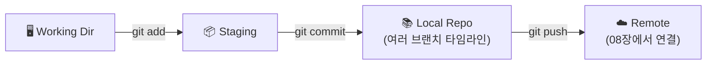



## 학습 목표

- 브랜치가 무엇인지, 왜 필요한지 설명할 수 있다
- `git branch`, `git switch` 명령어로 브랜치를 만들고 전환할 수 있다
- 브랜치에서 작업하고 `git log --oneline --graph --all`로 히스토리를 시각화할 수 있다
- learngitbranching.js.org에서 기본 시퀀스를 완료할 수 있다

<a id="toc"></a>

## 진행 순서

1. [왜 브랜치가 필요한가?](#part1) - main에서 직접 작업하면 안 되는 이유
2. [브랜치 만들기](#part2) - `git branch` 명령어
3. [브랜치 전환하기](#part3) - `git switch` 명령어
4. [한 번에 만들고 전환](#part4) - `git switch -c`
5. [브랜치에서 작업하기](#part5) - 커밋과 히스토리 시각화
6. [브랜치 삭제](#part6) - `git branch -d`
7. [VS Code에서 브랜치 관리](#part7) - 하단 상태바 활용
8. [learngitbranching.js.org 소개](#part8) - 시각적 연습 도구
9. [실습](#part9) - Introduction Sequence 완료
10. [정리](#part10) - 핵심 명령어 요약

---

# 05장. 브랜치 — 평행 세계 만들기

<a id="part1"></a>

## 1️⃣ 왜 브랜치가 필요한가? [↑](#toc)

> **브랜치 = 평행 세계.** 메인 타임라인(main)에 영향을 주지 않고 새로운 실험을 할 수 있습니다. 실험이 성공하면 메인에 합칩니다.

지금까지 우리는 **main 브랜치** 하나에서만 작업했습니다. 작은 프로젝트라면 괜찮지만, 현실에서는 문제가 생깁니다.

---

### main에서 직접 작업할 때의 문제

회원가입 기능을 만들다가 절반쯤 완성된 상태를 상상해보세요.

```
A -- B -- C(main, HEAD)   ← 여기서 직접 로그인 기능 개발 중
```

이 상태에서 갑자기 버그 신고가 들어왔습니다. "C에서 오류가 발생해요!"  
그런데 main에는 이미 절반만 완성된 코드가 섞여 있습니다.

**문제 1**: 버그를 고치려면 절반짜리 작업을 먼저 치워야 합니다.  
**문제 2**: 실험이 실패하면 main 전체가 망가집니다.  
**문제 3**: 두 가지 기능을 동시에 개발할 수 없습니다.

---

### 브랜치가 있으면?

```
A -- B -- C(main)
          └── D -- E(feature-login)   ← 여기서 실험
```

`feature-login` 브랜치에서 마음껏 실험합니다. main은 여전히 깨끗합니다.  
실험이 성공하면 main에 합치고(머지), 실패하면 브랜치만 지웁니다.

> ⚠️ **실무 규칙**: main 브랜치에 직접 커밋하지 않습니다. 항상 기능 브랜치를 만들어 작업하고, 완성된 후에 합칩니다.

---

<a id="part2"></a>

## 2️⃣ 브랜치 만들기 [↑](#toc)

> `git branch 이름` = "이 지점에서 새로운 평행 세계를 시작합니다."

```bash
# 새 브랜치 만들기
git branch feature-login

# 현재 브랜치 목록 확인
git branch
```

실행 결과:
```
* main
  feature-login
```

`*` 표시는 **현재 내가 있는 브랜치**입니다. 브랜치를 만들었지만 아직 이동하지 않았기 때문에 main에 있습니다.

---

### 브랜치 목록 더 자세히 보기

```bash
# 원격 브랜치까지 모두 표시
git branch -a

# 마지막 커밋 메시지와 함께 표시
git branch -v
```

실행 결과:
```
* main             a1b2c3d Initial commit
  feature-login    a1b2c3d Initial commit
```

> 💡 **팁**: 브랜치를 만들면 현재 커밋(`HEAD`)을 시작점으로 새 포인터가 생깁니다. 이 시점에는 두 브랜치가 같은 커밋을 가리킵니다.

---

<a id="part3"></a>

## 3️⃣ 브랜치 전환하기 [↑](#toc)

> `git switch 브랜치명` = "다른 평행 세계로 이동합니다."

```bash
# feature-login 브랜치로 이동
git switch feature-login
```

실행 결과:
```
Switched to branch 'feature-login'
```

이동 후 상태를 확인해봅니다:

```bash
git branch
```

실행 결과:
```
  main
* feature-login
```

`*` 가 `feature-login`으로 옮겨졌습니다. 이제 이곳에서 하는 커밋은 `feature-login` 브랜치에만 기록됩니다.

---

> ⚠️ **`git checkout`을 쓰지 않는 이유**: `checkout`은 브랜치 전환과 파일 복구를 동시에 담당해서 초보자에게 혼란을 줍니다. Git 2.23부터 `switch`(브랜치 전환)와 `restore`(파일 복구)로 역할이 분리되었습니다. **이 강의에서는 항상 `switch`를 사용합니다.**

---

<a id="part4"></a>

## 4️⃣ 한 번에 만들고 전환 [↑](#toc)

> `git switch -c 이름` = "새 평행 세계를 만들고 즉시 이동합니다."

```bash
# 브랜치 만들기 + 전환 한 번에
git switch -c feature-signup
```

실행 결과:
```
Switched to a new branch 'feature-signup'
```

이것은 아래 두 명령어를 합친 것과 같습니다:

```bash
git branch feature-signup
git switch feature-signup
```

> 💡 **가장 자주 쓰는 패턴입니다.** 새 작업을 시작할 때마다 `git switch -c 기능이름`을 습관처럼 사용하세요.

---

### 특정 커밋이나 브랜치에서 분기하기

```bash
# main 브랜치에서 새 브랜치 만들기 (현재 위치 무관)
git switch -c hotfix/login-bug main

# 특정 커밋 해시에서 분기
git switch -c experimental abc1234
```

---

<a id="part5"></a>

## 5️⃣ 브랜치에서 작업하기 [↑](#toc)

이제 브랜치에서 실제로 작업해봅시다. 현재 `feature-signup` 브랜치에 있다고 가정합니다.

---

### 파일 만들고 커밋하기

```bash
# signup.html 파일 생성
echo "signup page" > signup.html

# 스테이징
git add signup.html

# 커밋
git commit -m "Add: 회원가입 페이지 추가"
```

실행 결과:
```
[feature-signup 3f4e5d6] Add: 회원가입 페이지 추가
 1 file changed, 1 insertion(+)
 create mode 100644 signup.html
```

---

### 히스토리를 그래프로 보기

```bash
git log --oneline --graph --all
```

실행 결과:
```
* 3f4e5d6 (HEAD -> feature-signup) Add: 회원가입 페이지 추가
* a1b2c3d (main) Initial commit
```

이제 `feature-signup`이 `main`보다 한 커밋 앞서 있습니다. main은 그대로입니다.

---

### main으로 돌아가 또 다른 브랜치 만들기

```bash
# main으로 이동
git switch main

# login 브랜치 만들고 이동
git switch -c feature-login

# login.html 생성 및 커밋
echo "login page" > login.html
git add login.html
git commit -m "Add: 로그인 페이지 추가"

# 전체 그래프 확인
git log --oneline --graph --all
```

실행 결과:
```
* 7a8b9c0 (HEAD -> feature-login) Add: 로그인 페이지 추가
| * 3f4e5d6 (feature-signup) Add: 회원가입 페이지 추가
|/
* a1b2c3d (main) Initial commit
```

두 개의 평행 세계가 시각적으로 보입니다. 각 브랜치가 `main`이라는 공통 조상에서 갈라진 것을 확인할 수 있습니다.

> 💡 **팁**: `--oneline --graph --all`은 자주 쓰기 때문에 별칭(alias)을 등록하면 편합니다.
> ```bash
> git config --global alias.lg "log --oneline --graph --all"
> # 이후 git lg 만 치면 됩니다
> ```

---

<a id="part6"></a>

## 6️⃣ 브랜치 삭제 [↑](#toc)

> "실험이 끝나면 평행 세계를 정리합니다."

```bash
# main으로 이동 후
git switch main

# 머지된 브랜치 삭제 (안전)
git branch -d feature-login

# 머지되지 않은 브랜치 강제 삭제 (주의!)
git branch -D feature-experiment
```

실행 결과:
```
Deleted branch feature-login (was 7a8b9c0).
```

> ⚠️ **`-d`와 `-D` 차이**:
> - `-d`: **머지된 브랜치만** 삭제합니다. 작업이 남아 있으면 경고합니다.
> - `-D`: 머지 여부와 상관없이 **강제 삭제**합니다. 커밋이 사라질 수 있으니 신중하게 사용하세요.

---

### 원격 브랜치 삭제

```bash
# GitHub의 브랜치도 삭제 (08장에서 자세히 배웁니다)
git push origin --delete feature-login
```

---

<a id="part7"></a>

## 7️⃣ VS Code에서 브랜치 관리 [↑](#toc)

CLI 없이 VS Code에서도 브랜치를 쉽게 관리할 수 있습니다.

---

### 하단 상태바 — 브랜치 이름 클릭

VS Code 창 **맨 아래 왼쪽**에 현재 브랜치 이름이 표시됩니다. (예: `main`, `feature-login`)

이름을 클릭하면 상단에 팔레트가 열립니다:

| 선택지 | 동작 |
|--------|------|
| `+ Create new branch...` | 새 브랜치 만들기 (`git branch`) |
| `+ Create new branch from...` | 특정 브랜치/커밋에서 분기 |
| 브랜치 이름 선택 | 해당 브랜치로 전환 (`git switch`) |

---

### Source Control Graph (소스 제어 그래프)

VS Code 1.90+ 버전에서는 **Source Control** 패널(왼쪽 사이드바의 분기 아이콘)에서 **GRAPH** 탭을 열면 `git log --graph`와 동일한 시각화를 GUI로 볼 수 있습니다.

> 💡 **팁**: CLI와 VS Code를 같이 활용하세요. 브랜치 전환과 생성은 VS Code가 편하고, 상태 확인과 히스토리 탐색은 CLI가 더 명확합니다.

---

<a id="part8"></a>

## 8️⃣ learngitbranching.js.org 소개 [↑](#toc)

> [learngitbranching.js.org](https://learngitbranching.js.org/?locale=ko) — 브랜치를 시각적으로 연습할 수 있는 무료 인터랙티브 사이트입니다.

---

### 왜 이 사이트인가?

텍스트나 다이어그램으로 브랜치를 이해하는 데는 한계가 있습니다. 이 사이트는 명령어를 입력하면 브랜치 트리가 애니메이션으로 움직이기 때문에 **"아, 이렇게 되는구나!"** 하는 감각을 빠르게 익힐 수 있습니다.

---

### 시작하는 방법

1. [learngitbranching.js.org](https://learngitbranching.js.org/?locale=ko) 접속
2. **Main** 탭 → **Introduction Sequence** 선택
3. 4개의 레벨을 순서대로 완료합니다:
   - `1: git commit` — 커밋 복습
   - `2: git branch` — 브랜치 만들기
   - `3: git merge` — 머지 미리보기 (다음 장에서 자세히)
   - `4: git rebase` — 나중에 배울 개념 미리보기

> 💡 **팁**: 이 사이트에서 `git checkout` 명령어도 작동하지만, 우리는 `git switch`를 사용합니다. 사이트에서도 `git switch`를 입력하면 됩니다.

---

<a id="part9"></a>

## 9️⃣ 실습 [↑](#toc)

### 기본 실습

1. 빈 폴더에서 `git init`으로 리포지토리를 초기화합니다.
2. `README.md`를 만들고 첫 번째 커밋을 합니다.
3. `git switch -c feature-about`으로 브랜치를 만들고 이동합니다.
4. `about.html`을 만들고 커밋합니다.
5. `git log --oneline --graph --all`로 히스토리를 확인합니다.
6. `git switch main`으로 돌아와서 `about.html`이 없음을 확인합니다.

---

### 중급 실습

1. 위 기본 실습을 완료한 상태에서 시작합니다.
2. main에서 `git switch -c feature-contact`을 만들고 `contact.html`을 커밋합니다.
3. `git log --oneline --graph --all`로 두 브랜치가 갈라진 그래프를 확인합니다.
4. `feature-about` 브랜치를 `-d`로 삭제해봅니다. (머지 전이므로 경고가 나타납니다.)
5. 경고 메시지를 읽고 강제 삭제(`-D`) 여부를 결정합니다.

---

### 심화 실습 (숙제)

[learngitbranching.js.org](https://learngitbranching.js.org/?locale=ko) 의 **Introduction Sequence** 레벨 1~4를 완료하고, 완료 화면을 캡처해 제출합니다.

---

<a id="part10"></a>

## 🔟 정리 [↑](#toc)

| 명령어 | 역할 |
|--------|------|
| `git branch 이름` | 새 브랜치 만들기 |
| `git branch` | 브랜치 목록 보기 |
| `git branch -v` | 브랜치 목록 + 마지막 커밋 |
| `git branch -a` | 로컬 + 원격 브랜치 모두 |
| `git switch 이름` | 브랜치 전환 |
| `git switch -c 이름` | 브랜치 만들기 + 전환 |
| `git branch -d 이름` | 머지된 브랜치 삭제 |
| `git branch -D 이름` | 브랜치 강제 삭제 |
| `git log --oneline --graph --all` | 전체 브랜치 히스토리 시각화 |

---

### 4-Zone 모델에서 브랜치의 위치



브랜치를 전환하면 **Working Directory의 파일이 바뀝니다.** 이것이 "평행 세계로 이동"하는 실제 의미입니다.

---

### 다음 장 미리보기

평행 세계를 만들었습니다. 다음 장에서는 이 세계들을 **합치는 '머지'**를 배웁니다. 두 브랜치의 변경사항이 겹치면 어떻게 되는지, **충돌(conflict)**이 왜 생기고 어떻게 해결하는지도 함께 배웁니다.


