

## 학습 목표

- Pull Request(PR)가 무엇인지, 왜 직접 main에 push하지 않는지 설명할 수 있다
- GitHub에서 PR을 만들고, 리뷰하고, 머지할 수 있다
- Merge commit / Squash and merge / Rebase and merge 세 방식의 차이를 구분할 수 있다
- Fork 기반 오픈소스 협업 흐름을 이해하고 실행할 수 있다

<a id="toc"></a>

## 진행 순서

1. [PR이란?](#pr-intro) — 검토 요청서 개념
2. [PR 만드는 방법](#create-pr) — 브랜치 push → GitHub → PR 생성
3. [PR 리뷰](#review-pr) — Files changed, 댓글, Approve, Request changes
4. [머지 전략 3가지](#merge-strategy) — Merge commit / Squash / Rebase
5. [Fork와 PR](#fork-pr) — 오픈소스 기여 흐름
6. [PR 이후 동기화](#sync-after-pr) — Sync fork, git pull --rebase, upstream 추가
7. [실습](#practice) — Fork → 수정 → PR → 머지 전체 과정
8. [정리](#summary) — 핵심 명령어 표 + 다음 장 미리보기

---

# 09장. Pull Request — 검토 요청서 보내기

<a id="pr-intro"></a>

## 1️⃣ PR이란? [↑](#toc)

> "PR = 검토 요청서. '제가 이렇게 수정했는데 확인해주세요'라고 팀원에게 보내는 것입니다. 승인되면 main에 합쳐집니다."

직장에서 중요한 문서를 작성했다면 팀장에게 결재를 받은 뒤 최종본으로 올리죠? Git에서도 같은 원리를 적용합니다. 코드를 직접 `main`에 넣지 않고, **먼저 검토를 받는 과정**이 바로 Pull Request입니다.

### PR이 필요한 이유

| 이유 | 설명 |
|------|------|
| 버그 사전 차단 | 다른 사람이 보면 내가 못 본 실수를 발견합니다 |
| 지식 공유 | 팀 전체가 어떤 변경이 있었는지 히스토리로 확인합니다 |
| 코드 품질 유지 | 리뷰 과정에서 더 좋은 방법을 제안받을 수 있습니다 |
| 책임 추적 | 누가 어떤 이유로 코드를 바꿨는지 기록이 남습니다 |

### PR의 기본 흐름

```
feature 브랜치 작업
    ↓
origin에 push
    ↓
GitHub에서 PR 생성
    ↓
팀원 리뷰 & 댓글
    ↓
승인(Approve) → main에 머지
    ↓
feature 브랜치 삭제
```

> 💡 PR은 GitHub, GitLab, Bitbucket 같은 플랫폼의 기능입니다. Git 자체 명령어는 아닙니다. 플랫폼마다 이름이 다를 수 있지만(GitLab에서는 "Merge Request") 개념은 동일합니다.

---

<a id="create-pr"></a>

## 2️⃣ PR 만드는 방법 [↑](#toc)

> "브랜치를 push하면 GitHub가 자동으로 PR 버튼을 보여줍니다."

### 단계별 진행

**1단계 — 브랜치에서 작업하고 push합니다.**

```bash
# 새 기능 브랜치 생성
git switch -c feature/login-page

# 파일 수정 후 커밋
git add login.html
git commit -m "feat: 로그인 페이지 레이아웃 추가"

# origin에 push
git push origin feature/login-page
```

실행 결과:
```
Enumerating objects: 4, done.
Counting objects: 100% (4/4), done.
Delta compression using up to 8 threads
Compressing objects: 100% (3/3), done.
Writing objects: 100% (3/3), 512 bytes | 512.00 KiB/s, done.
Total 3 (delta 1), reused 0 (delta 0), pack-reused 0
remote: Resolving deltas: 100% (1/1), completed with 1 local object.
remote:
remote: Create a pull request for 'feature/login-page' on GitHub by visiting:
remote:      https://github.com/본인아이디/저장소이름/pull/new/feature/login-page
remote:
To https://github.com/본인아이디/저장소이름.git
 * [new branch]      feature/login-page -> feature/login-page
```

**2단계 — GitHub 저장소로 이동합니다.**

push 직후 GitHub 페이지를 열면 노란색 배너가 나타납니다.

```
feature/login-page had recent pushes less than a minute ago
[Compare & pull request]
```

`Compare & pull request` 버튼을 클릭합니다.

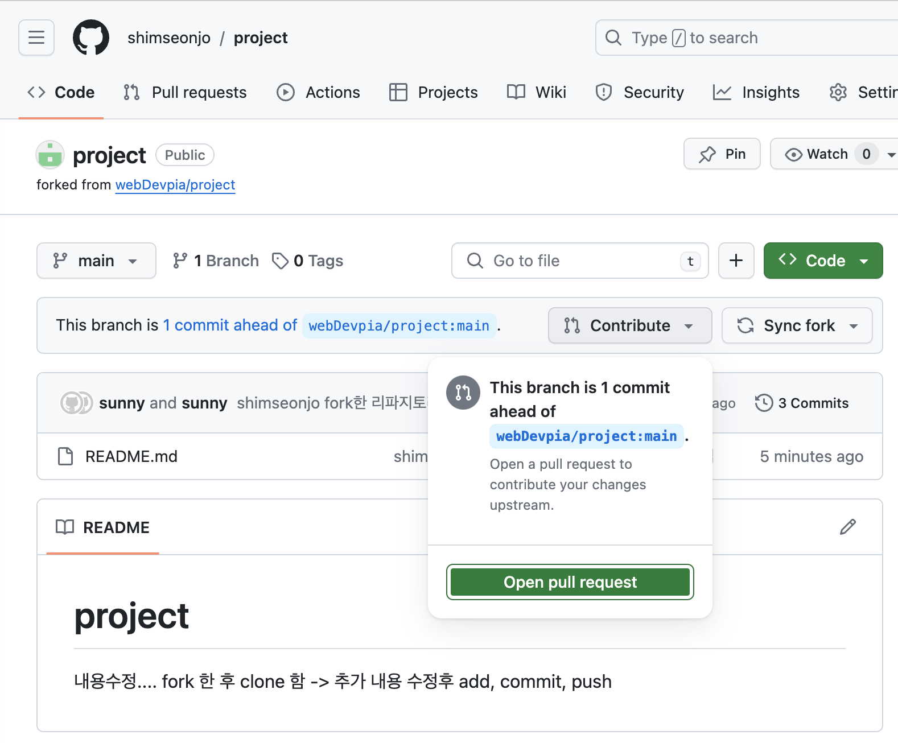

**3단계 — PR 제목과 설명을 작성합니다.**

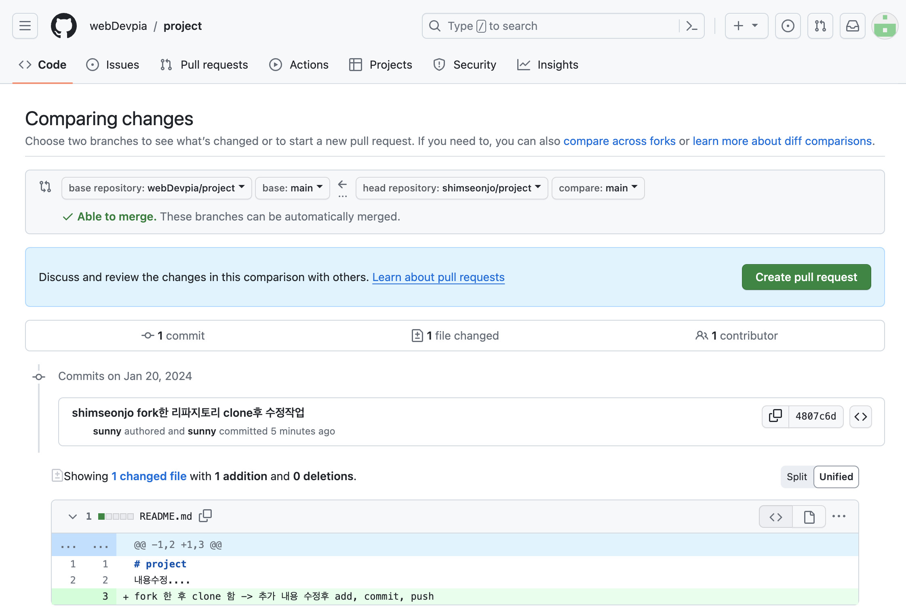

| 항목 | 작성 요령 |
|------|-----------|
| 제목 | 변경 내용을 한 줄로 요약합니다. 예: `feat: 로그인 페이지 레이아웃 추가` |
| 설명 | 무엇을, 왜 변경했는지 설명합니다. 스크린샷이 있으면 더 좋습니다 |
| Reviewers | 리뷰해줄 팀원을 지정합니다 |
| Labels | `bug`, `enhancement` 등 분류 태그를 붙입니다 |

**4단계 — `Create pull request` 버튼을 클릭합니다.**

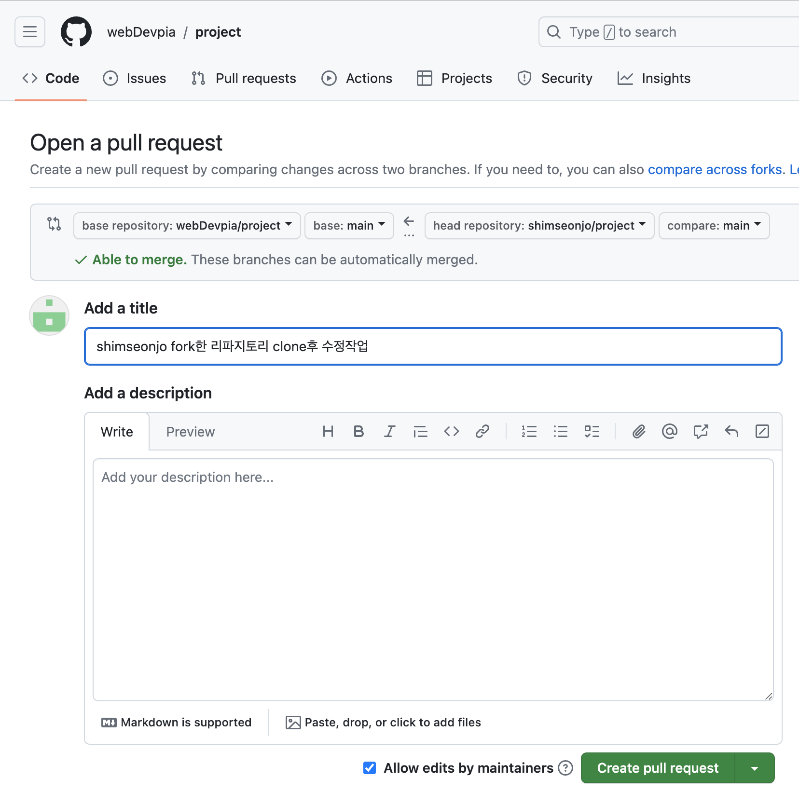

> 💡 PR이 열린 뒤에도 같은 브랜치에 추가 커밋을 push하면 PR에 자동 반영됩니다. 리뷰 중에 수정 요청을 받아도 새로 PR을 만들 필요가 없습니다.

---

<a id="review-pr"></a>

## 3️⃣ PR 리뷰 [↑](#toc)

> "리뷰는 코드에 포스트잇을 붙이는 것과 같습니다. 좋은 점, 고칠 점을 댓글로 남깁니다."

### 리뷰어(Reviewer) 입장

**Files changed 탭**을 클릭하면 변경된 코드 전체를 볼 수 있습니다.

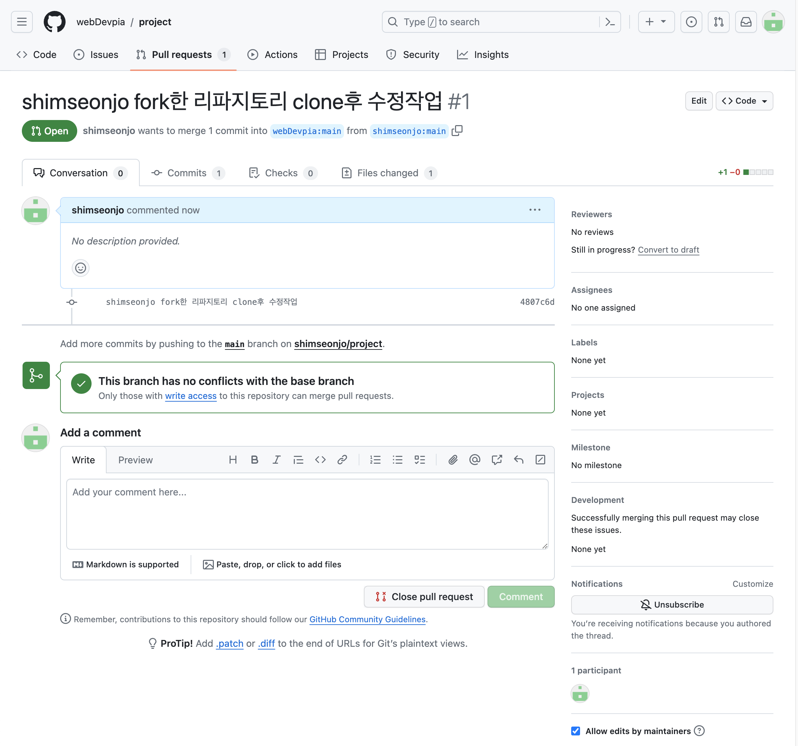

특정 줄에 댓글을 달려면 해당 줄 번호 왼쪽에 마우스를 올리면 나타나는 `+` 버튼을 클릭합니다.

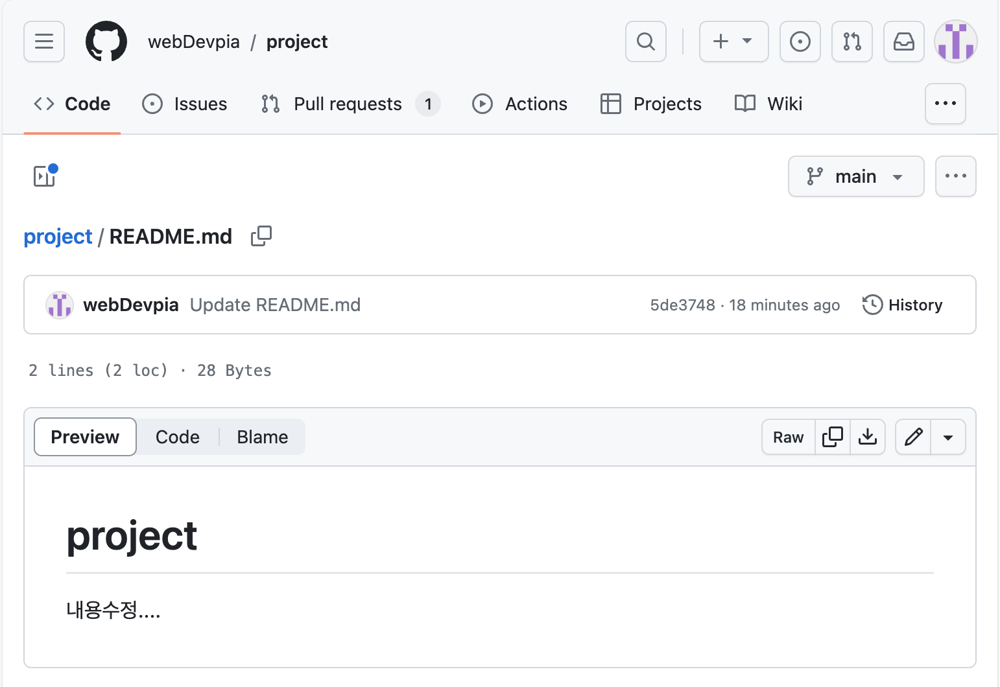

### 리뷰 결과 제출

오른쪽 상단 `Review changes` 버튼을 클릭하면 세 가지 옵션이 나옵니다.

| 옵션 | 의미 | 언제 사용하나요? |
|------|------|------------------|
| Comment | 의견만 남김 | 가볍게 질문할 때 |
| Approve | 승인 | 머지해도 좋다고 판단할 때 |
| Request changes | 수정 요청 | 반드시 고쳐야 할 부분이 있을 때 |

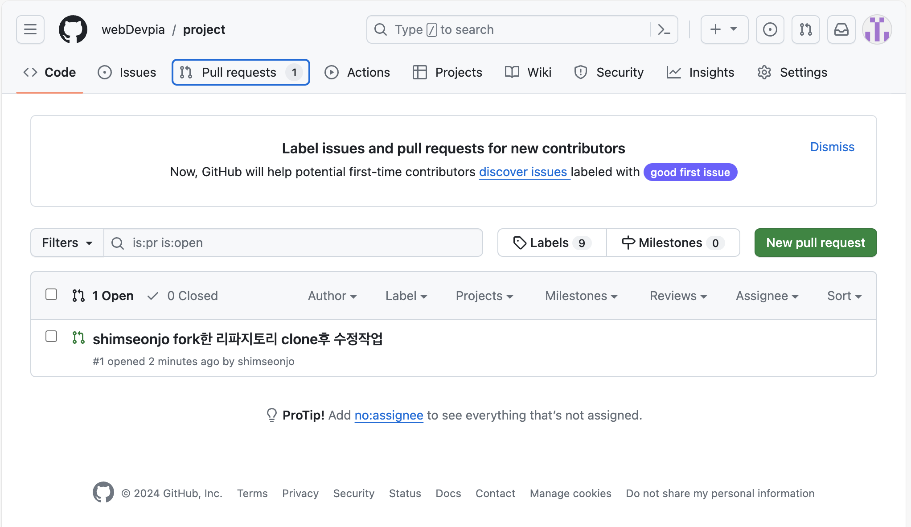

### PR 작성자(Author) 입장

리뷰 댓글을 받으면 코드를 수정하고 커밋을 추가합니다.

```bash
# 리뷰 반영 후 추가 커밋
git add login.html
git commit -m "fix: 리뷰 반영 — 버튼 색상 수정"
git push origin feature/login-page
```

수정된 내용이 PR에 자동으로 추가됩니다. 모든 리뷰어가 Approve하면 머지를 진행합니다.

> ⚠️ 팀 규칙에 따라 Approve 개수 요건(예: 최소 1명 이상 승인)이 다를 수 있습니다. 저장소 Settings → Branches에서 설정합니다.

---

<a id="merge-strategy"></a>

## 4️⃣ 머지 전략 3가지 [↑](#toc)

> "머지 버튼 옆 화살표(▼)를 누르면 세 가지 방법 중 하나를 고를 수 있습니다."

GitHub에서 PR을 머지할 때 세 가지 전략을 선택할 수 있습니다.

---

### Merge commit — 모든 이력 유지

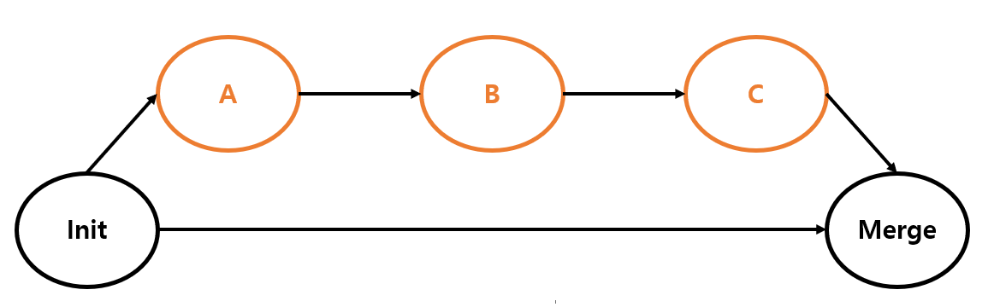

브랜치의 모든 커밋을 그대로 유지하고, 두 브랜치를 합쳤다는 **병합 커밋(merge commit)을 별도로 생성**합니다.

```
main:    A --- B --- E (merge commit)
                  /
feature:      C --- D
```

| 장점 | 단점 |
|------|------|
| 브랜치 이력 전체가 보존됩니다 | 이력이 복잡해질 수 있습니다 |
| 언제 어디서 합쳐졌는지 명확합니다 | 병합 커밋이 이력에 추가됩니다 |

---

### Squash and merge — 여러 커밋을 하나로

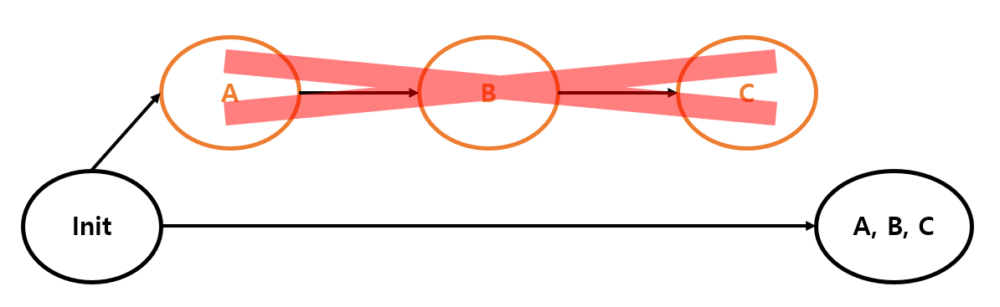

브랜치의 여러 커밋을 **하나의 새 커밋으로 합쳐서** main에 추가합니다.

```
main:    A --- B --- [C+D 통합]
feature:      C --- D  (사라짐)
```

| 장점 | 단점 |
|------|------|
| main 이력이 깔끔합니다 | 개별 커밋 내역이 사라집니다 |
| 한 PR = 한 커밋으로 관리됩니다 | 세부 작업 과정을 나중에 보기 어렵습니다 |

> 💡 실무 팁: 처음에는 **Squash and merge**가 가장 깔끔합니다. 개발 중에 "임시 저장", "오타 수정" 같은 지저분한 커밋을 하나로 정리해 main을 깔끔하게 유지할 수 있습니다.

---

### Rebase and merge — 선형 이력 유지

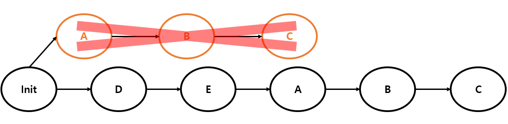

브랜치의 커밋들을 **개별 커밋 관계를 유지하면서** main 끝에 순서대로 붙입니다.

```
main:    A --- B --- C' --- D'
feature:      C --- D  (재기록됨)
```

| 장점 | 단점 |
|------|------|
| 개별 커밋이 보존됩니다 | 커밋 해시가 바뀝니다 |
| 이력이 선형(직선)으로 유지됩니다 | 충돌 처리가 복잡할 수 있습니다 |

---

### 세 방식 비교 한눈에

| 방식 | 이력 모양 | 커밋 수 | 추천 상황 |
|------|-----------|---------|-----------|
| Merge commit | 비선형 (나뭇가지) | 유지 + 병합 커밋 추가 | 이력을 완전히 보존해야 할 때 |
| Squash and merge | 선형 | 하나로 합침 | main을 깔끔하게 관리할 때 |
| Rebase and merge | 선형 | 유지 (해시 변경) | 커밋 단위를 유지하면서 선형 이력을 원할 때 |

---

<a id="fork-pr"></a>

## 5️⃣ Fork와 PR [↑](#toc)

> "Fork = 남의 저장소를 내 계정에 복사하기. 오픈소스 프로젝트에 기여할 때 씁니다."

팀 저장소의 collaborator가 아니라면 직접 브랜치를 push할 수 없습니다. 이때 **Fork** 방식을 사용합니다.

### Fork 기반 협업 흐름

```
원본 저장소(upstream)
    ↓ Fork
내 저장소(origin) — GitHub에 복사본 생성
    ↓ Clone
로컬 컴퓨터 — 내 저장소를 복제
    ↓ 브랜치 생성 + 작업 + push
내 저장소(origin)에 push
    ↓ PR 생성
원본 저장소(upstream)에 PR 요청
    ↓ 관리자 검토 및 머지
```

### 단계별 실행

**1단계 — Fork합니다.**

원본 저장소 페이지 오른쪽 상단 `Fork` 버튼을 클릭합니다.

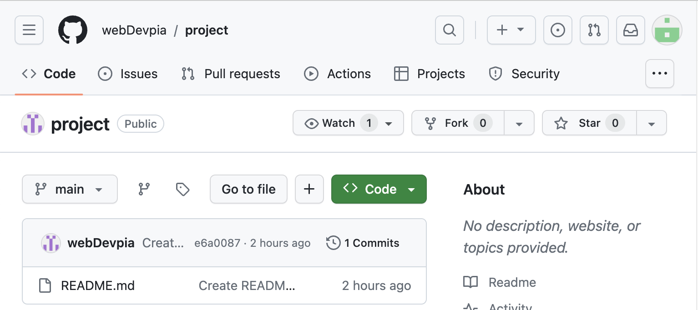

저장소 이름을 확인하고 `Create fork`를 클릭합니다.

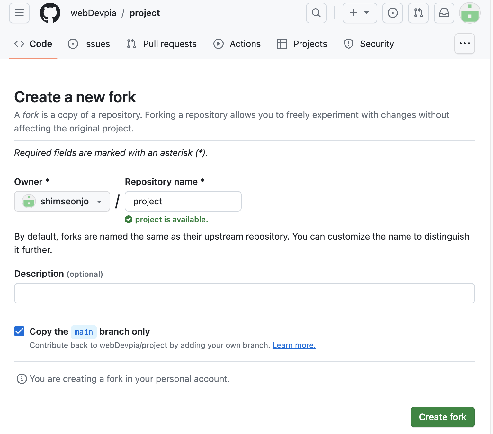

**2단계 — 내 저장소(origin)를 Clone합니다.**

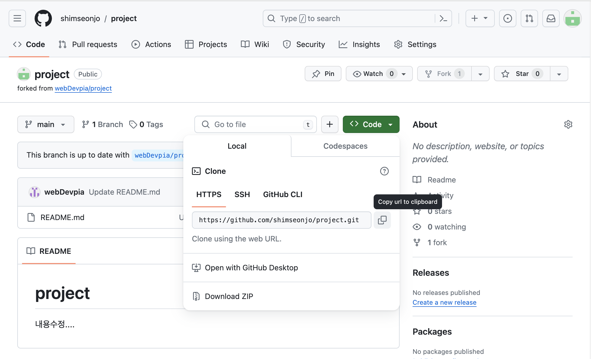

```bash
git clone https://github.com/내아이디/저장소이름.git
cd 저장소이름
```

**3단계 — 브랜치를 만들고 작업합니다.**

```bash
git switch -c fix/typo-in-readme
# 파일 수정
git add README.md
git commit -m "fix: README 오타 수정"
git push origin fix/typo-in-readme
```

**4단계 — GitHub에서 PR을 생성합니다.**

내 저장소(origin) 페이지에서 `Contribute → Open pull request`를 클릭합니다.

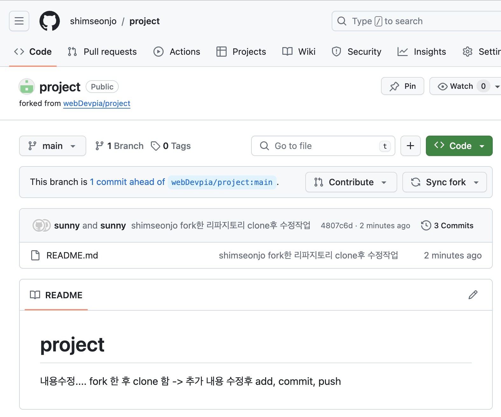


base 저장소가 원본(upstream)으로 설정되어 있는지 확인한 후 `Create pull request`를 클릭합니다.


**5단계 — 관리자가 검토하고 머지합니다.**

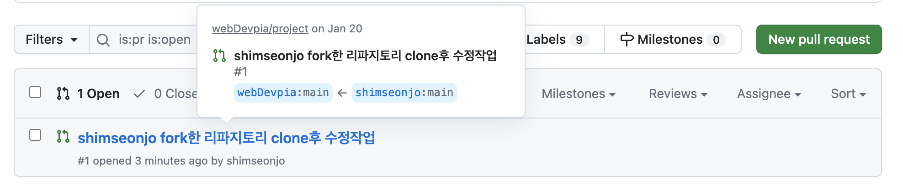

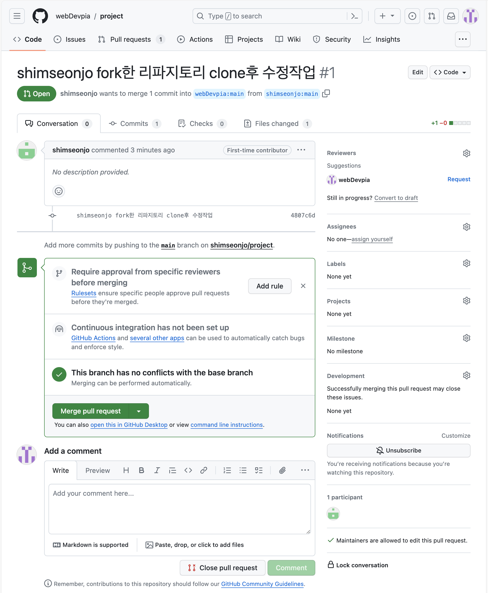

> ⚠️ PR이 열려 있는 동안 같은 브랜치에 추가 push를 하면 PR에 자동 반영됩니다. 머지 전까지는 하나의 PR로 계속 소통할 수 있습니다.

---

<a id="sync-after-pr"></a>

## 6️⃣ PR 이후 동기화 [↑](#toc)

> "머지 후에는 내 로컬과 내 Fork(origin)를 원본(upstream)과 맞춰야 합니다."

### GitHub에서 Fork 동기화 (간편 방법)

내 Fork 저장소 페이지에서 `Sync fork → Update branch`를 클릭합니다.

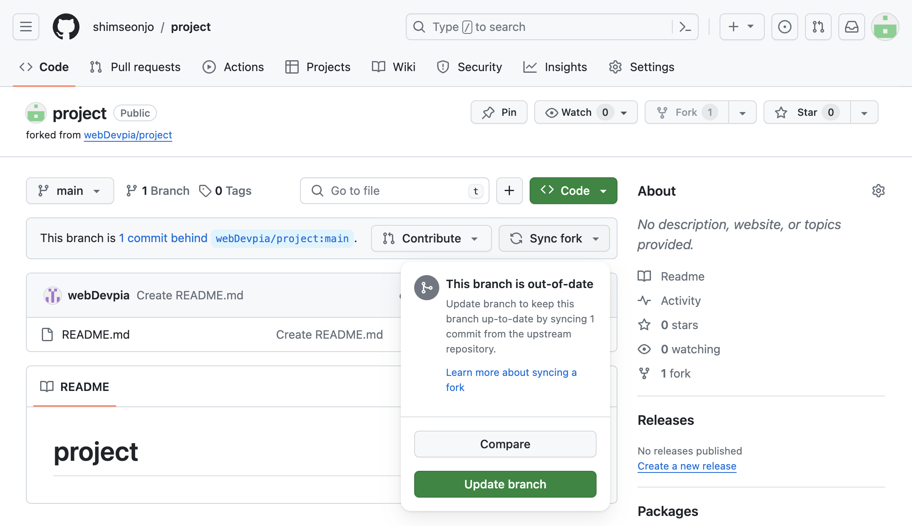

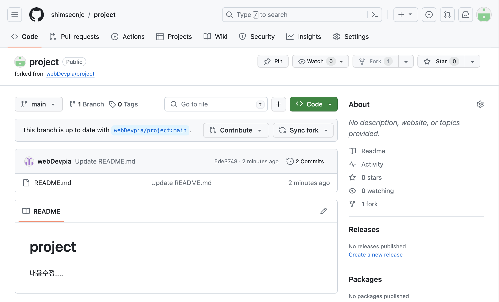

### 로컬에서 동기화

```bash
# origin에서 최신 상태를 가져옵니다
git pull --rebase origin main
```

실행 결과:
```
From https://github.com/내아이디/저장소이름
 * branch            main       -> FETCH_HEAD
Successfully rebased and updated refs/heads/main.
```

### upstream을 로컬에 직접 추가하는 방법

GitHub에서 Sync fork 버튼 없이 직접 관리하고 싶다면 로컬에 upstream 리모트를 추가합니다.

```bash
# 1. upstream 리포지토리 추가
git remote add upstream https://github.com/원본계정/저장소이름.git

# 2. 현재 리모트 목록 확인
git remote -v
```

실행 결과:
```
origin    https://github.com/내아이디/저장소이름.git (fetch)
origin    https://github.com/내아이디/저장소이름.git (push)
upstream  https://github.com/원본계정/저장소이름.git (fetch)
upstream  https://github.com/원본계정/저장소이름.git (push)
```

```bash
# 3. upstream에서 최신 변경 사항 가져오기
git fetch upstream

# 4. upstream의 변경 사항을 로컬 main에 병합
git merge upstream/main

# 5. 내 Fork(origin)에 push
git push origin main
```

> 💡 이미 머지된 feature 브랜치는 삭제해 저장소를 깔끔하게 유지하세요.
> ```bash
> # 로컬 브랜치 삭제
> git branch -d feature/login-page
> # 원격 브랜치 삭제
> git push origin --delete feature/login-page
> ```

---

<a id="practice"></a>

## 7️⃣ 실습 [↑](#toc)

### 기본 실습 — 팀 저장소 PR 만들기

팀원과 함께 하나의 저장소를 사용하는 상황을 가정합니다.

1. 저장소를 Clone합니다.
   ```bash
   git clone https://github.com/팀계정/저장소이름.git
   cd 저장소이름
   ```
2. 새 브랜치를 만듭니다.
   ```bash
   git switch -c feature/내이름-수정
   ```
3. `README.md`에 한 줄을 추가하고 저장합니다.
4. add → commit → push합니다.
   ```bash
   git add README.md
   git commit -m "docs: 내이름 README 수정 추가"
   git push origin feature/내이름-수정
   ```
5. GitHub에서 PR을 생성합니다.
6. 다른 팀원이 리뷰하고 Approve합니다.
7. `Squash and merge`로 머지합니다.
8. 머지 후 feature 브랜치를 삭제합니다.

---

### 중급 실습 — Fork 기반 PR

1. 강사가 제공한 실습 저장소를 Fork합니다.
2. 로컬에 Clone합니다.
3. `fix/내이름` 브랜치를 만들고 `index.html`의 오타를 수정합니다.
4. push 후 upstream 저장소로 PR을 생성합니다.
5. 강사(또는 동료)가 리뷰하고 머지합니다.
6. 머지 후 `Sync fork`로 내 Fork를 동기화합니다.
7. 로컬에서 `git pull --rebase origin main`을 실행합니다.

---

### 심화 실습 — 머지 전략 비교

1. 테스트용 저장소를 생성합니다.
2. `feature/merge-test` 브랜치에서 커밋 3개를 만듭니다.
   ```bash
   git switch -c feature/merge-test
   echo "A" >> test.txt && git add test.txt && git commit -m "test: 커밋 A"
   echo "B" >> test.txt && git add test.txt && git commit -m "test: 커밋 B"
   echo "C" >> test.txt && git add test.txt && git commit -m "test: 커밋 C"
   git push origin feature/merge-test
   ```
3. PR을 3개 만들어 각각 다른 머지 전략(Merge commit / Squash / Rebase)으로 머지합니다.
4. `git log --oneline --graph --all`로 이력 모양 차이를 비교합니다.

---

<a id="summary"></a>

## 8️⃣ 정리 [↑](#toc)

### 핵심 명령어 요약

| 상황 | 명령어 |
|------|--------|
| feature 브랜치 push | `git push origin 브랜치이름` |
| Fork 저장소 Clone | `git clone https://github.com/내아이디/저장소.git` |
| upstream 리모트 추가 | `git remote add upstream <원본 URL>` |
| upstream 최신 상태 가져오기 | `git fetch upstream` |
| upstream 변경사항 병합 | `git merge upstream/main` |
| 로컬 동기화 (rebase) | `git pull --rebase origin main` |
| 원격 브랜치 삭제 | `git push origin --delete 브랜치이름` |

### 머지 전략 선택 가이드

| 상황 | 추천 전략 |
|------|-----------|
| 팀 처음 시작, 단순하게 관리 | Squash and merge |
| 브랜치 이력을 완전히 남기고 싶다 | Merge commit |
| 선형 이력 + 커밋 단위 보존 | Rebase and merge |

### 이 장에서 배운 것

- PR은 코드를 main에 직접 넣지 않고 **검토를 받는 과정**입니다
- GitHub에서 브랜치를 push하면 `Compare & pull request` 버튼이 나타납니다
- 리뷰어는 Files changed 탭에서 줄 단위로 댓글을 달고 Approve 또는 Request changes를 선택합니다
- 머지 전략은 Squash and merge부터 시작하는 것을 추천합니다
- Fork 기반 PR은 오픈소스 기여의 표준 흐름입니다
- 머지 후에는 반드시 로컬과 Fork를 동기화합니다

---

## 다음 장 미리보기

코드 리뷰와 머지를 배웠습니다.

**10장에서는 실수를 되돌리는 다양한 방법**을 배웁니다. 잘못 커밋한 내용을 취소하거나, 삭제된 파일을 복구하거나, 아직 커밋하지 않은 변경을 임시 저장하는 방법까지 다룹니다. Git의 안전망을 제대로 활용해봅니다.


