

## 학습 목표

- GitHub Flow의 전체 사이클을 설명할 수 있다
- 팀장·팀원 역할로 나뉘어 실제 협업 과정을 처음부터 끝까지 수행할 수 있다
- 머지 충돌이 발생했을 때 당황하지 않고 해결할 수 있다
- 지금까지 배운 모든 Git 명령어가 실전에서 어떻게 연결되는지 설명할 수 있다

<a id="toc"></a>

## 진행 순서

1. [GitHub Flow](#github-flow) — 가장 단순한 팀 워크플로우
2. [실전 시뮬레이션 시나리오](#scenario) — 오늘 우리가 만들 것
3. [Step 1: 팀장 — 리포지토리 준비](#step1) — 초대까지
4. [Step 2: 팀원 — Clone + 기능 브랜치](#step2) — 작업 시작
5. [Step 3: 팀원 — Push + PR 생성](#step3) — 검토 요청
6. [Step 4: 팀장 — PR 리뷰 + 승인](#step4) — 코드 리뷰
7. [Step 5: 머지 + 동기화](#step5) — 팀 전체 반영
8. [충돌 시나리오](#conflict) — 두 사람이 같은 곳을 수정했다면
9. [개념 매핑표](#mapping) — 배운 장과 연결
10. [자주 쓰는 Git 명령어 모음](#cheatsheet) — 빠른 참조 카드
11. [과정을 마치며](#closing) — 회고 + 다음 단계

---

# 12장. 실전 워크플로우 — 실제 팀처럼 일하기

<a id="github-flow"></a>

## 1️⃣ GitHub Flow — 가장 단순한 팀 워크플로우 [↑](#toc)

> GitHub Flow는 "main 브랜치를 항상 배포 가능한 상태로 유지하면서, 모든 작업을 브랜치와 Pull Request로 처리하는 방식"입니다.
> 복잡한 전략 없이도 팀이 안전하게 협업할 수 있는, 현업에서 가장 많이 쓰이는 워크플로우 중 하나입니다.

### GitHub Flow 7단계

```
1. main에서 새 브랜치 생성
        ↓
2. 브랜치에서 작업 + 커밋
        ↓
3. 원격에 Push
        ↓
4. Pull Request(PR) 생성
        ↓
5. 팀원이 코드 리뷰
        ↓
6. main에 머지
        ↓
7. 브랜치 삭제 + 팀원 Pull
        ↓
    (다시 1번으로)
```

### 왜 이 방식인가?

| 원칙 | 이유 |
|------|------|
| main은 항상 동작하는 코드만 | 언제든 배포할 수 있어야 한다 |
| 작업은 반드시 브랜치에서 | main을 직접 건드리면 팀 전체가 영향받는다 |
| PR을 통해 리뷰 후 머지 | 혼자서는 발견 못 한 실수를 팀이 잡아준다 |
| 머지 후 브랜치 삭제 | 묵은 브랜치가 쌓이면 관리가 어려워진다 |

> 💡 GitHub Flow의 핵심은 단순함입니다.
> "main → 브랜치 → 작업 → PR → 머지 → 삭제" 이 하나의 사이클만 기억하세요.

---

<a id="scenario"></a>

## 2️⃣ 실전 시뮬레이션 시나리오 [↑](#toc)

> 오늘 시뮬레이션은 "실제 팀 프로젝트"처럼 진행합니다.
> 완벽하게 따라 하는 것보다 "흐름을 이해하고 막혔을 때 대처하는 법"을 익히는 것이 목표입니다.

### 시나리오 설정

**프로젝트**: 간단한 팀 소개 웹사이트 만들기

**역할 구성**:

| 역할 | 담당 작업 |
|------|----------|
| 팀장 (Leader) | 리포지토리 생성, 팀원 초대, PR 리뷰, 머지 |
| 팀원 A | 메인 페이지(`index.html`) 작업 |
| 팀원 B (선택) | 소개 페이지(`about.html`) 작업 |

> 💡 혼자 연습할 때는 GitHub 계정 2개를 이용하거나, 팀장+팀원 A 역할만 수행해도 됩니다.

---

<a id="step1"></a>

## 3️⃣ Step 1: 팀장 — 리포지토리 준비 [↑](#toc)

### 1-1. 리포지토리 생성

GitHub에서 새 리포지토리를 만듭니다.

```
리포지토리 이름: team-website
공개 범위: Public
초기화 옵션: Add a README file ✓
            Add .gitignore: None (직접 만들 예정)
```

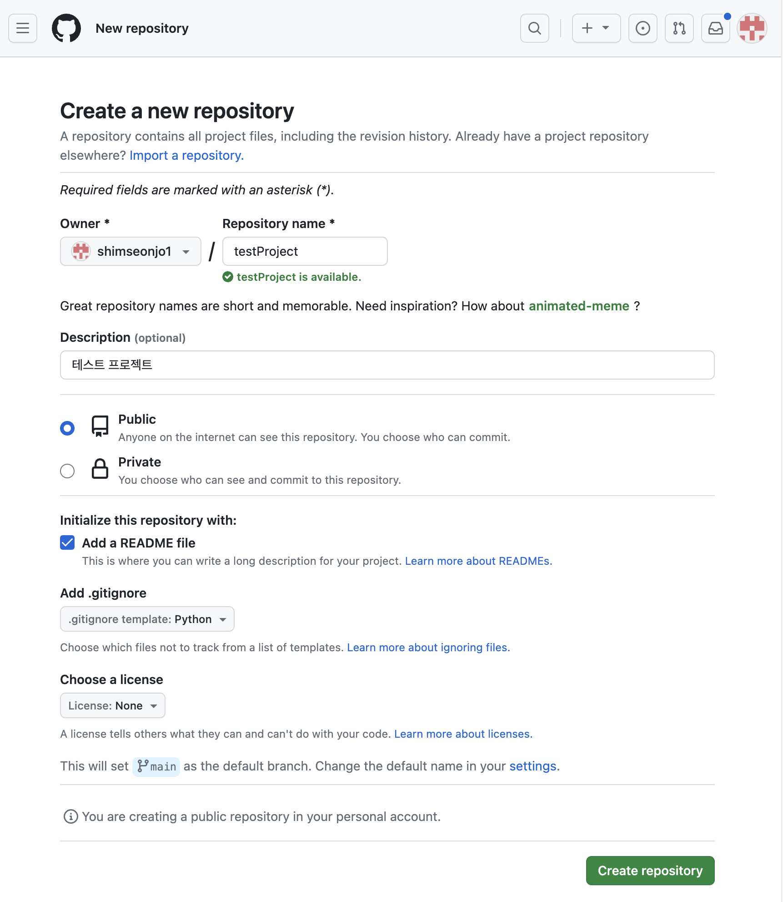

> ⚠️ 리포지토리 이름은 소문자와 하이픈만 사용하는 것이 관례입니다.
> `TeamWebsite`보다 `team-website`가 표준적입니다.

---

### 1-2. README.md 작성

생성된 리포지토리의 `README.md`를 편집합니다.
GitHub 웹 화면에서 직접 편집하거나, 로컬에 clone해서 수정합니다.

```markdown
# 우리 팀 소개 사이트

GitHub Flow를 연습하기 위한 팀 프로젝트입니다.

## 팀원

- 팀장: 홍길동
- 팀원 A: 김철수
- 팀원 B: 이영희

## 기여 방법

1. `main`에서 새 브랜치를 만드세요
2. 작업 후 커밋하세요
3. PR을 만들어 팀장에게 리뷰를 요청하세요
```

---

### 1-3. .gitignore 파일 생성

로컬에 clone 후 `.gitignore` 파일을 만듭니다.

```bash
git clone https://github.com/팀장계정/team-website
cd team-website
```

`.gitignore` 파일 내용:

```
# OS 관련
.DS_Store
Thumbs.db

# 에디터 관련
.vscode/
*.swp

# 임시 파일
*.tmp
*.log
```

```bash
git add .gitignore
git commit -m "프로젝트 초기 설정: .gitignore 추가"
git push
```

---

### 1-4. 팀원 초대

리포지토리 → **Settings** → **Collaborators** → **Add people**

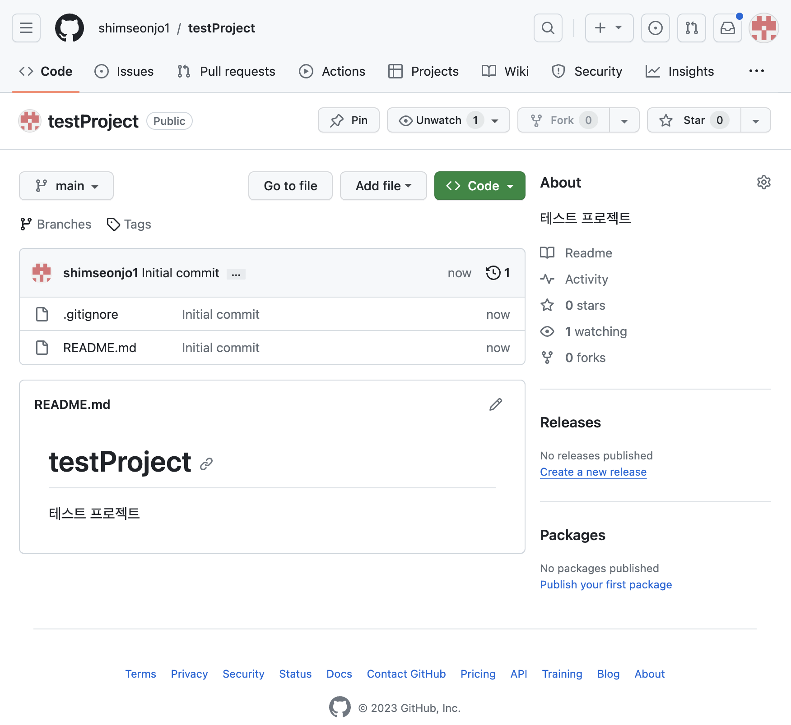

팀원의 GitHub 아이디를 입력하고 초대를 보냅니다.
팀원은 이메일로 온 초대를 수락해야 push 권한이 생깁니다.

> ⚠️ 팀원이 초대를 수락하기 전에는 push할 수 없습니다.
> 초대 이메일이 스팸함에 있을 수 있으니 확인해 보세요.

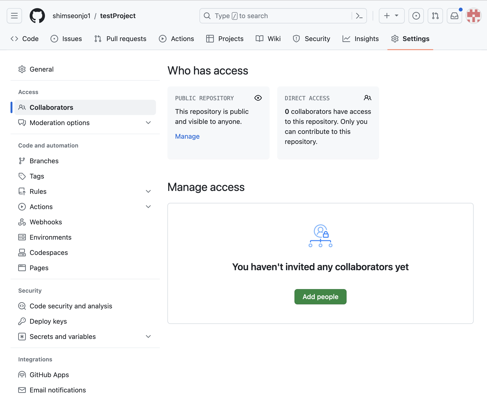

---

<a id="step2"></a>

## 4️⃣ Step 2: 팀원 — Clone + 기능 브랜치 + 작업 [↑](#toc)

### 2-1. 리포지토리 Clone

초대를 수락한 팀원 A가 리포지토리를 자신의 컴퓨터에 받습니다.

```bash
git clone https://github.com/팀장계정/team-website
cd team-website
```

> 💡 Fork 없이 직접 clone합니다.
> 팀원으로 초대되었으므로 이 리포지토리에 직접 push할 수 있습니다.

---

### 2-2. 기능 브랜치 생성

절대로 `main` 브랜치에서 직접 작업하지 않습니다.
`main`에서 새 브랜치를 만들고 그 브랜치에서 작업합니다.

```bash
git switch -c feature/main-page
```

브랜치 이름 규칙 예시:

| 유형 | 형식 | 예시 |
|------|------|------|
| 새 기능 | `feature/기능이름` | `feature/main-page` |
| 버그 수정 | `fix/버그이름` | `fix/typo-title` |
| 디자인 변경 | `style/변경이름` | `style/header-color` |

---

### 2-3. 작업 수행

`index.html`을 만들고 내용을 작성합니다.

```html
<!DOCTYPE html>
<html lang="ko">
<head>
  <meta charset="UTF-8">
  <meta name="viewport" content="width=device-width, initial-scale=1.0">
  <title>우리 팀 소개</title>
  <style>
    body {
      font-family: 'Noto Sans KR', sans-serif;
      max-width: 800px;
      margin: 0 auto;
      padding: 40px 20px;
    }
    nav a { margin-right: 15px; text-decoration: none; color: #0066cc; }
    .hero { background: #f0f4ff; padding: 40px; border-radius: 12px; text-align: center; }
  </style>
</head>
<body>
  <nav>
    <a href="index.html">홈</a>
    <a href="about.html">팀 소개</a>
  </nav>

  <div class="hero">
    <h1>우리 팀에 오신 것을 환영합니다</h1>
    <p>Git과 GitHub으로 협업하는 팀입니다.</p>
  </div>

  <section>
    <h2>최근 소식</h2>
    <p>팀 웹사이트를 성공적으로 런칭했습니다!</p>
  </section>
</body>
</html>
```

---

### 2-4. 커밋

작업이 완료되면 커밋합니다.
커밋은 작은 단위로 자주 하는 것이 좋습니다.

```bash
git add index.html
git commit -m "feat: 메인 페이지(index.html) 초안 작성"
```

좋은 커밋 메시지 형식:

```
feat: 새 기능 추가
fix: 버그 수정
style: 코드 형식·디자인 변경 (기능 변경 없음)
docs: 문서 수정
chore: 빌드·설정 변경
```

> 💡 커밋 메시지는 "무엇을 했는지"뿐 아니라 "왜 했는지"도 담으면 더 좋습니다.
> 나중에 `git log`를 볼 때 팀원이 맥락을 이해할 수 있습니다.

---

<a id="step3"></a>

## 5️⃣ Step 3: 팀원 — Push + PR 생성 [↑](#toc)

### 3-1. Push

로컬 브랜치를 원격에 올립니다.
처음 push할 때는 `-u` 옵션으로 추적 브랜치를 설정합니다.

```bash
git push -u origin feature/main-page
```

이후 같은 브랜치에서 push할 때는 `git push`만 입력하면 됩니다.

---

### 3-2. Pull Request 생성

GitHub 리포지토리에 접속하면 방금 push한 브랜치에 대한 안내가 나타납니다.

```
feature/main-page had recent pushes
[Compare & pull request]  ← 이 버튼을 클릭합니다
```

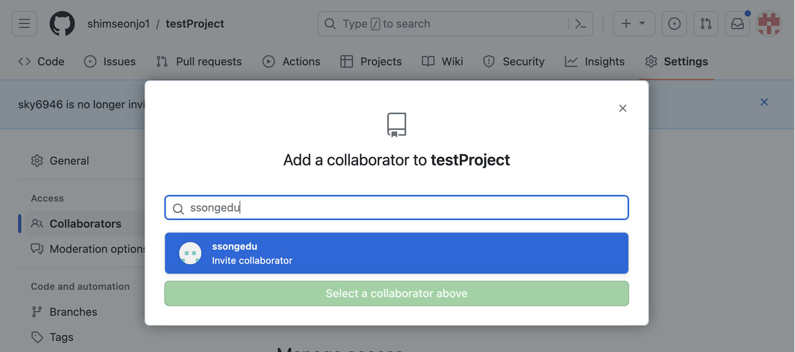

---

### 3-3. PR 내용 작성

PR 제목과 설명을 작성합니다.

**PR 제목**: `feat: 메인 페이지 초안 작성`

**PR 설명**:

```markdown
## 변경 내용

- `index.html` 메인 페이지를 새로 만들었습니다.
- 헤더 내비게이션과 히어로 섹션을 포함합니다.
- `about.html` 링크는 추후 팀원 B의 작업과 연결할 예정입니다.

## 확인 방법

1. `index.html`을 브라우저에서 열어보세요.
2. 레이아웃이 깔끔하게 보이는지 확인해 주세요.

## 관련 Issue

Closes #1
```

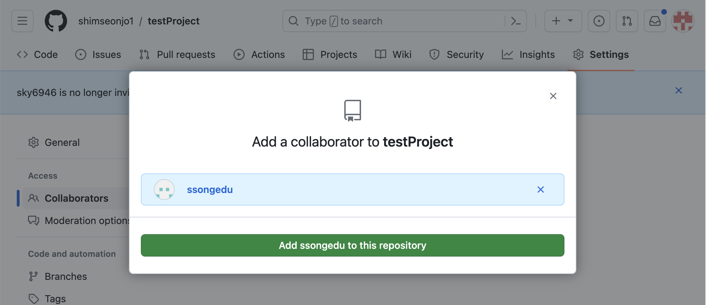

> 💡 PR 설명에 "무엇을 바꿨는가", "어떻게 확인하는가", "관련 Issue"를 담으면
> 팀장이 리뷰하기 훨씬 쉬워집니다.

**Reviewers** 항목에서 팀장을 지정합니다.

**Create pull request** 버튼을 클릭합니다.

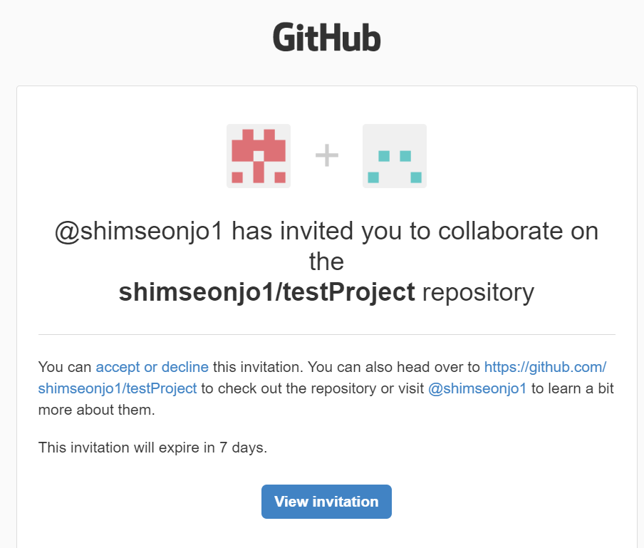

---

<a id="step4"></a>

## 6️⃣ Step 4: 팀장 — PR 리뷰 + 승인 [↑](#toc)

### 4-1. PR 확인

리포지토리의 **Pull requests** 탭에서 팀원이 만든 PR을 클릭합니다.

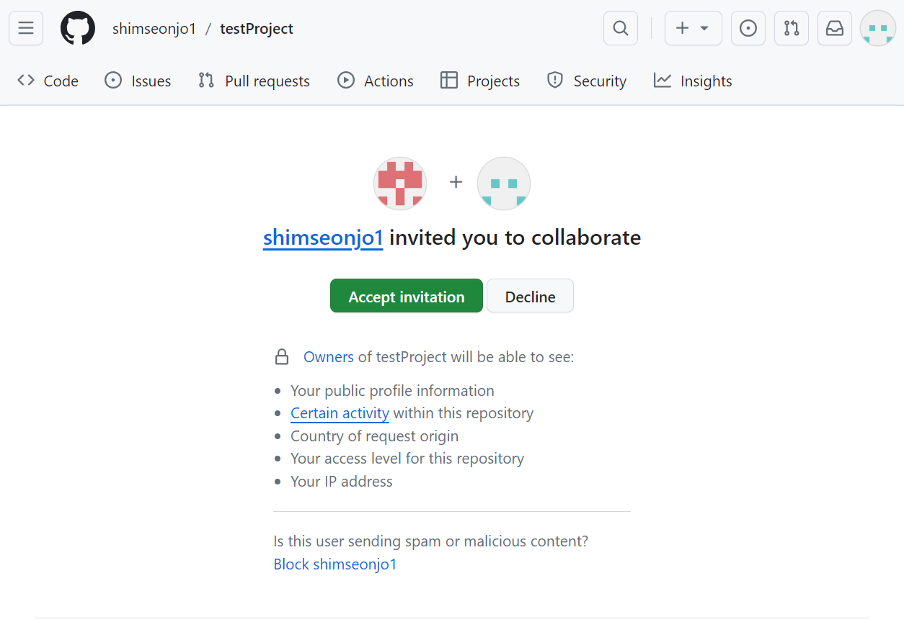

---

### 4-2. 변경 파일 검토

**Files changed** 탭에서 팀원이 추가하거나 수정한 내용을 확인합니다.

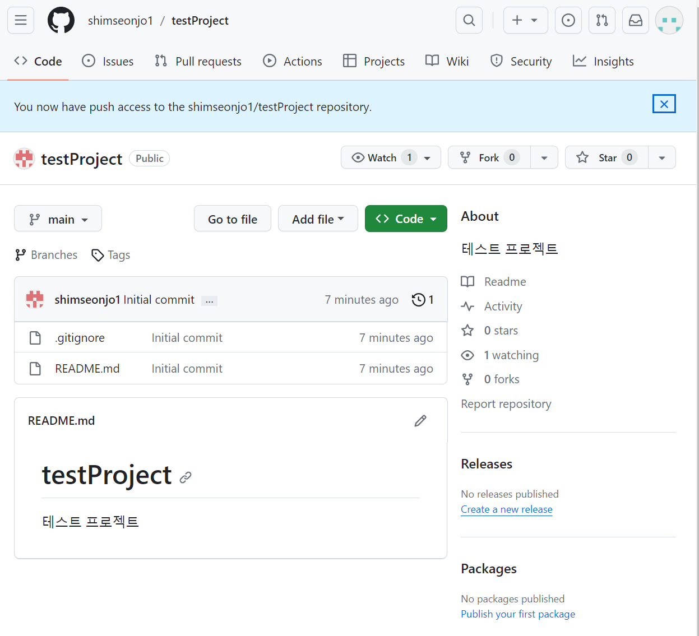

코드의 특정 줄에 코멘트를 남기려면 줄 번호 왼쪽의 `+` 버튼을 클릭합니다.

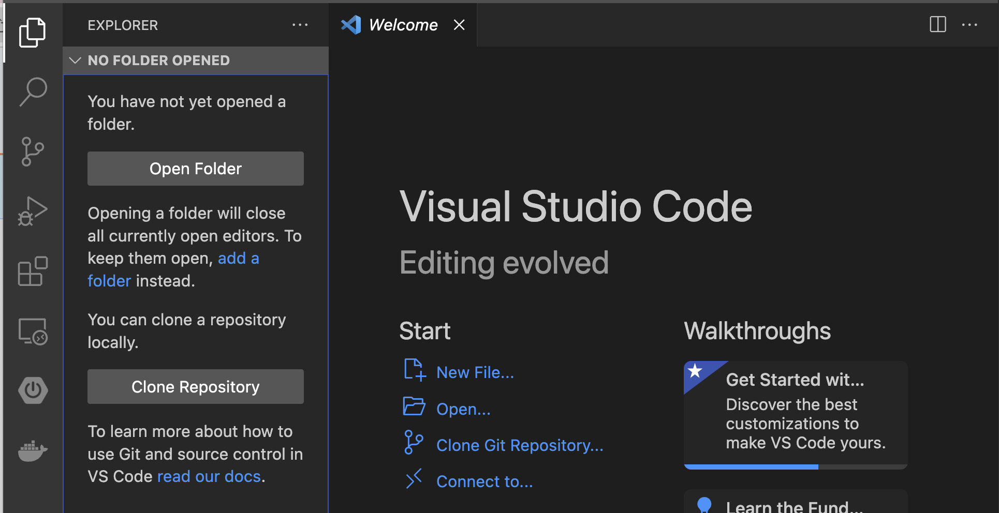

**코멘트 예시**:

```
히어로 섹션의 배경색이 좋네요.
혹시 모바일에서도 테스트해 보셨나요?
`viewport` 메타 태그가 있어서 아마 괜찮을 것 같은데,
about.html 연결까지 완료되면 한번 더 확인해 보아요.
```

---

### 4-3. 리뷰 제출

**Review changes** 버튼을 클릭합니다.

| 옵션 | 의미 | 언제 사용하나 |
|------|------|-------------|
| Comment | 단순 의견 | 칭찬, 질문, 가벼운 제안 |
| Approve | 승인 | 코드가 머지 가능한 상태 |
| Request changes | 수정 요청 | 반드시 수정 후 다시 리뷰 필요 |

오늘 실습에서는 **Approve** → **Submit review**를 선택합니다.

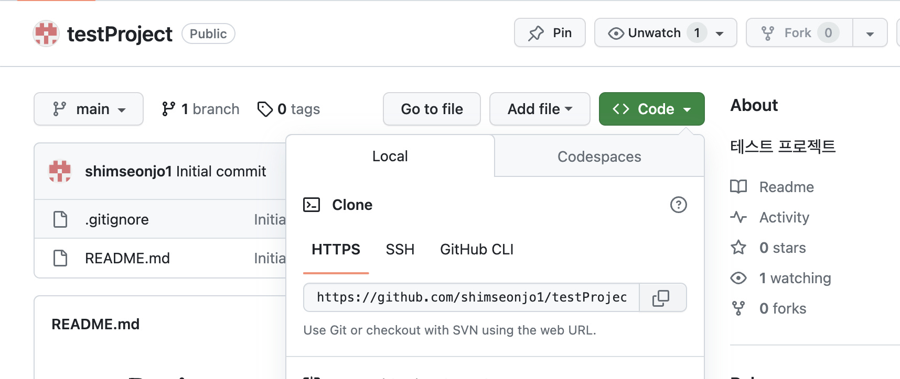

> 💡 코드 리뷰는 "틀렸다"를 지적하는 것이 아닙니다.
> "더 나은 방법이 있을까?", "이 부분 의도가 궁금해" 같은 대화입니다.
> 팀원의 노력을 인정하는 긍정적인 코멘트도 꼭 넣어 보세요.

---

### 4-4. 수정 요청을 받은 경우 (팀원)

팀장이 **Request changes**를 선택했다면, 팀원은 로컬에서 수정 후 다시 push합니다.
같은 브랜치에 push하면 PR이 자동으로 업데이트됩니다.

```bash
# 파일 수정 후
git add index.html
git commit -m "style: 팀장 리뷰 반영 - 모바일 패딩 조정"
git push
```

> 💡 수정 후 PR 댓글에 "수정했습니다. 다시 확인 부탁드립니다."를 남기는 것이 좋은 협업 매너입니다.

---

<a id="step5"></a>

## 7️⃣ Step 5: 머지 + 브랜치 삭제 + 동기화 [↑](#toc)

### 5-1. 머지 (팀장)

PR이 승인된 상태에서 **Merge pull request** 버튼을 클릭합니다.

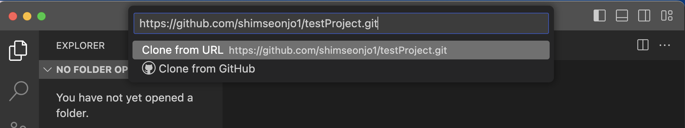

머지 방식은 **Create a merge commit**을 선택합니다.
(처음에는 가장 표준적인 방식입니다.)

**Confirm merge**를 클릭합니다.

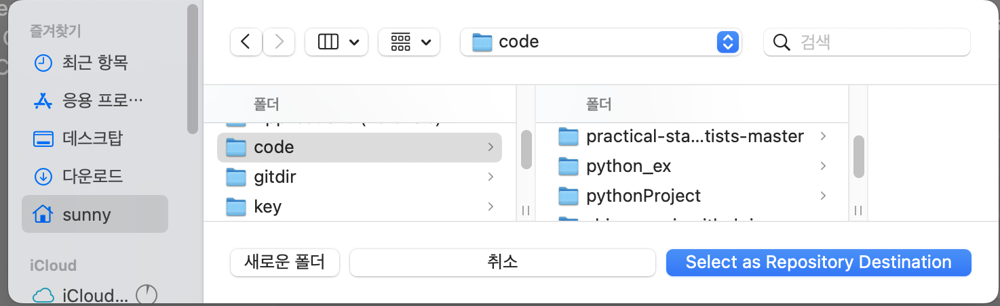

---

### 5-2. 브랜치 삭제

머지가 완료되면 GitHub이 브랜치 삭제 버튼을 표시합니다.

```
[Delete branch]  ← 클릭합니다
```

> 💡 머지된 브랜치는 삭제해도 커밋 이력은 남아 있습니다.
> 브랜치를 삭제하는 것은 "이 브랜치에서의 작업이 완료되었다"는 신호입니다.

---

### 5-3. 다른 팀원의 로컬 동기화 (모든 팀원)

`main` 브랜치가 업데이트되었으니, 모든 팀원이 최신 상태를 가져와야 합니다.

```bash
git switch main
git pull
```

팀원 B가 `about.html` 작업을 시작하기 전에 반드시 이 단계를 수행합니다.

```bash
# 최신 main을 받은 후 새 브랜치 생성
git switch main
git pull
git switch -c feature/about-page
```

> ⚠️ `git pull` 없이 새 브랜치를 만들면 오래된 main 기준으로 브랜치가 만들어집니다.
> 항상 pull 먼저, 그 다음 브랜치 생성 순서를 지키세요.

---

<a id="conflict"></a>

## 8️⃣ 충돌 시나리오 — 같은 곳을 두 사람이 수정했다면 [↑](#toc)

> 머지 충돌은 "두 사람이 같은 파일의 같은 줄을 다르게 수정했을 때" 발생합니다.
> Git은 둘 중 어느 것이 맞는지 판단할 수 없어 사람에게 결정을 맡깁니다.
> 처음에는 당황스럽지만, 해결 절차를 알면 두렵지 않습니다.

### 충돌 만들기 (실습용)

**팀장**이 GitHub 웹에서 직접 `index.html`의 제목을 수정합니다.

```html
<!-- 팀장이 변경 -->
<h1>우리 팀을 소개합니다</h1>
```

동시에 **팀원 A**도 로컬에서 같은 줄을 다르게 수정하고 커밋합니다.

```html
<!-- 팀원 A가 변경 -->
<h1>팀 프로젝트에 오신 것을 환영합니다!</h1>
```

팀원 A가 push를 시도하면 거절됩니다.

```bash
git push
# 오류: Updates were rejected because the remote contains work that you do not have locally.
```

---

### 충돌 해결 절차

**1단계 — 원격 변경사항 가져오기**

```bash
git pull
```

```
CONFLICT (content): Merge conflict in index.html
Automatic merge failed; fix conflicts and then commit the result.
```

**2단계 — 충돌 파일 열기**

`index.html`을 열면 충돌 마커가 표시되어 있습니다.

```html
<<<<<<< HEAD
<h1>팀 프로젝트에 오신 것을 환영합니다!</h1>
=======
<h1>우리 팀을 소개합니다</h1>
>>>>>>> origin/main
```

| 마커 | 의미 |
|------|------|
| `<<<<<<< HEAD` | 내가 작성한 내용의 시작 |
| `=======` | 내 내용과 상대방 내용의 경계 |
| `>>>>>>> origin/main` | 원격(상대방)의 내용 |

**3단계 — 팀과 합의 후 수정**

두 내용을 합치거나 하나를 선택합니다.
마커를 포함한 세 줄(`<<<<<<<`, `=======`, `>>>>>>>`)을 모두 지웁니다.

```html
<!-- 합의 결과 -->
<h1>우리 팀에 오신 것을 환영합니다</h1>
```

> ⚠️ VS Code를 쓴다면 충돌 마커 위에 `Accept Current Change`, `Accept Incoming Change`, `Accept Both Changes` 버튼이 나타납니다.
> 클릭 한 번으로 선택할 수 있어 편리합니다.

**4단계 — 커밋**

```bash
git add index.html
git commit -m "merge: 제목 충돌 해결 - 팀원 A와 팀장 합의"
git push
```

> 💡 충돌 해결 커밋 메시지에는 누가, 무엇을 합의해서 해결했는지 기록해 두면
> 나중에 이력을 볼 때 맥락을 이해하기 쉽습니다.

---

### 충돌 예방 습관

| 습관 | 효과 |
|------|------|
| 작업 전 항상 `git pull` | 최신 상태에서 시작 |
| 브랜치를 기능 단위로 작게 | 충돌 범위 최소화 |
| 자주 커밋 + 자주 push | 팀원이 내 변경을 빨리 인지 |
| 같은 파일 동시 작업 최소화 | 근본적인 예방 |

---

<a id="mapping"></a>

## 9️⃣ 개념 매핑표 — 배운 장과 연결 [↑](#toc)

오늘 시뮬레이션에서 사용한 모든 것은 이 과정에서 배운 내용입니다.

| 이 프로젝트에서 사용한 것 | 배운 장 |
|------------------------|---------|
| `git init`, `git add`, `git commit` | 03장 — 첫 번째 커밋 |
| `.gitignore` | 04장 — 변경 이력 관리 |
| `git switch -c`, 브랜치 전략 | 05장 — 브랜치 기초 |
| `git merge`, 충돌 해결 | 06장 — 머지 |
| `git remote`, `git push`, `git clone` | 07장 — 원격 저장소 |
| `git pull`, 협업 동기화 | 08장 — 협업 기초 |
| Pull Request, 코드 리뷰 | 09장 — Pull Request |
| `git restore`, `git stash` | 10장 — 되돌리기와 임시 저장 |
| GitHub Pages, Issues | 11장 — GitHub 활용 |

> 💡 Git을 처음 배울 때는 명령어들이 따로따로 보입니다.
> 하지만 오늘 시뮬레이션을 통해 모든 명령어가 하나의 흐름 안에서 연결된다는 것을 느꼈을 것입니다.

---

<a id="cheatsheet"></a>

## 🔟 자주 쓰는 Git 명령어 모음 [↑](#toc)

> 모든 명령어를 외울 필요는 없습니다.
> 이 카드를 북마크해 두고, 필요할 때마다 찾아 쓰세요.
> 쓰다 보면 자연스럽게 외워집니다.

```bash
# ── 저장소 시작 ──────────────────────────────────────
git init                      # 새 저장소 초기화
git clone URL                 # 원격 저장소 복제

# ── 상태 확인 ────────────────────────────────────────
git status                    # 현재 상태 확인
git log --oneline --graph     # 커밋 이력 보기 (그래프)
git diff                      # 스테이징 전 변경 내용 보기
git diff --staged             # 스테이징된 변경 내용 보기

# ── 기본 사이클: 작업 → 스테이징 → 커밋 ─────────────
git add 파일명                # 특정 파일 스테이징
git add .                     # 모든 변경 스테이징
git commit -m "메시지"        # 커밋
git commit --amend            # 가장 최근 커밋 메시지 수정

# ── 원격 저장소 ──────────────────────────────────────
git push                      # 원격에 업로드
git push -u origin 브랜치명   # 처음 push + 추적 설정
git pull                      # 원격에서 다운로드 + 머지
git fetch                     # 원격 변경사항 가져오기 (머지 안 함)

# ── 브랜치 ───────────────────────────────────────────
git branch                    # 브랜치 목록 확인
git switch 브랜치명            # 브랜치 전환
git switch -c 브랜치명         # 새 브랜치 생성 + 전환
git branch -d 브랜치명         # 브랜치 삭제 (머지된 것만)
git merge 브랜치명             # 브랜치 병합

# ── 되돌리기 ─────────────────────────────────────────
git restore 파일명             # 워킹 디렉터리 변경 취소
git restore --staged 파일명    # 스테이징 취소
git revert 커밋해시            # 특정 커밋을 되돌리는 새 커밋 생성
git reset --soft HEAD~1        # 커밋만 취소 (스테이징 유지)
git reset --mixed HEAD~1       # 커밋 + 스테이징 취소

# ── 임시 저장 ────────────────────────────────────────
git stash                     # 작업 중인 변경사항 임시 저장
git stash pop                 # 임시 저장 복구
git stash list                # 임시 저장 목록 확인
```

> ⚠️ `git reset --hard`는 데이터를 영구 삭제할 수 있습니다.
> 반드시 무엇을 삭제하는지 확인한 후 사용하세요.

---

<a id="closing"></a>

## 1️⃣1️⃣ 과정을 마치며 [↑](#toc)

### 전체 회고

이 과정은 01장에서 "최종_진짜최종_v3.docx" 문제로 시작했습니다.

```
최종.docx
최종_수정.docx
최종_진짜최종.docx
최종_진짜최종_v2_이게맞음.docx
최종_진짜최종_v3_제출용.docx   ← 이 문제를 해결하기 위해 여기까지 왔습니다
```

이제 여러분은 파일 이름으로 버전을 관리하는 대신, Git으로 모든 변경을 추적합니다.
실수를 했어도 되돌릴 수 있습니다.
혼자 작업해도, 팀과 함께 작업해도 안전합니다.

---

### 4-Zone 멘탈 모델 최종 복습

이 과정에서 배운 모든 Git 명령어는 4개의 구역 사이에서 데이터를 이동시킵니다.

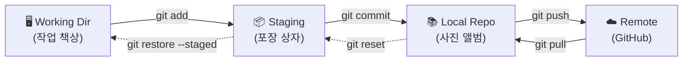

> 새 명령어를 만났을 때 "이 명령어가 어느 구역에서 어느 구역으로 데이터를 옮기는가?"라는 질문 하나로 이해할 수 있습니다.

---

### 다음으로 배우면 좋은 것들

이 과정을 마친 여러분에게 자연스럽게 연결되는 주제들입니다.

| 주제 | 내용 | 난이도 |
|------|------|--------|
| Git 고급 | `rebase`, `cherry-pick`, `bisect` | ⭐⭐⭐ |
| GitHub Actions CI/CD | 자동 테스트, 자동 배포 파이프라인 구축 | ⭐⭐⭐ |
| Git 전략 | Git Flow, Trunk-based Development | ⭐⭐⭐ |
| Git Hooks | 커밋 전 자동 검사, 코드 포맷팅 | ⭐⭐ |
| Conventional Commits | 커밋 메시지 표준화 | ⭐⭐ |
| Monorepo 관리 | 하나의 리포지토리에서 여러 프로젝트 관리 | ⭐⭐⭐⭐ |

---

### 마무리

Git을 처음 배울 때 가장 중요한 것은 **일단 써보는 것**입니다.

처음에는 명령어가 낯설고, 충돌이 생기면 당황스럽고, PR을 만드는 것이 부담스러울 수 있습니다.
하지만 한 번 해보면, 두 번째는 훨씬 쉽습니다.

오늘 배운 내용으로 여러분의 첫 번째 팀 프로젝트를 시작해 보세요.
GitHub Flow 7단계를 하나씩 따라가다 보면, 어느새 자연스럽게 협업하고 있는 자신을 발견하게 될 것입니다.

이 과정을 완주한 여러분을 진심으로 축하합니다.

> "버전 관리는 기술이기 전에 습관입니다. 오늘부터 매일 커밋하세요."


