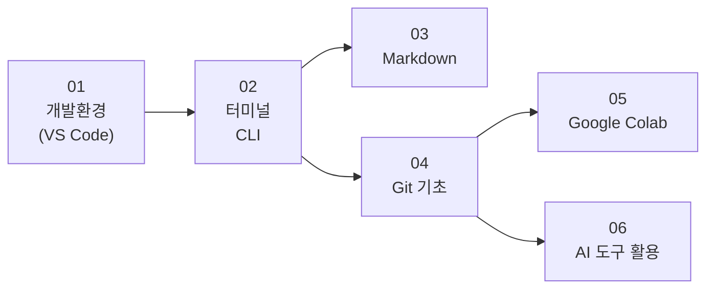



## 학습 목표

- 모든 과정을 시작하기 전에 갖춰야 할 공통 기초 역량을 파악할 수 있다
- 내가 수강할 과정에서 어떤 기초 도구가 필요한지 확인하고 먼저 준비할 수 있다

## 진행 순서

1. [이 섹션은 무엇인가?](#intro) - 기초 도구의 역할과 목적
2. [학습 경로](#path) - 6가지 기초 도구의 순서와 흐름
3. [목차](#chapters) - 각 장 요약
4. [과정별 필수 이수 가이드](#guide) - 내 과정에 필요한 것만 먼저 하기

---

# 기초 도구 — 모든 과정의 공통 기반

## 1️⃣ 이 섹션은 무엇인가? [↑](#toc)

> 모든 과정을 시작하기 전에 갖춰야 할 공통 기초 역량입니다.

프로그래밍을 배우려면 언어나 프레임워크를 공부하기 전에 **작업 환경 자체**를 먼저 갖춰야 합니다. 집을 짓기 전에 작업대와 공구를 준비하는 것과 같습니다.

이 섹션에서 다루는 6가지 도구는 Git, ML/DL, LLM, AI-Native 등 어느 과정을 수강하더라도 반복해서 쓰게 될 **가장 기본적인 도구**입니다.

| 도구 | 한 줄 설명 |
|------|-----------|
| 개발환경 (VS Code) | 코드를 작성하는 전문 편집기 |
| 터미널과 CLI | 글자로 컴퓨터에 명령을 내리는 환경 |
| Markdown | 문서와 README를 빠르게 작성하는 경량 문법 |
| Git 기초 | 파일 버전을 관리하고 협업하는 도구 |
| Google Colab | 설치 없이 브라우저에서 Python을 실행하는 환경 |
| AI 도구 활용 | ChatGPT, Copilot 등 AI 보조 도구를 실무에 적용하는 법 |

---

## 2️⃣ 학습 경로 [↑](#toc)

> 아래 순서대로 진행하면 각 도구가 다음 도구의 기반이 됩니다.

- **01 개발환경**: 모든 작업의 출발점. 이것부터 설치한다.
- **02 터미널**: 개발환경이 설치되면 터미널을 익혀야 나머지가 가능하다.
- **03 Markdown**: 터미널을 알면 Markdown으로 문서를 바로 쓸 수 있다.
- **04 Git**: 터미널 위에서 동작하므로 터미널 이후에 배운다.
- **05 Colab**: Git으로 파일을 관리할 줄 알면 Colab과 연동이 훨씬 자연스럽다.
- **06 AI 도구**: 앞의 도구들을 다 쓸 줄 알 때 AI 보조가 가장 효과적이다.

---

## 3️⃣ 목차 [↑](#toc)

| 장 | 제목 | 핵심 내용 |
|----|------|-----------|
| [01](/language/basic/dev-env) | 개발환경 구축 | VS Code 설치, 화면 구성, 단축키, 필수 확장 프로그램 |
| [02](/language/basic/terminal) | 터미널과 CLI | 터미널 열기, 기본 명령어, 경로 개념 |
| [03](/language/basic/markdown) | Markdown | 제목·목록·링크·코드 블록, README 작성 |
| [04](/language/basic/git-basic) | Git 기초 | init, add, commit, push, GitHub 연결 |
| [05](/language/basic/colab) | Google Colab | 노트북 구조, 셀 실행, 파일 업로드, GPU 설정 |
| [06](/language/basic/ai-tools) | AI 도구 활용 | ChatGPT 프롬프트, Copilot, AI와 함께 코딩하기 |

---

## 4️⃣ 과정별 필수 이수 가이드 [↑](#toc)

> 모든 기초 도구를 처음부터 다 할 필요는 없습니다.  
> 내가 수강할 과정에서 요구하는 것만 먼저 이수하고 본 과정을 시작하세요.

| 수강 과정 | 필수 | 권장 |
|-----------|------|------|
| **Git 과정** | 01 개발환경, 02 터미널 | 03 Markdown |
| **ML/DL** | 01 개발환경, 02 터미널, 05 Colab | 04 Git, 06 AI 도구 |
| **LLM / LangChain** | 01 개발환경, 02 터미널 | 04 Git, 06 AI 도구 |
| **AI-Native** | 01 개발환경, 02 터미널, 04 Git | 06 AI 도구 |
| **AI-Native JS** | 01 개발환경 | 03 Markdown, 06 AI 도구 |

> 💡 **팁**: "권장" 항목은 과정 진행에 당장 지장은 없지만, 미리 익혀두면 과정 중반부터 체감 속도가 달라집니다.

---

→ **첫 번째 장 시작**: [01. 개발환경 구축](/language/basic/dev-env)


