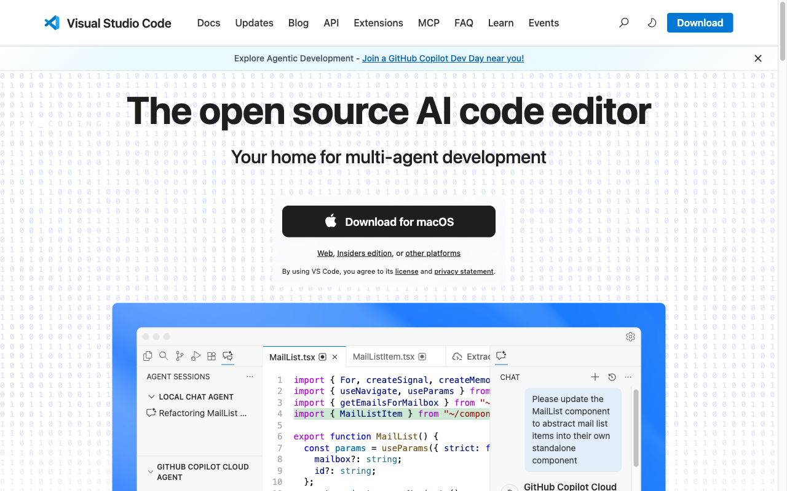
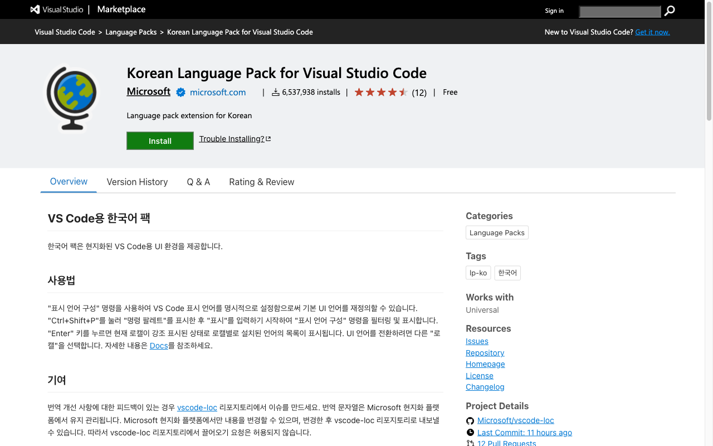
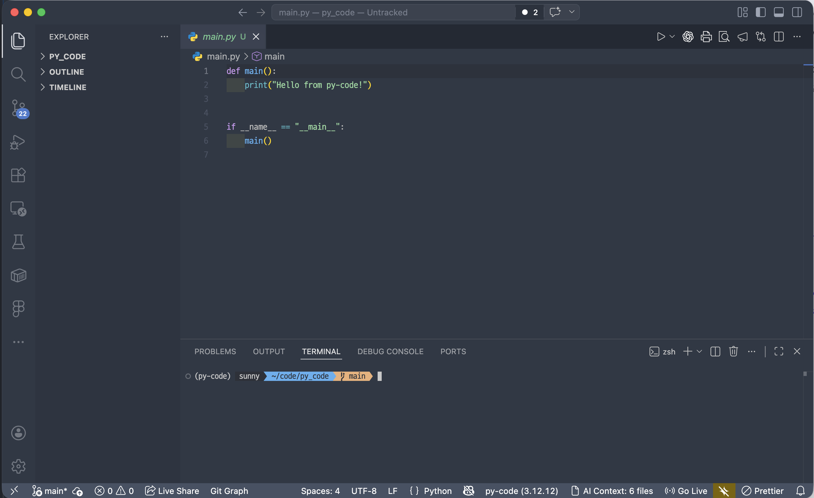



## 학습 목표

- VS Code를 설치하고 기본 사용법을 익힌다
- 핵심 단축키와 확장 프로그램을 설정한다

<a id="toc"></a>

## 진행 순서

1. [왜 VS Code인가?](#part1) - 메모장 vs 전문 도구, 세 가지 핵심 장점
2. [설치하기](#part2) - Windows / Mac 설치 링크, 한국어 팩
3. [화면 구성 이해하기](#part3) - 사이드바, 에디터, 터미널, 상태바
4. [핵심 단축키 10가지](#part4) - 가장 자주 쓰는 것만 표로 정리
5. [필수 확장 프로그램](#part5) - 5개 엄선, 각각 왜 필요한지
6. [실습: 첫 파일 만들기](#part6) - 폴더 열기 → hello.txt → 터미널 확인
7. [정리](#part7) - 핵심 요약, 학습 체크리스트

---

# 01장. 개발환경 구축 — 작업실 꾸미기

> 목수에게 톱과 작업대가 있듯, 개발자에게는 코드 편집기가 있습니다.  
> 이 장에서는 전 세계에서 가장 많이 쓰이는 편집기인 **VS Code**를 설치하고, 첫 번째 파일을 만들어봅니다.

---

<a id="part1"></a>

## 1️⃣ 왜 VS Code인가? [↑](#toc)

### 메모장 vs 전문 도구

코드는 메모장으로도 쓸 수 있습니다. 하지만 실제로 해보면 바로 차이를 느낍니다.

| 기능 | 메모장 | VS Code |
|------|--------|---------|
| 자동 완성 | 없음 | 있음 (타이핑 줄여줌) |
| 오타 감지 | 없음 | 있음 (빨간 밑줄) |
| 색상 구분 | 없음 | 있음 (키워드/문자열/주석이 다른 색) |
| 터미널 내장 | 없음 | 있음 (편집기 안에서 명령어 실행) |
| 확장 기능 | 없음 | 수천 개 (무료) |

> "메모장으로 코딩하는 것은 일반 주방 칼로 수술하는 것과 같습니다."

### VS Code의 세 가지 핵심 장점

1. **무료**: 마이크로소프트가 무료로 배포합니다. 모든 기능이 제한 없이 사용 가능합니다.
2. **확장 프로그램**: 마켓플레이스에서 수천 개의 플러그인을 설치할 수 있습니다. 어떤 언어나 프레임워크를 배우든 전용 도구가 있습니다.
3. **AI 통합**: GitHub Copilot, ChatGPT 등 AI 코딩 도구와 가장 잘 연동됩니다. 앞으로 AI 도구를 쓸 때도 VS Code가 중심이 됩니다.

---

<a id="part2"></a>

## 2️⃣ 설치하기 [↑](#toc)

### Windows

1. [https://code.visualstudio.com/](https://code.visualstudio.com/) 접속



2. **Download for Windows** 버튼 클릭 (버전은 자동으로 감지됨)
3. 설치 파일 실행 — 모든 옵션 기본값으로 진행해도 됩니다

> 설치 중 **"PATH에 추가"** 옵션이 나오면 반드시 체크하세요. 터미널에서 `code` 명령어로 VS Code를 바로 열 수 있게 됩니다.

### Mac

1. [https://code.visualstudio.com/](https://code.visualstudio.com/) 접속
2. **Download for Mac** 버튼 클릭
3. 다운로드된 `.zip` 파일 압축 해제 → `Visual Studio Code.app`을 **응용 프로그램** 폴더로 이동

**Mac에서 터미널 `code` 명령어 활성화:**

VS Code를 열고 `Cmd + Shift + P` → `Shell Command: Install 'code' command in PATH` 실행

### 한국어 팩 설치

VS Code는 기본적으로 영어입니다. 한국어로 바꾸고 싶다면:

1. VS Code 실행 후 왼쪽 아이콘 중 **확장 프로그램** (네모 4개 아이콘) 클릭
2. 검색창에 `Korean Language Pack` 입력
3. **Korean Language Pack for Visual Studio Code** 설치
4. VS Code 재시작



> 💡 한국어 팩은 선택 사항입니다. 영어 메뉴에 익숙해지는 것도 장기적으로 도움이 됩니다.

---

<a id="part3"></a>

## 3️⃣ 화면 구성 이해하기 [↑](#toc)

VS Code를 처음 열면 여러 영역이 눈에 들어옵니다. 각각의 역할을 알면 헤매지 않습니다.



| 영역 | 역할 |
|------|------|
| **액티비티 바** (왼쪽 아이콘 열) | 탐색기, 검색, Git, 확장 프로그램 등 주요 기능 전환 |
| **사이드바** (액티비티 바 오른쪽) | 폴더 구조 보기, 파일 목록, 검색 결과 등 표시 |
| **에디터 영역** (중앙) | 실제 파일을 열고 코드를 작성하는 공간 |
| **터미널 패널** (하단) | 명령어를 입력하는 내장 터미널. `Ctrl+`` ` (백틱)으로 토글 |
| **상태바** (맨 아래) | 현재 파일의 언어, 인코딩, Git 브랜치 등 상태 표시 |

---

<a id="part4"></a>

## 4️⃣ 핵심 단축키 10가지 [↑](#toc)

> 처음부터 전부 외울 필요 없습니다. 아래 10가지만 몸에 익히면 작업 속도가 눈에 띄게 달라집니다.

| 기능 | Windows | Mac |
|------|---------|-----|
| 파일 저장 | `Ctrl + S` | `Cmd + S` |
| 터미널 열기/닫기 | `` Ctrl + ` ``(백틱) | `` Ctrl + ` ``(백틱) |
| 명령 팔레트 | `Ctrl + Shift + P` | `Cmd + Shift + P` |
| 빠른 파일 열기 | `Ctrl + P` | `Cmd + P` |
| 줄 복사 (아래) | `Shift + Alt + ↓` | `Shift + Option + ↓` |
| 줄 삭제 | `Ctrl + Shift + K` | `Cmd + Shift + K` |
| 한 줄 주석 토글 | `Ctrl + /` | `Cmd + /` |
| 다중 커서 추가 | `Ctrl + Alt + ↑/↓` | `Cmd + Option + ↑/↓` |
| 찾기 / 바꾸기 | `Ctrl + H` | `Cmd + Option + F` |
| 들여쓰기 | `Tab` / `Shift + Tab` | `Tab` / `Shift + Tab` |

### 명령 팔레트란?

`Ctrl + Shift + P` (Mac: `Cmd + Shift + P`) 를 누르면 나오는 검색창입니다. VS Code의 모든 기능을 키워드로 검색해서 실행할 수 있습니다. 단축키가 기억나지 않을 때 여기서 검색하면 됩니다.

> 💡 **학습 전략**: 처음 1주일은 의식적으로 마우스 대신 단축키를 써보세요. 처음엔 느리지만 2주 후부터는 확실히 빨라집니다.

---

<a id="part5"></a>

## 5️⃣ 필수 확장 프로그램 [↑](#toc)

> 수천 개의 확장 프로그램 중에서 **비전공자가 처음부터 설치하면 좋은 5가지**만 추렸습니다.

확장 프로그램 설치 방법: 왼쪽 액티비티 바의 **확장 프로그램 아이콘** 클릭 → 이름 검색 → 설치

| 확장 프로그램 | 필요한 이유 |
|--------------|-----------|
| **Korean Language Pack** | VS Code 메뉴를 한국어로 표시. 처음엔 영어가 낯선 분에게 도움 |
| **Material Icon Theme** | 파일·폴더 아이콘을 직관적으로 바꿔줌. `.py`, `.md`, `.json`을 한눈에 구분 |
| **Indent Rainbow** | 들여쓰기를 색상으로 표시. Python 같이 들여쓰기가 중요한 언어에서 오류를 줄여줌 |
| **Live Server** | HTML 파일을 저장할 때마다 브라우저가 자동으로 새로고침됨. 웹 개발 실습에 필수 |
| **Prettier** | 코드 스타일을 자동으로 정리해줌. 저장할 때마다 들여쓰기·줄바꿈·따옴표를 통일 |

> 💡 나중에 Git 과정을 수강하면 **Git Graph** 확장 프로그램도 유용합니다. 지금은 위 5개로 충분합니다.

---

<a id="part6"></a>

## 6️⃣ 실습: 첫 파일 만들기 [↑](#toc)

> 도구를 설치했으니 실제로 사용해봅니다. 3단계로 첫 번째 파일을 만들고, 터미널에서 확인합니다.

### Step 1 — 작업 폴더 열기

1. VS Code 실행
2. 상단 메뉴 **파일(File)** → **폴더 열기(Open Folder)**
3. 원하는 위치에 `my-first-project`라는 새 폴더를 만들고 선택

왼쪽 사이드바에 `MY-FIRST-PROJECT` 폴더가 표시되면 성공입니다.

### Step 2 — 첫 번째 파일 만들기

1. 사이드바의 폴더 이름 옆 **새 파일(New File) 아이콘** 클릭 (또는 `Ctrl + N` / `Cmd + N`)
2. 파일 이름: `hello.txt` 입력 후 Enter
3. 에디터에 아래 내용을 입력하고 **저장** (`Ctrl + S` / `Cmd + S`)

```
안녕하세요.
저는 VS Code로 첫 번째 파일을 만들었습니다.
```

### Step 3 — 터미널에서 확인하기

1. `` Ctrl + ` `` (Mac도 동일) 로 터미널 패널 열기
2. 아래 명령어를 입력하고 Enter

**Windows (Git Bash / PowerShell):**
```
ls
```

**Mac / Linux (터미널):**
```
ls
```

`hello.txt`가 목록에 표시되면 성공입니다.

> 💡 터미널이 낯설어도 걱정하지 마세요. 다음 장 **02. 터미널과 CLI**에서 자세히 배웁니다. 여기서는 "터미널이 이런 곳이구나" 정도만 확인하면 충분합니다.

---

<a id="part7"></a>

## 7️⃣ 정리 [↑](#toc)

### 이 장에서 배운 것

| 항목 | 내용 |
|------|------|
| VS Code 장점 | 무료, 확장 프로그램, AI 통합 — 전 세계 개발자가 가장 많이 씀 |
| 설치 | Windows: 설치 파일 실행 / Mac: .zip 압축 해제 후 응용 프로그램으로 이동 |
| 화면 구성 | 액티비티 바 / 사이드바 / 에디터 / 터미널 패널 / 상태바 |
| 핵심 단축키 | 저장(`Ctrl+S`), 터미널(`` Ctrl+` ``), 명령 팔레트(`Ctrl+Shift+P`) 등 10가지 |
| 필수 확장 | Korean Pack, Material Icon, Indent Rainbow, Live Server, Prettier |
| 첫 실습 | 폴더 열기 → 파일 만들기 → 터미널 확인 |

---

### 학습 체크리스트

이 장을 마치기 전에 아래 항목을 모두 확인하세요.

- [ ] VS Code를 설치하고 정상적으로 실행된다
- [ ] `` Ctrl + ` `` 로 터미널 패널을 열고 닫을 수 있다
- [ ] `Ctrl + Shift + P` 로 명령 팔레트를 열 수 있다
- [ ] 5개 필수 확장 프로그램을 모두 설치했다
- [ ] `my-first-project` 폴더를 열고 `hello.txt` 파일을 만들었다
- [ ] 터미널에서 `ls` 명령어로 파일 목록을 확인했다

---

→ **다음 장**: [02. 터미널과 CLI](/language/basic/terminal)


