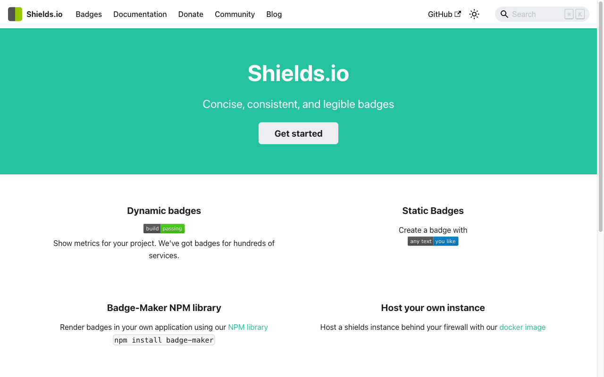

# 03. Markdown
{: .no_toc }

> 코드를 잘 짜는 것만큼 중요한 것이 있다.  
> 내가 만든 것을 다른 사람이 이해할 수 있도록 설명하는 것.  
> Markdown은 그 설명을 쉽고 보기 좋게 작성하는 가장 간단한 방법이다.

---

## 학습 목표
{: .no_toc }

- Markdown이 무엇인지, 어디에 쓰이는지 이해한다
- 제목, 굵게, 기울임, 취소선, 인라인 코드를 작성할 수 있다
- 순서 있는·없는 목록과 체크박스를 만들 수 있다
- 코드 블록에 언어를 지정해 문법 강조를 적용할 수 있다
- 링크, 이미지, 표, 인용, 수평선을 작성할 수 있다
- shields.io 뱃지를 만들어 GitHub 프로필 README에 삽입할 수 있다

---

<a id="toc"></a>

## 진행 순서
{: .no_toc }

1. [Markdown이란?](#1)
2. [제목과 텍스트 서식](#2)
3. [목록과 체크박스](#3)
4. [코드 블록](#4)
5. [링크와 이미지](#5)
6. [표 만들기](#6)
7. [인용과 구분선](#7)
8. [실습: 자기소개 README 작성](#8)
9. [정리](#9)

---

## 1️⃣ Markdown이란? [↑](#toc)

### 비유: 서식 있는 메모장

Word나 한글처럼 굵게·기울임·제목을 마우스로 지정하는 대신,  
**특수 기호 몇 개만으로 서식을 표현**하는 텍스트 형식이 Markdown이다.

예를 들어 Word에서는 "굵게" 버튼을 클릭하지만,  
Markdown에서는 `**굵게**` 라고 쓰면 자동으로 **굵게** 렌더링된다.

일반 메모장(.txt)과 달리 서식이 있고,  
Word(.docx)와 달리 사람이 읽을 수 있는 순수 텍스트다.

### 어디에서 쓰는가?

| 사용처 | 설명 |
|:---|:---|
| **GitHub README** | 프로젝트 소개 문서 (`README.md`) |
| **기술 문서** | API 문서, 튜토리얼, Wiki |
| **노션(Notion)** | `/` 명령으로 Markdown 블록 사용 |
| **블로그** | Jekyll, Hugo, Ghost 등 정적 사이트 |
| **이 사이트** | Just the Docs 기반의 모든 페이지 |
| **Jupyter Notebook** | 코드 사이 설명 셀 |
| **Slack / Discord** | 채팅에서 코드 블록, 굵게 등 사용 |

개발자라면 Markdown을 피할 수 없다.  
GitHub에 올리는 모든 프로젝트의 첫 페이지가 `README.md`이기 때문이다.

### VS Code에서 미리보기

VS Code에서 `.md` 파일을 작성할 때 실시간 미리보기를 볼 수 있다.

| 방법 | 단축키 |
|:---|:---|
| 미리보기 열기 | <kbd>Ctrl</kbd> + <kbd>Shift</kbd> + <kbd>V</kbd> |
| 옆에 나란히 보기 | <kbd>Ctrl</kbd> + <kbd>K</kbd> → <kbd>V</kbd> (순서대로 누름) |
| 명령 팔레트 | <kbd>Ctrl</kbd> + <kbd>Shift</kbd> + <kbd>P</kbd> → `Markdown: Open Preview` |

> Mac에서는 <kbd>Ctrl</kbd> 대신 <kbd>Cmd</kbd>를 사용한다.

파일 탐색기에서 `.md` 파일을 열고 오른쪽 상단의 미리보기 아이콘(돋보기)을 눌러도 된다.

---

## 2️⃣ 제목과 텍스트 서식 [↑](#toc)

### 제목 — `#` 기호

`#` 기호의 개수로 제목의 크기를 정한다. `#`이 많을수록 작은 제목이다.

```markdown
# 제목 1 (h1) — 페이지 대제목
## 제목 2 (h2) — 섹션 제목
### 제목 3 (h3) — 소제목
#### 제목 4 (h4)
##### 제목 5 (h5)
###### 제목 6 (h6) — 가장 작음
```

> `#` 다음에 **반드시 공백**을 넣어야 제목으로 인식된다.  
> `#제목`은 제목이 아닌 일반 텍스트로 처리될 수 있다.

### 굵게, 기울임, 취소선

| 서식 | Markdown 문법 | 결과 |
|:---|:---|:---|
| 굵게 | `**텍스트**` 또는 `__텍스트__` | **텍스트** |
| 기울임 | `*텍스트*` 또는 `_텍스트_` | *텍스트* |
| 굵게 + 기울임 | `***텍스트***` | ***텍스트*** |
| 취소선 | `~~텍스트~~` | ~~텍스트~~ |
| 인라인 코드 | `` `코드` `` | `코드` |

### 예시

```markdown
파이썬을 배우면 **데이터 분석**부터 *웹 개발*까지 할 수 있다.  
예전에는 ~~Java만 써야 한다~~는 말을 믿었지만 지금은 아니다.  
`print("Hello")`는 파이썬의 가장 기본적인 출력 함수다.
```

렌더링 결과:

파이썬을 배우면 **데이터 분석**부터 *웹 개발*까지 할 수 있다.  
예전에는 ~~Java만 써야 한다~~는 말을 믿었지만 지금은 아니다.  
`print("Hello")`는 파이썬의 가장 기본적인 출력 함수다.

### 줄 바꿈

Markdown에서 엔터를 한 번 누르면 **줄이 바뀌지 않는다**.  
실제로 줄을 바꾸려면:

- 줄 끝에 **공백 두 칸** (`  `)을 넣고 엔터
- 또는 빈 줄을 하나 삽입해서 **문단을 나눔**

```markdown
첫 번째 줄  
두 번째 줄 (앞 줄 끝에 공백 두 칸)

새로운 문단 (빈 줄 하나로 구분)
```

---

## 3️⃣ 목록과 체크박스 [↑](#toc)

### 순서 없는 목록 (Unordered List)

`-`, `*`, `+` 중 하나를 사용한다. 일반적으로 `-`를 가장 많이 쓴다.

```markdown
- 사과
- 바나나
- 오렌지
```

결과:
- 사과
- 바나나
- 오렌지

### 순서 있는 목록 (Ordered List)

숫자와 점(`.`)으로 시작한다. 숫자가 틀려도 자동으로 순서대로 렌더링된다.

```markdown
1. 첫 번째
2. 두 번째
3. 세 번째
```

결과:
1. 첫 번째
2. 두 번째
3. 세 번째

### 중첩 목록

들여쓰기(스페이스 2칸 또는 4칸)로 하위 목록을 만든다.

```markdown
- 프로그래밍 언어
  - Python
    - 데이터 분석
    - 웹 개발
  - JavaScript
    - 프론트엔드
    - 백엔드 (Node.js)
- 도구
  - VS Code
  - Git
```

결과:
- 프로그래밍 언어
  - Python
    - 데이터 분석
    - 웹 개발
  - JavaScript
    - 프론트엔드
    - 백엔드 (Node.js)
- 도구
  - VS Code
  - Git

### 체크박스 (Task List)

GitHub에서 이슈나 PR을 작성할 때, 또는 README에 진행 상황을 표시할 때 유용하다.

```markdown
- [x] VS Code 설치
- [x] Python 설치
- [ ] Git 설치
- [ ] GitHub 계정 만들기
```

결과:
- [x] VS Code 설치
- [x] Python 설치
- [ ] Git 설치
- [ ] GitHub 계정 만들기

> `- [x]`는 완료된 항목, `- [ ]`는 미완료 항목이다.  
> `[`와 `]` 사이에 공백이 있어야 체크박스로 인식된다.

---

## 4️⃣ 코드 블록 [↑](#toc)

### 인라인 코드

문장 안에 짧은 코드를 넣을 때는 백틱(`` ` ``) 하나로 감싼다.

```markdown
`print()` 함수는 결과를 화면에 출력한다.
폴더를 이동하려면 `cd` 명령어를 사용한다.
```

결과: `print()` 함수는 결과를 화면에 출력한다.

### 코드 블록 — 백틱 3개

여러 줄의 코드는 백틱 세 개(` ``` `)로 감싼다.

````markdown
```
여러 줄
코드
블록
```
````

### 언어 지정 — 문법 강조(Syntax Highlighting)

백틱 세 개 뒤에 언어 이름을 적으면 색깔로 구분해서 보여준다.

````markdown
```python
def greet(name):
    print(f"안녕하세요, {name}님!")

greet("세계")
```
````

결과:

```python
def greet(name):
    print(f"안녕하세요, {name}님!")

greet("세계")
```

### 자주 쓰는 언어 지정자

| 언어 | 지정자 |
|:---|:---|
| Python | `python` |
| JavaScript | `javascript` 또는 `js` |
| TypeScript | `typescript` 또는 `ts` |
| HTML | `html` |
| CSS | `css` |
| Bash / 터미널 | `bash` 또는 `sh` |
| SQL | `sql` |
| JSON | `json` |
| YAML | `yaml` |
| 지정 없음 (일반 텍스트) | (빈칸) |

### 다양한 언어 예시

````markdown
```javascript
const hello = (name) => {
  console.log(`Hello, ${name}!`);
};
```

```bash
# 현재 위치 확인
pwd
ls -la
```

```json
{
  "name": "my-project",
  "version": "1.0.0"
}
```
````

---

## 5️⃣ 링크와 이미지 [↑](#toc)

### 링크

```markdown
[표시할 텍스트](URL)
```

```markdown
[Google](https://www.google.com)
[GitHub](https://github.com)
[이 사이트의 홈](/)
```

결과: [Google](https://www.google.com), [GitHub](https://github.com)

새 탭에서 열리게 하려면 HTML을 직접 쓴다.

```html
<a href="https://www.google.com" target="_blank">Google (새 탭)</a>
```

### 이미지

```markdown

```

- **대체 텍스트**: 이미지가 로드되지 않을 때 표시되는 텍스트. 접근성에도 중요하다.
- **이미지 경로**: 상대경로(`./img/photo.png`) 또는 절대 URL

```markdown


```

### 이미지 크기 조절 — HTML `` 태그

Markdown의 `` 문법은 크기를 조절할 수 없다.  
크기를 지정하려면 HTML `` 태그를 사용한다.

```html
<!-- 너비만 지정 (비율 유지) -->


<!-- 너비와 높이 모두 지정 -->


<!-- 가운데 정렬 -->
<p align="center">
  
</p>
```

> GitHub README에서 이미지를 넣을 때 `` 태그를 많이 사용한다.  
> 특히 프로필 README에 뱃지나 로고를 가운데 정렬할 때 `<p align="center">`와 함께 쓴다.

### 링크가 걸린 이미지

이미지를 클릭하면 다른 페이지로 이동하게 만들 수 있다.

```markdown
[](이동할 URL)
```

```markdown
[](https://github.com)
```

---

## 6️⃣ 표 만들기 [↑](#toc)

### 기본 표 문법

`|`(파이프)로 열을 구분하고, `---`로 헤더와 내용을 나눈다.

```markdown
| 이름 | 나이 | 전공 |
|:---|:---:|---:|
| 홍길동 | 22 | 컴퓨터공학 |
| 김철수 | 24 | 경영학 |
| 이영희 | 21 | 데이터사이언스 |
```

결과:

| 이름 | 나이 | 전공 |
|:---|:---:|---:|
| 홍길동 | 22 | 컴퓨터공학 |
| 김철수 | 24 | 경영학 |
| 이영희 | 21 | 데이터사이언스 |

### 정렬 방법

| 문법 | 정렬 |
|:---|:---|
| `:---` | 왼쪽 정렬 (기본값) |
| `:---:` | 가운데 정렬 |
| `---:` | 오른쪽 정렬 |

### 표 작성 팁

- 각 열의 너비가 달라도 괜찮다. 렌더링 시 자동으로 맞춰진다.
- 표 안에 `**굵게**`, `*기울임*`, `` `코드` `` 서식을 사용할 수 있다.
- 셀 안에서 줄 바꿈은 지원되지 않는다.

```markdown
| 명령어 | 설명 | 예시 |
|:---|:---|:---|
| `pwd` | 현재 위치 출력 | `pwd` |
| `cd` | 폴더 이동 | `cd projects` |
| `ls` | 목록 확인 | `ls -l` |
```

결과:

| 명령어 | 설명 | 예시 |
|:---|:---|:---|
| `pwd` | 현재 위치 출력 | `pwd` |
| `cd` | 폴더 이동 | `cd projects` |
| `ls` | 목록 확인 | `ls -l` |

---

## 7️⃣ 인용과 구분선 [↑](#toc)

### 인용 블록 — `>`

`>` 기호로 시작하면 인용 블록이 된다. 주의사항이나 참고 내용을 강조할 때 자주 쓴다.

```markdown
> 좋은 코드는 잘 작동하는 코드가 아니라, 이해하기 쉬운 코드다.

> **주의**: `rm` 명령어는 삭제한 파일을 복구할 수 없습니다.  
> 삭제 전에 경로를 반드시 확인하세요.
```

결과:

> 좋은 코드는 잘 작동하는 코드가 아니라, 이해하기 쉬운 코드다.

> **주의**: `rm` 명령어는 삭제한 파일을 복구할 수 없습니다.  
> 삭제 전에 경로를 반드시 확인하세요.

### 중첩 인용

`>>`로 인용 안에 인용을 넣을 수 있다.

```markdown
> 첫 번째 인용
>> 내부 인용
>>> 더 깊은 인용
```

결과:

> 첫 번째 인용
>> 내부 인용
>>> 더 깊은 인용

### 수평선 (구분선) — `---`

세 개 이상의 `-`, `*`, `_`로 수평선을 만든다.

```markdown
첫 번째 섹션 내용

---

두 번째 섹션 내용
```

세 가지 모두 같은 수평선을 만든다. 가독성을 위해 `---`를 가장 많이 쓴다.

```markdown
---
***
___
```

> `---` 앞뒤로 빈 줄을 넣어야 수평선으로 인식된다.  
> 바로 위에 텍스트가 있으면 제목(h2)으로 처리될 수 있다.

---

## 8️⃣ 실습: 자기소개 README 작성 [↑](#toc)

### GitHub 프로필 README란?

GitHub에서 자신의 **사용자명과 같은 이름의 저장소**를 만들면,  
그 저장소의 `README.md`가 프로필 페이지에 자동으로 표시된다.

예: 사용자명이 `shimseonjo`라면 → `shimseonjo/shimseonjo` 저장소 생성

### shields.io 뱃지 만들기

[shields.io](https://shields.io)는 Markdown에서 사용할 수 있는 뱃지(배지) 이미지를 무료로 제공한다.  
기술 스택, 언어, 프레임워크를 시각적으로 표현할 때 많이 쓴다.



**뱃지 URL 형식:**

```
https://img.shields.io/badge/{이름}-{색상코드}?style=flat&logo={로고명}&logoColor={로고색}
```

**파라미터 설명:**

| 파라미터 | 설명 | 예시 |
|:---|:---|:---|
| `{이름}` | 뱃지에 표시될 텍스트 | `Python`, `GitHub` |
| `{색상코드}` | 뱃지 배경색 (HEX 코드, `#` 제외) | `3776AB`, `181717` |
| `style` | 뱃지 스타일 | `flat`, `flat-square`, `for-the-badge` |
| `logo` | 로고 이름 (Simple Icons 기준) | `python`, `github`, `react` |
| `logoColor` | 로고 색상 | `white`, `FFD43B` |

**뱃지 예시:**

```markdown


```

결과:


> 이름에 공백이 있으면 `%20`으로 바꿔야 한다. 예: `VS Code` → `VS%20Code`

**자주 쓰는 뱃지 색상 참고:**

| 기술 | 색상코드 | 로고명 |
|:---|:---:|:---|
| Python | `3776AB` | `python` |
| JavaScript | `F7DF1E` | `javascript` |
| React | `61DAFB` | `react` |
| GitHub | `181717` | `github` |
| VS Code | `007ACC` | `visualstudiocode` |
| FastAPI | `009688` | `fastapi` |
| Docker | `2496ED` | `docker` |
| MySQL | `4479A1` | `mysql` |

로고 이름은 [Simple Icons](https://simpleicons.org)에서 검색할 수 있다.

### GitHub 프로필 README 템플릿

아래 템플릿을 복사해서 나만의 프로필 README를 만들어보자.

```markdown
<p align="center">
  
</p>

<h1 align="center">안녕하세요, 저는 [이름]입니다 👋</h1>

<p align="center">
  비전공자 출신의 예비 개발자 / 데이터 분석가 지망생
</p>

---

## 🛠️ 기술 스택


---

## 📌 배우고 있는 것

- [ ] Python 기초
- [ ] Git & GitHub
- [ ] 데이터 분석 (pandas, matplotlib)
- [ ] 머신러닝 입문

---

## 📂 주요 프로젝트

| 프로젝트 | 설명 | 링크 |
|:---|:---|:---|
| 프로젝트명 | 간단한 설명 | [바로가기](URL) |

---

## 📫 연락처

- Email: your@email.com
- Blog: https://your-blog.com
```

### 저장소 만들기 순서

1. GitHub에 로그인 후 `New repository` 클릭
2. 저장소 이름에 **자신의 GitHub 사용자명을 그대로 입력**
3. `Public` 선택, `Add a README file` 체크
4. `Create repository` 클릭
5. README.md를 위 템플릿으로 수정하고 저장

---

## 9️⃣ 정리 [↑](#toc)

### Markdown 문법 요약 표

| 문법 | 코드 예시 | 결과 |
|:---|:---|:---|
| 제목 1~6 | `# 제목` ~ `###### 제목` | 크기별 제목 |
| 굵게 | `**텍스트**` | **텍스트** |
| 기울임 | `*텍스트*` | *텍스트* |
| 취소선 | `~~텍스트~~` | ~~텍스트~~ |
| 인라인 코드 | `` `코드` `` | `코드` |
| 코드 블록 | ` ```python ` | 문법 강조 코드 블록 |
| 순서 없는 목록 | `- 항목` | • 항목 |
| 순서 있는 목록 | `1. 항목` | 1. 항목 |
| 체크박스 | `- [ ] 항목` | ☐ 항목 |
| 링크 | `[텍스트](URL)` | 클릭 가능한 링크 |
| 이미지 | `` | 이미지 표시 |
| 이미지 크기 | `` | 크기 지정 이미지 |
| 표 | `\| 열1 \| 열2 \|` | 표 |
| 인용 | `> 텍스트` | 인용 블록 |
| 수평선 | `---` | 가로 구분선 |
| 굵게 + 기울임 | `***텍스트***` | ***텍스트*** |

### 학습 체크리스트

- [ ] VS Code에서 `.md` 파일을 만들고 미리보기(<kbd>Ctrl</kbd>+<kbd>Shift</kbd>+<kbd>V</kbd>)를 열 수 있다
- [ ] `#`, `##`, `###`으로 크기가 다른 제목을 만들 수 있다
- [ ] `**굵게**`, `*기울임*`, `~~취소선~~`, `` `인라인 코드` ``를 사용할 수 있다
- [ ] 순서 있는 목록, 순서 없는 목록, 체크박스를 만들 수 있다
- [ ] 코드 블록에 언어를 지정해 문법 강조를 적용할 수 있다
- [ ] 링크와 이미지를 삽입할 수 있다
- [ ] `` 태그로 이미지 크기를 조절할 수 있다
- [ ] `|` 기호로 표를 만들고 정렬을 적용할 수 있다
- [ ] `>` 인용과 `---` 수평선을 사용할 수 있다
- [ ] shields.io로 뱃지를 만들어 README에 넣을 수 있다
- [ ] GitHub 프로필 README를 작성해 프로필 페이지에 표시할 수 있다

---

→ **다음 장**: [04. Git 핵심](/language/basic/git)
