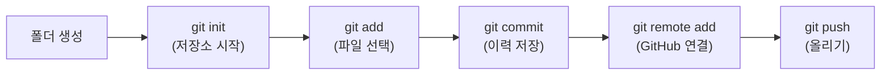

# 04. Git 핵심
{: .no_toc }

> Git은 개발자의 필수 도구입니다. 처음에는 낯설지만, 5가지 명령어만 익혀도 충분히 시작할 수 있습니다.

## 학습 목표
{: .no_toc }

- Git이 왜 필요한지 이해한다
- 기본 명령어 5개를 사용할 수 있다
- GitHub에 코드를 올릴 수 있다

<a id="toc"></a>

## 진행 순서

1. [Git이란?](#1️⃣-git이란-)
2. [설치와 초기 설정](#2️⃣-설치와-초기-설정-)
3. [핵심 5단계](#3️⃣-핵심-5단계-)
4. [GitHub 저장소 만들기](#4️⃣-github-저장소-만들기-)
5. [자주 쓰는 명령어](#5️⃣-자주-쓰는-명령어-)
6. [정리](#6️⃣-정리-)

---

## 1️⃣ Git이란? [↑](#toc)

### 문서의 Ctrl+Z를 무한으로

코드를 작성하다 보면 이런 상황이 생깁니다.

- "어제 버전으로 되돌리고 싶다"
- "두 사람이 같은 파일을 동시에 수정했다"
- "어느 시점에서 버그가 생겼는지 모르겠다"

Git은 이 모든 문제를 해결하는 **버전 관리 시스템**입니다. 파일의 변경 이력을 사진 찍듯 기록해두고, 언제든지 원하는 시점으로 돌아갈 수 있게 해줍니다.

### 버전 관리가 없으면?

Git을 모르면 이렇게 됩니다.

```
report.py
report_최종.py
report_최종2.py
report_진짜최종.py
report_진짜최종_v3.py
report_진짜최종_v3_수정.py   ← 어느 게 최신인가요?
```

Git을 쓰면 파일은 하나, 이력은 무한으로 관리됩니다.

### Git vs GitHub, 뭐가 다른가요?

| | Git | GitHub |
|---|---|---|
| **정체** | 내 컴퓨터에 설치하는 프로그램 | Git 저장소를 올려두는 웹사이트 |
| **비유** | 일기장 | 일기장을 보관하는 구름 창고 |

---

## 2️⃣ 설치와 초기 설정 [↑](#toc)

### Git 설치 확인

터미널(또는 명령 프롬프트)을 열고 입력하세요.

```bash
git --version
```

`git version 2.x.x` 같은 메시지가 나오면 이미 설치되어 있습니다. 설치가 필요하다면 [git-scm.com](https://git-scm.com)에서 내려받으세요.

### 초기 설정 (최초 1회)

Git에게 "이 컴퓨터 주인은 나"라고 알려주는 과정입니다. 딱 두 줄입니다.

```bash
git config --global user.name "홍길동"
git config --global user.email "hong@example.com"
```

{: .note }
이름과 이메일은 커밋(저장)할 때마다 기록에 남습니다. GitHub 계정과 같은 이메일을 사용하면 기여 이력이 연동됩니다.

---

## 3️⃣ 핵심 5단계 [↑](#toc)

### 흐름 한눈에 보기



### 택배 보내기 비유

Git의 3단계(add → commit → push)를 택배에 비유하면 이렇습니다.

| Git 명령어 | 택배 비유 | 하는 일 |
|---|---|---|
| `git add` | 상자에 물건 담기 | 변경된 파일을 선택 |
| `git commit` | 송장 붙이기 | 변경 이유를 메모와 함께 저장 |
| `git push` | 택배 발송 | GitHub에 업로드 |

### 실습: 폴더 만들고 첫 커밋까지

아래 순서대로 따라해보세요. 터미널을 열고 시작합니다.

**1단계. 프로젝트 폴더 만들기**

```bash
mkdir my-project
cd my-project
```

**2단계. Git 저장소 초기화**

```bash
git init
```

`.git` 폴더가 생기면 성공입니다. 이 폴더가 모든 이력을 담고 있습니다.

**3단계. 파일 만들기**

```bash
# macOS / Linux
echo "# 나의 첫 프로젝트" > README.md

# Windows (명령 프롬프트)
echo # 나의 첫 프로젝트 > README.md
```

**4단계. 파일 선택 (add)**

```bash
git add README.md
```

모든 변경 파일을 한번에 선택하려면 `git add .` 을 씁니다.

**5단계. 이력 저장 (commit)**

```bash
git commit -m "첫 번째 커밋: README 추가"
```

`-m` 다음에 오는 문자열이 커밋 메시지입니다. **무엇을 왜 변경했는지** 간결하게 적어주세요.

---

## 4️⃣ GitHub 저장소 만들기 [↑](#toc)

### 새 저장소 생성

1. [github.com](https://github.com) 에 로그인합니다. (계정이 없다면 **Sign up** 클릭)


2. 오른쪽 위 `+` 버튼 → **New repository** 클릭
3. Repository name에 `my-project` 입력
4. **Public** 또는 **Private** 선택
5. **Create repository** 클릭

{: .warning }
"Initialize this repository with a README"는 **체크하지 마세요**. 이미 로컬에 파일이 있으면 충돌이 생깁니다.

### remote 연결 후 push

저장소를 만들면 GitHub이 안내 명령어를 보여줍니다. 아래 두 줄을 터미널에 입력하세요.

```bash
# GitHub 저장소를 origin이라는 이름으로 연결
git remote add origin https://github.com/사용자이름/my-project.git

# main 브랜치로 업로드
git push -u origin main
```

{: .note }
`-u origin main` 은 최초 1회만 입력합니다. 이후에는 `git push` 만으로 됩니다.

브라우저에서 GitHub 저장소를 새로고침하면 파일이 올라가 있습니다.

---

## 5️⃣ 자주 쓰는 명령어 [↑](#toc)

| 명령어 | 하는 일 |
|---|---|
| `git status` | 현재 변경 사항 확인 (가장 먼저 확인하세요) |
| `git log --oneline` | 커밋 이력을 한 줄씩 보기 |
| `git pull` | GitHub의 최신 내용을 내 컴퓨터로 받기 |
| `git clone <URL>` | GitHub 저장소를 내 컴퓨터로 복사 |

{: .tip }
무언가 잘못됐다 싶으면 `git status` 부터 확인하세요. Git이 다음에 할 행동을 힌트로 알려줍니다.

---

## 6️⃣ 정리 [↑](#toc)

### 핵심 5단계 요약

| 순서 | 명령어 | 의미 |
|---|---|---|
| 1 | `git init` | 이 폴더를 Git으로 관리 시작 |
| 2 | `git add <파일>` | 저장할 파일 선택 |
| 3 | `git commit -m "메시지"` | 이력으로 저장 |
| 4 | `git remote add origin <URL>` | GitHub 연결 (최초 1회) |
| 5 | `git push` | GitHub에 올리기 |

### 학습 체크리스트

- [ ] `git --version` 으로 설치를 확인했다
- [ ] `git config` 로 이름과 이메일을 설정했다
- [ ] 폴더를 만들고 `git init` 을 실행했다
- [ ] `git add` → `git commit` 을 해봤다
- [ ] GitHub에 저장소를 만들고 `git push` 로 올렸다
- [ ] `git status` 와 `git log --oneline` 을 사용해봤다

### 더 깊이 배우려면

이 장은 생존에 필요한 최소한만 다뤘습니다. 브랜치, 병합, 충돌 해결 등 Git의 진짜 힘은 전체 과정에서 배울 수 있습니다.

→ [Git 전체 과정 보기](/git)

---

→ **다음 장**: [05. Google Colab](/language/basic/colab)
