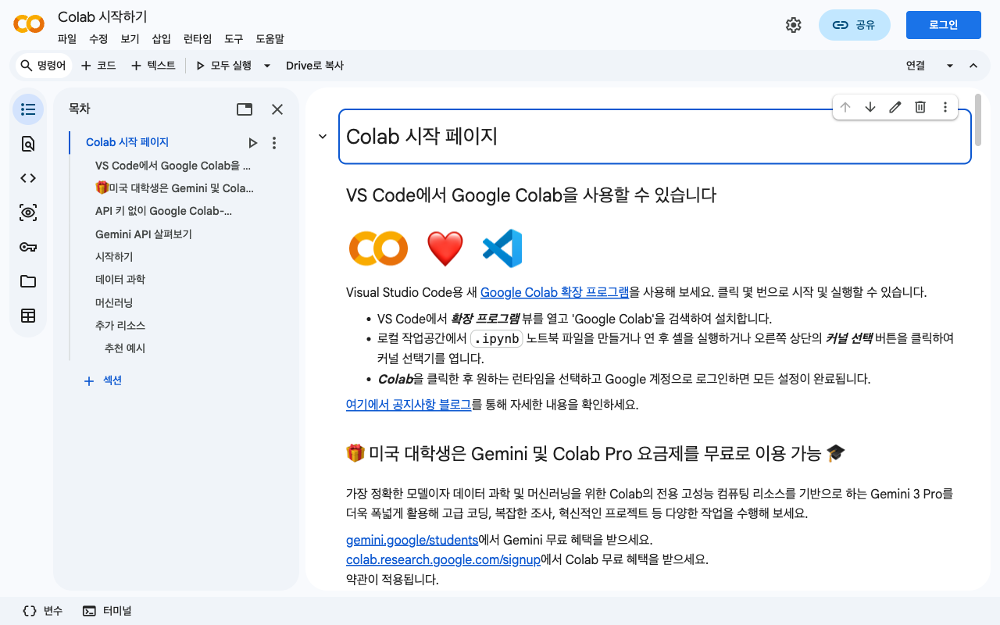

# 05. Google Colab
{: .no_toc }

> 설치 없이, 내 브라우저에서 바로 Python을 실행합니다. Google 계정 하나면 충분합니다.

## 학습 목표
{: .no_toc }

- Google Colab 노트북을 만들고 실행할 수 있다
- 파일 업로드와 라이브러리 설치를 할 수 있다
- GPU 설정을 할 수 있다

<a id="toc"></a>

## 진행 순서

1. [Colab이란?](#1️⃣-colab이란-)
2. [노트북 시작하기](#2️⃣-노트북-시작하기-)
3. [셀 다루기](#3️⃣-셀-다루기-)
4. [라이브러리 설치](#4️⃣-라이브러리-설치-)
5. [파일 업로드와 다운로드](#5️⃣-파일-업로드와-다운로드-)
6. [GPU 설정](#6️⃣-gpu-설정-)
7. [자주 하는 실수와 해결](#7️⃣-자주-하는-실수와-해결-)
8. [정리](#8️⃣-정리-)

---

## 1️⃣ Colab이란? [↑](#toc)

### 클라우드 실험실

Google Colab(Colaboratory)은 Google이 제공하는 **클라우드 기반 Python 실행 환경**입니다. 내 컴퓨터에 Python을 설치하지 않아도, 브라우저 하나로 코드를 작성하고 실행할 수 있습니다.

실험실에 비유하면 이렇습니다. 집에 실험 장비를 사는 대신, 학교 실험실을 빌려서 쓰는 것과 같습니다. 장비(GPU, 메모리)는 Google이 제공하고, 여러분은 실험(코드 실행)만 합니다.

### 장점 세 가지

| 장점 | 설명 |
|---|---|
| **설치 불필요** | Python, 주요 라이브러리가 이미 준비되어 있습니다 |
| **GPU 무료** | 딥러닝 학습에 필요한 GPU를 무료로 쓸 수 있습니다 (시간 제한 있음) |
| **공유 가능** | 노트북 링크 하나로 누구에게든 공유할 수 있습니다 |

### 시작 조건

**Google 계정 하나면 됩니다.** Gmail을 쓴다면 지금 당장 시작할 수 있습니다.

---

## 2️⃣ 노트북 시작하기 [↑](#toc)

### 접속과 새 노트북 만들기

1. 브라우저에서 [colab.research.google.com](https://colab.research.google.com) 접속



2. 팝업이 뜨면 **새 노트북** 클릭 (또는 팝업을 닫고 상단 **파일 → 새 노트북**)
3. `Untitled0.ipynb` 라는 이름의 노트북이 열립니다

### 이름 변경

상단의 파일 이름(`Untitled0.ipynb`)을 클릭하면 바로 이름을 바꿀 수 있습니다. 의미 있는 이름으로 저장하세요. 예: `01_python_기초.ipynb`

### Google Drive 자동 저장

Colab 노트북은 **내 Google Drive에 자동 저장**됩니다. `내 드라이브 → Colab Notebooks` 폴더에서 확인할 수 있습니다.

{: .note }
저장 단축키는 `Ctrl+S` (Windows) / `Cmd+S` (Mac)입니다. 자동 저장이 되지만 중요한 시점에는 직접 저장하는 습관을 들이세요.

---

## 3️⃣ 셀 다루기 [↑](#toc)

### 코드 셀 vs 텍스트 셀

노트북은 **셀(cell)** 단위로 구성됩니다. 셀에는 두 종류가 있습니다.

| 셀 종류 | 용도 | 만드는 방법 |
|---|---|---|
| **코드 셀** | Python 코드 작성 및 실행 | `+ 코드` 버튼 클릭 |
| **텍스트 셀** | 설명, 제목, 메모 (Markdown) | `+ 텍스트` 버튼 클릭 |

### 셀 실행

| 단축키 | 동작 |
|---|---|
| `Shift + Enter` | 셀 실행 후 다음 셀로 이동 (가장 많이 씁니다) |
| `Ctrl + Enter` | 셀 실행 후 현재 셀에 머무름 |
| `Alt + Enter` | 셀 실행 후 아래에 새 셀 추가 |

### 셀 추가, 삭제, 이동

- **추가**: 셀 위/아래로 마우스를 올리면 `+ 코드` / `+ 텍스트` 버튼 등장
- **삭제**: 셀 선택 후 오른쪽 점 세 개 메뉴 → 셀 삭제, 또는 단축키 `Ctrl+M D` (두 번 빠르게)
- **이동**: 셀 왼쪽 위아래 화살표 아이콘 클릭, 또는 셀을 드래그

### 실행 순서 주의사항

{: .warning }
**셀은 위에서 아래 순서로 실행하세요.** Colab은 셀을 어떤 순서로든 실행할 수 있지만, 변수나 함수는 실행된 셀에서만 존재합니다. 아래 셀에서 정의한 변수를 위 셀에서 쓰면 오류가 납니다.

```python
# 셀 1 - 먼저 실행해야 합니다
x = 10

# 셀 2 - 셀 1 이후에 실행해야 합니다
print(x)  # 10
```

처음 노트북을 열거나 런타임이 끊겼을 때는 **런타임 → 모두 실행** (`Ctrl+F9`)으로 위에서 아래로 전체 실행하세요.

---

## 4️⃣ 라이브러리 설치 [↑](#toc)

### !pip install

Colab에는 많은 라이브러리가 기본 설치되어 있지만, 없는 것은 직접 설치해야 합니다. 코드 셀에서 `!`를 앞에 붙이면 터미널 명령처럼 실행됩니다.

```python
!pip install 라이브러리이름
```

예시:

```python
!pip install konlpy          # 한국어 자연어처리
!pip install yfinance        # 주가 데이터
!pip install transformers    # Hugging Face 모델
```

### 런타임 재시작 후 재설치 필요한 이유

Colab의 런타임(실행 환경)은 일정 시간이 지나거나 브라우저를 닫으면 **초기화**됩니다. 설치했던 라이브러리도 사라집니다.

이것은 버그가 아닙니다. Colab은 클라우드 서버를 임시로 빌려 쓰는 구조이기 때문입니다. 매번 노트북을 시작할 때 `!pip install`이 담긴 셀을 다시 실행하면 됩니다.

{: .tip }
설치 셀은 노트북 맨 위에 모아두세요. "모두 실행"을 하면 순서대로 설치됩니다.

### 자주 쓰는 라이브러리

| 라이브러리 | 용도 | 기본 설치 여부 |
|---|---|---|
| `numpy` | 수치 계산 | 기본 설치 |
| `pandas` | 데이터 분석 | 기본 설치 |
| `matplotlib` | 시각화 | 기본 설치 |
| `scikit-learn` | 머신러닝 | 기본 설치 |
| `torch` (PyTorch) | 딥러닝 | 기본 설치 |
| `tensorflow` | 딥러닝 | 기본 설치 |

---

## 5️⃣ 파일 업로드와 다운로드 [↑](#toc)

### 파일 업로드 (코드로)

```python
from google.colab import files

uploaded = files.upload()  # 파일 선택 대화창이 열립니다
```

업로드한 파일은 현재 런타임의 임시 저장소(`/content/`)에 저장됩니다. 런타임이 초기화되면 사라집니다.

### 파일 다운로드

```python
from google.colab import files

files.download('결과파일.csv')  # 내 컴퓨터로 저장
```

### Google Drive 마운트 (권장)

파일이 많거나 런타임이 초기화되어도 유지하려면 Google Drive를 연결하는 것이 좋습니다.

```python
from google.colab import drive

drive.mount('/content/drive')
```

실행하면 Google 계정 인증 창이 뜹니다. 허용하면 `/content/drive/MyDrive/` 경로로 내 Google Drive에 접근할 수 있습니다.

```python
import pandas as pd

# Google Drive의 파일 읽기
df = pd.read_csv('/content/drive/MyDrive/데이터폴더/data.csv')
```

### 파일 경로 확인

왼쪽 사이드바의 **폴더 아이콘**을 클릭하면 현재 런타임의 파일 구조를 탐색기처럼 볼 수 있습니다. 파일을 오른쪽 클릭하면 경로를 복사할 수 있어 편리합니다.

---

## 6️⃣ GPU 설정 [↑](#toc)

### 런타임 유형 변경

기본 설정은 CPU입니다. GPU가 필요하면 다음과 같이 변경합니다.

1. 상단 메뉴 **런타임 → 런타임 유형 변경**
2. 하드웨어 가속기에서 **GPU** 선택
3. **저장** 클릭
4. 런타임이 재시작됩니다 (설치한 라이브러리는 다시 설치 필요)

### GPU 확인

```python
!nvidia-smi
```

GPU 이름, 메모리, 사용량 등이 출력되면 GPU가 활성화된 것입니다.

```python
import torch
print(torch.cuda.is_available())  # True면 GPU 사용 가능
print(torch.cuda.get_device_name(0))  # GPU 이름 확인
```

### 언제 GPU가 필요한가요?

| 작업 | CPU | GPU |
|---|---|---|
| 데이터 분석, 시각화 | 충분 | 불필요 |
| 일반 머신러닝 (sklearn) | 충분 | 불필요 |
| 딥러닝 모델 학습 | 매우 느림 | 필요 |
| 이미지/텍스트 대용량 처리 | 느림 | 권장 |

{: .note }
Colab 무료 버전은 GPU 사용 시간에 제한이 있습니다. 학습이 끝나면 **런타임 → 런타임 연결 해제 및 삭제**로 자원을 반납하세요.

---

## 7️⃣ 자주 하는 실수와 해결 [↑](#toc)

### 런타임 끊김

**증상**: "런타임 연결 끊김" 메시지, 셀을 실행해도 아무 반응 없음

**원인**: Colab은 일정 시간 사용하지 않으면 자동으로 연결을 끊습니다.

**해결**: 오른쪽 위 연결 버튼을 클릭해 재연결한 후, **런타임 → 모두 실행**으로 처음부터 다시 실행하세요.

---

### 변수 미정의 오류 (NameError)

**증상**: `NameError: name 'df' is not defined`

**원인**: 해당 변수를 정의한 셀이 아직 실행되지 않았습니다.

**해결**: **런타임 → 모두 실행** 또는 문제 셀보다 위에 있는 셀을 먼저 실행하세요.

```python
# 셀 순서가 중요합니다
# 이 셀을 먼저 실행해야
df = pd.read_csv('data.csv')

# 이 셀이 동작합니다
print(df.head())
```

---

### 파일 경로 오류 (FileNotFoundError)

**증상**: `FileNotFoundError: [Errno 2] No such file or directory`

**원인**: 런타임이 초기화되면서 업로드한 파일이 사라졌거나, 경로가 틀렸습니다.

**해결**:
1. 왼쪽 파일 탐색기에서 파일 존재 여부 확인
2. 없다면 다시 업로드하거나 Google Drive에서 마운트
3. 경로에 오타가 없는지 확인 (대소문자, 한글 포함 여부)

---

## 8️⃣ 정리 [↑](#toc)

### 단축키 요약

| 단축키 | 동작 |
|---|---|
| `Shift + Enter` | 셀 실행 + 다음 셀 이동 |
| `Ctrl + Enter` | 셀 실행 (현재 셀 유지) |
| `Ctrl + F9` | 모두 실행 (위에서 아래로) |
| `Ctrl + M A` | 위에 셀 추가 |
| `Ctrl + M B` | 아래에 셀 추가 |
| `Ctrl + M D` | 셀 삭제 |
| `Ctrl + S` | 저장 |

### 학습 체크리스트

- [ ] colab.research.google.com에 접속해 새 노트북을 만들었다
- [ ] 코드 셀에 `print("Hello, Colab!")` 을 입력하고 실행했다
- [ ] `!pip install` 로 라이브러리를 설치해봤다
- [ ] Google Drive를 마운트해봤다
- [ ] GPU 런타임으로 변경하고 `!nvidia-smi` 를 실행했다
- [ ] 런타임이 끊겼을 때 재연결하고 모두 실행해봤다

---

→ **다음 장**: [06. AI 도구 활용 기초](/language/basic/ai-tools)
