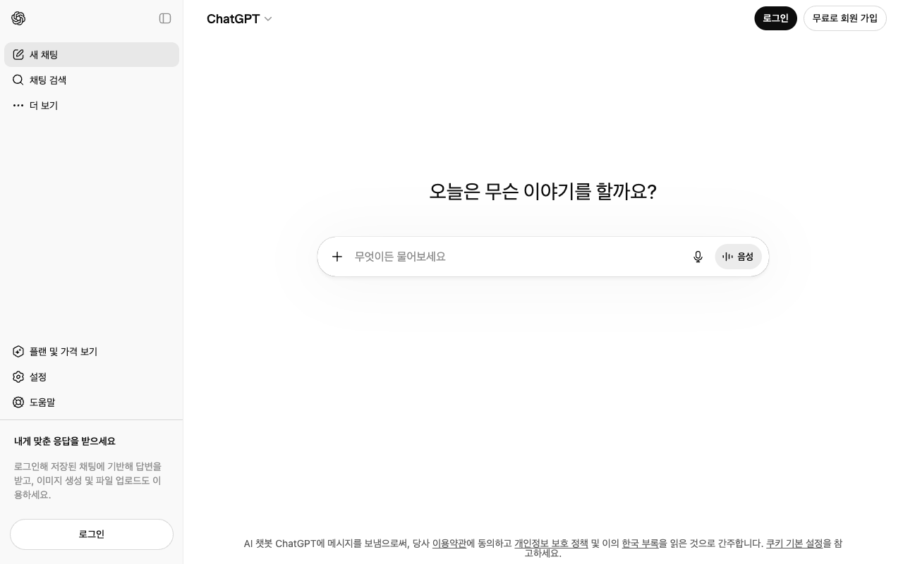

# 06. AI 도구 활용 기초
{: .no_toc }

> AI 도구는 학습을 가속하는 강력한 조력자입니다. 단, 올바르게 쓸 줄 알아야 합니다.

## 학습 목표
{: .no_toc }

- AI 도구를 학습 보조로 활용할 수 있다
- 좋은 질문을 할 수 있다
- AI 답변을 검증하는 습관을 기른다

<a id="toc"></a>

## 진행 순서

1. [AI 도구란?](#1️⃣-ai-도구란-)
2. [좋은 질문 만들기](#2️⃣-좋은-질문-만들기-)
3. [학습에 활용하기](#3️⃣-학습에-활용하기-)
4. [AI 답변 검증하기](#4️⃣-ai-답변-검증하기-)
5. [GitHub Copilot 맛보기](#5️⃣-github-copilot-맛보기-)
6. [AI 사용 규칙](#6️⃣-ai-사용-규칙-)
7. [정리](#7️⃣-정리-)

---

## 1️⃣ AI 도구란? [↑](#toc)

### 주요 AI 도구 소개

현재 프로그래밍 학습에 널리 쓰이는 AI 도구들입니다.



| 도구 | 제공사 | 특징 |
|---|---|---|
| **ChatGPT** | OpenAI | 대화형 AI, 개념 설명과 코드 작성에 강함 |
| **Claude** | Anthropic | 긴 문서 분석, 코드 리뷰, 설명에 강함 |
| **GitHub Copilot** | GitHub/OpenAI | 코드 에디터 내 자동완성 특화 |
| **Gemini** | Google | Google 서비스 연동, 멀티모달 지원 |

### "만능이 아니다" — AI의 한계

AI 도구는 강력하지만 한계가 있습니다. 이를 모르고 쓰면 잘못된 코드를 믿게 됩니다.

| AI가 잘하는 것 | AI가 못하는 것 |
|---|---|
| 개념 설명 및 비유 | 최신 라이브러리 변경사항 반영 |
| 코드 예시 생성 | 내 컴퓨터 환경 파악 |
| 에러 메시지 해석 | 실제로 코드를 실행해서 확인 |
| 반복 코드 자동 완성 | 비즈니스 요구사항을 스스로 판단 |
| 리팩토링 제안 | 항상 정확한 사실 보장 |

---

## 2️⃣ 좋은 질문 만들기 [↑](#toc)

### 나쁜 질문 vs 좋은 질문

AI에게서 좋은 답을 얻으려면 좋은 질문이 필요합니다. 모호하면 모호한 답이 돌아옵니다.

**예시 1: 에러 해결**

| | 질문 |
|---|---|
| **나쁜 질문** | "파이썬 에러 고쳐줘" |
| **좋은 질문** | "Python 3.11에서 pandas로 CSV를 읽을 때 `UnicodeDecodeError: 'utf-8' codec can't decode byte` 에러가 납니다. 어떻게 해결하나요?" |

**예시 2: 개념 이해**

| | 질문 |
|---|---|
| **나쁜 질문** | "반복문 설명해줘" |
| **좋은 질문** | "Python의 `for` 반복문을 처음 배우는 비전공자에게 실생활 비유로 설명해주세요. 예시 코드도 3줄 이내로 보여주세요." |

**예시 3: 코드 작성**

| | 질문 |
|---|---|
| **나쁜 질문** | "데이터 분석 코드 짜줘" |
| **좋은 질문** | "pandas를 사용해서 CSV 파일을 읽고, 'age' 컬럼의 평균, 최솟값, 최댓값을 출력하는 Python 코드를 작성해주세요." |

### 맥락 제공의 중요성

좋은 질문에는 이 세 가지가 포함됩니다.

1. **환경**: "Python 3.11, Colab에서", "VS Code에서"
2. **목표**: "~을 하고 싶습니다"
3. **현재 상황**: "~을 시도했는데 ~이 됩니다"

### 한국어 질문 팁

한국어로 질문할 때는 **주어를 생략하지 마세요**. 한국어는 주어를 자주 생략하지만, AI는 주어가 명확할 때 더 정확하게 답합니다.

- 모호: "어떻게 설치해요?" → 명확: "Python에서 pandas를 어떻게 설치하나요?"
- 모호: "왜 안 되죠?" → 명확: "이 코드가 왜 `TypeError`를 발생시키나요?"

---

## 3️⃣ 학습에 활용하기 [↑](#toc)

### 개념 설명 요청

새로운 개념이 이해되지 않을 때 AI에게 다양한 방식으로 설명을 요청하세요.

```
프롬프트 예시:
"Python의 리스트(list)와 딕셔너리(dict)의 차이를
식당 주문서에 비유해서 초등학생도 이해할 수 있게 설명해주세요."
```

### 에러 메시지 해석

에러가 나면 메시지 전체를 복사해 붙여넣으세요. AI는 에러 해석을 매우 잘합니다.

```
프롬프트 예시:
"아래 에러 메시지가 무슨 뜻인지, 어떻게 고치는지 알려주세요.

Traceback (most recent call last):
  File "main.py", line 5, in <module>
    print(name)
NameError: name 'name' is not defined"
```

### 코드 리뷰 요청

작성한 코드를 AI에게 리뷰받으면 더 좋은 코드 습관을 빠르게 익힐 수 있습니다.

```
프롬프트 예시:
"아래 코드를 초보자 관점에서 리뷰해주세요.
개선할 점이 있다면 왜 개선해야 하는지 이유도 함께 설명해주세요.

[코드 붙여넣기]"
```

### 비유로 설명 요청

추상적인 개념은 비유를 요청하면 기억에 오래 남습니다.

```
프롬프트 예시:
"Python의 함수(function) 개념을 요리 레시피에 비유해서
설명해주세요. 코드 예시도 포함해주세요."
```

---

## 4️⃣ AI 답변 검증하기 [↑](#toc)

### 환각(Hallucination)이란?

AI는 때때로 **틀린 정보를 자신 있게 말합니다**. 이를 "환각(Hallucination)"이라 합니다. 존재하지 않는 함수를 실제인 것처럼 알려주거나, 오래된 API를 현재 것처럼 설명하기도 합니다.

이것이 AI의 결함이 아니라 현재 기술의 특성입니다. 따라서 **검증하는 습관**이 필수입니다.

### 검증 방법 3가지

**1. 직접 실행해보기**

AI가 알려준 코드는 반드시 Colab이나 터미널에서 직접 실행해보세요. 실행되면 맞고, 에러가 나면 틀린 것입니다.

**2. 공식 문서 확인**

의심스러운 함수나 메서드는 공식 문서에서 확인하세요.

- Python 공식 문서: [docs.python.org](https://docs.python.org/ko/3/)
- pandas: [pandas.pydata.org/docs](https://pandas.pydata.org/docs/)
- PyTorch: [pytorch.org/docs](https://pytorch.org/docs/)

**3. 다른 소스 교차 확인**

같은 질문을 다른 AI에게 물어보거나, Stack Overflow, 공식 문서에서 같은 내용을 찾아 비교하세요.

### "복붙하지 말고, 이해하고 타이핑하라"

{: .warning }
AI 코드를 그냥 복사 붙여넣기하면 이해 없이 진행됩니다. 코드를 보고 한 줄씩 이해한 다음 직접 타이핑하세요. 손이 기억하고, 이해가 남습니다.

---

## 5️⃣ GitHub Copilot 맛보기 [↑](#toc)

### 무료 플랜

GitHub Copilot은 2024년부터 **개인 무료 플랜**을 제공합니다. 학생 계정이 있다면 더 넉넉한 무료 제공량이 있습니다.

- [github.com/features/copilot](https://github.com/features/copilot) 에서 무료 플랜 확인

### VS Code에 설치하기

1. VS Code 좌측 확장(Extensions) 아이콘 클릭 (`Ctrl+Shift+X`)
2. "GitHub Copilot" 검색
3. **설치** 클릭
4. GitHub 계정으로 로그인

### 코드 자동완성 체험

주석으로 의도를 적으면 Copilot이 코드를 제안합니다.

```python
# 1부터 100까지 짝수의 합을 구하는 함수
```

이 주석을 입력하고 Enter를 누르면 Copilot이 코드를 회색 글자로 제안합니다. `Tab` 키를 누르면 수락, `Esc`를 누르면 취소입니다.

{: .tip }
Copilot 제안을 무조건 수락하지 마세요. 제안된 코드가 내 의도와 맞는지 한 줄씩 확인하는 습관이 중요합니다.

---

## 6️⃣ AI 사용 규칙 [↑](#toc)

### Phase별 AI 활용 수준

학습 단계에 따라 AI를 활용하는 방식이 달라져야 합니다.

| 단계 | AI 역할 | 내가 해야 할 일 |
|---|---|---|
| **Phase 1: 입문** | 설명자 | 개념을 이해하는 데 AI 활용. 코드는 직접 타이핑 |
| **Phase 2: 기초** | 리뷰어 | 코드를 먼저 작성하고, AI에게 피드백 요청 |
| **Phase 3: 응용** | 파트너 | AI와 함께 설계 논의, 문서 초안 작성, 반복 코드 위임 |

### "AI는 도구이고, 판단은 사람의 몫"

AI가 알려준 코드가 맞는지, 내 문제에 맞는지 판단하는 것은 여러분의 몫입니다. AI를 잘 쓰는 능력도 결국 **기초 지식이 있어야** 가능합니다.

- AI에게 전부 맡기면: 코드가 왜 동작하는지 모릅니다
- AI를 보조로 쓰면: 빠르게 배우고, 깊게 이해합니다

---

## 7️⃣ 정리 [↑](#toc)

### 학습 체크리스트

- [ ] ChatGPT 또는 Claude에서 Python 개념을 하나 물어봤다
- [ ] 나쁜 질문을 좋은 질문으로 바꿔서 다시 물어봤다
- [ ] AI가 알려준 코드를 Colab에서 직접 실행해 검증했다
- [ ] 에러 메시지를 AI에게 붙여넣고 해석을 받아봤다
- [ ] GitHub Copilot을 VS Code에 설치했다
- [ ] AI 답변을 공식 문서와 교차 확인해봤다

---

기초 도구 과정을 모두 마쳤습니다. 이제 원하는 과정을 선택하여 학습을 시작하세요.

### 다음 학습 과정

- [Git 전체 과정](/git) — 브랜치, 병합, 협업까지 Git을 깊게 배웁니다
- [Python 기초](/language) — 변수, 자료형, 함수, 클래스를 단계적으로 배웁니다
- [FastAPI](/language/fastapi) — Python으로 웹 API를 만드는 방법을 배웁니다
