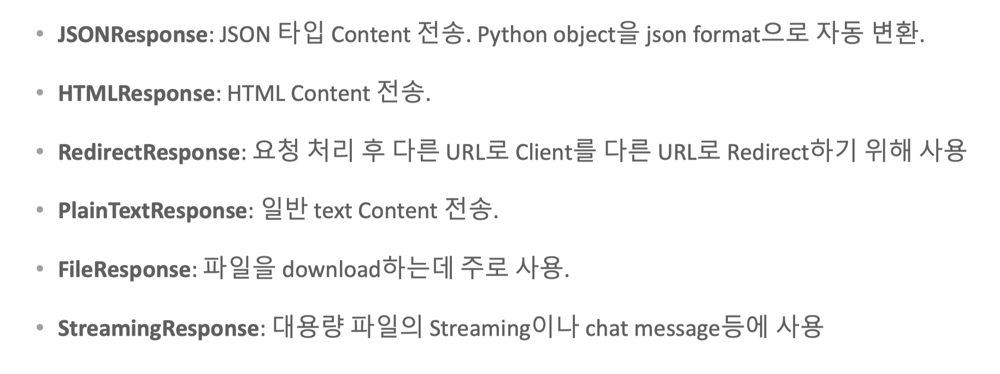

## FastAPI Response
http Response는 clinet Request에 따른 serve에서 내려 보내는 메시지   
요청 Request의 처리 상태, 여러 메타정보, 그리고 Content 데이터를 담고 있음

 

 FastAPI Response Class 유형

 {: width="600" height="auto" }

`Responses/main_response.py`

```py
from fastapi import FastAPI, Form, status
from fastapi.responses import (
    JSONResponse,
    HTMLResponse,
    RedirectResponse
)

from pydantic import BaseModel

app = FastAPI()

#response_class는 default가 JSONResponse. response_class가 HTMLResponse일 경우 아래 코드는?
@app.get("/resp_json/{item_id}", response_class=JSONResponse)
async def response_json(item_id: int, q: str | None = None):
    return JSONResponse(content={"message": "Hello World", 
                                 "item_id": item_id,
                                 "q": q}, status_code=status.HTTP_200_OK)


# HTML Response
# http://127.0.0.1:8081/resp_html/2?item_name=min
@app.get("/resp_html/{item_id}", response_class=HTMLResponse)
async def response_html(item_id: int, item_name: str | None = None):
    html_str = f'''
    <html>
    <body>
        <h2>HTML Response</h2>
        <p>item_id: {item_id}</p>
        <p>item_name: {item_name}</p>
    </body>
    </html>
    '''
    return HTMLResponse(html_str, status_code=status.HTTP_200_OK)


# Redirect(Get -> Get)
# http://127.0.0.1:8081/redirect?comment=min

@app.get("/redirect")
async def redirect_only(comment: str | None = None):
    print(f"redirect {comment}")
    
    return RedirectResponse(url=f"/resp_html/3?item_name={comment}")

# Redirect(Post -> Get)
# status_code=status.HTTP_302_FOUND 없으면 (Post -> Post)
@app.post("/create_redirect")
async def create_item(item_id: int = Form(), item_name: str = Form()):
    print(f"item_id: {item_id} item name: {item_name}")

    return RedirectResponse(url=f"/resp_html/{item_id}?item_name={item_name}"
                            , status_code=status.HTTP_302_FOUND)


class Item(BaseModel):
    name: str
    description: str
    price: float
    tax: float | None = None

# Pydantic model for response data
class ItemResp(BaseModel):
    name: str
    description: str
    price_with_tax: float

# reponse_model
@app.post("/create_item/", response_model=ItemResp
          , status_code=status.HTTP_201_CREATED)
async def create_item_model(item: Item):
    item_dict = item.model_dump
    if item.tax:
        price_with_tax = item.price + item.tax
    else:
        price_with_tax = item.price
    
    item_resp = ItemResp(
        name=item.name,
        description=item.description,
        price_with_tax=price_with_tax
    )
    # 반드시 response_model로 정의된 pydantic model을 반환. 
    return item_resp
```


```bash
uvicorn Responses.main_response:app --port=8081 --reload
```

```json
{
    "name": "Foo",
    "description": "An optional description",
    "price": 45.2,
    "tax": 3.5
}
```