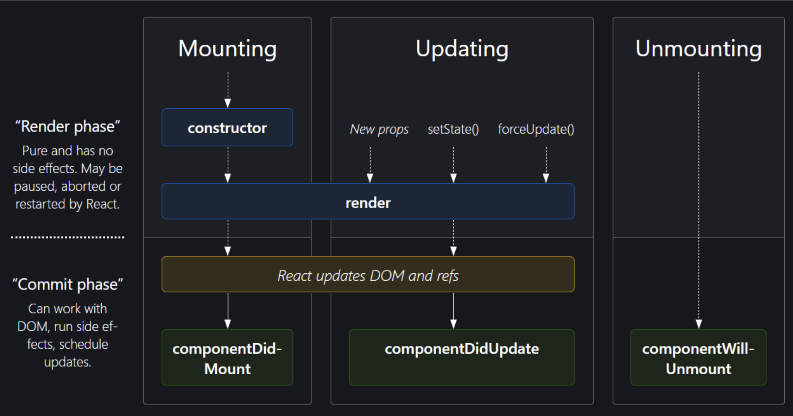

### 8. useState() hook

리액트에서의 state는 리액트 컴포넌트의 상태를 의미, 즉 리액트 컴포넌트의 변경 가능한 데이터  

- 직접 state를 수정하지 않는다. 랜더링이 일이나지 않음.
- set함수를 이용하여 값을 수정

```jsx
const [변수명,set함수명] = useState(초깃값)
```



src/App.jsx
```jsx
import ProfilePicture from "./08/ProfilePicture"
import MyComponent_08 from "./08/MyComponent"
import Counter from "./08/Counter"

export default function App() {

  return (
    <>
      <ProfilePicture/>
      <MyComponent_08/>
      <Counter/>
    </>
  )
}
```

src/08/ProfilePicture.jsx
```jsx
import { useState } from "react";

export default function ProfilePicture(){

  const imgurl = './src/assets/profile.png';

  let displayVales = ""
  const styles = {display:displayVales}

  const handleClick = () => {
    displayVales ? displayVales = "" : displayVales = "none" 
    document.getElementById('dis').style.display = displayVales
  } 

  const [display,setDisplay] = useState("");
  const styles1 = {display:display}
  const handleClick1 = () => {
    setDisplay(display ? "" : "none" )
  }

  return(
    <>
    </img>
    <button onClick={handleClick}>이미지1</button>
    <br/>
    </img>
    <button onClick={handleClick1}>이미지2</button>
    </>
  )
}
```

src/08/MyComponent.jsx
```jsx
import { useState } from "react";

export default function MyComponent_08(){
  let age_1 = 0
  let name_1 = "Guest"
  let isEmployed_1 = false

  const [name,setName] = useState("Guest");
  const [age, setAge] = useState(0);
  const [isEmployed,setIsEmployed] = useState(false);

  const updateName = () => {
    setName("홍길동");
    name_1 ="홍길동"
  }
  const incrementAge = () => {
    setAge(age+1);
    age_1 += 1;
  }
  const toggleEmployedStatus = () => {
    setIsEmployed(!isEmployed);
  }
  
  return(
    <div>
      <span>Name_1: {name_1}</span> <span>Name: {name}</span>
      <button className="border-1" onClick={updateName}>Set Name</button><br/>

      <span>Age_1: {age_1}</span> <span>Age: {age}</span> 
      <button className="border-1" onClick={incrementAge}>Increment Age</button><br/>

      <span>Is employed: {isEmployed?"yes":"no"}</span>
      <button className="border-1" onClick={toggleEmployedStatus}>Toggle Status</button>
    </div>
  )
}


```

src/08/Counter.jsx
```jsx
import { useState } from "react";

export default function Counter(){
  
  const [count,setCount] = useState(0);
  const increment = () =>{
    setCount(count + 1);
  }
  const decrement = () => {
    setCount(count - 1);
  }
  const reset = () => {
    setCount(0);
  }
  return(
    <div>
      <p>{count}</p>
      <button onClick={decrement}>Decrement</button>
      <button onClick={reset}>Reset</button>
      <button onClick={increment}>Increment</button>
    </div>
  );
}

```