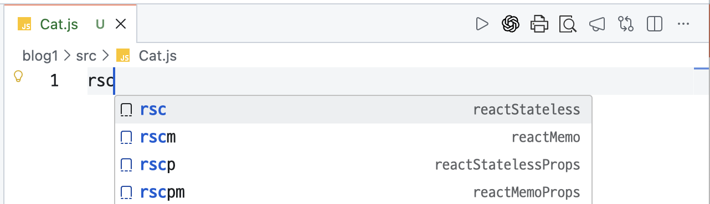
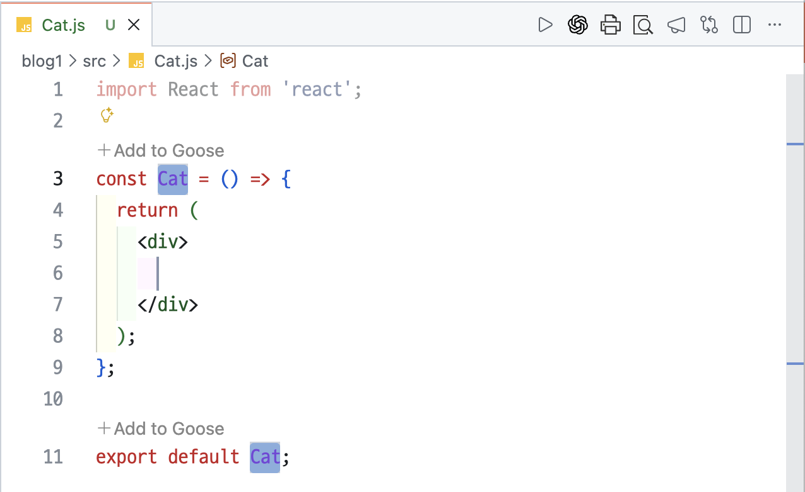
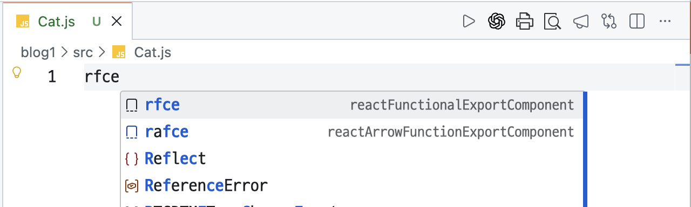
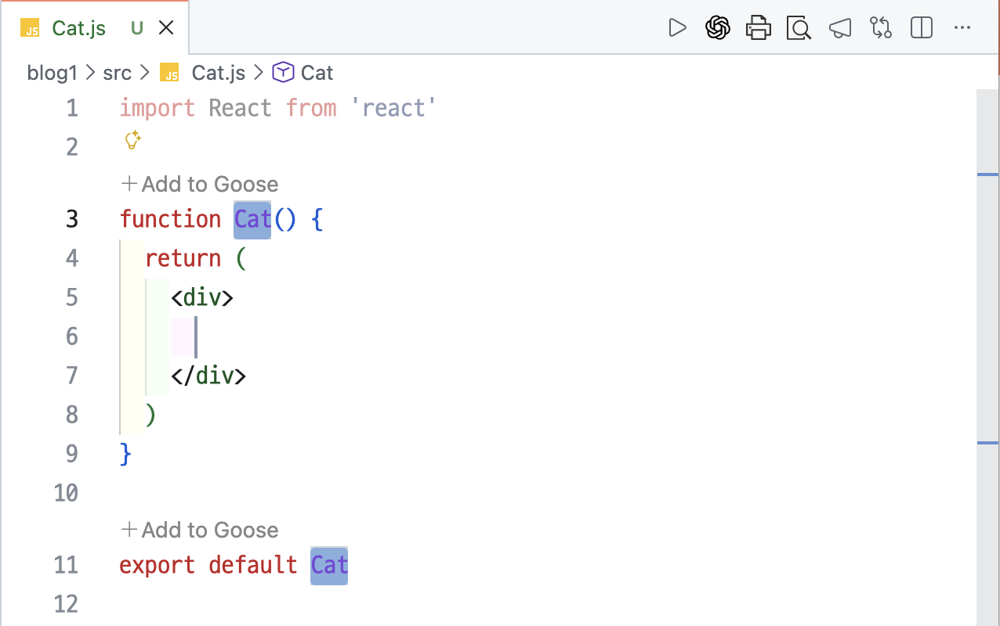
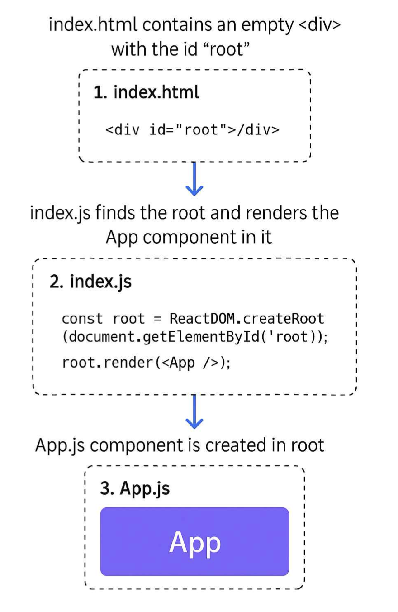
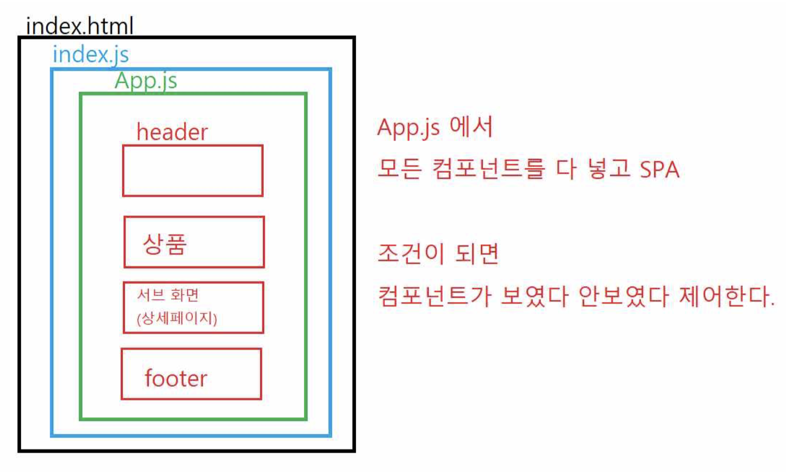
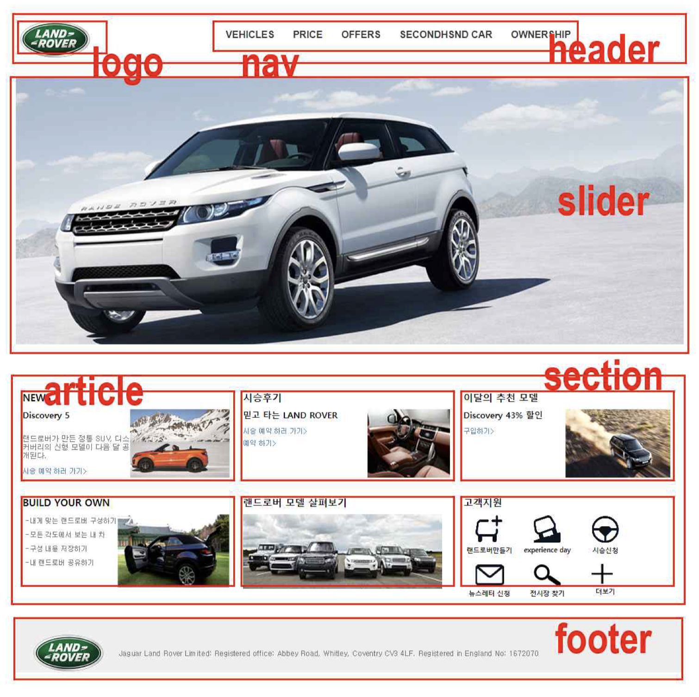

## 1. 기본설정

### 1.  node.js 설치

설치 후 버전 확인
```bash
node -v
npm -v
```

### 2. vscode 설치

설치후 확장 프로그램 설치

| 이름 | 역할 | 
|------|------|
| Live Server | 실시간으로 브라우저에서 적용된 내용을 확인 |
| auto rename tag | 태그의 시작/종료를 도시에 수정 |
| Auto import, Auto import -es6| 파일명을 입력하면 자동 import |
| **Reactjs code snippets** | **rsc**로 함수 만들어줌 (자동완성) |
| **ES7 + React/Redux/React-Nativ e snippets** | **rfce**로  함수만들어줌(자동완성) |

마우스휠로 폰트 키우기

File > Preferences > Settings > mouse 검색 > Editor : Mouse Wheel Zoom 체크하기


### 3. react 프로젝트 만들기

작업디렉토리로 이동

```sh
npx create-react-app blog1
cd blog1
npm start
```
React 앱은 http://localhost:3000 포트에서 실행

**리엑트에서 함수 만드는 방법** 

– 대문자로 컴포넌트를 만들고 src폴더 아래 > Cat.js 만들기

– **rsc** 입력후 enter
{: width="500" height="auto" }

– **tab** 키로 이동 후 내용입력  
{: width="500" height="auto" }

– **rfce** 입력후 enter  
{: width="500" height="auto" }

– **tab** 키로 이동 후 내용입력   
{: width="500" height="auto" }

– **App.js** 에 컴포넌트 추가하기. 
```js
import './App.css';
import Dog from './Dog'; import Cat from './Cat';
function App() {
return (
  <div className="App"> 
    <Dog></Dog>
    <Cat/>
  </div>
);
}
export default App;
```

### 4. 기본 동작 
{: width="300" height="auto" }

{: width="500" height="auto" }

App.js는 모든 컴포넌트의 중심이고,
조건(if, useState, 라우터)에 따라 화면을 바꿔가며 보여주는 SPA 구조

**SPA의 단점**

문제는 서버에서 렌더링하면 검색이 잘되는데 
리엑트로 만든 SPA는 검색에 노출이 잘 안되서 Next.js를 많이 사용한다. Next.js는 TypeScirpt가 기본이다
일반적인 React(SPA)는 모든 화면을 브라우저에서(JavaScript로) 그리는 방식이다. 그래서 검색 엔진(구글, 네이버)이 페이지 내용을 제대로 읽지 못할 수 있다. 반면에 Next.js는 페이지를 서버에서 미리 만들어서(SSR) 브라우저에 보내준다. 그래서 검색 엔진에도 잘 노출되고, SEO(검색 최적화)에 유리하다.

**SPA**

Single Page Application 하나의 페이지에서 모든 기능이 동작하는 앱
처음에 HTML 하나만 로딩하고, 이후에는 페이지를 다시 새로고침하지 않고
필요한 부분만 JavaScript로 바꿔서 보여주는 방식 한 페이지 안에서 필요한 화면만 바꿔 보여주는 웹앱

**SSR**

Server Side Rendering (서버 사이드 렌더링)
사용자가 요청하면 서버가 HTML을 만들어 보내줌 검색엔진이 쉽게 읽을 수 있어 SEO에 유리함

**SEO**

Search Engine Optimization
검색 엔진에 잘 노출되게 만드는 기술,  검색엔진 최적화Search → 검색
Engine → 검색엔진 (구글, 네이버 등)
Optimization → 잘 보이도록 최적화

### 5. HTML 구조

📌 시맨틱 웹페이지란?

시맨틱 웹페이지(Semantic Web Page) 는
HTML 요소를 단순히 화면에 보여주기 위한 용도가 아니라,
태그 자체가 의미(semantic)를 가지도록 구성하여 문서 구조와 정보의 의미를 명확하게 표현한 웹페이지를 말합니다.

즉, <div> 같은 의미 없는 태그 대신 의미가 명확한 태그를 사용하여
사용자, 검색엔진, 보조기기(스크린리더) 등 모두가 웹페이지 구조와 내용을 정확히 이해할 수 있도록 만든 페이지입니다.

{: width="500" height="auto" }

| 내용 | 설명 |
|------|------|
| header | 헤더를 의미, 머리말 |
| nav | 네비게이션을 의미 / 메뉴,로그인 서브메뉴 |
| section| 여러 중심 내용을 감싸는 공간을 의미, 웹컨텐츠들을 그룹으로 묶어주는 역할을 담당 |
| article | 글자가 많이 들어가는 부분을 의미, 본문내용웹페이지 상에서의 실제 내용을 의미 |
| figure | 이미지사진 등 |
| aisde | 사이드에 위치하는 공간을 의미 (퀵메뉴, 서브메뉴) |
| footer | 푸터를 의미, 웹사이트의 저작권 정보나 저작권표기 |


