# javascript 함수
## 1. 실행환경
모든 브라우저는 자바스크립트를 해석하고 실행할 수 있는 자바스크립트 엔진을 내장하고 있다. 브라우저뿐만 아니라 Node.js도 자바스크립트 엔진을 내장하고 있다. 따라서 자바스크립트는 브라우저와 Node.js 환경에서 실행할 수 있다. 기본적으로 브라우저에서 동작하는 코드는 Node.js 환경에서도 동작한다.

그런데 브라우저와 Node.js는 존재 목적이 다르다. 브라우저는 HTML, CSS, 자바스크립트를 실행하여 웹 페이지를 화면에 렌더링하는 것이 주된 목적이지만, Node.js는 서버 개발 환경을 제공하는 것이 주된 목적이다. 따라서 브라우저와 Node.js 모두 자바스크립트의 코어인 ECMAScript를 실행할 수 있지만 브라우저와 Node.js에서 ECMAScript 이외에 추가적으로 제공하는 기능은 호환되지 않는다.

예를 들어 브라우저는 HTML 요소를 선택하거나 조작하는 기능들의 집합인 DOM API를 기본적으로 제공한다. 하지만 서버 개발 환경을 제공하는 것이 주 목적인 Node.js는 클라이언트 사이드 Web API인 DOM API를 제공하지 않는다. 서버에서는 HTML 요소를 다룰 일이 없기 때문이다. 반대로 Node.js에서는 파일을 생성하고 수정할 수 있는 File 시스템을 기본 제공하지만 브라우저는 이를 지원하지 않는다. (Web API인 File API FileReader 객체를 사용해 사용자가 지정한 파일을 읽어 들이는 것은 가능하다.) 브라우저는 사용자 컴퓨터에서 동작한다. 만약 브라우저를 통해 사용자 컴퓨터에 파일을 생성하거나 기존 로컬 파일을 수정할 수 있다면 사용자 컴퓨터는 악성 코드에 노출되기 쉽기 때문에 보안 상 이유로 이를 금지하고 있다.

이처럼 브라우저는 ECMAScript와 DOM, BOM, Canvas, XMLHttpRequest, Fetch, requestAnimationFrame, SVG, Web Storage, Web Component, Web worker와 같은 클라이언트 사이드 Web API를 지원한다. Node.js는 클라이언트 사이드 Web API는 지원하지 않고 ECMAScript와 Node.js 고유의 API를 지원한다.

## 2. 함수
### 1. 기본함수 작성
```js
function 함수명 { ... 
  return data;
}
function 함수명(매개변수){ ... }
```

### 2. 함수 표현식
이름 없는 함수를 작성하고 변수에 할당해서 사용
```js
const hi = function(name){
  console.log(`${name}님, 안녕하세요?`);
}

hi("홍길동")
```

### 3. 즉시 실행 함수
함수 선언과 동시에 실행
```js
(function(a,b){
  console.log(`두 수의 합: ${a+b}`);
})(100,200);
```

### 4. 화살표 함수
```js
// let hi = function(){
//   return '안녕하세요?';
// }

let hi = ()=>'안녕하세요?';

console.log(hi());
```

## 3. 동기 vs 비동기

동기적 수행
- 한번에 하나씩
- 순서대로

비동기적 수행
- 실행시키고 시간이 걸리면 다음 실행으로 넘어감
- 먼저 처리대는 순서대로 결과가 나옴

### 1. 동기 프로그래밍 
- 작성된 순서대로 한 줄씩 실행되는 방식
- 자바스크립트는 기본적으로 동기적으로 작동함
- 자바스크립트는 싱글쓰레드 언어이다.(한번에 하나씩 실행)  

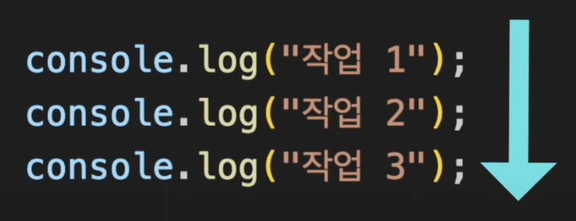
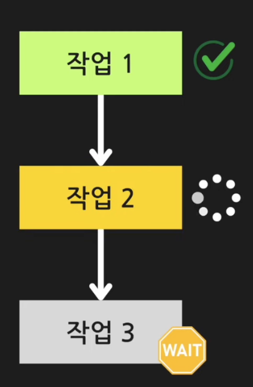

```js
console.log('작업 1');
console.log('작업 2');
console.log('작업 3');
``` 

```js
console.log('작업 1');
// 함수도 호이스팅 된다.
print(); 
console.log('작업 3');

function print() {
  console.log('작업 2');
}
```

동기프로그램의 문제
- 동기프로그램은 직관적이고 이해하기 쉽지만 순서대로만 실행되어야 하므로 Blocking 문제가 생김  
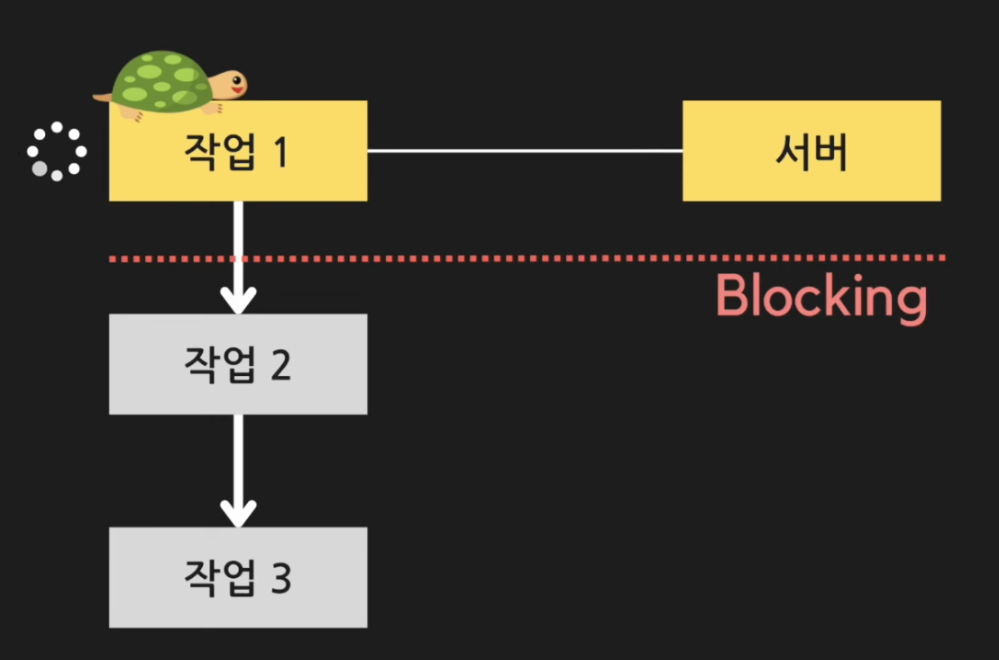

### 2. 비동기 프로그래밍
- 작성된 순서대로 실행하나 완료될 때까지 기다리지 않고 다음 작업을 시작함
- 처리가 오래 걸리는 작업은 작업이 끝난 이후 콜백함수에 의해 후처리 작업이 진행  

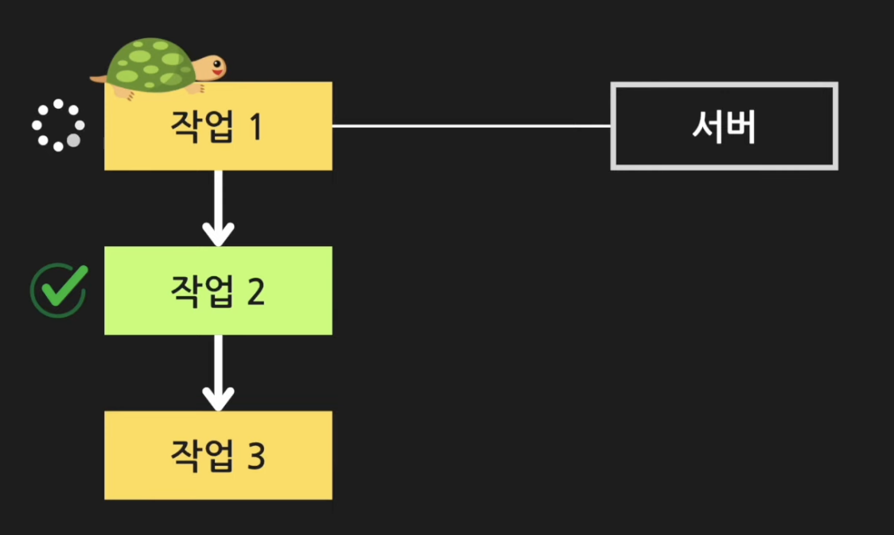

```js
// setTimeout(콜백함수,지연시간)은 비동기 함수이다.
console.log('작업 1');
setTimeout(()=>{
  console.log('작업 2');
},3000);
```

```js
// setTimeout()은 비동기함수이므로 함수 시작해 놓고 다음 작업으로 넘어감
setTimeout(()=>{
  console.log('작업 2');
},3000);
console.log('작업 1');
```

```js
console.log('작업 1');
setTimeout(()=>{
  console.log('작업 2');
},3000);
console.log('작업 3');
```

자바스크립트는 v8 엔진에 의해서 실행되며 싱글스레드이나 v8엔진 외에도 Web APIs환경도 있다. Web APIs환경은 멀티쓰레드 환경이고 비동기 프로그래밍이 가능하다.  

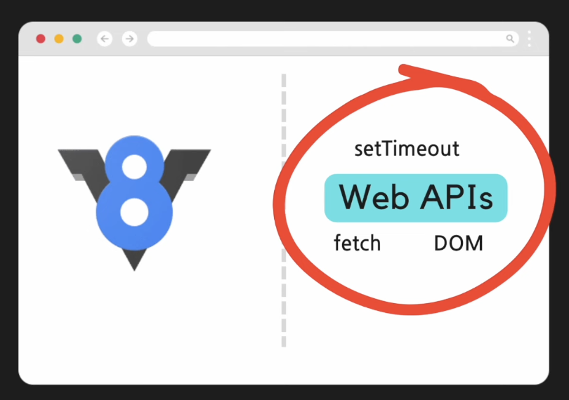
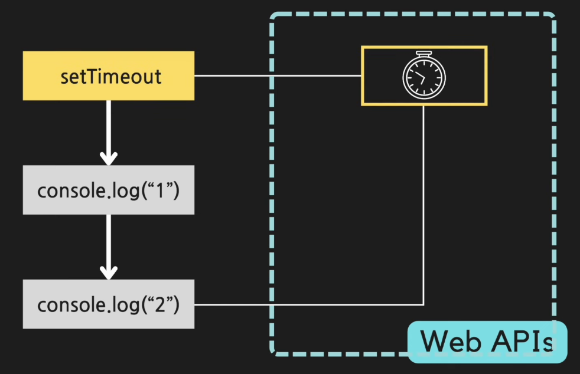


### 3. 콜백함수

다른 함수의 인자로 전달되는 함수를 말함.  

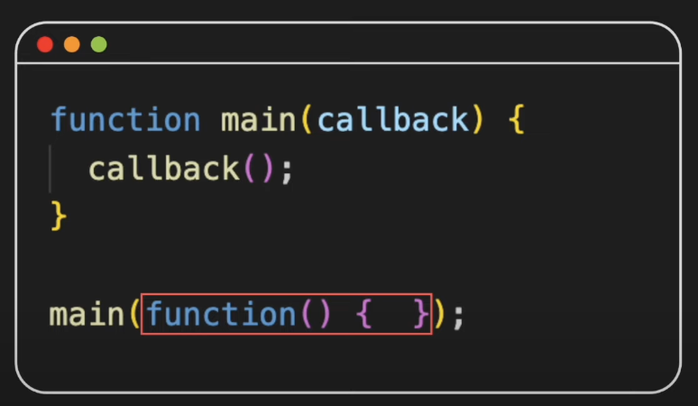
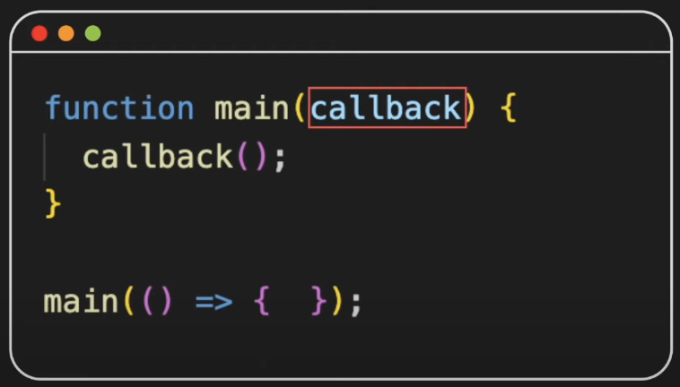

#### 비동기 콜백
비동기 처리에 사용되는 콜백함수를 말함.  
비동기 함수는 정확히 언제 끝나는지 알 수 없다.  
걸리는 시간에 따라 실행 순서가 뒤섞이기도 한다.  
이 때 비동기 함수의 처리가 완료된 이후 후처리를 해야 한다면 비동기 콜백을 이용하여 해결할 수 있다.

```js
function getData(){
  setTimeout(()=>{
    console.log('서버에서 데이터를 받아왔어요')
  },2000)
}
getData()
console.log('후처리..')
```

```js
function getData(callback){
  setTimeout(()=>{
    console.log('서버에서 데이터를 받아왔어요')
    callback({name:'홍길동'})
  },2000)
}
getData((data)=>{
  console.log(data.name)
})
```

온라인 쇼핑몰 시나리오를 프로그래밍 한다고 가정하자.

market.js
```js
// 1. 로그인
function login(username,callback){
  setTimeout(()=>{
    callback(username);
  },3000);
}
// 2. 장바구니에 담기
function addToCart(product,callback){
  setTimeout(()=>{
    callback(product);
  },2000);
  return product;
}
// 3. 결제하기
function makePayment(cardNumber,product,callback){
  setTimeout(()=>{
    callback(cardNumber,product);
  },1000);
}
```

각 작업은 이전 작업에 의존적이다.  
각 함수는 순차적으로 실행되어져야 하며, 앞에 함수의 처리 이후에 다음 함수가 처리되어야 한다.   

아래 내용을 추가
```js
login('홍길동',(username)=>{
  console.log(`${username}님 안녕하세요`);
});
let item = addToCart('감자',(product)=>{
  console.log(`${product}를 장바구니에 담았습니다.`);
});
console.log(item)
makePayment('1111', item, (cardNumber,product)=>{
  console.log(`${cardNumber}-${product}를 구매했습니다.`);
});
```

run:
```bash
node market.js
```

처리결과가 순차적이지 않다.  
output:
```
감자
1111-감자를 구매했습니다.
감자를 장바구니에 담았습니다.
홍길동님 안녕하세요
```

콜백함수를 이용하여 실행순서를 정해줄 수 있다.  
추가 내용을 다음으로 변경
```js
login('홍길동',(username)=>{
  console.log(`${username}님 안녕하세요`);
  addToCart("감자",(product)=>{
    console.log(`${product}를 장바구니에 넣었습니다.`);
    makePayment("000000000000",product,(cardNumber,item)=>{
      console.log(`${cardNumber.slice(0,6)}로 ${item}를 구매했습니다.`);
    });
  });
});
```

run:
```bash
node market.js
```

처리결과가 순차적이다.  
콜백함수를 중첩해서 작업하므로 가독성은 떨어지고 유지보수도 힘들어진다.(콜백지옥)  

output:
```
홍길동님 안녕하세요
감자를 장바구니에 넣었습니다.
000000로 감자를 구매했습니다.
```

### 4. Promise
ES6에서 등장  
 
#### 1. Promise란?
비동기 처리에 사용되는 자바스크립트 객체  
비동기 작업을 처리하고 그 결과는 성공(resolve) 혹은 실패(reject)로 리턴 
Promise는 비동기 작업 진행중일때 아직 비어 있다가 처리가 완료되면 그 결과물이 저장된다.

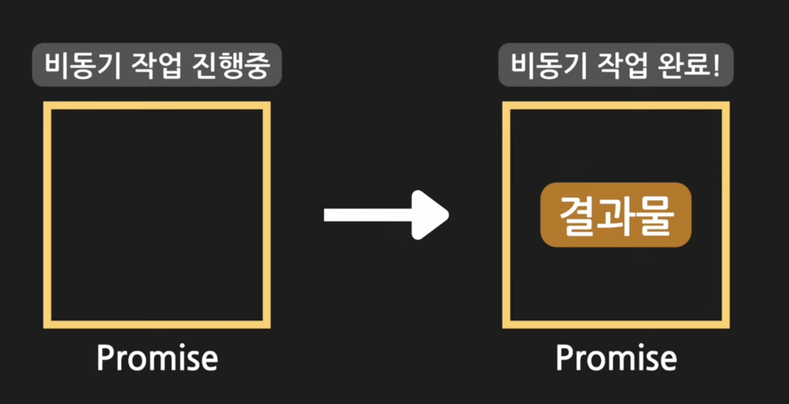

결과는 성공 혹은 실패로 볼 수 있다.  

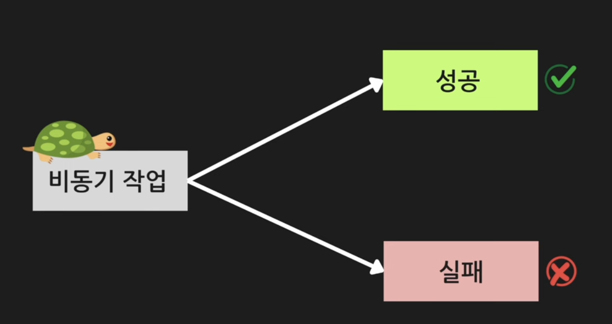

처음 상태는 대기 상태에서 성공 시는 결과 값이 실패 시는 오류에 대한 정보가 저장된다.  

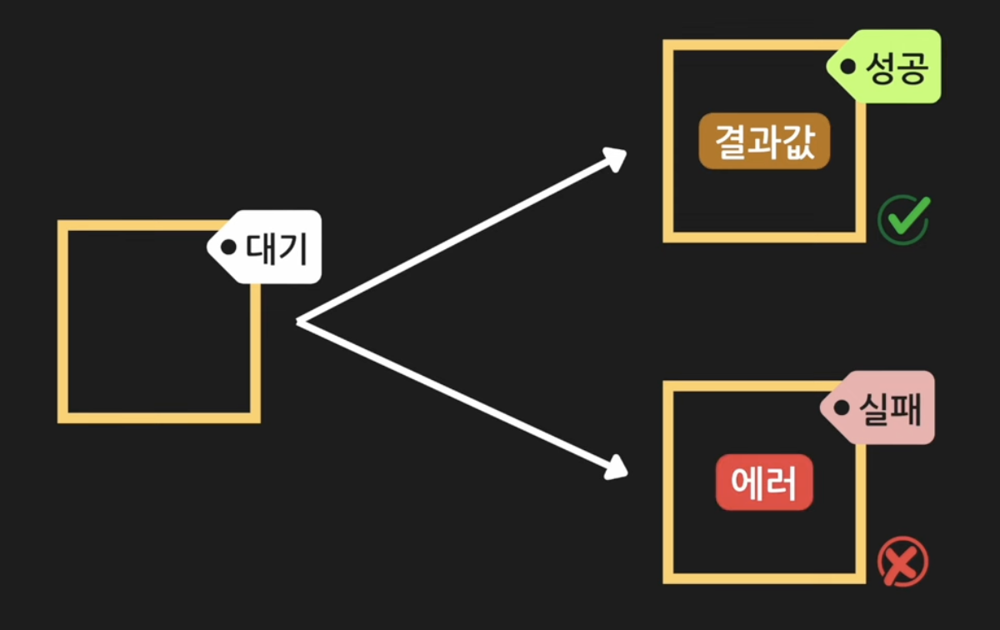

promise는 state와 result 두 개의 값을 가지는 객체    

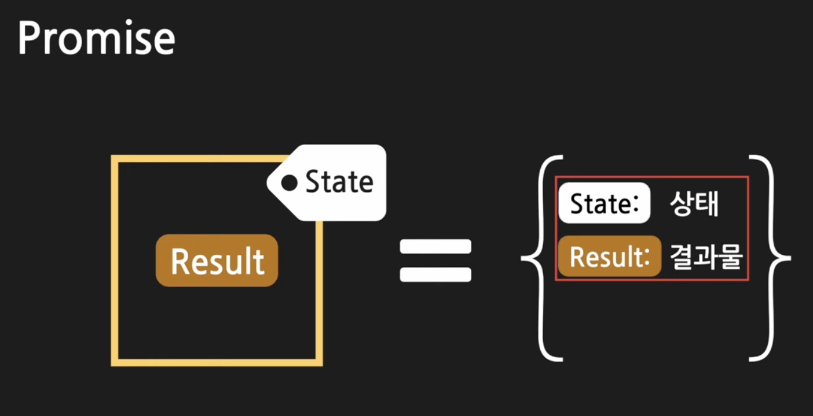

state는 3가지 값을 가진다.  

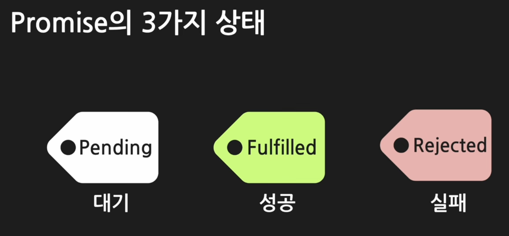

- 대기  


- 성공  
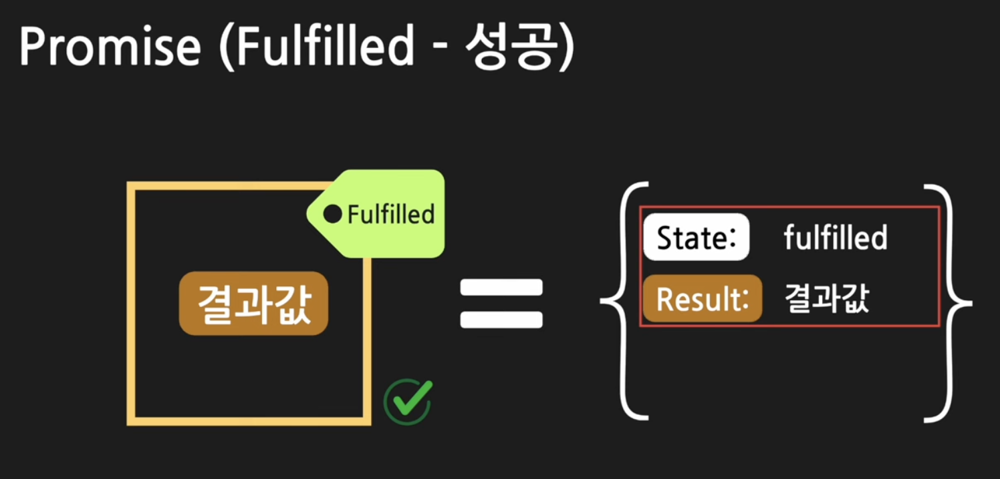

- 실패  
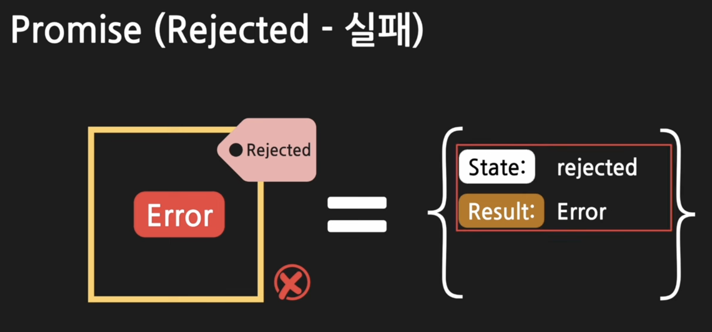

- 성공하면 resolve를 실패하면 reject를 받아서 처리한다.  
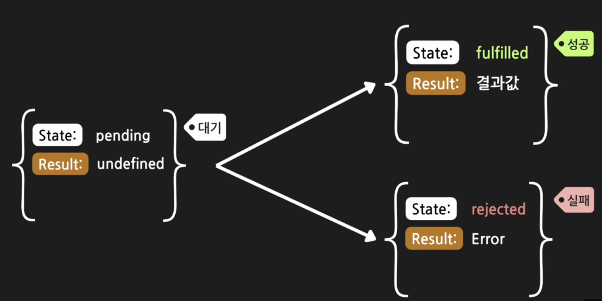

#### 2. Promise 객체 생성
```js
// promise 생성자를 이용해서 생성
// 인자값으로 함수를 받음
// 그 함수 안에 비동기로 처리할 작업을 작성한다.
// 프로미스 객체는 작성하면 바로 execute
// resolve,reject는 execute 함수 안에서 호출할 수 있는 함수
const promise = new Promise((resolve,reject)=>{
  // 비동기로 처리할 작업 기재
  resolve(성공 결과 data)
  reject(실패 결과 error)
})
```

```js
const promise = new Promise((resolve,reject)=>{
  console.log('비동기 작업');
  resolve('완료');
});

// console.log(promise);
```

promise가 성공 혹은 실패 이전에 출력
```js
const promise = new Promise((resolve,reject)=>{
  setTimeout(()=>{
    const data = {name : '철수'};
    console.log('네트워크 요청 성공');  
  },1000);
});

console.log(promise);
```

promise가 작업 처리 이후에 출력
```js
const promise = new Promise((resolve,reject)=>{
  setTimeout(()=>{
    const data = {name : '철수'};
    console.log('네트워크 요청 성공');  
    resolve(data)
  },1000);
});

setTimeout(()=>{
  console.log(promise);
},2000);
```

promise가 성공 혹은 실패에 대한 처리

```js
const promise = new Promise((resolve,reject)=>{
  setTimeout(()=>{
    const data = {name : '철수'};
    // const data = null
    if(data){
      console.log('네트워크 요청 성공');  
      resolve(data)
    }else{
      reject(new Error('네트워크 문제 !!!'))
    }
  },1000);
});

setTimeout(()=>{
  console.log(promise);
},2000);
```

promise를 사용하는 비동기 함수 만들기
- 함수안에서 promise객체를 만들어 준다.  

```js
function getData(){
  const promise = new Promise((resolve,reject)=>{
    setTimeout(()=>{
      const data = {name : '철수'};
      // const data = null
      if(data){
        console.log('네트워크 요청 성공');  
        resolve(data)
      }else{
        reject(new Error('네트워크 문제 !!!'))
      }
    },1000);
  });
  return promise;
}

const promise = getData();
setTimeout(()=>{
  console.log(promise);
},2000);
```

#### 3. then(), catch(), finally()

promise는 then, catch, finally 를 제공한다.  
then() : promise가 완료되고 성공하면 resolve를 콜백함수가 받아서 성공 시 처리할 내용을 처리한다.   
catch() : promise가 실행 중 실패하면 reject을 catch()의 콜백함수가 받아서 실패 시 처리할 내용을 처리한다.  
finally() : 성공 실패 상관없이 마지막에 무조건 처리  

promise를 사용하는 비동기 함수 사용하기  

```js
function getData(){
  const promise = new Promise((resolve,reject)=>{
    setTimeout(()=>{
      const data = {name : '철수'};
      // const data = null
      if(data){
        console.log('네트워크 요청 성공');  
        resolve(data)
      }else{
        reject(new Error('네트워크 문제 !!!'))
      }
    },1000);
  });
  return promise;
}

const promise = getData();

getData
.then((data)=>{
  const name = data.name;
  console.log(`${name}님 안녕하세요`);
})
.catch((error)=>{
  console.log('에러처리를 합니다.');
})
.finally(()=>{
  console.log('마무리 작업')
})
```

#### 4. promise chaining
여러 개의 비동기 작업을 순서대로 처리할 수 있다.

```js
const promise = getData();
promise
.then((data)=> getData())
.then((data)=> getData())
.then((data)=> getData())
.then(console.log);  
```

```js
const promise = getData();
promise
.then((data)=>{
  console.log('1',data);
  return getData();
})
.then((data)=>{
  console.log('2',data);
  return getData();
})
.then((data)=>{
  console.log('3',data);
});  
```
then()에서 문자열을 리턴하면 promise객체로 만들고 resolve('문자열')로 리턴된다.

promise를 사용하는 Web API(Fetch)  
Fetch는 Promise를 리턴한다.

```js
fetch('https://jsonplaceholder.typicode.com/users')
.then((response)=>{
  // console.log(response);
  return response.json();
})
.then((data)=>{
  console.log(data);
})
.catch((error)=>{
  console.log('에러가 발생했습니다.')
})
.finally(()=>{
  console.log('마무리 작업')
});
```

#### 5. 온라인 쇼핑몰 시나리오를 promise를 사용하여 프로그래밍 해보자

```js
// 1. 로그인
function login(username){
  return new Promise((resolve,reject)=>{
    setTimeout(()=>{
      if(username){
        resolve(username);
      }else{
        reject(new Error('아이디를 입력해 주세요'));
      }
    },3000);
  });
}

login("hong")
.then((username)=>{
  console.log(`${username}님 안녕하세요`)
})
.catch((error)=>{
  console.log('오류발생')
})
```

```js
// 2. 장바구니에 담기
function addToCart(product){
  return new Promise((resolve,reject)=>{
    setTimeout(()=>{
      if (product){
        resolve(product);
      }else{
        reject(new Error('장바구니에 넣을 상품이 없어요!'));
      }
    },2000);
  });
}

addToCart('감자')
.then((product)=>{
  console.log(`${product}를 장바구니에 넣었습니다.`);
})
```

```js
// 3. 결제하기
function makePayment(cardNumber,product,){
  return new Promise((resolve,reject)=>{
    setTimeout(()=>{
      if(cardNumber.length !== 16){
        reject(new Error('잘못된 카드 번호 입니다.'));
        return;
      }
      if(!product){
        reject(new Error('결제할 상품을 넣어주세요'));
        return;
      }
      resolve(product);
    },1000);
  });
}

makePayment("1234123412341234","감자")
.then((product)=>{
  console.log(`${product}를 결제했습니다.`);
})
.catch((error)=>{console.log(error)});
```

```js
login('hong')
.then((username)=>{
  console.log(`${username}님 안녕하세요`);
  return addToCart('감자');
})
.then((product)=>{
  console.log(`${product}를 장바구니에 넣었습니다.`);
  return makePayment('1234123412341234',product);
})
.then((product)=>{
  console.log(`${product}를 결제를 완료했습니다.`);
})
.catch((error)=>{
  console.log(error.message);
});
```
username을 입력 받지 못했을 때 catch에서 기본값을 셋팅해 줄 수 있다.
```js
login('')
.catch(()=>{
  return 'guest';
})
.then((username)=>{
  console.log(`${username}님 안녕하세요`);
  return addToCart('');
})
.catch(()=>{
  return '옥수수';
})
.then((product)=>{
  console.log(`${product}를 장바구니에 넣었습니다.`);
  return makePayment('1234123412341234',product);
})
.then((product)=>{
  console.log(`${product}를 결제를 완료했습니다.`);
})
.catch((error)=>{
  console.log(error.message);
})
.finally(()=>{
  console.log('마무리 작업 진행')
})

```
#### 6. promise가 제공하는 4가지 static 함수

##### 1. Promise.all
Promise.all은 여러개의 Promise들을 인자값으로 넣고, Promise를 하나 리턴한다.  
인자값으로 받은 모든 Promise가 resolve가 되어야 반환하는 Promise도 resolve된다.
실행되는 함수들 사이에 선후 관계가 없을 경우 꼭 순차적으로 실행되어져야 하는것은 아니므로 
각 함수의 실행이 모두 완료되고 난 이후 처리가 필요하다면 Promise.all을 사용한다.  

순차적 실행 시간    
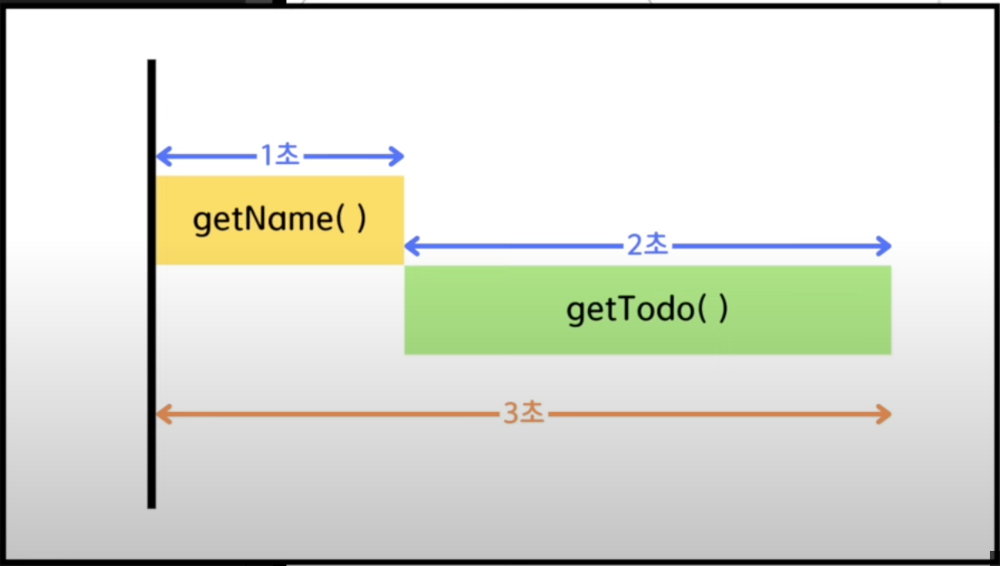

병렬처리시 실행 시간  
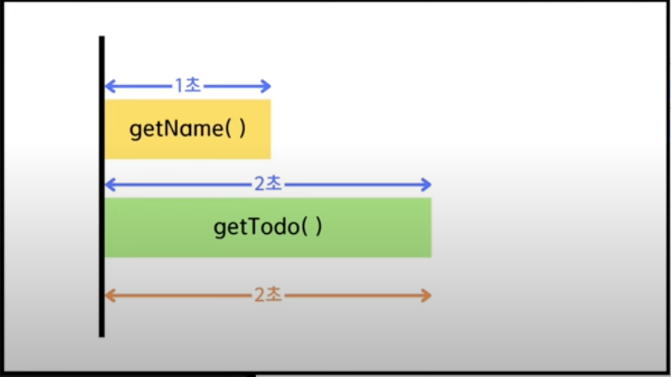

```js
//사용자 정보를 받아옴
function getName(){
  return new Promise((resolve,reject)=>{
    setTimeout(()=>{
      resolve('hong');
      // reject(new Error('에러 : 이름이 없어요'));
    },1000);
  });
}
//할일을 받아옴
function getTodo(){
  return new Promise((resolve,reject)=>{
    setTimeout(()=>{
      resolve('밥먹기');
      // reject(new Error('에러 : 할일이 없어요'));
    },2000);
  });
}

// 순차적으로 실행 3초가 걸림
getName()
.then((name)=>{
  console.log(name);
  return getTodo();
})
.then((todo)=>{
  console.log(todo);
});

```

```js
//Promise.all을 이용 2초가 걸림
const promise = Promise.all([getName(),getTodo()]);
promise.then((data)=>{
  console.log(data);
})
```

###### Promise.all의 오류 처리

```js
// 하나라도 실패하면 바로 reject 시킨다. 남아 있는 다른 promise도 중단됨.
const promise = Promise.all([getName(),getTodo()]);
promise
.then((data)=>{
  console.log(data);
})
.catch((error)=>{
  console.log(error);
});
```

##### 2. Promise.allSettled
```js
// 인자로 전달된 모든 promise를 성공,실패여부를 개별적으로 확인 
// 모든 promise가 완료 될 때까지 기다려서 최종 promise가 resolve된다.
const promise = Promise.allSettled([getName(),getTodo()]);
promise
.then((data)=>{
  console.log(data);
});
```

##### 3. Promise.any
```js
// 새로운 promise를 반환 전달해준 promise 중에서 제일 먼저 반환되는 resolve를 리턴
// 모든 promise가 실패해야 reject를 리턴한다.
const promise = Promise.any([getName(),getTodo()]);
promise
.then((data)=>{
  console.log(data);
})
.catch((error)=>{
  console.log(error);
});
``` 

##### 4. Promise.race
```js
// 전달된 프로미스 중 제일 먼저 처리가 끝난 프로미스의 성공이면 resolve를 실패면 reject를 리턴
const promise = Promise.race([getName(),getTodo()]);
promise
.then((data)=>{
  console.log(data);
})
.catch((error)=>{
  console.log(error);
});pd
```

### 5. async / await

async를 붙이면 일반함수를 비동기함수로 변경,  Promise를 반환하는 비동기함수가 된다.
await을 붙이면 비동기 작업을 수행하는 코드를 동기적으로 실행하도록 한다.

```js
// 네트워크를 통해 서버에 요청하고 그결과를 받는 시간을 표현
function networkRequest(){
  return new Promise((resolve)=>{
    setTimeout(()=>{
      resolve();
    },2000);
  });
}
//사용자 정보를 받아옴
async function getUser(){
  await networkRequest();
  return '홍길동';
}
//할일을 받아옴
async function getTodo(){
  await networkRequest();
  return ['청소하기','밥먹기'];
}
//
async function getData(){
  const user = await getUser();
  // console.log(user);
  const todo = await getTodo();
  // console.log(todo);
  console.log(`${user}님 ${todo}를 하세요`)
}

getData()
```

```js
// 네트워크를 통해 서버에 요청하고 그결과를 받는 시간을 표현
function networkRequest(){
  return new Promise((resolve)=>{
    setTimeout(()=>{
      resolve();
    },2000);
  });
}
//사용자 정보를 받아옴
async function getUser(){
  throw new Error('에러가 발생했어요')
  await networkRequest();
  return '홍길동';
}
//할일을 받아옴
async function getTodo(){
  await networkRequest();
  return ['청소하기','밥먹기'];
}
// 오류처리
async function getData(){
  let user;
  try{
    user = await getUser();
  }catch(error){
    console.log(error.message);
    // user='guest'; 
  }
  const todo = await getTodo();
  console.log(`${user}님 ${todo}를 하세요`)
}

getData()
```
```js
async function fetchData(){
  const  response = await fetch('https://jsonplaceholder.typicode.com/users');
  const data = await response.json();
  console.log(data);
}
fetchData();
```

## 4. 활용예
### 1. 콘솔에서 데이터 입력 함수
```js
const readline = require('readline');

// 사용자에게 데이터를 줄 단위로 입력받고, 비밀번호 입력 시 '*'로 가려지게 하는 함수
async function promptIn(msg, isPassword = false) {
  const rl = readline.createInterface({
    input: process.stdin,
    output: process.stdout
  });
  if (isPassword) {
    return new Promise((resolve, reject) => {
      rl.question(msg, (pwd) => {
        rl.output.write('\n');  
        resolve(pwd);
        rl.close();
      });
      rl._writeToOutput = function _writeToOutput(stringToWrite) {
        rl.output.write("*");
      };
    });
  } else {
    return new Promise((resolve, reject) => {
      rl.question(msg, (input) => {
        resolve(input);
        rl.close();
      });
      rl._writeToOutput = function _writeToOutput(stringToWrite) {
        rl.output.write(stringToWrite);
      };
    });
  }
}


// 예시 사용
async function exampleUsage() {
  const normalText = await promptIn('이름 입력 >> ');
  console.log(normalText);

  const passwordInput = await promptIn('비밀번호 입력 >> ', true);
  console.log(passwordInput);

  const normalText1 = await promptIn('주소 입력 >> ');
  console.log(normalText1);
}

exampleUsage()
```