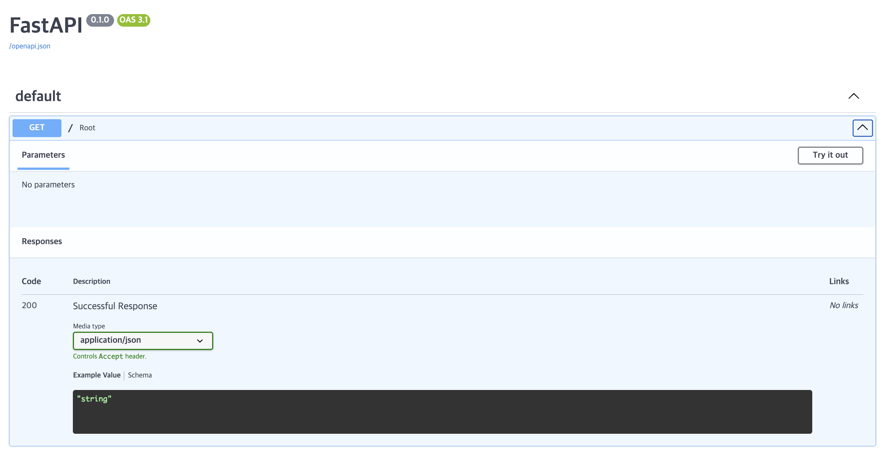

# 1. FastAPI

## 1. 실습 환경 구축

### 1. 가상환경 설정 및 FastAPI 설치

```bash
conda create --name fastapi
conda activate fastapi
pip install fastapi
```

### 2. 
```py
# FastAPI import
from fastapi import FastAPI

# FastAPI instance 생성. 
app = FastAPI()

# Path 오퍼레이션 생성. Path는 도메인명을 제외하고 / 로 시작하는 URL 부분
# 만약 url이 https://example.com/items/foo 라면 path는 /items/foo 
# Operation은 GET, POST, PUT/PATCH, DELETE등의 HTTP 메소드임. 
@app.get("/")
async def root():
``` 독스트링 작성

```
    return {"message": "Hello World"}
```

```bash
uvicorn Welcome.main:app --port=8081 --reload
```

### Swagger UI
api들을 브라우저 기반에서 편리하게 관리 및 문서화, 테스트 할 수 있는 기능을 제공  
http://127.0.0.1:8081/docs로 접속해서 결과 확인  




```py

```

```py

```

```py

```

```py

```

```py

```

```py

```

```py

```

```py

```

```py

```

```py

```

```py

```

```py

```

```py

```

```py

```


