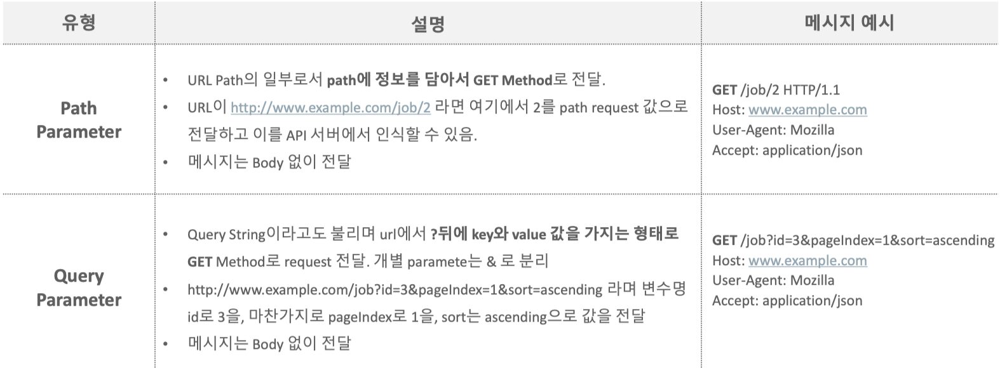
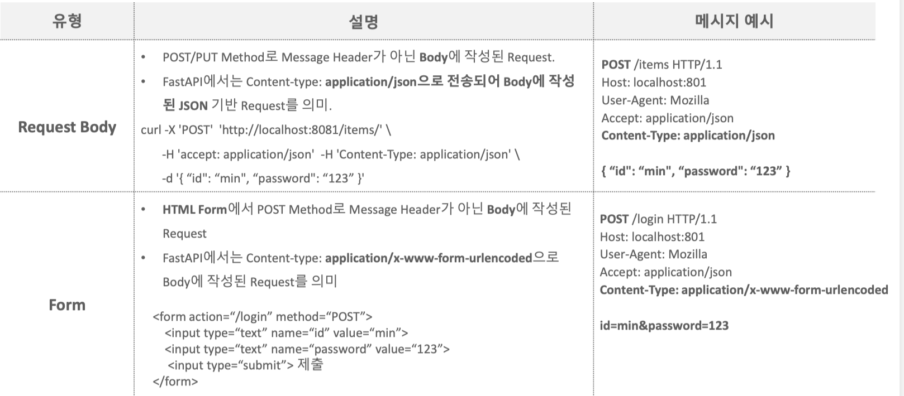

# FastAPI
{: .no_toc }

## Contents
{: .no_toc .text-delta }

1. TOC
{:toc}

---

## 실습 환경 구축

### 가상환경 생성 및 라이브러리 설치

```bash
conda create --name fastapi
conda activate fastapi
pip install fastapi
```

### 동작 테스트

welcome/main.py
```py
# FastAPI import
from fastapi import FastAPI

# FastAPI instance 생성. 
app = FastAPI()

# Path 오퍼레이션 생성. Path는 도메인명을 제외하고 / 로 시작하는 URL 부분
# 만약 url이 https://example.com/items/foo 라면 path는 /items/foo 
# Operation은 GET, POST, PUT/PATCH, DELETE등의 HTTP 메소드임. 
@app.get("/")
async def root():
    """
    루트 경로('/')에 대한 GET 요청을 처리하는 함수입니다.
    간단한 JSON 응답을 반환합니다.
    """
    return {"message": "Hello World"}
```

```bash
uvicorn Welcome.main:app --port=8081 --reload
```
### FastAPI와 클라이언트 간 동작 흐름 이해가기


	GET은 데이터를 요청할 때,
	POST는 데이터를 생성할 때,
	PUT, PATCH는 데이터를 수정할 때,
	DELETE는 데이터를 삭제할 때,
	HEAD는 데이터의 존재 여부만 확인.

### Swagger UI를 이용한 동작 확인
api들을 브라우저 기반에서 편리하게 관리 및 문서화, 테스트 할 수 있는 기능을 제공  
http://127.0.0.1:8081/docs로 접속해서 결과 확인  


## FastAPI Request
FastAPI는 Path Parameter, Query Parameter, Request Body, Form Fields, Header, Cookie, File 등의 다양한 Request 들을 다룰 수 있게 지원함.






### Path 파라미터

requests/main_path.py

```py
from fastapi import FastAPI
from enum import Enum

app = FastAPI()

# http://localhost:8081/items/3
# decorator에 path값으로 들어오는 문자열중에 
# format string { }로 지정된 변수가 path parameter
@app.get("/items/{item_id}")
# 수행 함수 인자로 path parameter가 입력됨. 
# 함수 인자의 타입을 지정하여 path parameter 타입 지정.
async def read_item(item_id: int):
    return {"item_id": item_id} 

# Path parameter값과 특정 지정 Path가 충돌되지 않도록 endpoint 작성 코드 위치에 주의 
# 아래쪽에 있을 경우 오류발생  /items/all로 요청시  /items/3으로인식됨
@app.get("/items/all")
# 수행 함수 인자로 path parameter가 입력됨. 함수 인자의 타입을 지정하여 path parameter 타입 지정.  
async def read_all_items():
    return {"message": "all items"}
```

```bash
uvicorn Requests.main_path:app --port=8081 --reload
```

### Query 파라미터

requests/main_query.py

```py
from fastapi import FastAPI
from typing import Optional

app = FastAPI()

fake_items_db = [{"item_name": "Foo"}, {"item_name": "Bar"}, {"item_name": "Baz"}]

# http://localhost:8081/items?skip=0&limit=2
@app.get("/items")
# 함수에 개별 인자값이 들어가 있는 경우 path parameter가 아닌 모든 인자는 query parameter
# query parameter의 타입과 default값을 함수인자로 설정할 수 있음.
# fake_items_db에서 데이터 슬라이딩해서 리턴
async def read_item(skip: int = 0, limit: int = 2):
    return fake_items_db[skip: skip + limit]

@app.get("/items_nd/")
# 함수 인자값에 default 값이 주어지지 않으면 반드시 query parameter에 해당 인자가 주어져야 함.  
async def read_item_nd(skip: int, limit: int):
    return fake_items_db[skip : skip + limit]

@app.get("/items_op/")
# 함수 인자값에 default 값이 주어지지 않으면 None으로 설정. 
# limit: Optional[int] = None 또는 limit: int | None = None 과 같이 Type Hint 부여  
async def read_item_op(skip: int, limit: int = None ):
    # return fake_items_db[skip : skip + limit]
    if limit:
        return fake_items_db[skip : skip + limit]
    else:
        return {"limit is not provided"}
    
# Path와 Query Parameter를 함께 사용.
@app.get("/items/{item_id}")
async def read_item(item_id: str, q: str | None = None):
    if q:
        return {"item_id": item_id, "q": q}
    return {"item_id": item_id}   
```

```bash
uvicorn Requests.main_query:app --port=8081 --reload
```

### Request Body

requests/main_rbody.py
```py
from fastapi import FastAPI, Body
from pydantic import BaseModel
from typing import Optional, Annotated

app = FastAPI()

#Pydantic Model 클래스는 반드시 BaseModel을 상속받아 생성. 
class Item(BaseModel):
    name: str
    description: str | None = None
    #description: Optional[str] = None
    price: float
    tax: float | None = None
    #tax: Optional[float] = None


#수행 함수의 인자로 Pydantic model이 입력되면 Json 형태의 Request Body 처리
@app.post("/items")
async def create_item(item: Item):
    print("###### item type:", type(item))
    print("###### item:", item)
    return item


# Request Body의 Pydantic model 값을 Access하여 로직 처리
@app.post("/items_tax/")
async def create_item_tax(item: Item):
    item_dict = item.model_dump()
    print("#### item_dict:", item_dict)
    if item.tax:
        price_with_tax = item.price + item.tax
        item_dict.update({"price_with_tax": price_with_tax})
    return item_dict   

# Path, Query, Request Body 모두 함께 적용. 
@app.put("/items/{item_id}")
async def update_item(item_id: int, item: Item, q: str | None = None):
    result = {"item_id": item_id, **item.model_dump()}
    
    if q:
        result.update({"q": q})
    print("#### result:", result)
    return result

class User(BaseModel):
    username: str
    full_name: str | None = None
    #full_name: Optional[str] = None


# 여러개의 request body parameter 처리. 
# json 데이터의 이름값과 수행함수의 인자명이 같아야 함.  
@app.put("/items_mt/{item_id}")
async def update_item_mt(item_id: int, item: Item, user: User):
    results = {"item_id": item_id, "item": item, "user": user}
    print("results:", results)
    return results
```

```bash
uvicorn Requests.main_rbody:app --port=8081 --reload
```

```json
{
    "name": "Foo",
    "description": "An optional description",
    "price": 45.2,
    "tax": 3.5
}
```

```json
{
    "item": {
        "name": "Foo",
        "description": "The pretender",
        "price": 42.0,
        "tax": 3.2
    },
    "user": {
        "username": "dave",
        "full_name": "Dave Grohl"
    }
}
```

javascript기반 Requests Body 적용. 

static/rbody.html

```py
<!DOCTYPE html>
<html lang="en">
<head>
    <meta charset="UTF-8">
    <meta name="viewport" content="width=device-width, initial-scale=1.0">
    <title>Display JSON Response</title>
</head>
<body>
    <h1>JSON Response Data</h1>
    <pre id="jsonOutput"></pre> <!-- A <pre> tag to display JSON data -->
    <script>
        // The URL to which the request is sent
        const url = 'http://localhost:8081/items';

        // The data you want to send in JSON format
        const data = {
            name: "Foo",
            description: "An optional description",
            price: 45.2,
            tax: 3.5
        };

        // Options for the fetch request
        //const options = ;

        // Making the request
        fetch(url, {
        method: 'POST', // The HTTP method to use
        headers: {
            'Content-Type': 'application/json' // The type of content to send
        },
        body: JSON.stringify(data) // The actual data to send, in JSON string format
        })
        .then(response => response.json()) // Parsing the response as JSON
        .then(data => {
            console.log('Success:', data); // Handling the response data
            const outputElement = document.getElementById('jsonOutput');
            // Set the text content of the <pre> element to the formatted JSON string
            outputElement.textContent = JSON.stringify(data, null, 2);
        })
        .catch((error) => {
            console.error('Error:', error); // Handling any errors
        });

    </script>
</body>
</html>
```

Requests/main_rbody_js.py

```py
from fastapi import FastAPI
from pydantic import BaseModel
from typing import Optional
from starlette.middleware.cors import CORSMiddleware
from fastapi.staticfiles import StaticFiles

app = FastAPI()

app.mount("/static", StaticFiles(directory="static"), name="static")

app.add_middleware(
    CORSMiddleware,
    allow_origins=["*"],
    allow_credentials=True,
    allow_methods=["*"],
    allow_headers=["*"],
    max_age=-1,  # Only for the sake of the example. Remove this in your own project.
)

#Pydantic Model 클래스는 반드시 BaseModel을 상속받아 생성. 
class Item(BaseModel):
    name: str
    #description: str | None = None
    description: Optional[str] = None
    price: float
    #tax: float | None = None
    tax: Optional[float] = None


#수행 함수의 인자로 Pydantic model이 입력되면 Json 형태의 Request Body 처리
@app.post("/items/")
async def create_item(item: Item):
    print("###### item")
    return item

# Request Body의 Pydantic model 값을 Access하여 로직 처리
@app.post("/items_tax/")
async def create_item_tax(item: Item):
    item_dict = item.dict()
    if item.tax:
        price_with_tax = item.price + item.tax
        item_dict.update({"price_with_tax": price_with_tax})
    return item_dict

# Path, Query, Request Body 모두 함께 적용. 
# @app.put("/items/{item_id}")
# async def update_item(item_id: int, item: Item, q: str | None = None):
#     result = {"item_id": item_id, **item.dict()}
#     if q:
#         result.update({"q": q})
#     return result

class User(BaseModel):
    username: str
    #full_name: str | None = None
    full_name: Optional[str] = None

# 여러개의 request body parameter 처리. 
# json 데이터의 이름값과 수행함수의 인자명이 같아야 함.  
@app.put("/items_mt/{item_id}")
async def update_item_mt(item_id: int, item: Item, user: User):
    results = {"item_id": item_id, "item": item, "user": user}
    return results

```

```bash
uvicorn Requests.main_rbody_js:app --port=8081 --reload
```


### Form

HTML Form Element를 이용해서 Post로 Request Body를 전송하는 경우 FastAPI에서 Form()으로 처리  
개별 input값 별로 Form()을 이용해서 처리
여러 개의 input 값들을 한번에 처리할 수도 있지만, 이를 위해서는 Form()과 Pydantic을 classmethod로 결합해야 함  

 

 


Requests/main_form.py

```py
from pydantic import BaseModel
from typing import Optional, Annotated

from fastapi import FastAPI, Form

app = FastAPI()

# 개별 Form data 값을 Form()에서 처리하여 수행함수 적용. 
# Form()은 form data값이 반드시 입력되어야 함. Form(None)과 Annotated[str, Form()] = None은 Optional
@app.post("/login")
async def login(username: str = Form(),
                email: str = Form(),
                country: Annotated[str, Form()] = None):
    return {"username": username, 
            "email": email,
            "country": country}

# ellipsis(...) 을 사용하면 form data값이 반드시 입력되어야 함. 
@app.post("/login_f/")
async def login(username: str = Form(...), 
                email: str = Form(...),
                country: Annotated[str, Form()] = None):
    return {"username": username, 
            "email": email, 
            "country": country}

# path, query parameter와 함께
@app.post("/login_pq/{login_gubun}")
async def login(login_gubun: int, q: str | None = None, 
                username: str = Form(), 
                email: str = Form(),
                country: Annotated[str, Form()] = None):
    return {"login_gubun": login_gubun,
            "q": q,
            "username": username, 
            "email": email, 
            "country": country}

#Pydantic Model 클래스는 반드시 BaseModel을 상속받아 생성. 
class Item(BaseModel):
    name: str
    description: str | None = None
    #description: Optional[str] = None
    price: float
    tax: float | None = None
    #tax: Optional[float] = None

# json request body용 end point
@app.post("/items_json/")
async def create_item_json(item: Item):
    return item

# form tag용 end point
@app.post("/items_form/")
async def create_item_json(name: str = Form(),
                           description: Annotated[str, Form()] = None,
                           price: str = Form(),
                           tax: Annotated[int, Form()] = None
                           ):
    return {"name": name, "description": description, "price": price, "tax": tax}
```

```bash
uvicorn Requests.main_rbody_js:app --port=8081 --reload
```

### Request 객체

FastAPI의 Request 객체는 HTTP Request에 대한 대부분의 정보를 다 가지고 있음. 

 

 

Requests/main_request.py

 ```py
from fastapi import FastAPI, Request

app = FastAPI()

@app.get("/items")
async def read_item(request: Request):
    client_host = request.client.host
    headers = request.headers
    query_params = request.query_params
    url = request.url
    path_params = request.path_params
    http_method = request.method
    
    return {
            "client_host": client_host,
            "headers": headers,
            "query_params": query_params,
            "path_params": path_params,
            "url": str(url),
            "http_method":  http_method
        }


@app.get("/items/{item_group}")
async def read_item_p(request: Request, item_group: str):
    client_host = request.client.host
    headers = request.headers 
    query_params = request.query_params
    url = request.url
    path_params = request.path_params
    http_method = request.method

    return {
        "client_host": client_host,
        "headers": headers,
        "query_params": query_params,
        "path_params": path_params,
        "url": str(url),
        "http_method":  http_method
    }


@app.post("/items_json/")
async def create_item_json(request: Request):
    data =  await request.json()  # Parse JSON body
    print("received_data:", data)
    return {"received_data": data}

@app.post("/items_form/")
async def create_item_form(request: Request):
    data = await request.form() # Parse Form body
    print("received_data:", data)
    return {"received_data": data}
 ```

```bash
uvicorn Requests.main_request:app --port=8081 --reload
```

테스트는 Thunder Client로 진행

 

 


## FastAPI Response
http Response는 clinet Request에 따른 serve에서 내려 보내는 메시지   
요청 Request의 처리 상태, 여러 메타정보, 그리고 Content 데이터를 담고 있음

 

 FastAPI Response Class 유형

 

Responses/main_response.py

```py
from fastapi import FastAPI, Form, status
from fastapi.responses import (
    JSONResponse,
    HTMLResponse,
    RedirectResponse
)

from pydantic import BaseModel

app = FastAPI()

#response_class는 default가 JSONResponse. response_class가 HTMLResponse일 경우 아래 코드는?
@app.get("/resp_json/{item_id}", response_class=JSONResponse)
async def response_json(item_id: int, q: str | None = None):
    return JSONResponse(content={"message": "Hello World", 
                                 "item_id": item_id,
                                 "q": q}, status_code=status.HTTP_200_OK)


# HTML Response
@app.get("/resp_html/{item_id}", response_class=HTMLResponse)
async def response_html(item_id: int, item_name: str | None = None):
    html_str = f'''
    <html>
    <body>
        <h2>HTML Response</h2>
        <p>item_id: {item_id}</p>
        <p>item_name: {item_name}</p>
    </body>
    </html>
    '''
    return HTMLResponse(html_str, status_code=status.HTTP_200_OK)


# Redirect(Get -> Get)
@app.get("/redirect")
async def redirect_only(comment: str | None = None):
    print(f"redirect {comment}")
    
    return RedirectResponse(url=f"/resp_html/3?item_name={comment}")

# Redirect(Post -> Get)
@app.post("/create_redirect")
async def create_item(item_id: int = Form(), item_name: str = Form()):
    print(f"item_id: {item_id} item name: {item_name}")

    return RedirectResponse(url=f"/resp_html/{item_id}?item_name={item_name}"
                            , status_code=status.HTTP_302_FOUND)


class Item(BaseModel):
    name: str
    description: str
    price: float
    tax: float | None = None

# Pydantic model for response data
class ItemResp(BaseModel):
    name: str
    description: str
    price_with_tax: float

# reponse_model
@app.post("/create_item/", response_model=ItemResp
          , status_code=status.HTTP_201_CREATED)
async def create_item_model(item: Item):
    item_dict = item.model_dump
    if item.tax:
        price_with_tax = item.price + item.tax
    else:
        price_with_tax = item.price
    
    item_resp = ItemResp(
        name=item.name,
        description=item.description,
        price_with_tax=price_with_tax
    )
    # 반드시 response_model로 정의된 pydantic model을 반환. 
    return item_resp
```


```bash
uvicorn Responses.main_response:app --port=8081 --reload
```

```json
{
    "name": "Foo",
    "description": "An optional description",
    "price": 45.2,
    "tax": 3.5
}
```

## 템플릿 엔진과 정적 파일(Static file) 다루기

### 템플릿 엔진

html 등의 태그 기반의 마크업등은 다양한 표현 방식을 제공하면서 길고 복잡한 형태의 파일로 구성.  
Template 엔진은 표현을 위한 Frontend, 로직과 데이터 핸들링을 위한 Backend 처리를 쉽게 분리할 수 있게 해줌.  
유연한 동적 Content 생성, 개발팀과 Designer의 역활을 분리, 소스코드 모듈화 및 재사용성 증대등의 다양한 장점을 지원


[jinja 문법 기본](17_jinja-template-guide.md)

Templates/main.py

```py
from fastapi import FastAPI, Request
from fastapi.responses import HTMLResponse
from fastapi.templating import Jinja2Templates
from pydantic import BaseModel

app = FastAPI()

# jinja2 Template 생성. 인자로 directory 입력
templates = Jinja2Templates(directory="templates")

class Item(BaseModel):
    name: str
    price: float

# response_class=HTMLResponse를 생략하면 application/json으로 Swagger UI에서 인식(별 문제는 없음)
@app.get("/items/{id}", response_class=HTMLResponse)
# template engine을 사용할 경우 반드시 Request 객체가 인자로 입력되어야 함. 
async def read_item(request: Request, id: str, q: str | None = None):
    # 내부에서 pydantic 객체 생성. 
    item = Item(name="test_item", price=10)
    # pydantic model값을 dict 변환. 
    item_dict = item.model_dump()

    return templates.TemplateResponse(
        request=request,
        name="item.html",
        context={"id": id, "q_str": q, "item": item, "item_dict": item_dict}
    )
    
    # FastAPI 0.108 이하 버전에서는 아래와 같이 TemplateResponse() 인자 호출
    # return templates.TemplateResponse(name="item.html",
    #                                   {"request": request
    #                                    , "id": id, "q_str": q, "item": item, "item_dict": item_dict})


@app.get("/item_gubun")
async def read_item_by_gubun(request: Request, gubun: str):
    item = Item(name="test_item_02", price=4.0)
    
    return templates.TemplateResponse(
        request=request, 
        name="item_gubun.html", 
        context={"gubun": gubun, "item": item}
    )


@app.get("/all_items", response_class=HTMLResponse)
async def read_all_items(request: Request):
    all_items = [Item(name="test_item_" +str(i), price=i) for i in range(5) ]
    print("all_items:", all_items)
    return templates.TemplateResponse(
        request=request, 
        name="item_all.html", 
        context={"all_items": all_items}
    )


# safe read
@app.get("/read_safe", response_class=HTMLResponse)
async def read_safe(request: Request):
    html_str = '''
    <ul>
    <li>튼튼</li>
    <li>저렴</li>
    </ul>
    '''
    return templates.TemplateResponse(
        request=request, 
        name="read_safe.html", 
        context={"html_str": html_str}
    )

```

Templates/templates/item.html

```html
<html>
<head>
    <title>Item Details</title>
</head>
<body>
    <h1>Item id: {{ id }}</h1>
    <h1>query: {{ q_str}} </h1>
    <h3>{{item}}</h3>
    <h5>item name: {{item.name}}, item price: {{item.price}}</h5>
    <p>item_dict[name]: {{item_dict['name']}} </p>
</body>
</html>
```

Templates/templates/item_gubun.html

```html
<html>
<head>
    <title>Item Details</title>
</head>
<body>
    
    <p>이것은 어드민용 item입니다.</p>
    
    <p> 이것은 일반용 item 입니다. </p>
    
    <h3>{{item}}</h3>
</body>
</html>
```

Templates/templates/item_all.html

```html
<html>
<head>
    <title>Item Details</title>
</head>
<body>
     
    <h3>item name:{{ item.name }} item price: {{ item.price }}</h3>
    
</body>
</html>
```

Templates/templates/read_safe.html

```html
<html>
<body>
    <h1> 우리 상품은 </h1>
    {{ html_str | safe }}
</body>
</html>
```
### 정적 파일(Static file) 다루기
결과값을 동적으로 반환하는 endpoint path와 달리 css, javascript, image, 정적 html 파일들은 그 내용이 변경되지 않는 정적 파일임  
FastAPI는 이들 Static File들은 Endpoint로 별도로 관리하지 않으며 정적 파일들을 위한 별도의 ASGI서버를 생성하여 관리하며 이를 위하여 StaticFiles클래스를 제공  

Templates/main_static.py

```py
from fastapi import FastAPI, Request
from fastapi.responses import HTMLResponse
from fastapi.staticfiles import StaticFiles
from fastapi.templating import Jinja2Templates

app = FastAPI()

# /static은 url path, StaticFiles의 directory는 directory명, name은 url_for등에서 참조하는 이름 
app.mount("/static", StaticFiles(directory="static"), name="static")

# jinja2 Template 생성. 인자로 directory 입력
templates = Jinja2Templates(directory="templates")

@app.get("/items/{id}", response_class=HTMLResponse)
async def read_item(request: Request, id: str, q: str | None = None):
    html_name = "item_static.html"
    #html_name = "item_urlfor.html"
    return templates.TemplateResponse(
        request=request, name=html_name, context={"id": id, "q_str": q}
    )
```

Templates/templates/read_static.html

```html
<html>
<head>
    <title>Item Details</title>
    <link rel="stylesheet" href="/static/css/styles.css">
</head>
<body>
    <h1>Item id: {{ id }}</h1>
    <h3><a href="/static/link_tp.html">another link</a></h3>
</body>
</html>
```

Templates/templates/read_urlfor.html

```html
<html>
<head>
    <title>Item Details</title>
    <link rel="stylesheet" href="{{ url_for('static', path='css/styles.css') }}">
</head>
<body>
    <h1>Item id: {{ id }}</h1>
    <h3><a href="{{ url_for('static', path='link_tp.html') }}">another link</a></h3>
</body>
</html>
```

```css
h1 {
    color: green;
}
```

```html
<html>
<head>
    <title>link tp</title>
    <link rel="stylesheet" href="/static/css/styles.css">

</head>
<body>
    <h1>Another Result</h1>
</body>
</html>
```

## FastAPI의 APIRouter

```py

```

## Pydantic

```py

```

## FastAPI의 Async, 멀티 Thread, 멀티 Process 이해

```py

```

## RDBMS 다루기 - SQLAlchemy 활용

```py

```

## Blog 애플리케이션 개발하기

```py

```

## Blog 애플리케이션 개발하기 - 리팩토링

```py

```

## Blog 애플리케이션 개발하기 - Bootstrap 적용 및 File Upload

```py

```

## Blog 애플리케이션 개발하기 - 비동기(Asynchronous) DB처리

```py

```

## FastAPI Exception Handler

```py

```

## FastAPI Middleware

```py

```

## Blog 애플리케이션 개발하기 - Login

```py

```

## Cookie와 Signed Cookie 기반의 FastAPI Session Middleware

```py

```

## Blog 애플리케이션 개발하기 - SessionMiddleware 적용

```py

```
## Blog 애플리케이션 개발하기 - Redis 기반 Session 적용

```py

```

```py

```
