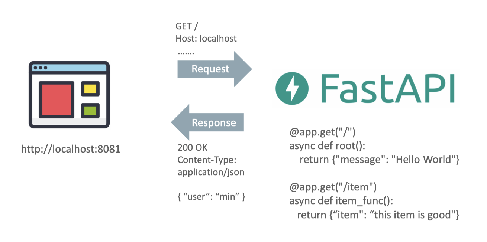
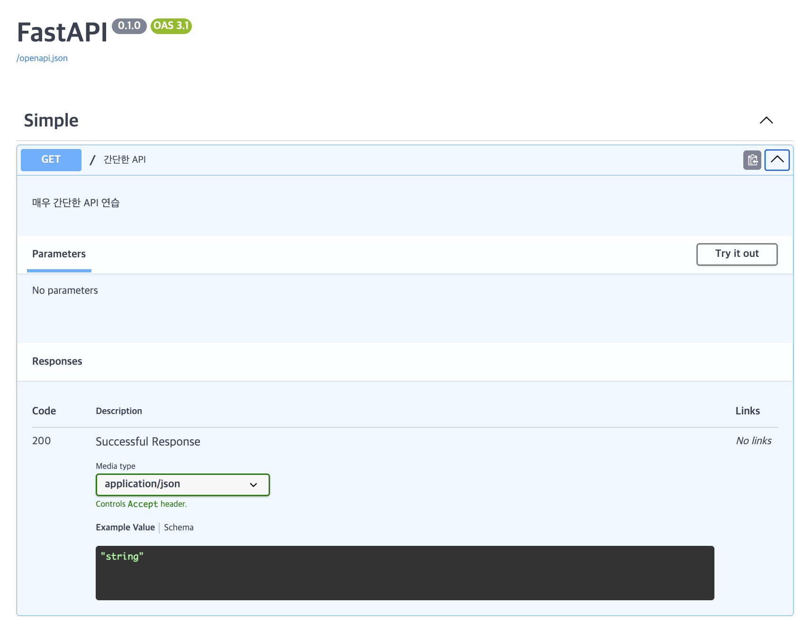

## FastAPI 소개

### 왜 FastAPI인가?

**탁월한 성능**
- ASGI 표준을 따르는 FastAPI는 비동기 방식으로 요청을 처리하여, 파이썬 웹 프레임워크 중에서도 단연 최상의 속도를 제공.
- ASGI(Asynchronous Server Gateway Interface)는 Python 웹 애플리케이션과 서버 간의 비동기 통신을 위한 표준 인터페이스
- 빠른 응답 속도는 오늘날 수많은 사용자를 동시에 수용해야 하는 대규모 애플리케이션에 필수적인 요소.

**개발자를 위한 직관적인 설계**
- FastAPI는 개발자가 더욱 효율적이고 생산적으로 작업할 수 있도록 설계. 
- 직관적인 내부 API, Dependency Injection 기능, 일원화된 타입 힌트(type hint), 그리고 자동으로 생성되는 OpenAPI 문서는 개발 과정에서 오류를 최소화하고, 프로젝트의 속도를 비약적으로 높여줌.

**편리한 데이터 처리와 검증**
- FastAPI는 Pydantic과 완벽하게 통합되어, 데이터 검증과 직렬화, 파싱 과정을 안전하고 정밀하게 처리. 
- 이로 인해 개발자는 더욱 효율적이고 신뢰할 수 있는 코드를 작성할 수 있으며, 복잡한 데이터 구조도 손쉽게 다룰 수 있음.

**비동기 처리의 무한한 가능성**
- FastAPI는 비동기 프로그래밍을 통해 동시에 다수의 작업을 처리하는 능력을 제공.
- 특히, 데이터베이스와 외부 API와 같은 I/O 바운드 작업에서 빛을 발하며, 빠르고 반응성이 뛰어난 애플리케이션을 구축할 수 있음.

### 성능 비교

**BMT를 현실에 반영해 보기**
- 대부분의 Benchmark 성능 테스트는 다양한 현실 Application을 잘 반영하지 못함
- 대부분의 현실 Application은 초당 수천건의 Request를 요청하지 않음(많으면 초당 수십건 정도)
- DB와 연계된 웹 애플리케이션의 Response Time 대부분은 DB 수행 속도에 좌우됨
- DB 연계 웹 애플리케이션의 경우 비동기가 아닌 동기 방식으로 DB와 인터페이스 해야 한다면 FastAPI와 타 프레임워크 간의 성능 차이는 크지 않을 수 있음

**그럼에도 불구하고 FastAPI가 우수한 경우**
- DB를 사용하지 않고, 대량의 동시 접속 요청이 많은 시스템일 경우 FastAPI가 훨씬 뛰어난 성능
- DB 연계 시스템에서 비동기로 DB 인터페이스를 한다면, FastAPI는 훨씬 더 많은 동시 접속을 수용 가능
- I/O 기반 처리나, 타 API에 요청, 머신러닝/딥러닝 추론 요청 등을 FastAPI는 비동기로 처리하면서 더 많은 동시 접속 처리를 빠르게 수행 가능

### 개발 편의성 측면

**장점**
- 모던하고 직관적인 내부 API, Dependency Injection 기능, 일원화된 타입 힌트(type hint)
- 편리한 문서 자동화
- 내재화된 Pydantic 통합을 통한 편리한 검증 및 직렬화
- 범용 API 개발을 편리하게 지원

**단점**
- 아직 Community가 타 Python 웹 프레임워크 대비 많지 않음
- Pydantic과 너무 강하게 결합되어 검증 오류 발생 시 한글 등으로 Customization이 어려움

## 실습 환경 구축

### 가상환경 생성 및 라이브러리 설치

```bash
conda create --name fastapi
conda activate fastapi
pip install fastapi
pip list | grep fastapi 
# fastapi   0.115.12
```
conda create --name [env_name]: 지정된 이름([env_name])으로 새로운 conda 가상 환경을 생성.  
conda activate [env_name]: 지정된 이름의 conda 가상 환경을 활성화.  
pip install [package_name]: 지정된 파이썬 패키지를 현재 활성화된 환경에 설치.  
pip list: 현재 환경에 설치된 모든 파이썬 패키지 목록을 출력.  
| (파이프): 앞 명령어의 출력을 다음 명령어의 입력으로 전달.  
grep [pattern]: 입력 텍스트에서 지정된 패턴([pattern]을 포함하는 라인을 찾아 출력.  

### 동작 테스트

`welcome/main.py`

```py
from fastapi import FastAPI

app = FastAPI()

@app.get("/")
async def root():
    """
    루트 경로('/')에 대한 GET 요청을 처리하는 함수입니다.
    간단한 JSON 응답을 반환합니다.
    """
    return {"message": "Hello World"}
```

- Path는 domain 명을 제외하고 / 로 시작하는 URL 부분
- 만약 url이 https://example.com/items/foo 라면 path는 /items/foo
- Operation은 GET, POST, PUT/PATCH, DELETE 등의 HTTP 메소드

🧪 실행 방법

```bash
uvicorn Welcome.main:app --port=8081 --reload
```

uvicorn은 ASGI 서버로, FastAPI 애플리케이션을 실행.  
--reload 옵션은 코드 변경 시 자동으로 서버를 재시작  
브라우저에서 http://127.0.0.1:8081에 접속하면 {"message": "Hello World"}라는 응답을 확인할 수 있음.
**http://127.0.0.1:8081/docs**에 접속하면 Swagger UI를 통해 자동 생성된 API 문서를 확인할 수 있음.

### FastAPI와 클라이언트 간 동작 흐름 이해가기



**GET**은 데이터를 요청할 때,  
**POST**는 데이터를 생성할 때,  
**PUT**, **PATCH**는 데이터를 수정할 때,  
**DELETE**는 데이터를 삭제할 때,  
**HEAD**는 데이터의 존재 여부만 확인.  


### Swagger UI를 이용한 동작 확인

api들을 브라우저 기반에서 편리하게 관리 및 문서화, 테스트 할 수 있는 기능을 제공  
http://127.0.0.1:8081/docs로 접속해서 결과 확인  

```py
from fastapi import FastAPI

app = FastAPI()

# 경로 작동 데코레이터에 추가 인자를 전달하여 자동 생성되는 API 문서를 상세하게 만듭니다.
@app.get(
    "/",  # 처리할 경로
    summary="간단한 API",  # Swagger UI에서 보여질 API의 요약 설명
    tags=['Simple'],      # Swagger UI에서 API를 그룹화할 태그 목록
    description="매우 간단한 API 연습" # Swagger UI에서 보여질 API의 상세 설명
)
async def root():
    """
    루트 경로('/')에 대한 GET 요청을 처리하는 함수입니다.
    간단한 JSON 응답을 반환합니다.
    (이 함수 docstring도 description의 일부로 사용될 수 있습니다)
    """
    return {"message": "Hello World"}
```


