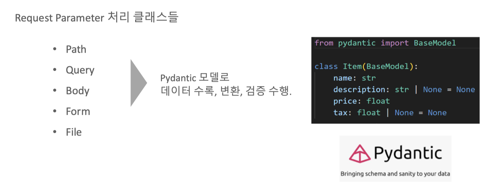
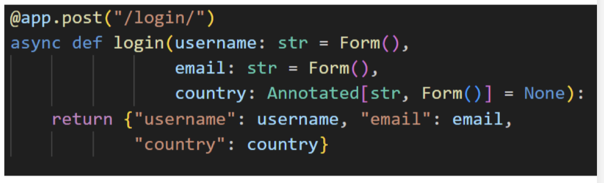
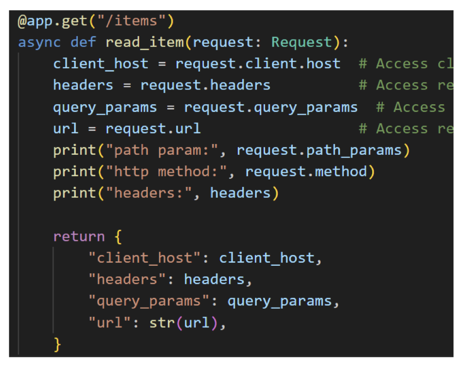
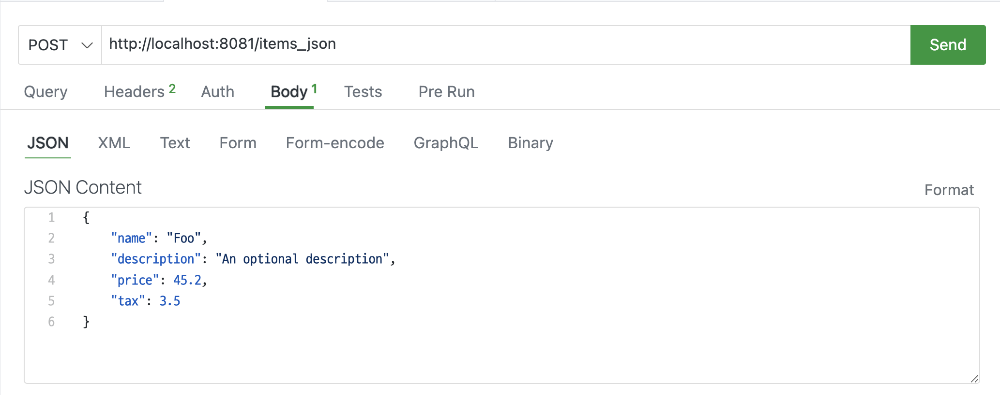
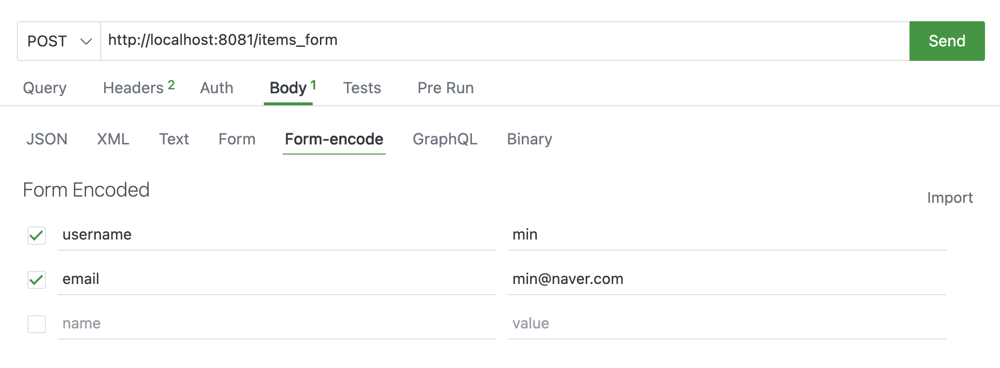

## FastAPI Request

FastAPI는 Path Parameter, Query Parameter, Request Body, Form Fields, Header, Cookie, File 등의 다양한 Request 들을 다룰 수 있게 지원함.

### FastAPI 요청 매개변수 유형

**Path Parameter**

- URL Path의 일부로서 path에 정보를 담아서 GET Method로 전달
- URL이 http://www.example.com/job/2 라면 여기에서 2를 path request 값으로 전달하고 이를 API 서버에서 인식할 수 있음
- 메시지는 Body 없이 전달

```
GET /job/2 HTTP/1.1
Host: www.example.com
User-Agent: Mozilla
Accept: application/json
```

**Query Parameter**

- Query String이라고도 불리며 url에서 ?뒤에 key와 value 값을 가지는 형태로 GET Method로 request 전달
- 개별 parameter는 & 로 분리
- http://www.example.com/job?id=3&pageIndex=1&sort=ascending 라면 변수명 id로 3을, pageIndex로 1을, sort는 ascending으로 값을 전달
- 메시지는 Body 없이 전달

```
GET /job?id=3&pageIndex=1&sort=ascending
Host: www.example.com
User-Agent: Mozilla
Accept: application/json
```

**Request Body**

- POST/PUT Method로 Message Header가 아닌 Body에 작성된 Request
- FastAPI에서는 Content-type: application/json으로 전송되어 Body에 작성된 JSON 기반 Request를 의미

```
POST /items HTTP/1.1
Host: localhost:801
User-Agent: Mozilla
Accept: application/json
Content-Type: application/json

{ "id": "min", "password": "123" }
```

**Form**

- HTML Form에서 POST Method로 Message Header가 아닌 Body에 작성된 Request
- FastAPI에서는 Content-type: application/x-www-form-urlencoded으로 Body에 작성된 Request를 의미

```
POST /login HTTP/1.1
Host: localhost:801
User-Agent: Mozilla
Accept: application/json
Content-Type: application/x-www-form-urlencoded

id=min&password=123
```

HTML 폼 예시:
```html
<form action="/login" method="POST">
  <input type="text" name="id" value="min">
  <input type="text" name="password" value="123">
  <input type="submit"> 제출
</form>
```




### Path 파라미터

`requests/main_path.py`

```py
from fastapi import FastAPI

app = FastAPI()

# http://localhost:8081/items/3
# decorator에 path값으로 들어오는 문자열중에 
# format string { }로 지정된 변수가 path parameter

@app.get("/items/{item_id}")
# 수행 함수 인자로 path parameter가 입력됨. 
# 함수 인자의 타입을 지정하여 path parameter 타입 지정.
async def read_item(item_id: int):
    return {"item_id": item_id} 

# Path parameter값과 특정 지정 Path가 충돌되지 않도록 endpoint 작성 코드 위치에 주의 
# 아래쪽에 있을 경우 오류발생  /items/all로 요청시  /items/3으로인식됨
@app.get("/items/all")
# 수행 함수 인자로 path parameter가 입력됨. 함수 인자의 타입을 지정하여 path parameter 타입 지정.  
async def read_all_items():
    return {"message": "all items"}
```

```bash
uvicorn Requests.main_path:app --port=8081 --reload
```

### Query 파라미터

`requests/main_query.py`

```py
from fastapi import FastAPI
from typing import Optional

app = FastAPI()

fake_items_db = [{"item_name": "Foo"}, {"item_name": "Bar"}, {"item_name": "Baz"}]

# http://localhost:8081/items?skip=0&limit=2
@app.get("/items")
# 함수에 개별 인자값이 들어가 있는 경우 path parameter가 아닌 모든 인자는 query parameter
# query parameter의 타입과 default값을 함수인자로 설정할 수 있음.
# fake_items_db에서 데이터 슬라이딩해서 리턴
async def read_item(skip: int = 0, limit: int = 2):
    return fake_items_db[skip: skip + limit]

@app.get("/items_nd/")
# 함수 인자값에 default 값이 주어지지 않으면 반드시 query parameter에 해당 인자가 주어져야 함.  
async def read_item_nd(skip: int, limit: int):
    return fake_items_db[skip : skip + limit]

@app.get("/items_op/")
# 함수 인자값에 default 값이 주어지지 않으면 None으로 설정. 
# limit: Optional[int] = None 또는 limit: int | None = None 과 같이 Type Hint 부여  
async def read_item_op(skip: int, limit: int = None ):
    # return fake_items_db[skip : skip + limit]
    if limit:
        return fake_items_db[skip : skip + limit]
    else:
        return {"limit is not provided"}
    
# Path와 Query Parameter를 함께 사용.
@app.get("/items/{item_id}")
async def read_item(item_id: str, q: str | None = None):
    if q:
        return {"item_id": item_id, "q": q}
    return {"item_id": item_id}   
```

```bash
uvicorn Requests.main_query:app --port=8081 --reload
```

### Request Body

`requests/main_rbody.py`

```py
from fastapi import FastAPI
from pydantic import BaseModel
from typing import Optional

app = FastAPI()

#Pydantic Model 클래스는 반드시 BaseModel을 상속받아 생성. 
class Item(BaseModel):
    name: str
    description: str | None = None
    #description: Optional[str] = None
    price: float
    tax: float | None = None
    #tax: Optional[float] = None


#수행 함수의 인자로 Pydantic model이 입력되면 Json 형태의 Request Body 처리
@app.post("/items")
async def create_item(item: Item):
    print("###### item type:", type(item))
    print("###### item:", item)
    return item


# Request Body의 Pydantic model 값을 Access하여 로직 처리
@app.post("/items_tax/")
async def create_item_tax(item: Item):
    item_dict = item.model_dump()
    print("#### item_dict:", item_dict)
    if item.tax:
        price_with_tax = item.price + item.tax
        item_dict.update({"price_with_tax": price_with_tax})
    return item_dict   

# Path, Query, Request Body 모두 함께 적용. 
@app.put("/items/{item_id}")
async def update_item(item_id: int, item: Item, q: str | None = None):
    result = {"item_id": item_id, **item.model_dump()}
    
    if q:
        result.update({"q": q})
    print("#### result:", result)
    return result

class User(BaseModel):
    username: str
    full_name: str | None = None
    #full_name: Optional[str] = None


# 여러개의 request body parameter 처리. 
# json 데이터의 이름값과 수행함수의 인자명이 같아야 함.  
@app.put("/items_mt/{item_id}")
async def update_item_mt(item_id: int, item: Item, user: User):
    results = {"item_id": item_id, "item": item, "user": user}
    print("results:", results)
    return results
```

```bash
uvicorn Requests.main_rbody:app --port=8081 --reload
```

```json
{
    "name": "Foo",
    "description": "An optional description",
    "price": 45.2,
    "tax": 3.5
}
```

```json
{
    "item": {
        "name": "Foo",
        "description": "The pretender",
        "price": 42.0,
        "tax": 3.2
    },
    "user": {
        "username": "dave",
        "full_name": "Dave Grohl"
    }
}
```

**javascript기반 Requests Body 적용.**

`static/rbody.html`

```py
<!DOCTYPE html>
<html lang="en">
<head>
    <meta charset="UTF-8">
    <meta name="viewport" content="width=device-width, initial-scale=1.0">
    <title>Display JSON Response</title>
</head>
<body>
    <h1>JSON Response Data</h1>
    <pre id="jsonOutput"></pre> 
    <!-- A <pre> tag to display JSON data -->
    <script>
        // The URL to which the request is sent
        const url = 'http://localhost:8081/items';

        // The data you want to send in JSON format
        const data = {
            name: "Foo",
            description: "An optional description",
            price: 45.2,
            tax: 3.5
        };

        // Options for the fetch request
        //const options = ;

        // Making the request
        fetch(url, {
        method: 'POST', // The HTTP method to use
        headers: {
            'Content-Type': 'application/json' // The type of content to send
        },
        body: JSON.stringify(data) // The actual data to send, in JSON string format
        })
        .then(response => response.json()) // Parsing the response as JSON
        .then(data => {
            console.log('Success:', data); // Handling the response data
            const outputElement = document.getElementById('jsonOutput');
            // Set the text content of the <pre> element to the formatted JSON string
            outputElement.textContent = JSON.stringify(data, null, 2);
        })
        .catch((error) => {
            console.error('Error:', error); // Handling any errors
        });

    </script>
</body>
</html>
```

`Requests/main_rbody_js.py`

```py
from fastapi import FastAPI
from pydantic import BaseModel
from typing import Optional
from starlette.middleware.cors import CORSMiddleware
from fastapi.staticfiles import StaticFiles

app = FastAPI()

app.mount("/static", StaticFiles(directory="static"), name="static")

app.add_middleware(
    CORSMiddleware,
    allow_origins=["*"],
    allow_credentials=True,
    allow_methods=["*"],
    allow_headers=["*"],
    max_age=-1,  # Only for the sake of the example. Remove this in your own project.
)

#Pydantic Model 클래스는 반드시 BaseModel을 상속받아 생성. 
class Item(BaseModel):
    name: str
    description: str | None = None
    # description: Optional[str] = None
    price: float
    tax: float | None = None
    tax: Optional[float] = None


#수행 함수의 인자로 Pydantic model이 입력되면 Json 형태의 Request Body 처리
@app.post("/items/")
async def create_item(item: Item):
    print("###### item")
    return item

# Request Body의 Pydantic model 값을 Access하여 로직 처리
@app.post("/items_tax/")
async def create_item_tax(item: Item):
    item_dict = item.dict()
    if item.tax:
        price_with_tax = item.price + item.tax
        item_dict.update({"price_with_tax": price_with_tax})
    return item_dict

# Path, Query, Request Body 모두 함께 적용. 
# @app.put("/items/{item_id}")
# async def update_item(item_id: int, item: Item, q: str | None = None):
#     result = {"item_id": item_id, **item.dict()}
#     if q:
#         result.update({"q": q})
#     return result

class User(BaseModel):
    username: str
    #full_name: str | None = None
    full_name: Optional[str] = None

# 여러개의 request body parameter 처리. 
# json 데이터의 이름값과 수행함수의 인자명이 같아야 함.  
@app.put("/items_mt/{item_id}")
async def update_item_mt(item_id: int, item: Item, user: User):
    results = {"item_id": item_id, "item": item, "user": user}
    return results

```

```bash
uvicorn Requests.main_rbody_js:app --port=8081 --reload
```


### Form

HTML Form Element를 이용해서 Post로 Request Body를 전송하는 경우 FastAPI에서 Form()으로 처리  
개별 input값 별로 Form()을 이용해서 처리
여러 개의 input 값들을 한번에 처리할 수도 있지만, 이를 위해서는 Form()과 Pydantic을 classmethod로 결합해야 함  

 

 


`Requests/main_form.py`

```py
from pydantic import BaseModel
from typing import Optional, Annotated
from fastapi import FastAPI, Form, Depends

app = FastAPI()

# 개별 Form data 값을 Form()에서 처리하여 수행함수 적용. 
# Form()은 form data값이 반드시 입력되어야 함. Form(None)과 Annotated[str, Form()] = None은 Optional
@app.post("/login")
async def login(username: str = Form(),
                email: str = Form(),
                country: Annotated[str, Form()] = None):
    return {"username": username, 
            "email": email,
            "country": country}

# ellipsis(...) 을 사용하면 form data값이 반드시 입력되어야 함. 
@app.post("/login_f/")
async def login(username: str = Form(...), 
                email: str = Form(...),
                country: Annotated[str, Form()] = None):
    return {"username": username, 
            "email": email, 
            "country": country}

# path, query parameter와 함께
@app.post("/login_pq/{login_gubun}")
async def login(login_gubun: int, q: str | None = None, 
                username: str = Form(), 
                email: str = Form(),
                country: Annotated[str, Form()] = None):
    return {"login_gubun": login_gubun,
            "q": q,
            "username": username, 
            "email": email, 
            "country": country}

#Pydantic Model 클래스는 반드시 BaseModel을 상속받아 생성. 
class Item(BaseModel):
    name: str
    description: str | None = None
    #description: Optional[str] = None
    price: float
    tax: float | None = None
    #tax: Optional[float] = None

# json request body용 end point
@app.post("/items_json/")
async def create_item_json(item: Item):
    return item

# form tag용 end point
@app.post("/items_form/")
async def create_item_json(name: str = Form(),
                        description: Annotated[str, Form()] = None,
                        price: str = Form(),
                        tax: Annotated[int, Form()] = None
                        ):
    return {"name": name, "description": description, "price": price, "tax": tax}

class UserInput(BaseModel):
    username: str
    email: str
    age: Optional[int] = None  # 나이는 선택 사항

    @classmethod
    def as_form(
        cls,
        username: str = Form(..., description="사용자 이름"),
        email: str = Form(..., description="이메일 주소"),
        age: Optional[int] = Form(None, description="나이 (선택)")
    ):
        return cls(username=username, email=email, age=age)

@app.post("/submit")
async def submit(user: UserInput = Depends(UserInput.as_form)):
    return {
        "message": f"User {user.username} submitted successfully!",
        "user_data": user.model_dump()
    }
```

```bash
uvicorn Requests.main_rbody_js:app --port=8081 --reload
```

### Request 객체

FastAPI의 Request 객체는 HTTP Request에 대한 대부분의 정보를 다 가지고 있음. 

 

 

`Requests/main_request.py`

 ```py
from fastapi import FastAPI, Request

app = FastAPI()
# 요청(Request) 객체를 통해 요청한 클라이언트의 ip 정보, 요청 헤더, 쿼리스트링, 요청한 전체 url, http 메서드(get)

# http://127.0.0.1:8081/items?item_code=8
@app.get("/items")
async def read_item(request: Request):
    client_host = request.client.host
    headers = request.headers
    query_params = request.query_params
    url = request.url
    path_params = request.path_params
    http_method = request.method
    
    return {
            "client_host": client_host,
            "headers": headers,
            "query_params": query_params,
            "path_params": path_params,
            "url": str(url),
            "http_method":  http_method
        }

# http://127.0.0.1:8081/items/34
@app.get("/items/{item_group}")
async def read_item_p(request: Request, item_group: str):
    client_host = request.client.host
    headers = request.headers 
    query_params = request.query_params
    url = request.url
    path_params = request.path_params
    http_method = request.method

    return {
        "client_host": client_host,
        "headers": headers,
        "query_params": query_params,
        "path_params": path_params,
        "url": str(url),
        "http_method":  http_method
    }

# SwaggerUI에서 테스트가 안되므로 테스트는 Thunder Client로 진행

@app.post("/items_json/")
async def create_item_json(request: Request):
    data =  await request.json()  # Parse JSON body
    print("received_data:", data)
    return {"received_data": data}

# SwaggerUI에서 테스트가 안되므로 테스트는 Thunder Client로 진행

@app.post("/items_form/")
async def create_item_form(request: Request):
    data = await request.form() # Parse Form body
    print("received_data:", data)
    return {"received_data": data}
 ```

```bash
uvicorn Requests.main_request:app --port=8081 --reload
```

테스트는 Thunder Client로 진행

 

 
