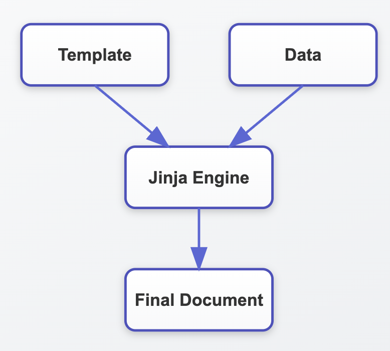

## 템플릿 엔진과 정적 파일(Static file) 다루기

### 템플릿 엔진

html 등의 태그 기반의 마크업등은 다양한 표현 방식을 제공하면서 길고 복잡한 형태의 파일로 구성.  
Template 엔진은 표현을 위한 Frontend, 로직과 데이터 핸들링을 위한 Backend 처리를 쉽게 분리할 수 있게 해줌.  
유연한 동적 Content 생성, 개발팀과 Designer의 역활을 분리, 소스코드 모듈화 및 재사용성 증대등의 다양한 장점을 지원



[jinja 문법 기본](16_10_fastapi.md)

`Templates/main.py`

```py
from fastapi import FastAPI, Request
from fastapi.responses import HTMLResponse
from fastapi.templating import Jinja2Templates
from pydantic import BaseModel

app = FastAPI()

# jinja2 Template 생성. 인자로 directory 입력
templates = Jinja2Templates(directory="templates")

class Item(BaseModel):
    name: str
    price: float

# response_class=HTMLResponse를 생략하면 application/json으로 Swagger UI에서 인식(별 문제는 없음)
@app.get("/items/{id}", response_class=HTMLResponse)
# template engine을 사용할 경우 반드시 Request 객체가 인자로 입력되어야 함. 
async def read_item(request: Request, id: str, q: str | None = None):
    # 내부에서 pydantic 객체 생성. 
    item = Item(name="test_item", price=10)
    # pydantic model값을 dict 변환. 
    item_dict = item.model_dump()

    return templates.TemplateResponse(
        request=request,
        name="item.html",
        context={"id": id, "q_str": q, "item": item, "item_dict": item_dict}
    )
    
    # FastAPI 0.108 이하 버전에서는 아래와 같이 TemplateResponse() 인자 호출
    # return templates.TemplateResponse(name="item.html",
    #                                   {"request": request
    #                                    , "id": id, "q_str": q, "item": item, "item_dict": item_dict})


@app.get("/item_gubun")
async def read_item_by_gubun(request: Request, gubun: str):
    item = Item(name="test_item_02", price=4.0)
    
    return templates.TemplateResponse(
        request=request, 
        name="item_gubun.html", 
        context={"gubun": gubun, "item": item}
    )


@app.get("/all_items", response_class=HTMLResponse)
async def read_all_items(request: Request):
    all_items = [Item(name="test_item_" +str(i), price=i) for i in range(5) ]
    print("all_items:", all_items)
    return templates.TemplateResponse(
        request=request, 
        name="item_all.html", 
        context={"all_items": all_items}
    )


# safe read
@app.get("/read_safe", response_class=HTMLResponse)
async def read_safe(request: Request):
    html_str = '''
    <ul>
    <li>튼튼</li>
    <li>저렴</li>
    </ul>
    '''
    return templates.TemplateResponse(
        request=request, 
        name="read_safe.html", 
        context={"html_str": html_str}
    )

```

`Templates/templates/item.html`

```html
<html>
<head>
    <title>Item Details</title>
</head>
<body>
    <h1>Item id: {{ id }}</h1>
    <h1>query: {{ q_str}} </h1>
    <h3>{{item}}</h3>
    <h5>item name: {{item.name}}, item price: {{item.price}}</h5>
    <p>item_dict[name]: {{item_dict['name']}} </p>
</body>
</html>
```

`Templates/templates/item_gubun.html`

```html
<html>
<head>
    <title>Item Details</title>
</head>
<body>
    
    <p>이것은 어드민용 item입니다.</p>
    
    <p> 이것은 일반용 item 입니다. </p>
    
    <h3>{{item}}</h3>
</body>
</html>
```

`Templates/templates/item_all.html`

```html
<html>
<head>
    <title>Item Details</title>
</head>
<body>
     
    <h3>item name:{{ item.name }} item price: {{ item.price }}</h3>
    
</body>
</html>
```

`Templates/templates/read_safe.html`

```html
<html>
<body>
    <h1> 우리 상품은 </h1>
    {{ html_str | safe }}
</body>
</html>
```

### 정적 파일(Static file) 다루기

결과값을 동적으로 반환하는 endpoint path와 달리 css, javascript, image, 정적 html 파일들은 그 내용이 변경되지 않는 정적 파일임  
FastAPI는 이들 Static File들은 Endpoint로 별도로 관리하지 않으며 정적 파일들을 위한 별도의 ASGI서버를 생성하여 관리하며 이를 위하여 StaticFiles클래스를 제공  

`Templates/main_static.py`

```py
from fastapi import FastAPI, Request
from fastapi.responses import HTMLResponse
from fastapi.staticfiles import StaticFiles
from fastapi.templating import Jinja2Templates

app = FastAPI()

# /static은 url path, StaticFiles의 directory는 directory명, name은 url_for등에서 참조하는 이름 
app.mount("/static", StaticFiles(directory="static"), name="static")

# jinja2 Template 생성. 인자로 directory 입력
templates = Jinja2Templates(directory="templates")

@app.get("/items/{id}", response_class=HTMLResponse)
async def read_item(request: Request, id: str, q: str | None = None):
    html_name = "item_static.html"
    #html_name = "item_urlfor.html"
    return templates.TemplateResponse(
        request=request, name=html_name, context={"id": id, "q_str": q}
    )
```

`Templates/templates/read_static.html`

```html
<html>
<head>
    <title>Item Details</title>
    <link rel="stylesheet" href="/static/css/styles.css">
</head>
<body>
    <h1>Item id: {{ id }}</h1>
    <h3><a href="/static/link_tp.html">another link</a></h3>
</body>
</html>
```

`Templates/templates/read_urlfor.html`

```html
<html>
<head>
    <title>Item Details</title>
    <link rel="stylesheet" href="{{ url_for('static', path='css/styles.css') }}">
</head>
<body>
    <h1>Item id: {{ id }}</h1>
    <h3><a href="{{ url_for('static', path='link_tp.html') }}">another link</a></h3>
</body>
</html>
```

`Templates/static/css/styles.css`

```css
h1 {
    color: green;
}
```

`Templates/static/link_tp.html`

```html
<html>
<head>
    <title>link tp</title>
    <link rel="stylesheet" href="/static/css/styles.css">

</head>
<body>
    <h1>Another Result</h1>
</body>
</html>
```
