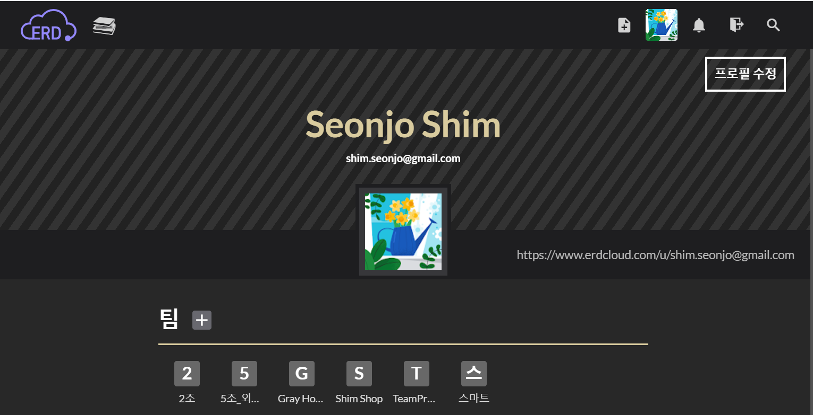
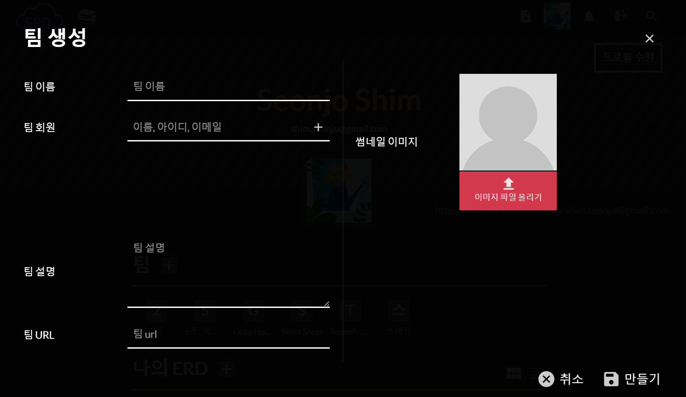
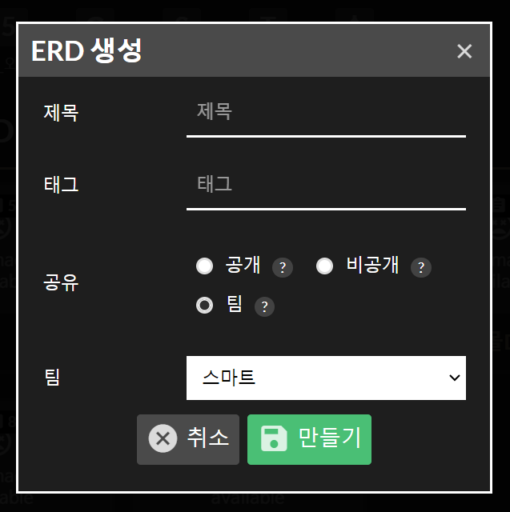
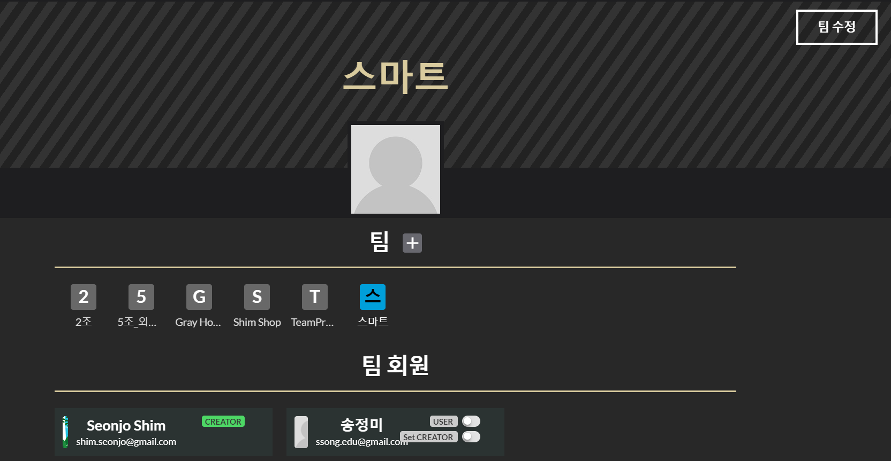
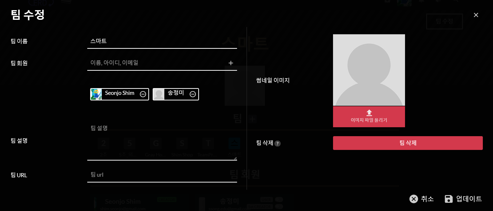
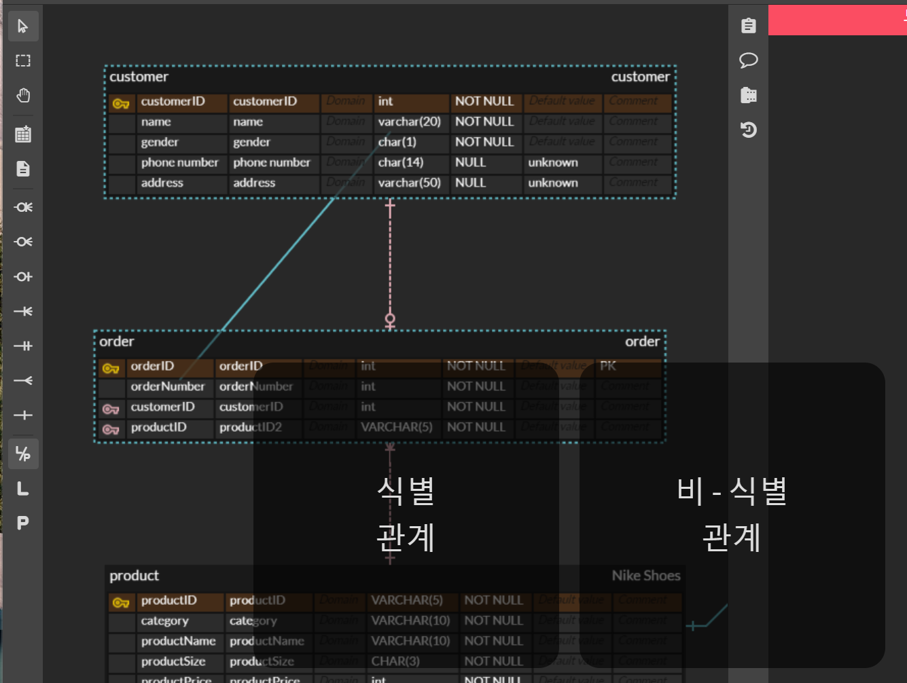
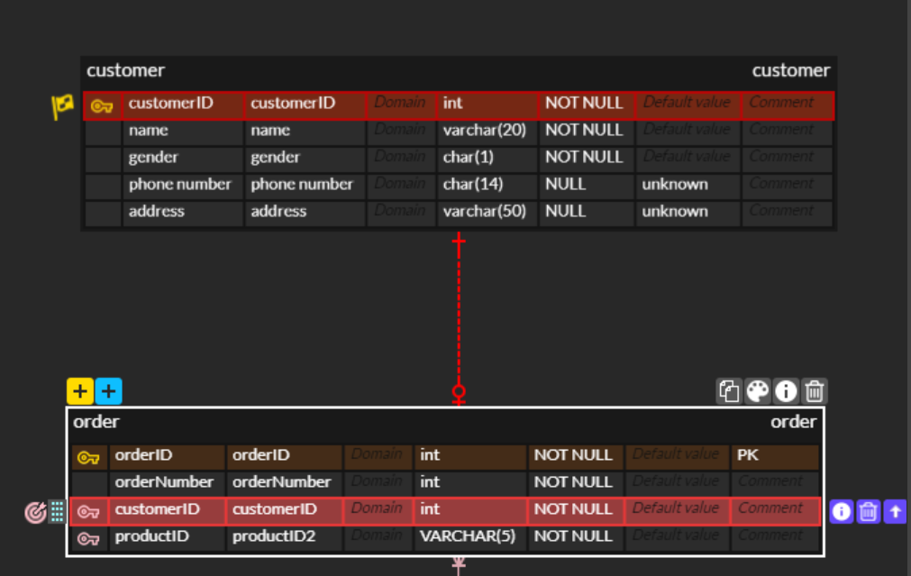

## 1. ERD Cloud
[erdcloud](https://www.erdcloud.com/)

 내용 |  설명 
 선택 |  엔티티나 메모등을 선택 
 다중선택 |  한번에 여러 개체를 선택 
 새로운 엔티티 추가 |  새로운 테이블을 생성 
 새로운 메모 추가 |  메모생성 
 없거나 한 개 또는 여러 개 | 
 부모테이블의 데이터를 참조하는 자식테이블의 데이터가 없거나 한 개 또는 여러 개 
 없거나 여러 개 | 
 부모테이블의 데이터를 참조하는 자식테이블의 데이터가 없거나 여러 개 
 없거나 한 개 | 
 부모테이블의 데이터를 참조하는 자식테이블의 데이터가 없거나 한 개 
 한 개 또는 여러 개 | 
 부모테이블의 데이터를 참조하는 자식테이블의 데이터가 한 개 또는 여러 개
 오직 한 개만 |  부모테이블의 데이터를 참조하는 자식테이블의 데이터가 오직 한 개만
 여러 개|  부모테이블의 데이터를 참조하는 자식테이블의 데이터가 여러 개
 한 개|  부모테이블의 데이터를 참조하는 자식테이블의 데이터가 한 개
 논리&물리 보기|  논리명 물리명 같이 본다.
 논리 보기|  논리명만 보여준다. 이해하기 편한 이름
 물리 보기 |  물리명만 보여준다. 실제 필드명
 가져오기 |  작성된 쿼리문으로 erd를 작성
 내보내기 |   쿼리문(mysql,오라클,ms-sql)이나 이미지 등으로 내보낼수 있다.

### 팀(내프로필-팀에서 생성)  
로그인 후 프로필을 선택하고 팀+ 를 클릭

팀이름 입력, 팀회원은 팀원의 아이디나 이메일 주소로 찾아서 선택하고 만들기 버튼 클릭

erd를 생성할 때 공유에 팀을 체크하고 만들어 놓은 팀을 선택한다.

수정시 해당팀을 선택하고 오른쪽 상단의 팀수정 버튼을 클릭

팀원을 추가하거나 팀삭제 버튼을 클릭해서 삭제할 수 있다.

### ERD 작성
관계 설정 : 부모테이블 클릭하고 자식테이블 클릭  
#### 식별관계(실선)-부모테이블의 기본키를 자식테이블의 기본키로 사용  
#### 비-식별관계(점선)-부모테이블의 기본키를 자식테이블의 외래키로 사용  

관계설정을 제거하려면 자식테이블 쪽의 외래키를 선택하고 해당 필드를 삭제하면 된다.

