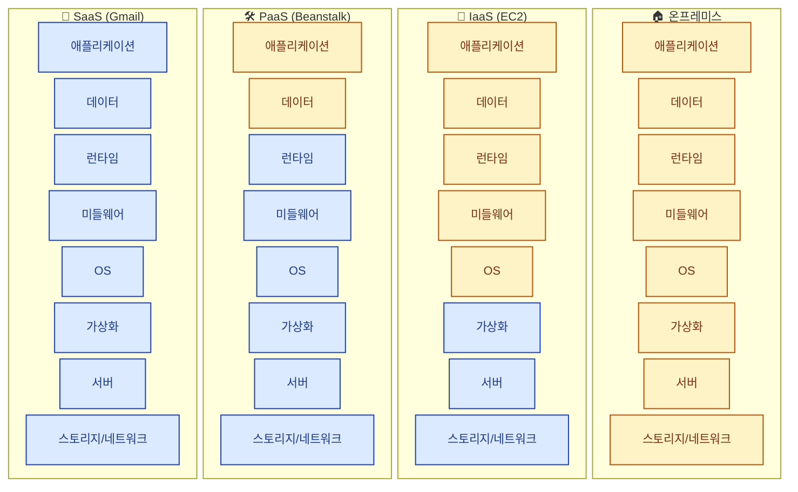
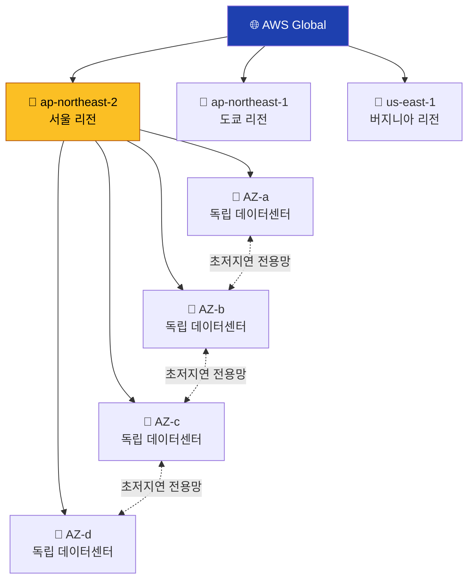
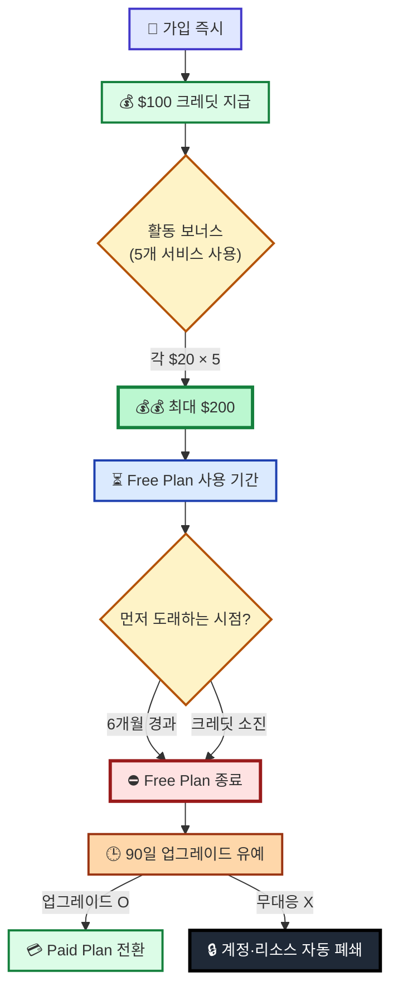

## 학습 목표

- 클라우드 컴퓨팅이 무엇이고 왜 사용하는지 설명할 수 있다
- AWS의 주요 서비스를 이해하고 이 수업에서 사용할 서비스를 파악할 수 있다

<a id="toc"></a>

## 진행 순서

1. [클라우드란?](#part1) - 온프레미스 vs 클라우드, IaaS/PaaS/SaaS
2. [AWS란?](#part2) - 리전과 가용 영역 개념
3. [오늘 사용할 AWS 서비스](#part3) - EC2, VPC, EBS 소개
4. [프리 티어와 비용 주의](#part4) - 과금 방지 필수 안내
5. [정리](#part5) - 개념 요약

---

# 01장. 클라우드와 AWS 소개

<a id="part1"></a>

## 1. 클라우드란? [↑](#toc)

### 전력 그리드 비유

> 집에 발전소를 짓지 않고 전기를 빌려 쓰듯,
> **서버를 직접 사지 않고 필요한 만큼 빌려 쓰는 것**이 클라우드 컴퓨팅입니다.

과거에는 회사가 직접 서버(컴퓨터)를 구매하고, 전용 서버실을 만들고, 24시간 관리 인력을 두었습니다.
지금은 인터넷을 통해 다른 회사의 서버를 빌려 쓰고, **사용한 만큼만 비용**을 냅니다.

### 온프레미스 vs 클라우드

| 항목 | 온프레미스(On-Premise) | 클라우드(Cloud) |
|------|----------------------|----------------|
| 서버 소유 | 직접 구매 | 빌려 씀 |
| 초기 비용 | 수천만 ~ 수억 원 | 거의 없음 |
| 확장 | 서버 추가 구매 필요 (수일~수주) | 몇 분 내 즉시 확장 |
| 유지보수 | 자체 인력 필요 | 클라우드 업체가 담당 |
| 접근 위치 | 사내 네트워크 | 인터넷 연결 어디서나 |


### 클라우드의 장점

- **초기 비용 없음**: 서버를 구매하지 않으므로 자본 지출 없이 시작 가능
- **즉시 확장**: 트래픽이 갑자기 늘어나도 클릭 몇 번으로 서버 증설
- **전 세계 접근**: 인터넷만 있으면 어디서든 서버 접속 및 관리

### 클라우드 서비스 모델 (IaaS / PaaS / SaaS)

| 모델 | 풀네임 | 무엇을 빌리나 | AWS 예시 | 비유 |
|------|--------|-------------|---------|------|
| **IaaS** | Infrastructure as a Service | 서버, 네트워크, 스토리지 | EC2, S3 | 빈 사무실 임대 |
| **PaaS** | Platform as a Service | 개발 환경, 런타임, DB | Elastic Beanstalk, RDS | 가구 있는 사무실 |
| **SaaS** | Software as a Service | 완성된 소프트웨어 | (Gmail, Notion이 해당) | 공유 오피스 |

> - **IaaS**: 빈 사무실을 빌려 가구, 컴퓨터, 인테리어를 직접 꾸밉니다. 자유도가 가장 높습니다.
> - **PaaS**: 책상과 컴퓨터가 갖춰진 사무실을 빌립니다. 코드만 올리면 바로 실행됩니다.
> - **SaaS**: 공유 오피스처럼 이미 모든 게 갖춰진 서비스를 그냥 사용합니다.

이 수업에서는 **IaaS** 수준의 AWS 서비스를 직접 다룹니다.



> 🟡 노란색 = **내가 관리** / 🔵 파란색 = **AWS가 관리**. 오른쪽으로 갈수록 내 부담이 줄어듭니다.

---

<a id="part2"></a>

## 2. AWS란? [↑](#toc)

**AWS(Amazon Web Services)**는 Amazon이 운영하는 클라우드 서비스 플랫폼으로,
2025년 기준 전 세계 클라우드 시장 점유율 **약 31%**로 1위입니다.
200개 이상의 서비스를 제공하며, 넷플릭스, 삼성, 카카오 등 전 세계 기업이 사용합니다.

### 리전(Region)과 가용 영역(AZ)

### 지사와 건물 비유

> AWS는 전 세계에 **리전(지사)**을 두고, 각 리전 안에 여러 개의 **가용 영역(건물)**을 운영합니다.
> 한 건물에 화재가 나도 다른 건물이 정상 운영되어 서비스가 중단되지 않습니다.

| 개념 | 설명 | 비유 |
|------|------|------|
| **리전(Region)** | 특정 지역에 위치한 데이터센터 클러스터 | 서울 지사 |
| **가용 영역(AZ)** | 리전 안의 독립적인 데이터센터 | 지사 내 별도 건물 |

- 리전은 지리적으로 분리되어 있어 재해(지진, 정전)에 대비합니다.
- 하나의 리전 안에는 보통 2~6개의 가용 영역이 있습니다.
- 가용 영역끼리는 초저지연 전용 네트워크로 연결됩니다.



> 💡 **이 수업에서는 서울(ap-northeast-2) 리전 1곳만 사용**하지만, AZ 개념은 실무 고가용성 설계의 기초입니다.

### 주요 리전

| 리전 코드 | 위치 |
|-----------|------|
| ap-northeast-2 | **서울** (이 수업에서 사용) |
| ap-northeast-1 | 도쿄 |
| us-east-1 | 버지니아 (AWS 본사) |
| eu-west-1 | 아일랜드 |

> 이 수업에서는 **서울 리전 (ap-northeast-2)**을 사용합니다.
> 콘솔 오른쪽 상단에서 "서울"이 선택되어 있는지 항상 확인하세요!

---

<a id="part3"></a>

## 3. 오늘 사용할 AWS 서비스 [↑](#toc)

이 수업에서는 아래 3가지 핵심 서비스를 사용합니다.
복잡한 서비스는 다루지 않으니 부담 갖지 마세요.

| 서비스 | 풀네임 | 역할 | 비유 |
|--------|--------|------|------|
| **EC2** | Elastic Compute Cloud | 가상 서버 (컴퓨터) | PC방에서 컴퓨터 대여 |
| **VPC / 보안 그룹** | Virtual Private Cloud | 네트워크 / 방화벽 | 건물 출입 통제 시스템 |
| **EBS** | Elastic Block Store | 서버의 하드디스크 | USB 외장 하드 |

### 용어 한 문장 풀이

- **VPC (Virtual Private Cloud)** — 내 서버들이 들어갈 **가상 네트워크 공간**입니다. 회사 사옥에서 동·층·호수를 정하듯, 내 EC2가 어떤 네트워크에 위치할지 정의합니다. 본 수업에선 AWS가 자동 생성한 **기본(Default) VPC**를 그대로 사용합니다.
- **보안 그룹 (Security Group)** — VPC 안의 **서버 단위 방화벽**입니다. "어떤 IP에서, 어떤 포트로" 들어오고 나가는 트래픽을 허용할지 규칙으로 정합니다. 04장에서 SSH(22)와 HTTP(80)를 직접 엽니다.
- **EBS (Elastic Block Store)** — EC2에 **외장 하드처럼 붙는 가상 디스크**입니다. EC2 본체가 꺼져도(Stop) 데이터가 살아남습니다. 본 수업의 t3.micro에는 8GB EBS가 자동으로 함께 만들어집니다.

### 오늘의 실습 흐름

이 수업 전체를 통해 다음 순서로 실습이 진행됩니다.

```
[AWS 계정 + 비용 알림] → [EC2 생성] → [Instance Connect 접속]
   → [리눅스/git 기초] → [Nginx 설치] → [GitHub에서 정적 사이트 배포]
   → [리소스 정리(Terminate)]
```

- **AWS 계정 + 비용 알림**: 클라우드 서비스를 사용하기 위한 계정 생성, $0.01 과금 시 알림 설정
- **EC2 생성**: 가상 서버(컴퓨터) 빌리기 (Ubuntu 24.04 + t3.micro)
- **Instance Connect 접속**: 브라우저에서 서버 터미널 열기
- **리눅스/git 기초**: 서버 관리 명령어와 GitHub에서 코드 받는 도구
- **Nginx 설치**: 웹 서버 소프트웨어 설치
- **GitHub 정적 사이트 배포**: 강사 레포의 코드를 받아 내 서버에서 서비스
- **리소스 정리**: 인스턴스를 Terminate 하여 과금 방지

---

<a id="part4"></a>

## 4. 프리 티어와 비용 주의 [↑](#toc)

> ⚠️ **이 섹션은 수업에서 가장 중요합니다. 반드시 읽으세요.**

### 신규 프리 티어(Free Tier) 안내

AWS는 **2025년 7월 15일부터 적용된** 신규 가입자용 **크레딧 기반 프리 티어**를 운영하고 있습니다.
이 수업은 **신규 가입자(Free Plan) 기준**으로 진행합니다.

| 항목 | 내용 |
|------|------|
| **가입 시 크레딧** | $100 (사인업 즉시 지급) |
| **추가 크레딧** | 최대 $100 — EC2·RDS·Lambda·Bedrock·Budgets 활동 시 각 $20씩 |
| **크레딧 유효기간** | **계정 개설일로부터 12개월** (이 기간 내 사용해야 함) |
| **Free Plan 계정 유효기간** | **계정 개설일로부터 6개월** 또는 **크레딧 소진** 중 **먼저 도래하는 시점**에 Free Plan 종료 |
| **Free Plan 종료 후** | 계정 자동 폐쇄 절차 진입, **90일간 콘텐츠 보존** 후 영구 삭제. 90일 이내 Paid Plan으로 업그레이드 시 잔여 크레딧을 12개월 한도까지 계속 사용 가능 |
| **요금제 선택** | **Free Plan**(요금 청구 없음, 6개월 한도) / **Paid Plan**(크레딧 소진 후 종량제) |

> 📌 **"크레딧 12개월"과 "Free Plan 6개월"은 별개 개념**입니다.
> - 크레딧은 12개월 유효 — 12개월 안에 다 쓰지 않으면 잔여분 소멸
> - Free Plan 계정은 6개월 또는 크레딧 소진 시 종료 (둘 중 빠른 시점)
> - Paid Plan으로 전환하면 6개월을 넘겨도 잔여 크레딧을 12개월까지 계속 차감 가능

> 💡 이 수업에서는 **Free Plan**을 선택하여 가입합니다.
> Free Plan은 크레딧이 모두 소진되거나 6개월이 지나면 종료됩니다. 이후 90일 안에 Paid Plan으로 업그레이드하지 않으면 계정과 리소스가 자동 폐쇄됩니다.
>
> ⚠️ Free Plan 상태에서는 요금이 청구되지 않지만, 다음 조건에 해당하면 자동으로 Paid Plan으로 전환되어 종량제 과금이 발생할 수 있습니다.
> - AWS Organizations·AWS Control Tower 가입
> - AWS Partner Network 가입
> - Professional Services / Enterprise Agreement 계약
> - AWS Skill Builder Team 구독
> - HIPAA·SEC 준수 계정 지정
>
> 자세한 조건은 [AWS Free Tier Terms](https://aws.amazon.com/free/terms/)를 참고하세요.

> 🚧 **Free Plan은 일부 AWS 서비스로 접근이 제한됩니다.**
> AWS 공식 정책상 Free Plan은 **선별된 일부 서비스와 기능에만** 접근 가능하며, **xlarge 이상의 대형 인스턴스**나 **nano 인스턴스** 등 일부 옵션은 사용이 제한됩니다.
> 본 수업에서 사용하는 EC2(t3.micro), VPC, 보안 그룹, Budgets는 모두 포함되어 있으니 안심하세요. 다만 수업 외 다른 서비스(예: SageMaker 일부, 일부 데이터베이스)를 시도할 경우 차단될 수 있습니다.

**📊 신규 프리티어 라이프사이클**



> 💡 **활동 보너스 5개 서비스** — EC2 / RDS / Lambda / Bedrock / Budgets. 각 서비스를 한 번이라도 사용하면 $20씩 추가 크레딧이 적립되어 최대 $200까지 받을 수 있습니다.

### 과금 방지가 가장 중요합니다

AWS는 **사용한 만큼 비용이 부과**됩니다.
수업이 끝난 뒤 인스턴스를 그냥 두면 비용이 계속 발생합니다.

> **수업 마지막에 반드시 인스턴스를 '종료(Terminate)'합니다.**

### 종료(Terminate) vs 중지(Stop) 차이

| 상태 | 설명 | 비용 |
|------|------|------|
| **실행 중(Running)** | 서버가 동작 중 | 시간당 요금 발생 |
| **중지(Stop)** | 서버 전원 끔, 디스크는 유지 | EBS 스토리지 비용 계속 발생 |
| **종료(Terminate)** | 서버와 디스크 모두 삭제 | 비용 없음 |

> **퇴실(Terminate) = 방을 완전히 비우고 나감** → 아무 비용 없음
> **잠시 외출(Stop) = 방은 유지되고 일부 비용 계속 발생**

수업용 실습 서버는 수업이 끝나면 **종료(Terminate)**를 선택하세요.
다음 수업 때 새로 만들면 됩니다.

### 다음 장에서 설정할 비용 알림

다음 장(03장)에서 **$0.01이라도 과금되면 이메일 알림**이 오도록 설정합니다.
이 설정은 비용을 자동으로 차단하지는 않지만, 예상치 못한 사용량을 빠르게 알아차리는 안전장치입니다.

### 사전 준비 (수업 전날까지)

> **다음 준비물을 미리 챙겨두세요:**
>
> 1. 이메일 주소 준비 (AWS 계정 생성용)
> 2. 신용카드 또는 체크카드 준비 (본인 인증용, Free Plan을 유지하면 요금 청구 없음)
> 3. 휴대폰 준비 (SMS 인증용)

---

<a id="part5"></a>

## 5. 정리 [↑](#toc)

### 핵심 개념 요약

| 개념 | 설명 |
|------|------|
| 클라우드 | 인터넷을 통해 서버/스토리지/소프트웨어를 빌려 쓰는 서비스 |
| IaaS | 서버/네트워크를 빌리는 형태 (EC2가 대표적) |
| AWS | Amazon이 운영하는 세계 1위 클라우드 플랫폼 |
| 리전 | 특정 지역의 데이터센터 클러스터 (서울: ap-northeast-2) |
| 가용 영역(AZ) | 리전 안의 독립적인 데이터센터 |
| EC2 | AWS의 가상 서버 서비스 |
| Free Plan (신규) | 2025.7.15 이후 가입자 — 최대 $200 크레딧 + 최대 6개월 무료 플랜 |
| Terminate | 인스턴스 완전 삭제 (비용 없음) |

> ℹ️ 2025.7.15 **이전 가입자**는 종전 12개월 무료 사용량 기반의 Free Tier가 적용됩니다. 본 수업은 신규 가입자를 전제로 진행하므로 본문에서는 신 Free Plan 정책만 다룹니다.

