# 02장. AWS 가입 따라하기
{: .no_toc }

AWS 계정을 처음부터 만드는 **실제 화면 캡처와 단계별 안내**입니다. **수업 전날까지 사전 과제로 진행**하며, 수업 당일에는 가입 완료 여부만 확인합니다. 미완료자가 있으면 수업 시작 시 별도 좌석에서 본 가이드를 따라가도록 안내합니다.

> ⏱ **예상 소요 시간**: 25~40분 (개별 진행 + 인증 지연 대응)

> 🎤 **수업 운영 안내**: 사전 과제 미완료자는 수업 시작 후 본 가이드로 개별 진행하며 SMS 인증·카드 결제에서 막히는 경우 **개별 트러블슈팅**(§18)을 강사가 지원합니다. 사전 과제를 마친 대다수는 03장 콘솔 둘러보기부터 함께 시작합니다.

> 📌 **사전 준비물**: 본 자료를 따라가기 전 §1 사전 준비물(이메일·카드·휴대폰)을 옆에 두고 시작하세요. **카드사 해외 결제 차단을 미리 풀어두면** 막힘이 줄어듭니다.

> 📅 본 자료는 **2025년 7월 15일 이후 적용된** 신 Free Plan 정책 기준입니다.
> 신규 가입자는 **최대 $200까지의 AWS 크레딧**(가입 즉시 $100 + 활동 보너스 최대 $100)을 받고, **Free Plan**과 **Paid Plan** 중 선택합니다. 자세한 정책은 [01장 §4 프리 티어와 비용 주의](/cloud/intro#part4)를 참고하세요.

> 📷 **화면이 약간 다를 수 있습니다** — AWS 콘솔 UI는 수시로 개편됩니다. 본 가이드의 스크린샷은 캡처 시점 기준이며, 버튼 위치·문구가 다소 달라도 동일한 흐름으로 진행됩니다. 화면이 크게 다르면 §18 트러블슈팅 또는 [AWS 공식 가입 가이드](https://aws.amazon.com/ko/premiumsupport/knowledge-center/create-and-activate-aws-account/)를 참고하세요.

<a id="toc"></a>

## 진행 순서

1. [시작하기 전 — 사전 준비물](#prep)
2. [⏱ 예상 소요 시간](#time)
3. [Step 0. 프리 티어 페이지에서 시작](#step0)
4. [Step 1. 가입 진입 (로그인 화면)](#step1)
5. [Step 2. 이메일·계정 이름 입력](#step2)
6. [Step 3. 이메일 인증 코드 발송 대기](#step3)
7. [Step 4. 이메일에서 인증 코드 확인](#step4)
8. [Step 5. 인증 코드 입력](#step5)
9. [Step 6. 루트 비밀번호 생성](#step6)
10. [Step 7. ⭐ Free Plan(무료 6개월) 선택](#step7)
11. [Step 8. 연락처 정보 입력](#step8)
12. [Step 9. 결제 정보 입력 (본인 인증)](#step9)
13. [Step 10. 카드 정보 입력 (한국 결제대행)](#step10)
14. [Step 11. 계정 설정 진행 중 + 휴대폰/지원 플랜](#step11)
15. [Step 12. 🎉 가입 완료](#step12)
16. [가입 후 즉시 할 일 3가지](#after)
17. [MFA 단계별 설정 가이드](#mfa-guide)
18. [화면이 다르게 보일 때 — 트러블슈팅](#troubleshoot)
19. [용어 미니 사전](#glossary)
20. [✅ 가입 완료 자가진단](#selfcheck)

---

<a id="prep"></a>

## 1. 시작하기 전 — 사전 준비물 [↑](#toc)

가입을 시작하기 전에 아래 4가지를 옆에 두세요. 가입 도중 한 번이라도 끊기면 처음부터 다시 해야 할 수 있습니다.

| # | 준비물 | 용도 | 메모 |
|---|---|---|---|
| 1 | **이메일 주소** | 계정 ID 역할 | Gmail / Naver 등. 평소 자주 쓰는 메일 권장 |
| 2 | **비밀번호** | 루트 계정 비밀번호 | 8~64자, 대소문자+숫자+기호 포함 |
| 3 | **신용/체크카드** | 본인 인증 + 결제 수단 | 해외결제 가능한 카드. $1 인증 후 환불 |
| 4 | **휴대폰** | SMS 또는 음성 인증 | 인증 코드 수신용 |

> ⚠️ **체크카드도 가능**하지만, 카드에 잔액이 $1(약 1,500원) 이상 있어야 인증이 됩니다.
> **법인카드/가족카드는 인증이 안 될 수 있습니다.** 본인 명의 카드를 권장합니다.

> 🔐 **이메일은 평생 이 계정의 식별자**가 됩니다. 회사 이메일보다 **본인이 계속 쓸 개인 이메일**을 권장합니다.
> 비밀번호 분실·MFA 분실 시 이 이메일이 **유일한 복구 채널**입니다.

---

<a id="time"></a>

## 2. ⏱ 예상 소요 시간 [↑](#toc)

| 단계 | 예상 시간 | 비고 |
|---|---|---|
| Step 0 ~ Step 6 (이메일·비밀번호) | 5~7분 | 인증 메일 도착 1~2분 포함 |
| Step 7 (플랜 선택) | 1분 | **Free Plan 선택 필수** |
| Step 8 (연락처) | 3분 | 영문 주소 입력 |
| Step 9 ~ Step 10 (카드 인증) | 5~10분 | 최대 $1 소액 인증, **3~7 영업일 내 환불** |
| Step 11 ~ Step 12 (활성화) | 1~3분 | "Congratulations" 화면 도달 |
| **합계** | **15~25분** | 인증 지연 시 +10분 |

> ⏱️ **수업 운영 시 추가 시간**: 강사 시연(5분) + 수강생 인증 지연 대응(5~10분)을 고려해 **총 25~40분**을 02장에 배정합니다.
> 카드 인증이 막히면 카드사 처리에 최대 24시간이 걸릴 수 있으므로, **수업 1주 전 안내 시 카드사 해외 결제 차단 해제를 미리 요청**하세요.

---

<a id="step0"></a>

## 3. Step 0. 프리 티어 페이지에서 시작 [↑](#toc)

브라우저에서 **[https://aws.amazon.com/free](https://aws.amazon.com/free)** 에 접속합니다.
(Chrome / Edge / Safari / Firefox 무엇이든 가능)

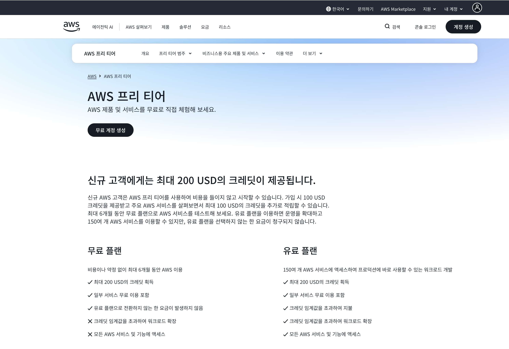

화면 중앙의 **"무료 계정 생성"** 검은 버튼을 클릭합니다.

> 💡 페이지 하단에 **"신규 고객에게는 최대 200 USD의 크레딧이 제공됩니다"** 안내가 보입니다.
> 무료 플랜과 유료 플랜 비교가 표시되는데, **이 수업에서는 무료 플랜(Free Plan)** 을 선택할 예정입니다.

> 🌐 **페이지가 영어로만 표시되면**: 페이지 **하단 우측**의 언어 드롭다운에서 "한국어" 선택. 일부 화면은 영어로 남을 수 있습니다.

---

<a id="step1"></a>

## 4. Step 1. 가입 진입 (로그인 화면) [↑](#toc)

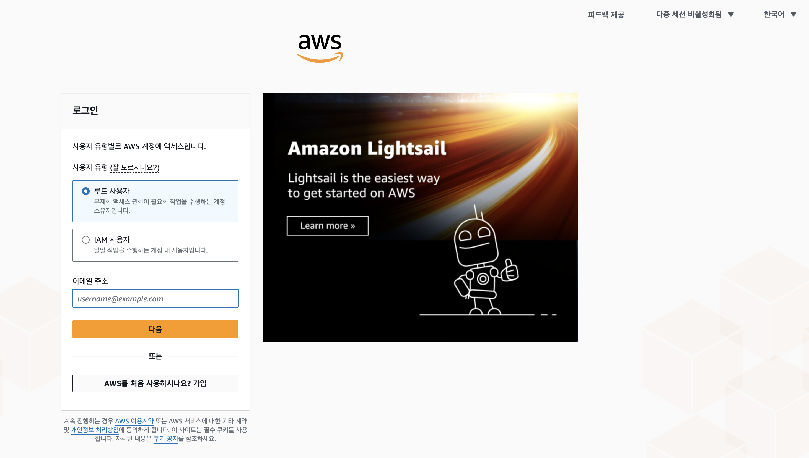

로그인 화면이 뜨더라도 당황하지 마세요. **하단의 흰색 버튼 "AWS를 처음 사용하시나요? 가입"** 을 클릭합니다.

| 보이는 항목 | 의미 | 이번에 선택할 것 |
|---|---|---|
| 루트 사용자 | 무제한 액세스 권한 | (해당 없음 — 가입 후 자동 적용) |
| IAM 사용자 | 일상 작업용 계정 | (해당 없음 — 첫 가입은 루트로) |
| **AWS를 처음 사용하시나요? 가입** | 신규 가입 진입 | ✅ **이 버튼 클릭** |

> ⚠️ **주의:** 위쪽의 "루트 사용자" 라디오 버튼과 이메일 입력란은 **이미 계정이 있는 사람용 로그인 화면**입니다.
> 처음 가입한다면 반드시 **하단 흰색 버튼**을 클릭하세요. (수강생들이 가장 자주 막히는 단계)

---

<a id="step2"></a>

## 5. Step 2. 이메일·계정 이름 입력 [↑](#toc)

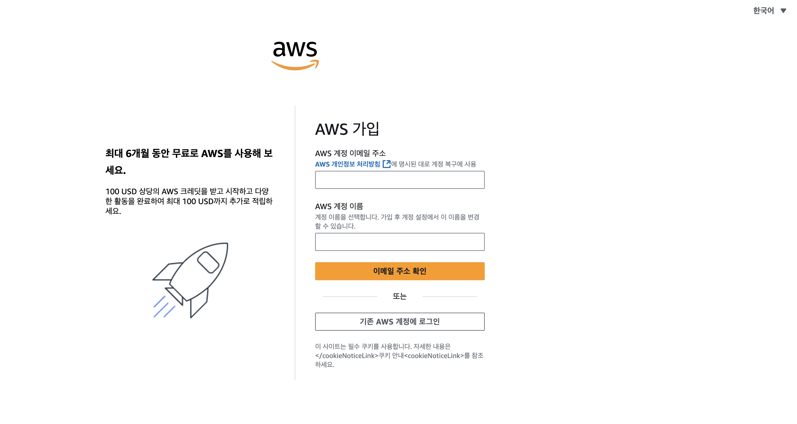

좌측 안내문구: **"최대 6개월 동안 무료로 AWS를 사용해 보세요. 100 USD 상당의 AWS 크레딧을 받고 시작하고 다양한 활동을 완료하여 최대 100 USD까지 추가로 적립하세요."**

### 입력 항목

| 필드 | 설명 | 예시 |
|---|---|---|
| **AWS 계정 이메일 주소** | 로그인 ID 겸 비상 연락 채널 | `your-name@gmail.com` |
| **AWS 계정 이름** | 콘솔 표시용 별명 (가입 후 변경 가능) | `your-name-aws` |

입력 예시:

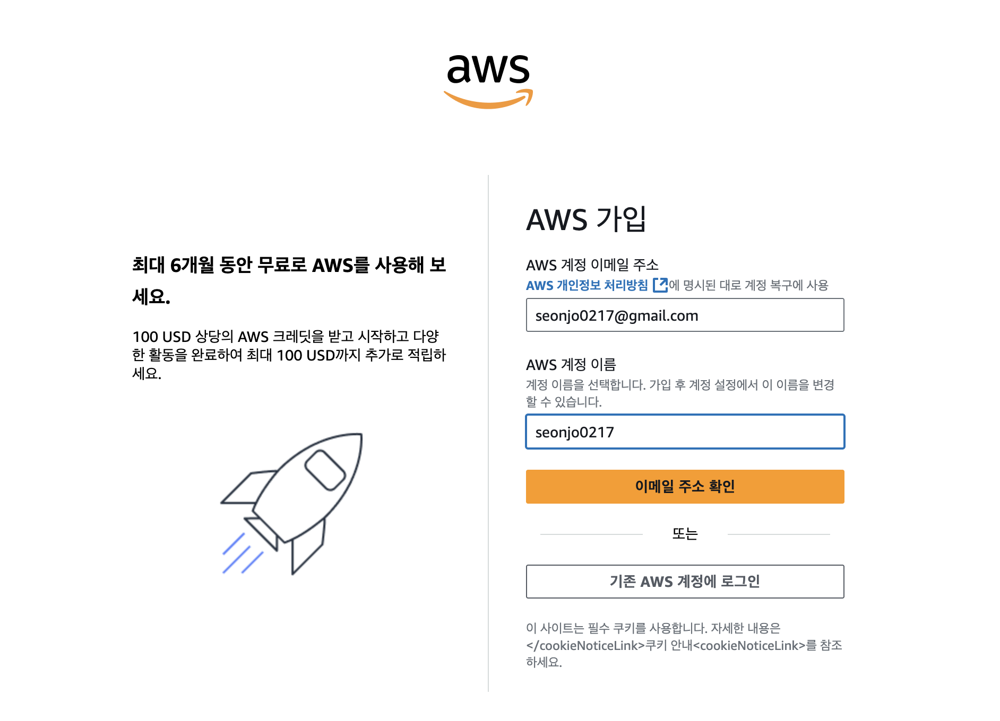

두 항목을 채운 뒤 주황색 **"이메일 주소 확인"** 버튼을 클릭합니다.

> ⚠️ **이미 다른 AWS 계정에 사용 중인 이메일은 사용할 수 없습니다.**
> "이미 사용된 이메일" 오류가 뜨면 다른 이메일로 시도하거나, 콘솔에서 비밀번호 재설정으로 기존 계정에 로그인하세요.

---

<a id="step3"></a>

## 6. Step 3. 이메일 인증 코드 발송 대기 [↑](#toc)

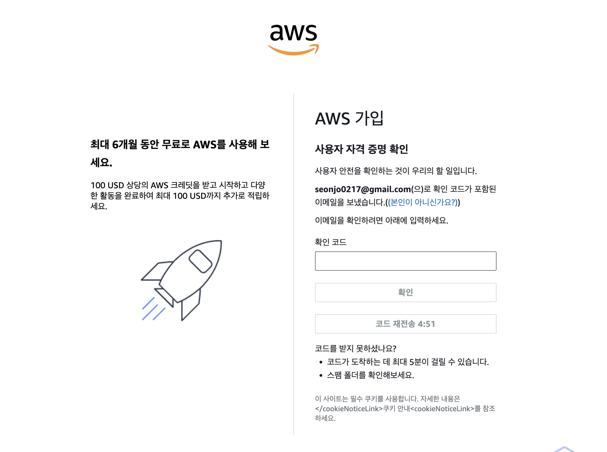

화면이 바뀌면서 **"사용자 자격 증명 확인"** 안내가 표시됩니다.

```
your-name@gmail.com(으)로 확인 코드가 포함된 이메일을 보냈습니다.
이메일을 확인하려면 아래에 입력하세요.
```

- 화면 하단에 **카운트다운 타이머**(예: `4:51`)가 시작됩니다.
- **5분 안에 인증 메일이 도착**하지 않으면 "코드 재전송" 버튼을 사용하세요.
- **스팸함**도 함께 확인합니다 (발송자: `no-reply@signup.aws`).

---

<a id="step4"></a>

## 7. Step 4. 이메일에서 인증 코드 확인 [↑](#toc)

이메일을 열면 **6자리 인증 코드**가 큰 글씨로 표시됩니다.

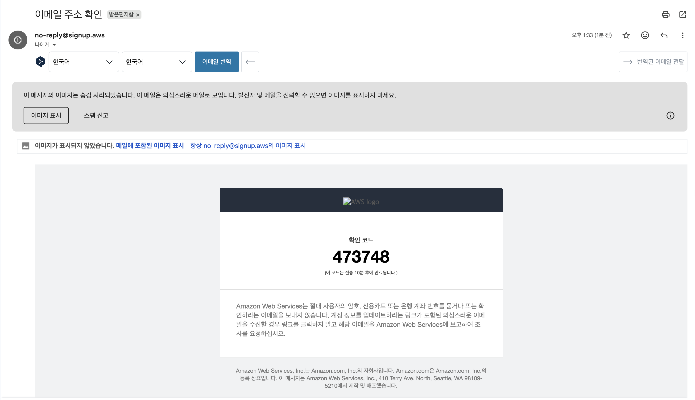

```
확인 코드
473748
(이 코드는 10분 후에 만료됩니다.)
```

- 발송자: `no-reply@signup.aws`
- 제목: "이메일 주소 확인"
- 코드는 **10분 동안만 유효**합니다.

> ⚠️ Gmail 등에서 "이미지가 표시되지 않습니다" 경고가 떠도 **인증 코드 자체는 텍스트로 보입니다.** 이미지 차단 무시하고 코드만 복사하면 됩니다.

> 🛡️ **보안 팁:** AWS는 절대 사용자에게 비밀번호·신용카드·계좌번호를 이메일이나 링크로 요구하지 않습니다. 본문에 그런 안내가 있다면 **피싱**입니다.

---

<a id="step5"></a>

## 8. Step 5. 인증 코드 입력 [↑](#toc)

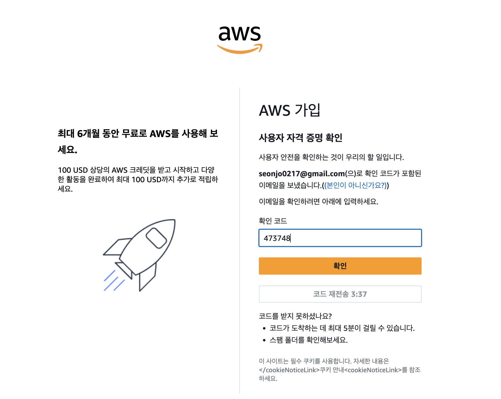

원래 가입 창으로 돌아와 **6자리 코드를 그대로 입력**한 뒤 주황색 **"확인"** 버튼을 누릅니다.

> 💡 이메일에서 코드를 **복사 → 붙여넣기**할 때 앞뒤 공백이 함께 복사되지 않도록 주의하세요.

---

<a id="step6"></a>

## 9. Step 6. 루트 비밀번호 생성 [↑](#toc)

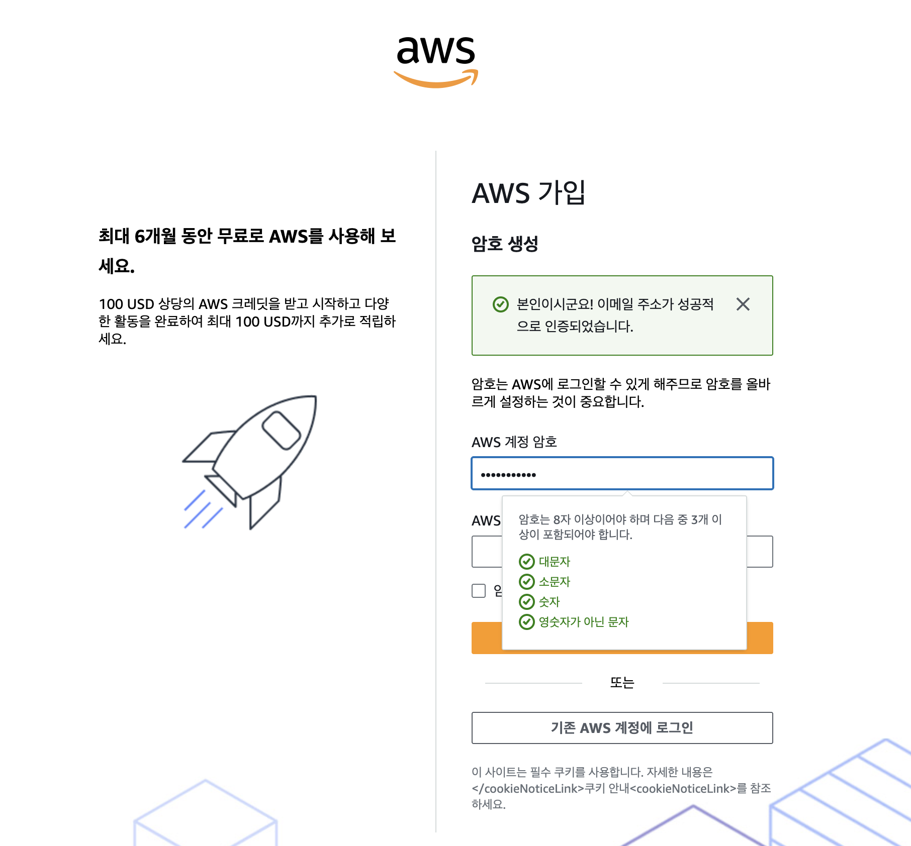

상단에 녹색 체크와 함께 **"본인이시군요! 이메일 주소가 성공적으로 인증되었습니다."** 메시지가 뜹니다.

이제 **AWS 계정 암호**(루트 비밀번호)를 설정합니다.

### 비밀번호 요건 (AWS 정책)

- 최소 **8자**, 최대 **64자**
- 다음 4종류 중 **3종류 이상** 포함:
  - ✅ 영어 대문자 (A~Z)
  - ✅ 영어 소문자 (a~z)
  - ✅ 숫자 (0~9)
  - ✅ 특수문자 (`!@#$%^&*()` 등)
- 이메일 주소나 계정 이름과 동일하면 안 됨

### 좋은 비밀번호 예시

```
✅ Cloud2026!aws        (소문자+대문자+숫자+특수문자)
✅ MyFirstAWS#2026      (좋음)
❌ password123          (너무 단순)
❌ aws                  (8자 미만)
```

> 🔐 **루트 비밀번호는 마스터키**입니다. 분실하면 계정 전체에 접근할 수 없습니다.
> **비밀번호 매니저(1Password / Bitwarden 등)에 즉시 저장**하는 것을 강력히 권장합니다.
> 가입 직후 **MFA(다단계 인증) 설정**을 완료하세요 (본 부록 마지막 [가입 후 즉시 할 일](#after) 참고).

비밀번호 입력 후 주황색 **"계속"** 버튼을 클릭합니다.

---

<a id="step7"></a>

## 10. Step 7. ⭐ Free Plan(무료 6개월) 선택 [↑](#toc)

> ⚠️ **이 수업에서 가장 중요한 단계입니다.**
> 2025년 7월 15일 이후 신규 가입자에게만 표시됩니다.

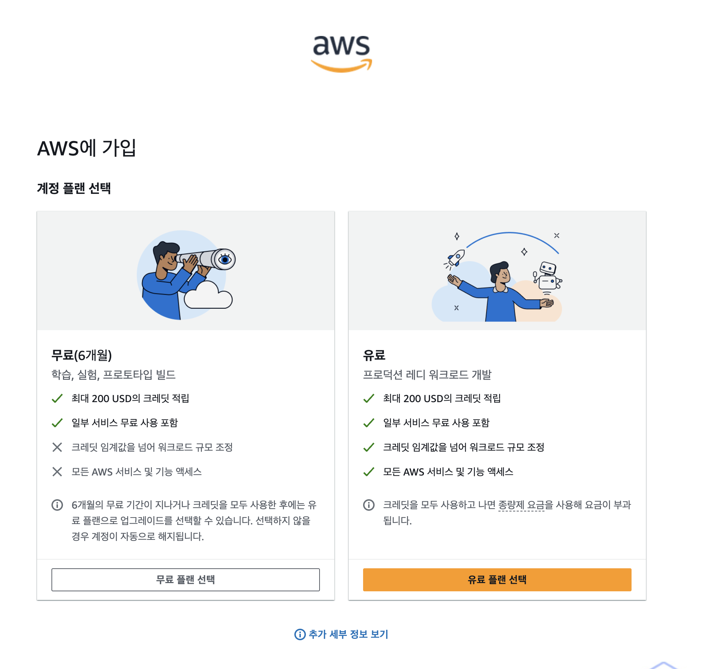

화면에 두 가지 카드가 나란히 표시됩니다.

### Free Plan vs Paid Plan 상세 비교

| 항목 | **Free Plan** | Paid Plan |
|---|---|---|
| 표제 | 무료(6개월) | 유료 |
| 사인업 크레딧 | $100 즉시 지급 | $100 즉시 지급 |
| 추가 크레딧 | 활동 시 최대 $100 (총 $200) | 활동 시 최대 $100 (총 $200) |
| 사용 가능 서비스 | 일부 서비스로 제한 | 모든 AWS 서비스 |
| 크레딧 소진 후 동작 | **계정 종료 절차 진입** (무료 플랜 기간에는 요금 청구 없음) | 종량제 요금으로 자동 전환 (요금 발생) |
| 6개월 후 동작 | Free Plan 종료, 90일 내 Paid Plan 업그레이드 가능 | 정상 유지 (계속 청구) |
| 권장 | ✅ **이 수업 + 처음 학습자** | ❌ 실무·익숙한 사용자 |

**좌측 흰색 "무료 플랜 선택" 버튼**을 클릭합니다.

> 🟢 무료 플랜의 장점: 무료 플랜 기간에는 요금이 청구되지 않고, 6개월 또는 크레딧 소진 시 계정 종료 절차로 들어갑니다. 계속 사용하려면 90일 안에 Paid Plan으로 업그레이드해야 합니다.
>
> ⚠️ 직접 Paid Plan으로 전환하거나 AWS Organizations 가입 등 자동 업그레이드 조건에 해당하면 종량제 과금이 발생할 수 있습니다.

> 🔴 유료 플랜을 잘못 선택하면: 크레딧 소진 직후부터 종량제 요금이 카드로 청구됩니다.

---

<a id="step8"></a>

## 11. Step 8. 연락처 정보 입력 [↑](#toc)

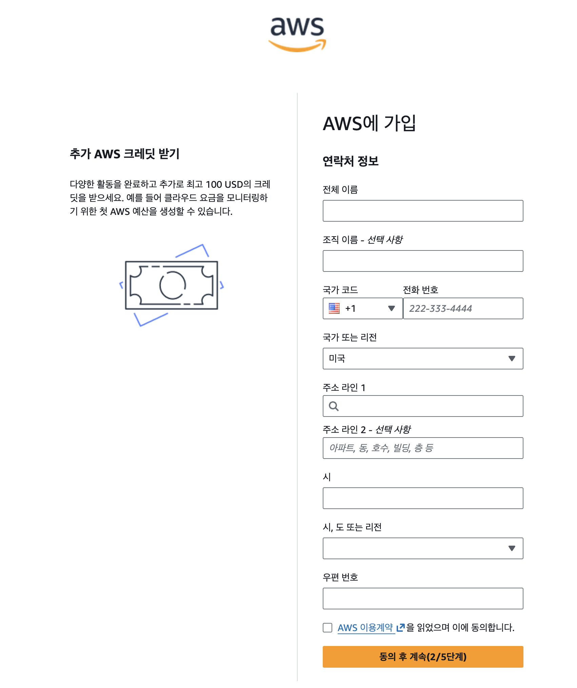

기본값이 **국가 코드 +1 (미국)** 으로 되어 있습니다. **반드시 한국으로 변경**하세요.

### 사용 용도 선택 (별도 화면에서 표시될 수 있음)

| 옵션 | 선택 시점 |
|---|---|
| **개인(Personal)** | ✅ 수업용은 이쪽 선택 |
| 비즈니스(Business) | 회사 명의로 가입할 때 |

> 💡 두 옵션의 기능 차이는 거의 없습니다. 개인으로 가입했다가 나중에 비즈니스로 변경 가능합니다.

### 입력 예시 (한국)

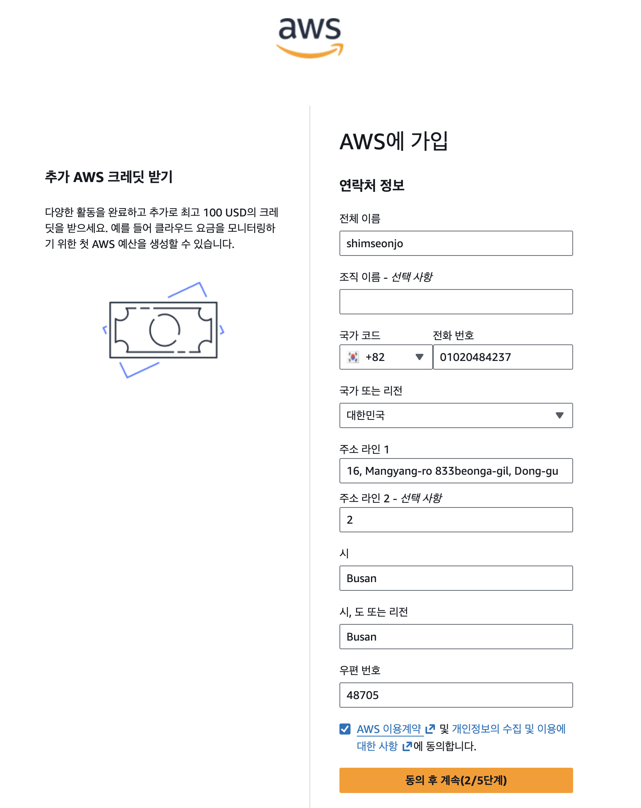

| 필드 | 입력 가이드 | 예시 |
|---|---|---|
| 전체 이름 | 영문 이름 (여권 표기 권장, **카드 명의와 일치**) | `Hong Gildong` |
| 조직 이름 | (선택) 비워둬도 OK | — |
| 국가 코드 | **+82** 로 변경 | 🇰🇷 +82 |
| 전화 번호 | 한국 휴대폰 (선행 0 포함/제외 모두 가능) | `01012345678` |
| 국가 또는 리전 | **대한민국** | 대한민국 |
| 주소 라인 1 | 영문 도로명 주소 | `16, Mangyang-ro 833beonga-gil, Dong-gu` |
| 주소 라인 2 | 동·호수 (선택) | `2` |
| 시 (City) | 영문 도시명 | `Busan` |
| 시·도 또는 리전 | 영문 시·도 | `Busan` |
| 우편 번호 | 5자리 우편번호 | `48705` |

> 📝 **영문 주소 변환**: 우체국 영문 주소 변환기(`https://www.epost.go.kr` → 영문주소 변환) 또는 네이버 "영문 주소 변환" 검색.

하단 **"AWS 이용계약 및 개인정보의 수집 및 이용에 대한 사항에 동의합니다"** 체크박스를 체크하고 주황색 **"동의 후 계속(2/5단계)"** 버튼을 클릭합니다.

---

<a id="step9"></a>

## 12. Step 9. 결제 정보 입력 (본인 인증) [↑](#toc)

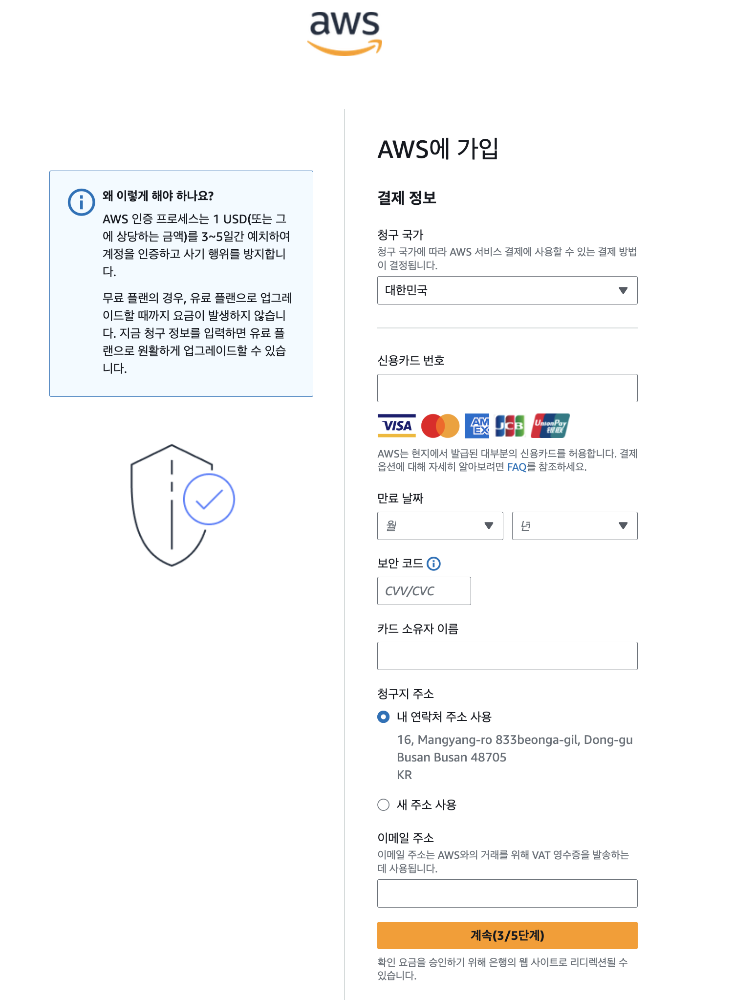

> ℹ️ 좌측 안내: **"왜 이렇게 해야 하나요? AWS 인증 프로세스는 1 USD까지의 금액을 3~5일간 예치하여 계정을 인증하고자 임시로 청구합니다. 무료 플랜의 경우, 유료 플랜으로 업그레이드할 때까지 요금이 발생하지 않습니다."**

### 입력 항목

| 필드 | 설명 |
|---|---|
| 청구 국가 | **대한민국** 선택 |
| 신용카드 번호 | 16자리 (공백 없이) |
| 만료 날짜 | MM / YY |
| 보안 코드 | CVV/CVC (카드 뒷면 3자리) |
| 카드 소유자 이름 | **카드에 새겨진 영문 이름 그대로** |
| 청구지 주소 | **"내 연락처 주소 사용"** 체크하면 8단계 주소 자동 입력 |
| 이메일 주소 (선택) | VAT 영수증 받을 이메일 |

### 인증 결제 안내

```
- $1 (약 1,500원) 인증 결제가 일시 발생합니다
- 인증이 끝나면 즉시 자동 환불됩니다
- 카드사 명세서에 "AWS"로 며칠간 표시될 수 있습니다
- 환불은 보통 3~7일 내에 카드사 시스템에 반영됩니다
```

> 💳 **카드 인증 안내**
> - 본인 인증 목적이며, **Free Plan을 유지하는 동안에는 요금이 청구되지 않습니다.** 계속 사용하려고 Paid Plan으로 전환하면 이후 종량제 과금이 발생할 수 있습니다.
> - **체크카드도 가능**하지만 잔액 부족·해외결제 차단 시 인증 실패합니다.
> - 일부 카드사는 **해외 결제 차단**이 기본값. 카드사 앱에서 "해외 결제 허용" 확인.
> - 비자/마스터/JCB 권장 (BC 단독 카드는 불가할 수 있음)

주황색 **"계속(3/5단계)"** 버튼 클릭.

---

<a id="step10"></a>

## 13. Step 10. 카드 정보 입력 (한국 결제대행) [↑](#toc)

한국 카드의 경우 **국내 결제대행사 페이지**로 리다이렉트됩니다.

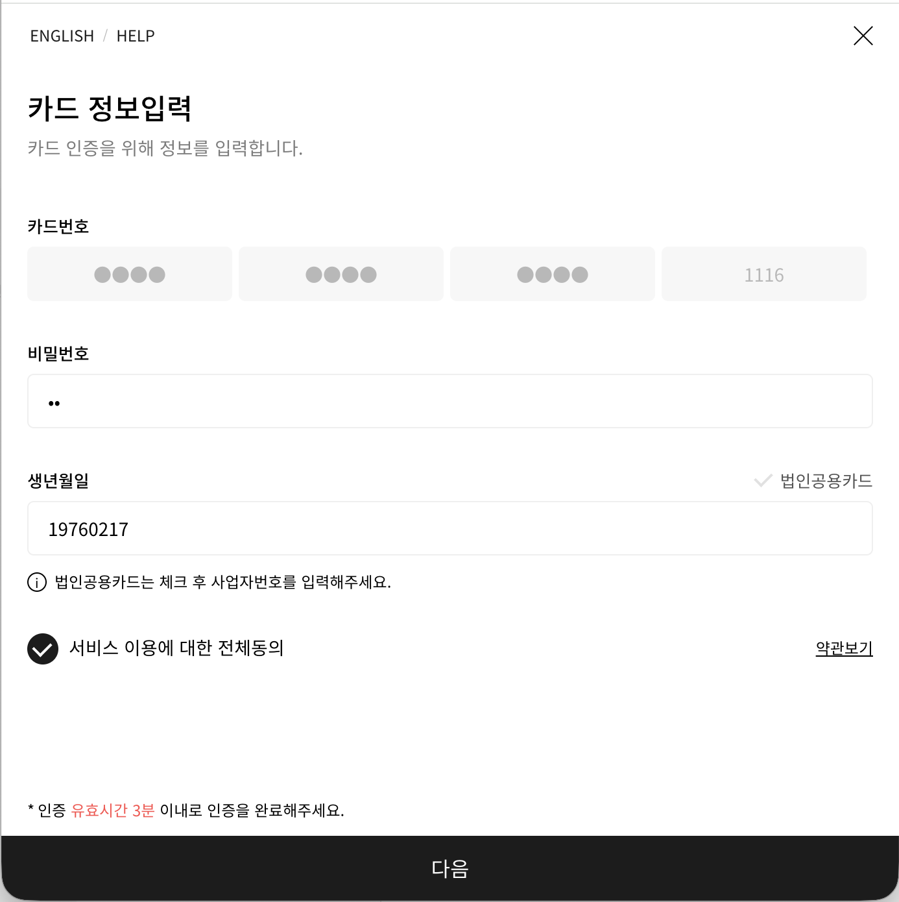

### 입력 항목

| 필드 | 설명 |
|---|---|
| 카드번호 | 16자리 카드번호 (마지막 4자리 자동 채움) |
| 비밀번호 | 카드 비밀번호 **앞 2자리** |
| 생년월일 | YYYYMMDD 8자리 (개인) / 사업자번호 (법인) |
| 서비스 이용에 대한 전체동의 | 체크박스 ✅ |

> ⏰ **인증 유효시간 3분** — 화면 하단의 빨간 글씨로 카운트다운이 표시됩니다. 3분 안에 모두 입력하지 못하면 처음부터 다시 시도해야 합니다.

> 🔒 **법인공용카드 사용 시:** 우측 상단 "법인공용카드" 체크 후 사업자번호 입력. 개인 학습용은 체크하지 마세요.

검은 **"다음"** 버튼을 클릭하면 카드사 추가 인증(ARS·앱 인증 등)이 진행될 수 있습니다.

---

<a id="step11"></a>

## 14. Step 11. 계정 설정 진행 중 + 휴대폰/지원 플랜 [↑](#toc)

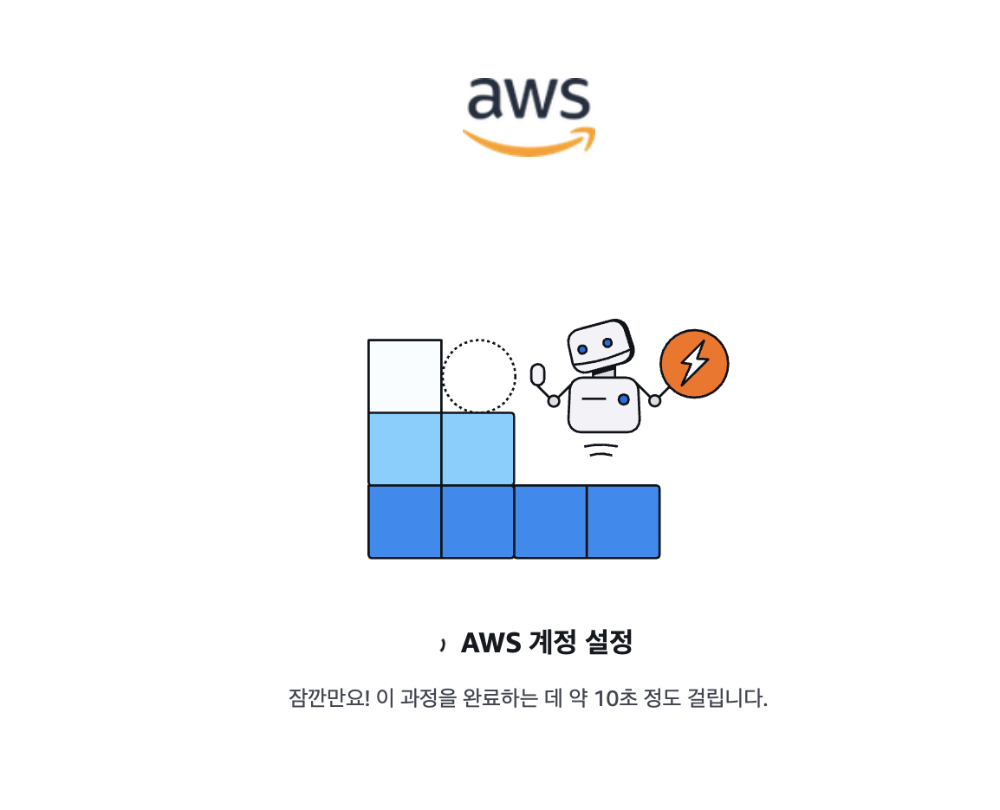

귀여운 로봇 일러스트와 함께 **"AWS 계정 설정 — 잠깐만요! 이 과정을 완료하는 데 약 10초 정도 걸립니다."** 안내가 표시됩니다.

> ⏳ **실제로는 1~3분** 정도 걸리는 경우가 많습니다. 화면을 닫지 말고 기다리세요.
> 5분 이상 멈춰있다면 새로고침하지 말고 **AWS 콘솔(https://console.aws.amazon.com)** 에 직접 로그인해 보세요. 활성화가 이미 끝났을 수 있습니다.

이 단계에서 **휴대폰 본인 인증**과 **지원 플랜 선택**이 함께 안내됩니다.

### 📱 휴대폰 본인 인증

| 인증 방법 | 설명 |
|---|---|
| **문자 메시지(SMS)** | ✅ 일반적으로 빠르고 편함 |
| 음성 통화(Voice call) | 자동 음성으로 코드 안내 |

| 입력 항목 | 입력 |
|---|---|
| 국가 코드 | `+82 (대한민국)` |
| 휴대폰 번호 | `01012345678` (앞자리 0 생략 가능) |
| 보안 검사(CAPTCHA) | 화면에 표시된 문자 입력 |

→ **"SMS 보내기(Send SMS)"** 클릭 → 4자리 코드 도착 → 입력 → **"계속"**.

> 📵 **30초 이내에 SMS가 안 오면**: "코드 다시 보내기" → 안 오면 "음성 통화" 방식으로 변경.

### 🛠 지원 플랜 선택

| 옵션 | 월 요금 | 선택 |
|---|---|---|
| **기본 지원(Basic Support) — 무료** | $0 | ✅ 이 수업은 이쪽 |
| 개발자 지원(Developer) | $29~ | ❌ 수업 후 검토 |
| 비즈니스 지원(Business) | $100~ | ❌ |
| Enterprise 지원 | $5,500~ | ❌ |

> ⚠️ 반드시 **"기본 지원 - 무료"**를 선택하세요. 다른 플랜은 매월 요금이 청구됩니다.

→ **"가입 완료(Complete sign up)"** 클릭

---

<a id="step12"></a>

## 15. Step 12. 🎉 가입 완료 [↑](#toc)

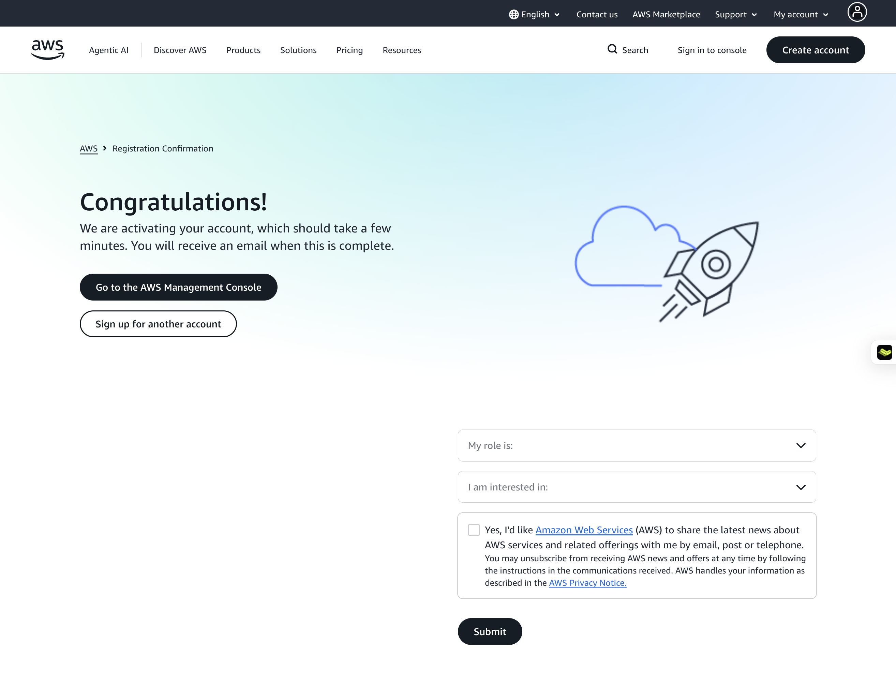

다음 화면이 보이면 가입 성공입니다.

```
Congratulations!
We are activating your account, which should take a few minutes.
You will receive an email when this is complete.
```

### 다음 행동

1. **"Go to the AWS Management Console"** 검은 버튼 클릭
2. 가입 시 사용한 **이메일과 비밀번호로 로그인** (`https://console.aws.amazon.com`)
3. 화면 우측 상단에서 **리전을 "서울(ap-northeast-2)"로 변경**
   ```
   우측 상단 드롭다운 클릭
   → "아시아 태평양(Asia Pacific)" 섹션
   → "서울 ap-northeast-2(Seoul)" 선택
   ```
4. 본 부록 [가입 후 즉시 할 일](#after) 진행

> ⚠️ **리전을 빠뜨리면** 04장에서 EC2를 만들었을 때 다른 리전에서 만들어져 "인스턴스가 안 보여요" 오류로 이어집니다. 반드시 **서울**로 설정하세요.

> 📧 **활성화 완료 이메일**이 가입 이메일로 도착합니다. 이메일이 와야 EC2 등 일부 서비스가 정상 동작합니다.
> 일반적으로 5~30분 이내 도착. 1시간 이상 안 오면 AWS Support에 문의 가능합니다.

> 💡 화면 하단에 **"My role is" / "I am interested in"** 같은 설문이 보이는데, 적당히 채워서 Submit하거나 그냥 페이지를 닫아도 가입에는 영향이 없습니다.

---

<a id="after"></a>

## 16. 가입 후 즉시 할 일 3가지 [↑](#toc)

가입은 끝났지만, **계정을 안전하게 사용하려면 가입 직후에 반드시 해야 할 3가지**가 있습니다. 이 3가지가 없으면 (1) 의도치 않게 발생한 과금을 모르고 지나치거나, (2) 비밀번호 유출만으로 계정이 탈취되는 사고가 일어날 수 있습니다.

> 🎤 **수업 진행 안내**: 본 §16의 ①·②는 03장 §2에서 더 상세히 함께 진행합니다. ③ MFA는 **수업 중 본 §16-A를 따라 즉시 설정**해야 합니다 (AWS 정책상 35일 의무).

### 3가지 통합 효과

| 항목 | 무엇을 막아주나 |
|:---|:---|
| ① Free Tier 사용량 알림 | 무료 한도 **85% 도달 사전 경고** → 한도 초과 전 사용량 조정 |
| ② Zero-Spend Budget | $0.01이라도 **과금 발생 시 즉시 알림** → 빠른 원인 추적 |
| ③ MFA (필수) | **루트 계정 탈취 차단** → 비밀번호 유출돼도 계정 안전 |

> ⚠️ **3가지 모두 "알림"이며 "차단"이 아닙니다.** 실제로 과금을 멈추거나 로그인을 막아주는 게 아니라, 사고 발생 시 빠르게 인지하도록 도와줍니다. 알림을 받으면 **즉시 콘솔에서 직접 확인·조치**해야 합니다.

---

### ① Free Tier 사용량 알림 켜기

**무엇인가**

Free Plan의 서비스별 무료 한도 중 **85%를 사용하면 AWS가 자동으로 이메일 알림**을 발송합니다. 신규 계정 대부분 자동으로 활성화되어 있으나, 이메일 주소가 정확한지 확인이 필요합니다.

**왜 필요한가**

본인도 모르게 무료 한도를 초과하면 그 시점부터 종량제 과금이 시작됩니다. 85% 알림을 받아두면 **한도 초과 전에 사용량을 줄이거나 리소스를 정리**할 시간이 생깁니다.

**설정 방법**

```
콘솔 검색창에 "Billing" 입력 → Billing and Cost Management
→ 왼쪽 메뉴 "Billing preferences"
→ "Alert preferences" 섹션 → "Edit" 클릭
→ "Receive AWS Free Tier usage alerts" 옵션 선택
→ 이메일 주소 입력 → "Update" 클릭
```

**효과·한계**

- ✅ 한도 85% 도달 시 자동 이메일
- ⚠️ 한도 초과를 **차단하지 않습니다.** 알림을 무시하면 초과분 과금
- ⚠️ 알림은 일별 집계 기준이라 **수 시간 지연** 가능

---

### ② Zero-Spend Budget 만들기

**무엇인가**

실제 비용이 **$0.01이라도 발생하면 이메일 알림**을 보내는 예산(Budget)입니다.

**왜 필요한가**

Free Plan 범위 밖의 서비스를 실수로 사용하거나, 무료 한도를 초과하면 즉시 과금됩니다. ① Free Tier 알림은 한도 85% 시점만 알려주므로, **"한 푼이라도 청구되면 알림"이 되는 안전망**이 따로 필요합니다.

**설정 방법**

```
콘솔 검색창에 "Budgets" 입력 → AWS Budgets
→ "예산 생성(Create budget)"
→ 템플릿: "Zero spend budget" 선택
→ 이름: my-zero-budget
→ 이메일 수신자: 본인 이메일
→ "예산 생성"
```

**효과·한계**

- ✅ $0.01 이상 과금 발생 시 자동 이메일 (Free Plan 종료 후 안전망)
- ⚠️ **알림이며 차단이 아닙니다.** 과금을 자동으로 멈추지 않음
- ⚠️ AWS Budgets는 하루 최대 3회(약 8~12시간 간격) 업데이트되므로 **알림이 수 시간 지연**될 수 있음
- ⚠️ 알림 받으면 **즉시 Cost Explorer**로 어떤 서비스가 비용을 만들었는지 확인 필요

> 💡 **고급 옵션**: AWS Budgets에는 임계값 도달 시 EC2/RDS를 자동 Stop·Terminate하는 **Budget Actions(차단)** 기능도 있습니다 (2024년 출시). 이 수업 범위 밖이지만 [공식 문서](https://docs.aws.amazon.com/cost-management/latest/userguide/budgets-controls.html)를 참고해 보세요.

---

### ③ MFA (다단계 인증) 설정 — **필수**

**무엇인가**

비밀번호 외에 **스마트폰 인증 앱이 생성하는 6자리 코드를 추가로 요구**하는 이중 잠금. 비유하자면 **"현관 자물쇠(비밀번호) + 지문 인식(MFA)"**입니다.

**왜 필요한가**

AWS 루트 계정이 탈취되면 공격자가 고성능 GPU 서버를 수십 대 생성해 암호화폐 채굴에 사용하고, **며칠 만에 수백~수천만 원의 요금이 청구**되는 사례가 실제 보고됩니다. MFA는 이런 사고를 막는 가장 효과적인 첫 방어선입니다.

또한 AWS는 **2024년부터 모든 계정의 루트 사용자에게 MFA 등록을 의무화**했습니다. 가입 후 **35일 이내 MFA를 등록하지 않으면 콘솔 접근이 차단**됩니다 (aws017.png 화면에 "35일 이내 등록" 경고가 직접 표시됨).

**설정 방법**

설정 절차는 비전공자에게 익숙하지 않을 수 있어, 단계별 가이드를 별도 섹션으로 분리했습니다.

→ **[§17. MFA 단계별 설정 가이드](#mfa-guide)** (이미지 포함, 약 5~10분)

**효과·한계**

- ✅ 비밀번호 유출돼도 30초마다 바뀌는 일회용 코드 없이는 로그인 불가
- ✅ AWS 루트 계정 탈취 가능성을 사실상 0에 가깝게 차단
- ⚠️ **스마트폰 분실 시 복구 절차** 필요 (이메일·전화번호 인증)
- ⚠️ 코드 입력 시간 30초 제한 — 시계 동기화 필요

---

<a id="mfa-guide"></a>

## 17. MFA 단계별 설정 가이드 [↑](#toc)

> ⏱ **예상 소요 시간**: 5~10분 (인증 앱 설치 포함)
>
> 📱 **준비물**: 스마트폰 (Android 또는 iOS), 카메라 권한

### 1. AWS의 MFA 4가지 종류

| 종류 | 보안 강도 | 편의성 | 비용 | 본 수업 권장 |
|:---|:---:|:---:|:---:|:---:|
| **패스키 (Passkey)** | ⭐⭐⭐⭐⭐ (피싱 방지) | 높음 (생체 인증) | 무료 | 가능하면 추천 |
| **인증 앱 (TOTP)** | ⭐⭐⭐⭐ | 높음 | 무료 | ✅ **이 수업 기본 선택** |
| **FIDO2 보안 키** | ⭐⭐⭐⭐⭐ (피싱 방지) | 보통 (물리 기기) | $25~$70 | 선택 |
| **하드웨어 TOTP 토큰** | ⭐⭐⭐⭐ | 낮음 (별도 기기) | $15~$40 | 비권장 |

> 💡 AWS는 **피싱 방지 능력이 있는 패스키/보안 키를 최우선 권장**합니다. 다만 본 수업은 추가 비용 없이 휴대폰만으로 설정 가능한 **인증 앱**을 기본으로 사용합니다.
>
> 📌 루트 사용자당 **최대 8개의 MFA 디바이스**를 등록할 수 있습니다. 분실에 대비해 **2개 이상(예: 폰 + 태블릿)** 등록을 권장합니다.

> 🤔 **왜 패스키가 아닌 인증 앱을 기본으로 선택했나요?**
>
> 보안 강도만 보면 패스키가 더 우수합니다(피싱 방지). 다만 본 수업이 인증 앱(TOTP)을 기본으로 채택한 이유는:
>
> 1. **환경 의존성** — 패스키는 Touch ID·Face ID·Windows Hello 같은 **OS 생체 인증** 또는 별도 보안 키가 필요합니다. 수강생의 노트북·폰이 Mac·Windows·iOS·Android로 제각각이면 강사가 환경별로 다른 안내를 해야 합니다.
> 2. **저장소 선택 부담** — 패스키는 iCloud 키체인·Google Password Manager·1Password·Bitwarden 중 어디에 저장할지 사용자가 직접 골라야 합니다. 비전공자에게는 결정이 어렵고, 잘못 고르면 기기 변경 시 복구가 막힙니다.
> 3. **이식성·복구 표준화** — 인증 앱(TOTP)은 표준 기술(RFC 6238)이라 같은 QR을 어떤 앱(Google Authenticator·Microsoft Authenticator·Authy·1Password 등)에 스캔해도 동일하게 작동합니다. 패스키는 저장소에 종속되어 이동·복구 절차가 환경별로 다릅니다.
> 4. **학습 전이 효과** — 인증 앱은 GitHub·Google·Naver·Discord 등 100+ 서비스에서 동일하게 쓸 수 있어, 본 수업에서 배운 흐름을 다른 계정에도 즉시 적용 가능합니다.
> 5. **보안 원리 가시성** — "30초마다 새 코드"라는 시간 기반 일회용 코드 동작이 직관적이라 MFA 개념 학습에 유리합니다.
> 6. **수업 운영 일관성** — 모든 수강생이 같은 Authenticator 화면을 보며 강사가 통합 진행할 수 있습니다.
>
> ✅ **패스키가 더 좋은 시나리오**: 개인 학습자가 Mac/iPhone(또는 Windows 11 + Hello) 단일 환경에서 사용하거나, 1Password/Bitwarden을 이미 쓰고 있다면 §17 §4에서 "인증 앱" 대신 "패스키 또는 보안 키" 옵션을 선택하세요.

### 2. 인증 앱 설치 (스마트폰)

| OS | 권장 앱 | 설치 방법 |
|:---|:---|:---|
| **Android** | Google Authenticator | Play 스토어 → "Google Authenticator" 검색 → 설치 |
| **iOS** | Google Authenticator | App Store → "Google Authenticator" 검색 → 설치 |
| **대안 앱** | Microsoft Authenticator, Duo Mobile | 동일 방식 |

> ⚠️ 앱 설치 후 **카메라 권한을 허용**해야 QR 코드 스캔이 가능합니다. 첫 실행 시 권한 요청 팝업에서 "허용" 선택.

### 3. AWS 콘솔에서 MFA 등록 시작

콘솔에 로그인되어 있는 상태에서 진행합니다.

```
콘솔 우측 상단 계정 이름 클릭
→ "보안 자격 증명(Security credentials)" 클릭
→ "다단계 인증(MFA)" 섹션
→ "MFA 디바이스 할당(Assign MFA device)" 클릭
```

### 4. 디바이스 종류 선택 (인증 앱)

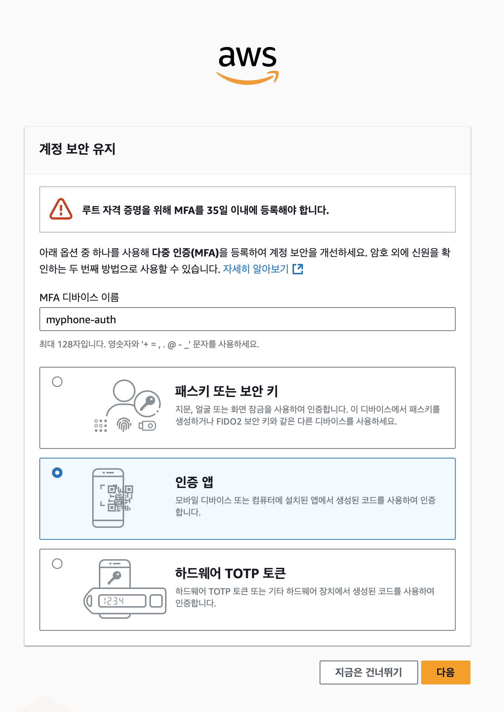

화면 상단에 **"루트 자격 증명을 위해 MFA를 35일 이내에 등록해야 합니다"** 경고가 표시됩니다.

| 입력 항목 | 입력값 | 설명 |
|:---|:---|:---|
| MFA 디바이스 이름 | `myphone-auth` | 알아보기 쉬운 이름 (영문, 최대 128자) |
| MFA 디바이스 종류 | **인증 앱** 선택 | 두 번째 옵션 |

> 💡 **"패스키 또는 보안 키"** 첫 번째 옵션은 생체 인증·물리 키 방식 (고급 사용자용).
> **"하드웨어 TOTP 토큰"** 세 번째 옵션은 별도 구매한 물리 기기를 사용하는 방식.

"다음(Next)" 클릭.

### 5. QR 코드 스캔 + 코드 2개 입력

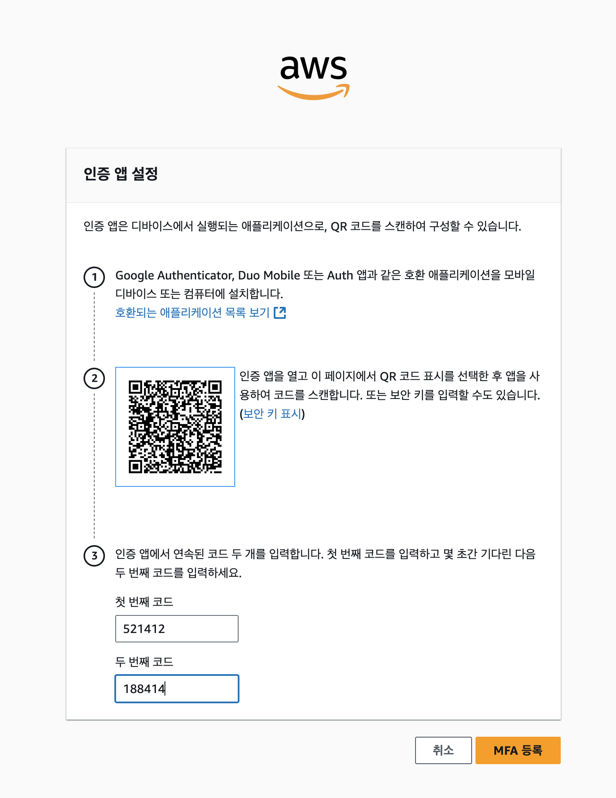

**Step A — 인증 앱에서 QR 코드 스캔**

1. 스마트폰에서 **Google Authenticator** 앱을 엽니다
2. 우측 하단 **`+` 버튼** → **"QR 코드 스캔"** 선택
3. 카메라를 PC 화면의 QR 코드에 비춥니다
4. 앱에 **"Amazon Web Services"** 또는 입력한 디바이스 이름이 자동 추가됩니다
5. 6자리 숫자가 표시됩니다 (30초마다 갱신)

> 💡 QR 코드 인식이 안 되면 화면 밝기를 높이거나, "보안 키 표시"를 클릭해 텍스트 키를 앱에 직접 입력하세요.

**Step B — 코드 2개 입력**

```
첫 번째 코드: 앱에 현재 표시된 6자리 코드 입력
→ 30초 기다려서 코드가 갱신될 때까지 대기
→ 두 번째 코드: 새로 갱신된 6자리 코드 입력
→ "MFA 등록(Add MFA)" 클릭
```

> 💡 **왜 코드를 2개 입력하나요?** 인증 앱은 시간 기반(TOTP)이라 PC와 폰의 시각이 동일해야 작동합니다. AWS는 연속된 두 코드를 받아 **시계 동기화 검증**을 수행합니다.
>
> ⚠️ 코드가 계속 틀린다고 나오면: 스마트폰 **설정 → 날짜/시간 → "자동으로 설정"** 켜기. PC 시간과 폰 시간이 맞지 않으면 코드가 계속 틀립니다.

### 6. 등록 완료 + 계정 복구 정보 점검

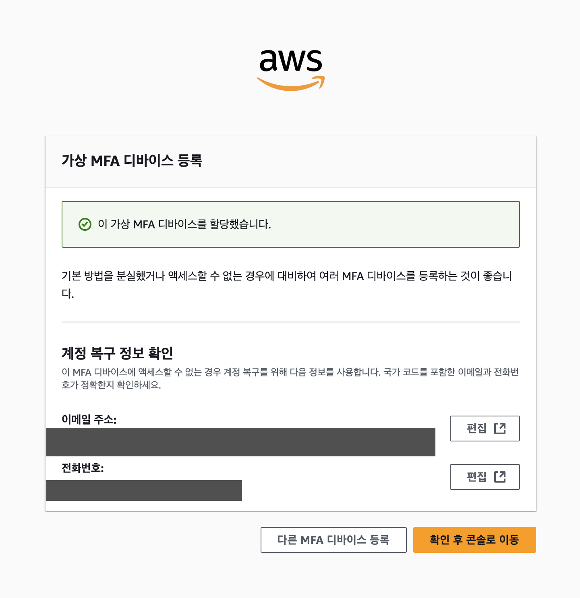

**"이 가상 MFA 디바이스를 할당했습니다"** 녹색 메시지가 보이면 등록 성공입니다.

화면 하단의 **"계정 복구 정보 확인"** 섹션에 표시된 **이메일 주소·전화번호가 정확한지 반드시 확인**하세요.

> 🔑 **이 이메일과 전화번호는 MFA 디바이스를 분실했을 때 유일한 복구 채널**입니다. 잘못된 정보가 입력되어 있으면 "편집(Edit)" 버튼으로 즉시 수정.

마지막으로 **"확인 후 콘솔로 이동"** 버튼을 클릭하면 MFA 설정이 완료됩니다.

### 7. MFA 분실·고장 시 복구 절차

스마트폰을 잃어버리거나, 인증 앱을 실수로 삭제했거나, 폰을 교체했을 때:

```
AWS 로그인 화면 → "MFA 문제 해결(Troubleshoot MFA)" 클릭
→ 등록된 이메일로 복구 링크 수신
→ 등록된 전화번호로 음성 인증
→ 인증 완료 → 기존 MFA 해제
→ 새 디바이스로 MFA 재등록
```

> ⚠️ **이메일과 전화번호 둘 다 접근 불가**한 상황: AWS Support에 직접 문의 (한국어 가능). 본인 확인 절차로 수일이 소요될 수 있습니다.
>
> 💡 **사전 예방**: 폰 교체·분실에 대비해 **태블릿이나 두 번째 폰에도 같은 인증 앱을 등록**해 두세요. AWS는 최대 8개 MFA 디바이스를 지원합니다.

### 8. MFA 등록 후 첫 로그인

다음번 로그인 시 비밀번호 입력 후 **6자리 MFA 코드 입력 화면**이 추가로 표시됩니다.

```
1. 이메일 입력 → 다음
2. 비밀번호 입력 → 로그인
3. 인증 앱에서 현재 6자리 코드 확인
4. 코드 입력 → 콘솔 진입
```

> 💡 매번 코드를 입력하는 게 번거로우면 IAM 사용자를 만들어 일상 작업에 사용하고, 루트 계정은 잠가두세요 (03장 §3 IAM 참고).

---

<a id="troubleshoot"></a>

## 18. 화면이 다르게 보일 때 — 트러블슈팅 [↑](#toc)

| 증상 | 원인 | 해결 |
|---|---|---|
| 가입 페이지가 영어로만 표시됨 | 언어 자동 감지 실패 | 페이지 **하단 우측** 언어 드롭다운 → "한국어" |
| 인증 메일이 안 옴 (5분 이상) | 스팸함 / 메일 서버 지연 | 스팸함 / Gmail "프로모션" 탭 확인 → "코드 재전송" → 다른 이메일 시도 |
| "이미 사용된 이메일" 오류 | 이전에 같은 이메일로 가입한 적 있음 | 다른 이메일로 가입 또는 [콘솔](https://console.aws.amazon.com)에서 비밀번호 재설정 |
| 카드 인증 실패 (`Card declined`) | 해외결제 차단 / 잔액 부족 / 카드 종류 미지원 | 카드사 앱에서 해외결제 허용 → 다른 카드 시도 (비자/마스터/JCB 권장) |
| SMS 인증 코드 안 옴 | 통신사 지연 / +82 누락 / 스팸 차단 | "음성 통화"로 전환 → 통신사 스팸 차단 해제 |
| "Congratulations" 화면이 안 뜨고 멈춤 | AWS 활성화 지연 | 5분 대기 → 콘솔 직접 로그인 시도 |
| 활성화 후 EC2 만들기 시 `Pending verification` | 신규 계정 검증 대기 | 30분~2시간 대기 후 재시도 |
| 가입 완료 메일 1시간 이상 안 옴 | 이메일 필터 / 활성화 지연 | AWS Support → "Account and Billing Support" 케이스 생성 |
| 가입은 됐는데 콘솔에 EC2가 안 보임 | 리전 미설정 / 활성화 미완 | 우측 상단 리전을 **"서울"**로 변경 → 5~10분 후 새로고침 |

### 카드 인증이 계속 실패할 때

| 메시지 | 원인 | 해결 |
|---|---|---|
| "결제를 처리할 수 없습니다" | 해외결제 차단 | 카드사에 해외결제 허용 요청 |
| "카드 정보를 확인하세요" | 번호/만료일/CVC 오타 | 카드 다시 확인 |
| "잔액 부족" | 체크카드 잔액 부족 | $1 이상 충전 후 재시도 |
| 거래 거부 | 카드사가 의심 거래로 판단 | 카드사 앱에서 거래 승인 또는 고객센터 연락 |

추가 시도:
1. 다른 카드(체크/신용 모두) 시도
2. 카드사 고객센터에 **"해외 가맹점 결제 허용"** 요청
3. **PayPal**로 결제 수단 등록 (가능한 경우)
4. AWS Support 채팅으로 문의 (한국어 가능)

### 가입 도중 페이지 닫혔을 때

이미 입력한 이메일로 **다시 가입 시도**하면 보통 마지막 단계부터 이어집니다.
완전히 새로 시작하려면 다른 이메일로 시도하거나 AWS Support에 미완성 계정 삭제 요청.

### 도움이 더 필요하면

- **AWS Support Center**: 콘솔 우측 상단 "Support" → "Support Center" → "Create case"
- 가입 단계 문제는 **Account and Billing Support**가 무료로 처리합니다 (한국어 가능).

---

<a id="glossary"></a>

## 19. 용어 미니 사전 [↑](#toc)

가입 화면에서 만나는 영어 용어를 한국어와 함께 정리했습니다.

| 영어 | 한국어 | 의미 |
|---|---|---|
| Root user | 루트 사용자 | 가입 시 만든 최상위 관리자 계정 |
| AWS Account | AWS 계정 | 가입한 결과로 만들어지는 단위 |
| Account name | 계정 이름 | 계정의 별명 (변경 가능) |
| Customer Agreement | 고객 동의(약관) | AWS 이용 약관 |
| Billing address | 청구지 주소 | 카드 청구서 발송 주소 |
| Verification | 본인 인증 | 카드/SMS로 본인 확인 |
| Support plan | 지원 플랜 | AWS 기술 지원 등급 |
| Free Plan | 프리 플랜 | 신규 가입자용 무료 플랜 (6개월 또는 크레딧 소진 시 종료 절차 진입) |
| Paid Plan | 페이드 플랜 | 종량제 (크레딧 소진 후 청구) |
| Credit | 크레딧 | 무료 사용량 ($1 = 1 크레딧) |
| Region | 리전 | 데이터센터가 있는 지역 (서울 = ap-northeast-2) |
| Console | 콘솔 | AWS 관리 웹 화면 |
| Budget | 버짓(예산) | 비용 한도 + 알림 설정 |
| MFA | 다단계 인증 | 비밀번호 + 휴대폰 코드로 이중 보안 |

---

<a id="selfcheck"></a>

## 20. ✅ 가입 완료 자가진단 [↑](#toc)

수업 다음 단계로 넘어가기 전 아래 항목을 모두 체크할 수 있어야 합니다.

**필수 — 03장 진행 전 완료**

- [ ] AWS 콘솔(`console.aws.amazon.com`)에 루트 사용자로 로그인할 수 있다
- [ ] 가입 시 **Free Plan**을 선택했다 (Paid Plan 아님)
- [ ] 결제 카드가 등록되어 있고, 가입 인증이 완료되었다
- [ ] **MFA를 등록했다** (§17 참고 — 35일 이내 의무)
- [ ] 가입 메일/비밀번호를 **비밀번호 매니저에 저장**했다

**권장 — 03장에서 함께 설정**

- [ ] 우측 상단의 리전이 **"서울 (ap-northeast-2)"** 로 표시된다
- [ ] Free Tier 사용량 알림 활성화
- [ ] Zero-Spend Budget 생성

위 필수 항목이 모두 체크되면 04장(EC2 생성)부터 막힘없이 진행할 수 있습니다.

---

## 다음 단계

가입이 완료되면 본 강의의 본문으로 돌아갑니다.

- **[01장 클라우드와 AWS 소개](/cloud/intro)** — 개념 복습
- **[03장 AWS 계정과 비용 관리](/cloud/account)** — 비용 알림(Budget) 설정 (수업에서 함께 진행)
- **[04장 EC2 인스턴스 생성과 접속](/cloud/ec2)** — 첫 가상 서버 만들기

---

> 💪 **가입을 마치셨다면, 첫 발을 뗀 것입니다!**
> 본 수업 03장에서 비용 알림과 IAM 개념을 마저 다룹니다. 수업에서 만나요.

---

[↑ 목차로](#toc)
