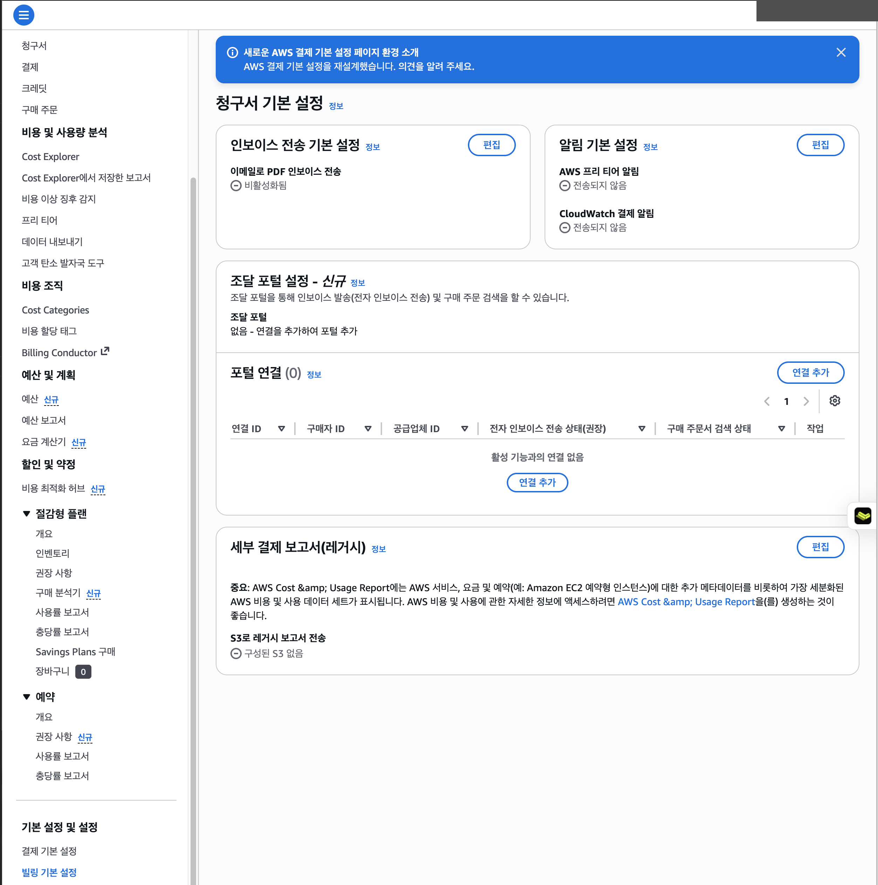
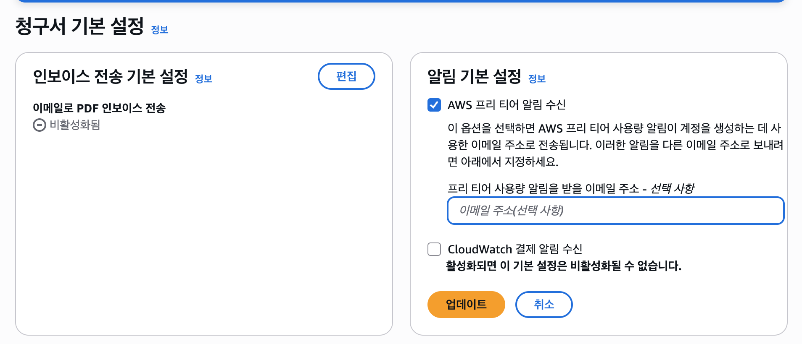
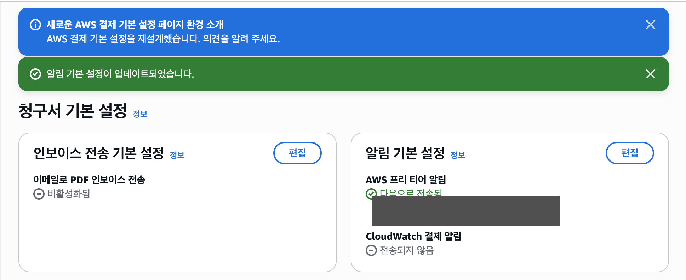
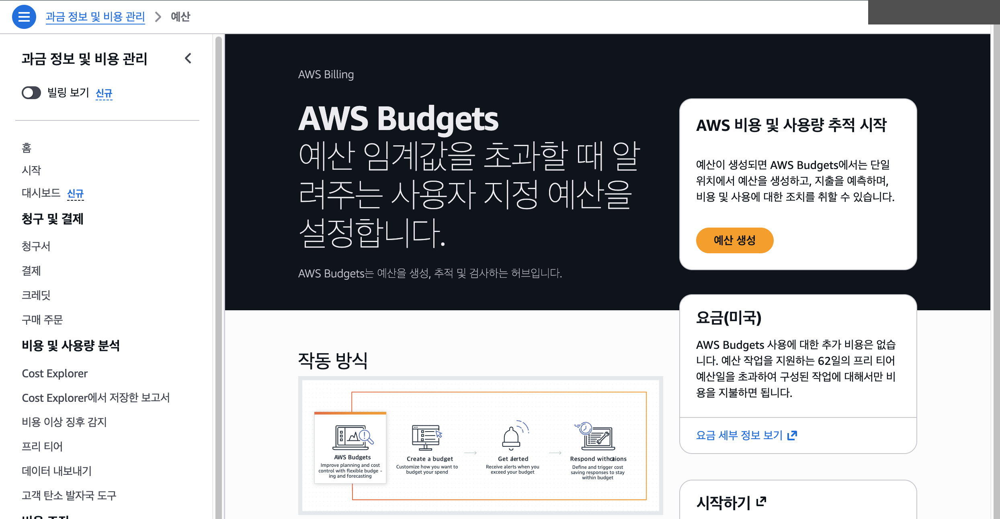
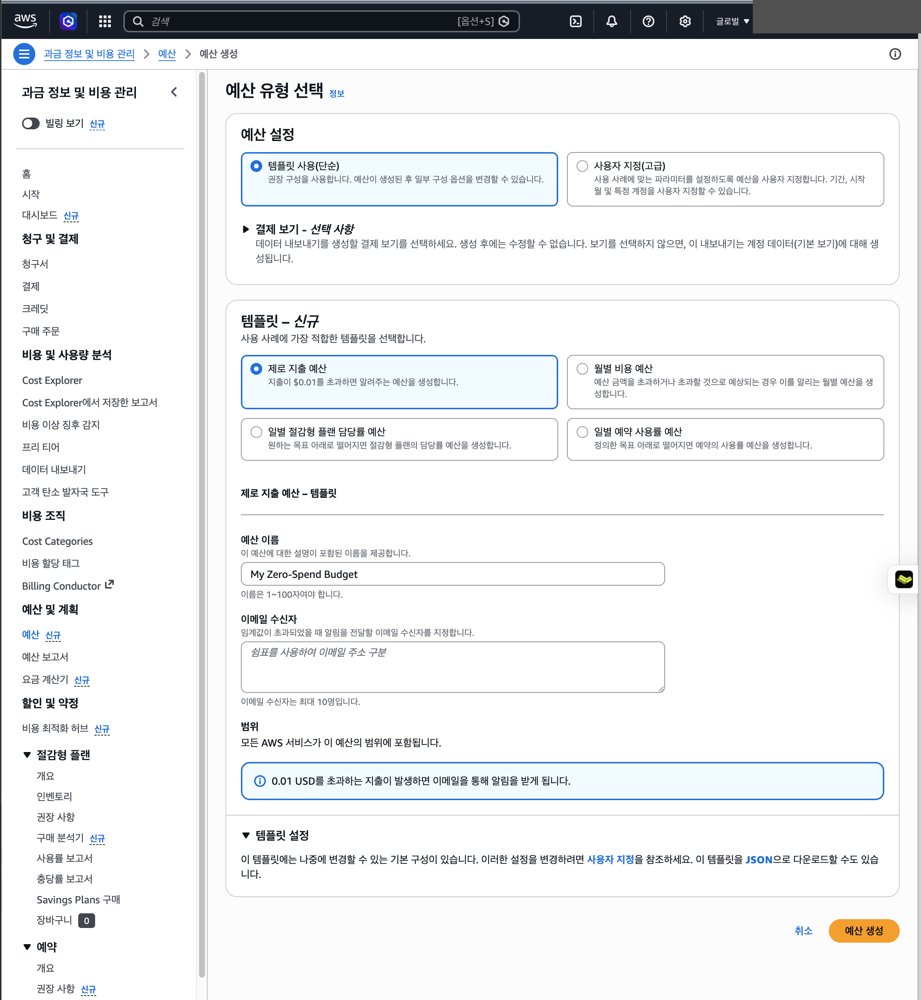
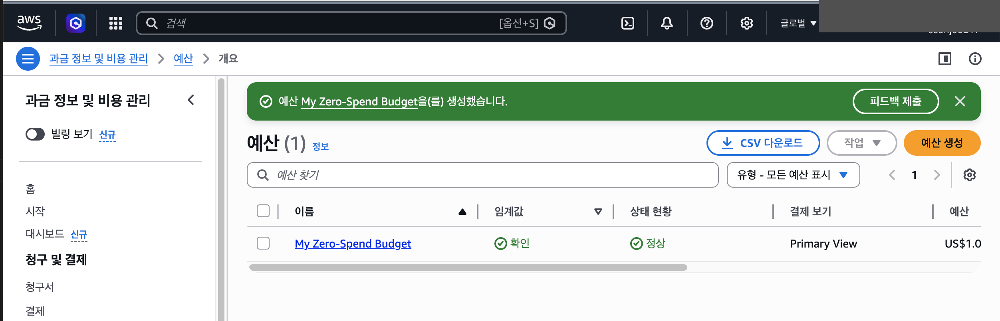
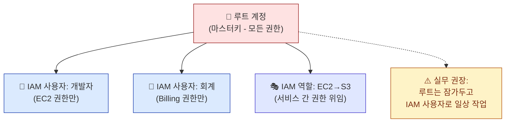
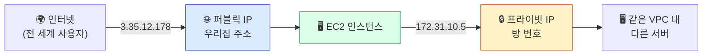

## 학습 목표

- AWS 콘솔의 주요 영역을 파악하고 서울 리전을 선택할 수 있다
- 비용 알림을 설정하여 예상치 못한 과금을 방지할 수 있다
- 루트 계정과 IAM의 차이를 이해하고 MFA를 설정할 수 있다

> ⏱ **예상 소요 시간**: 약 25분

> 📌 **선행 단계**: 직전 [02장 AWS 가입 따라하기](./signup)에서 가입을 마친 직후 본 장을 진행합니다. 02장에서 카드 인증·SMS 인증 등으로 막힌 수강생이 있으면 03장과 병행하면서 따라잡도록 안내합니다.

<a id="toc"></a>

## 진행 순서

1. [AWS 콘솔 둘러보기](#part1) - 서울 리전 선택, 서비스 탐색
2. [비용 알림 설정 (필수!)](#part2) - Budgets, Free Tier 알림
3. [IAM 기본 (간단히)](#part3) - 루트 계정과 IAM 사용자
4. [퍼블릭 IP 미리보기](#part4) - 다음 장에서 사용할 IP 주소 개념
5. [정리](#part5) - 체크리스트 및 다음 장 미리보기

---

# 03장. AWS 콘솔과 비용 관리


<a id="part1"></a>

## 1. AWS 콘솔 둘러보기 [↑](#toc)

### 쇼핑몰 로비 비유

> AWS 콘솔은 200개 이상의 서비스가 모인 **서비스 쇼핑몰의 메인 로비**입니다.
> 원하는 서비스를 상단 검색창에서 찾아 바로 이동할 수 있습니다.

### 콘솔 주요 구성 요소

**상단 검색바**

```
화면 최상단 검색창에 서비스 이름을 입력하면 바로 이동합니다.
예: "EC2" 검색 → EC2 대시보드
    "Billing" 검색 → 결제 및 비용 관리
    "Budgets" 검색 → 예산 설정
```

**리전 선택 (오른쪽 상단)**

화면 오른쪽 상단에 현재 선택된 리전이 표시됩니다.

> ⚠️ **반드시 "서울(ap-northeast-2)"로 변경하세요!**
>
> 리전을 잘못 선택하면 만든 EC2 인스턴스가 보이지 않는 가장 흔한 문제가 발생합니다.
> "리소스가 없어요!"라는 상황의 90%는 리전 문제입니다.

**서울 리전 선택 방법**

```
오른쪽 상단 리전 드롭다운 클릭
→ "아시아 태평양" 섹션
→ "서울 ap-northeast-2" 선택
```

**최근 방문 서비스**

콘솔 홈에는 최근에 방문한 서비스가 표시되어 자주 사용하는 서비스에 빠르게 접근할 수 있습니다.

---

<a id="part2"></a>

## 2. 비용 알림 설정 (필수!) [↑](#toc)

> **이 설정이 이 수업의 첫 번째 실습입니다.**
> 이 설정을 완료하면 $0.01이라도 과금되는 순간 이메일 알림이 옵니다.
> 알림은 비용을 자동으로 막아주지는 않습니다. 이메일을 받으면 즉시 어떤 서비스에서 비용이 발생했는지 확인해야 합니다.

### Step 1: Free Tier 사용량 알림 확인·활성화

> 📌 **2025년 7월 15일 이후 신 Free Plan 가입자**(본 수업 대상)는 **이 옵션이 기본 활성화**되어 있습니다. 이메일 주소가 가입 시 입력한 것과 같은지 **확인만** 하면 됩니다. (필요 시 아래 절차로 변경)

**정확한 메뉴 경로**

1. 콘솔 우측 상단 계정명 → **"결제 및 비용 관리(Billing and Cost Management)"** 클릭
   - 또는 콘솔 상단 검색창에 **"Billing"** 입력 → 첫 결과 클릭
2. 좌측 사이드바에서 **`Preferences and Settings`** 섹션을 펼침 (이미 펼쳐져 있을 수도 있음)
3. 그 안의 **`청구 기본 설정(Billing preferences)`** 메뉴 클릭



4. 페이지 가운데 **`알림 기본 설정(Alert preferences)`** 카드 → 우측 **`편집(Edit)`** 버튼 클릭
5. 아래 옵션이 **체크되어 있는지** 확인 (없으면 체크):
   - ☑ **`AWS 프리 티어 알림 수신(Receive AWS Free Tier alerts)`**



6. **프리 티어 사용량 알림을 받을 이메일 주소** 입력란에 본인 이메일 입력 (비어 있으면 가입 시 사용한 이메일 사용)
7. 우측 하단 주황색 **`업데이트(Update)`** 버튼 클릭

> 💡 같은 화면 하단의 **`CloudWatch 결제 알림 수신`**은 본 수업에서 사용하지 않습니다. 체크하지 않아도 됩니다.

**완료 화면**



화면 상단에 녹색 배너 **"알림 기본 설정이 업데이트되었습니다"**가 뜨고, **`알림 기본 설정`** 카드의 **`AWS 프리 티어 알림`** 항목 옆에 ✅ **`다음으로 전송됨`**과 입력한 이메일 주소가 표시됩니다.

**효과**: 프리 티어 한도의 **85%에 도달**하면 위 이메일로 자동 알림 발송.

> ⚠️ **메뉴 이름이 다른 경우**: AWS 콘솔 UI는 자주 개편됩니다. 다음 표기 중 하나로 표시될 수 있습니다.
>
> | 옵션 표기 | 의미 |
> |:---|:---|
> | `AWS Free Tier 알림 수신(Receive AWS Free Tier alerts)` | 공식 표기 (현재) |
> | `AWS Free Tier 사용량 알림 수신(Receive AWS Free Tier usage alerts)` | 이전 버전 |
> | `Free Tier 사용량 알림(Free Tier usage alerts)` | 더 이전 버전 |
>
> 모두 같은 기능이며, **체크박스를 켜고 이메일을 입력하면** 됩니다.

> 🔍 **메뉴를 못 찾을 때**: 콘솔 상단 검색창에 `청구 기본 설정(Billing preferences)` 직접 입력 → 바로 이동.

### Step 2: Zero-Spend Budget 생성

$0.01이라도 실제 비용이 발생하면 즉시 알림을 받는 예산을 설정합니다.

**정확한 메뉴 경로 (2026년 5월 기준)**

1. 콘솔 우측 상단 계정명 → **"결제 및 비용 관리"** 클릭
   - 또는 직접 URL: [`console.aws.amazon.com/cost-management/`](https://console.aws.amazon.com/cost-management/)
   - 또는 콘솔 상단 검색에 **"Budgets"** 입력 → 첫 결과 클릭
2. 좌측 사이드바에서 **`예산(Budgets)`** 메뉴 클릭



3. 페이지 우측 상단(또는 시작 페이지의 주황색) **`예산 생성(Create budget)`** 버튼 클릭



4. **`예산 설정`** 섹션에서 → **`템플릿 사용(단순)(Use a template - simplified)`** 라디오 버튼 선택 (기본 선택됨)
   - (다른 옵션 `사용자 지정(고급)(Customize - advanced)`은 고급 사용자용)
5. **`템플릿 — 신규`** 카드 목록에서 → **`제로 지출 예산(Zero spend budget)`** 선택
   - 설명: *"지출이 보이는 무료 사용량을 초과할 경우 알려주는 예산을 생성합니다."*
6. **`예산 이름`**: `My Zero-Spend Budget` (또는 자동 생성된 이름 그대로 사용 가능)
7. **`이메일 수신자`**: 본인 이메일 주소 입력 (쉼표로 구분해 여러 명 가능, 최대 10명)
8. 페이지 하단 우측 주황색 **`예산 생성(Create budget)`** 버튼 클릭

**완료 화면**



화면 상단에 녹색 배너 **"예산 My Zero-Spend Budget을(를) 생성했습니다"**가 뜨고, **`예산`** 목록에 새 예산이 표시됩니다.

| 컬럼 | 값 (예시) |
|:---|:---|
| 이름 | My Zero-Spend Budget |
| 임계값 | ✅ 확인 |
| 상태 현황 | ✅ 정상 |
| 결제 보기 | Primary View |
| 예산 | US$1.0 |

**효과**: 실제 비용이 **$0.01 이상 발생하는 즉시** 입력한 이메일로 알림 발송.

> ⚠️ **알림이며 차단이 아닙니다.** Zero spend budget은 과금을 **자동으로 멈추지 않습니다.** 알림 받으면 즉시 Cost Explorer에서 어떤 서비스가 비용을 만들었는지 확인하세요.

> 💡 **알림 지연 가능**: AWS Budgets는 하루 최대 3회(약 8~12시간 간격) 업데이트되므로 실제 과금과 알림 사이 **수 시간 지연**이 있을 수 있습니다.

> 🔍 **Cost Management 콘솔이 처음 열리면**: "Cost Explorer를 활성화하시겠습니까?" 안내가 뜨거나, 그래프가 비어 있을 수 있습니다. **Cost Explorer 활성화 없이도** Budget은 생성됩니다. 그래프는 24시간 후 표시됩니다.

> 🔧 **`템플릿 사용(Use a template)` 옵션이 안 보이면**: AWS 콘솔 UI 버전에 따라 첫 화면이 바로 템플릿 목록일 수 있습니다. 그 경우 **`Zero spend budget`** 카드를 직접 선택하면 됩니다.

### 비용 확인 방법

실습 중 현재까지 발생한 비용을 확인하고 싶다면:

```
콘솔 상단 검색 "Cost Explorer"
→ 날짜별 비용 확인 가능
```

---

<a id="part3"></a>

## 3. IAM 기본 (간단히) [↑](#toc)

### 마스터키와 출입카드 비유

> **루트 계정**은 건물 전체를 열 수 있는 **마스터키**입니다.
> **IAM 사용자**는 특정 부서만 출입할 수 있는 **부서별 출입카드**입니다.

**IAM(Identity and Access Management)**은 AWS 리소스에 대한 접근 권한을 관리하는 서비스입니다.

| 유형 | 설명 | 권장 사용 상황 |
|------|------|--------------|
| **루트 계정** | 모든 권한을 가진 최고 관리자 계정 | 계정 설정, 결제 관리 |
| **IAM 사용자** | 특정 권한만 부여된 별도 계정 | 일상적인 AWS 사용 |
| **IAM 역할** | 특정 서비스나 리소스에 부여하는 권한 | EC2가 S3에 접근할 때 |



### 이 수업의 방침

이 수업에서는 **편의를 위해 루트 계정으로 실습**을 진행합니다.

> ⚠️ **루트 계정 일상 사용은 AWS Well-Architected 보안 안티패턴입니다.**
> 루트 계정은 **계정 폐쇄·결제 정보 변경 등 일부 작업에만** 사용해야 합니다. 수업 종료 후 본 계정을 계속 활용한다면 **반드시 IAM 사용자로 전환**하세요.
>
> **수업 후 IAM 전환 권장 절차** (08장 다음 학습 단계 §HTTPS·보안 항목 참조):
> 1. IAM 콘솔 → 사용자 추가 → 이름·콘솔 액세스 활성화
> 2. 권한: 처음엔 `AdministratorAccess` 정책 부여 (이후 최소 권한으로 좁힘)
> 3. **IAM 사용자에게도 MFA 설정**
> 4. 일상 작업은 IAM 사용자로, 루트 계정은 비밀번호·MFA로 잠가두기
> 5. **루트 계정 액세스 키가 있다면 즉시 삭제** (키는 만들지 말 것)

### MFA(다단계 인증) 설정 필수

루트 계정에는 MFA를 설정해두면 비밀번호가 유출되어도 계정을 보호할 수 있습니다.
이 수업은 편의를 위해 루트 계정으로 진행하므로, EC2를 만들기 전에 MFA를 설정하는 것을 필수 체크포인트로 둡니다.

```
경로: 콘솔 오른쪽 상단 계정명 클릭
      → "보안 자격 증명(Security credentials)"
      → "MFA 디바이스 할당(Assign MFA device)"
      → 휴대폰 인증 앱(Google Authenticator 등) 연동
```

> MFA 설정을 마친 뒤 다음 장으로 넘어가세요. 실무에서는 루트 계정 MFA가 필수 보안 기준입니다.

---

<a id="part4"></a>

## 4. 퍼블릭 IP 미리보기 [↑](#toc)

다음 장(04장)에서 서버를 만들면 **퍼블릭 IP 주소**가 발급됩니다. 서버 접속에 사용하는 핵심 개념이므로 미리 알아둡니다.

> **비유: 우리집 주소 vs 방 번호**
> - **퍼블릭 IP** = 우리집 주소 — 인터넷 어디서든 이 주소로 찾아올 수 있음 (예: `3.35.12.178`)
> - **프라이빗 IP** = 방 번호 — 같은 건물(네트워크) 안에서만 통하는 내부 주소 (예: `172.31.10.5`)

| 구분 | 퍼블릭 IP | 프라이빗 IP |
|------|-----------|-------------|
| 접근 범위 | 인터넷 전체 | AWS 내부 네트워크만 |
| 예시 | `3.35.12.178` | `172.31.10.5` |
| 용도 | 브라우저로 웹서버 접속, SSH 접속 | 서버 간 내부 통신 |
| 변경 여부 | ⚠️ 서버 중지 후 재시작 시 **바뀜** | 고정 |

> ⚠️ **주의:** 서버를 껐다 켜면 퍼블릭 IP가 바뀝니다! 오늘 수업에서는 서버를 끄지 않으므로 걱정하지 않아도 됩니다. (고정 IP가 필요하면 "Elastic IP"를 사용하지만, 이 수업에서는 다루지 않습니다.)



3교시에서 EC2 인스턴스를 만들면 이 퍼블릭 IP를 직접 확인하고, 브라우저에 입력해서 접속하게 됩니다.

---

<a id="part5"></a>

## 5. 정리 [↑](#toc)

### 02장(가입) 완료 확인

| 항목 | 완료 여부 |
|------|----------|
| AWS 계정 생성 및 **Free Plan 선택** | ☐ |
| 콘솔 로그인 | ☐ |

> 위 항목이 미완료라면 [02장 AWS 가입 따라하기](./signup)로 돌아가 가입부터 마치세요.

### 이 장 완료 체크리스트

| 항목 | 완료 여부 |
|------|----------|
| 리전을 서울(ap-northeast-2)로 변경 | ☐ |
| Free Tier 사용량 알림 활성화 | ☐ |
| Zero-Spend Budget 생성 (my-zero-budget) | ☐ |
| 루트 계정 MFA 설정 | ☐ |

모든 항목에 체크가 되어야 다음 장으로 넘어갈 수 있습니다.

### 핵심 개념 요약

| 개념 | 설명 |
|------|------|
| AWS 콘솔 | AWS 서비스를 관리하는 웹 인터페이스 |
| Free Plan | 신규 가입 시 선택하는 요금제 — 최대 6개월 또는 크레딧 소진 시 종료 절차 진입 |
| 신규 프리티어 크레딧 | 가입 시 $100 + 활동 시 추가 $100 (총 최대 $200) |
| 리전 선택 | 서울(ap-northeast-2) 항상 확인 |
| Zero-Spend Budget | $0.01 과금 시 이메일 알림 |
| 루트 계정 | 모든 권한을 가진 최고 관리자 |
| IAM | AWS 접근 권한 관리 서비스 |

### 다음 장 미리보기

**04장 EC2 생성과 접속**에서는:
- 가상 서버(EC2 인스턴스)를 직접 생성합니다
- 보안 그룹(방화벽)을 설정하여 필요한 포트만 열어둡니다
- EC2 Instance Connect로 서버에 접속합니다

---

[↑ 목차로](#toc)
