## 학습 목표

- EC2 인스턴스를 생성하고 보안 그룹을 설정할 수 있다
- EC2 Instance Connect로 서버에 접속할 수 있다

<a id="toc"></a>

## 진행 순서

1. [EC2란?](#part1) - 가상 서버 개념 이해
2. [EC2 인스턴스 생성 (Step by Step)](#part2) - OS 선택, 키 페어, 보안 그룹
3. [보안 그룹 상세](#part3) - 인바운드/아웃바운드, 포트 설정
4. [EC2 접속하기](#part4) - EC2 Instance Connect, SSH 클라이언트
5. [퍼블릭 IP와 DNS](#part5) - IP 개념, 탄력적 IP 소개
6. [정리](#part6) - 요약, 체크리스트

---

# 04장. EC2 인스턴스 생성과 접속

<a id="part1"></a>

## 1. EC2란? [↑](#toc)

### PC방 컴퓨터 대여 비유

> PC방에서 원하는 사양의 컴퓨터를 원하는 시간만큼 빌리고,
> **쓴 시간만큼만 비용을 내는 것**이 EC2입니다.

**EC2(Elastic Compute Cloud)**는 AWS에서 제공하는 가상 서버 서비스입니다.

| 용어 | 설명 |
|------|------|
| **EC2** | Elastic Compute Cloud의 약자. AWS의 가상 서버 서비스 |
| **인스턴스(Instance)** | EC2로 만든 하나의 가상 서버(컴퓨터) |
| **AMI(Amazon Machine Image)** | 서버의 OS와 기본 소프트웨어가 담긴 설치 이미지 |
| **인스턴스 유형** | 서버의 사양 (CPU 수, 메모리 크기 등) |

- "인스턴스를 생성한다" = PC방에서 컴퓨터 자리를 빌린다
- "인스턴스를 종료한다" = PC방에서 퇴실한다
- 인스턴스는 실행 중인 시간만큼 비용이 발생합니다 (초 단위 청구)

---

<a id="part2"></a>

## 2. EC2 인스턴스 생성 (Step by Step) [↑](#toc)

### 시작하기 전 확인

> ⚠️ **반드시 리전이 "서울(ap-northeast-2)"인지 확인하세요!**
> 콘솔 오른쪽 상단에서 확인합니다.

### Step 1: EC2 대시보드로 이동

```
콘솔 상단 검색 "EC2" → EC2 대시보드
→ 왼쪽 메뉴 "인스턴스(Instances)"
→ 오른쪽 상단 "인스턴스 시작(Launch instances)" 클릭
```

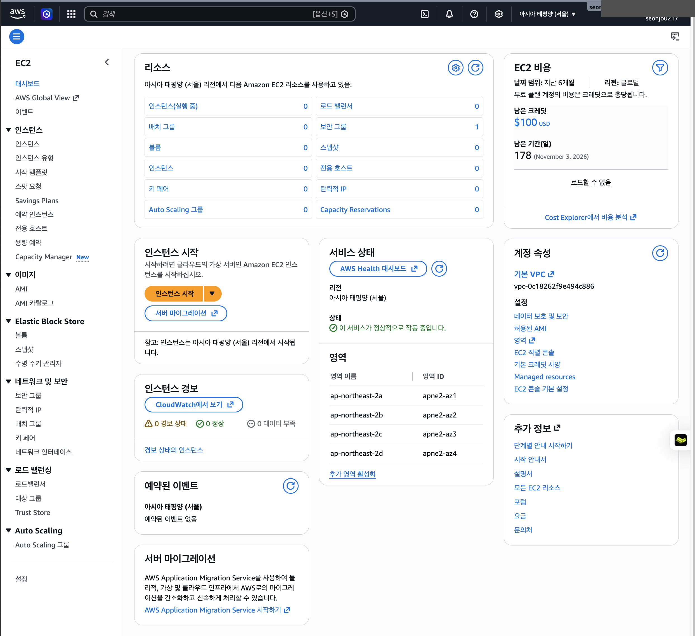

> 💡 **EC2 대시보드 첫 화면에서 확인할 것**:
> - **`리소스`** 카드 — 현재 실행 중인 인스턴스·볼륨·키 페어·보안 그룹 개수 (처음에는 모두 0)
> - **`EC2 비용`** 카드 — 신 Free Plan 가입자라면 $100 USD 크레딧과 남은 기간 표시
> - **`영역(Availability Zones)`** 카드 — 서울 리전(`ap-northeast-2`)의 가용 영역 4개(`2a`, `2b`, `2c`, `2d`) 확인
>
> 좌측 상단에 **`EC2`** 표시가 있어야 합니다. 다른 지역(예: `버지니아북부`)이면 우측 상단에서 **서울**로 변경하세요.

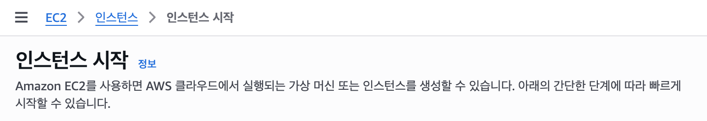

### Step 2: 이름 태그 설정

인스턴스 시작 페이지 가장 위의 **`이름 및 태그(Name and tags)`** 카드 → **`이름(Name)`** 입력란에 별명을 입력합니다.

```
이름(Name): my-web-server
```

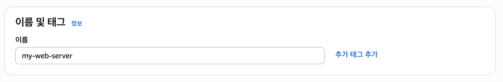

> 💡 **"이름 태그"가 뭔가요?**
>
> AWS의 모든 리소스(EC2 인스턴스·S3 버킷·EBS 볼륨 등)에는 **태그(Tag)**라는 `키 = 값` 형태의 라벨을 붙일 수 있습니다. 예: `Environment = prod`, `Owner = hong-gildong`.
>
> 그중 **`Name`이라는 특수한 태그**는 AWS 콘솔이 **인스턴스의 별명**으로 사용하는 약속된 키입니다. `이름` 입력란에 `my-web-server`를 적으면 내부적으로 **`Key=Name, Value=my-web-server`** 태그가 자동 생성됩니다.

> 🎯 **이 별명은 어디에 보이나요?**
>
> | 위치 | 표시 |
> |:---|:---|
> | EC2 인스턴스 목록 | 가장 왼쪽 **`Name`** 컬럼 |
> | 인스턴스 상세 페이지 | 페이지 제목 옆 |
> | CloudWatch 모니터링 그래프 | 인스턴스 구분 라벨 |
> | 청구서·Cost Explorer | 비용을 인스턴스별로 분리해서 볼 때 |
>
> 별명을 안 적으면 콘솔 목록에 `-` 로 표시되어 인스턴스가 여러 개 생겼을 때 어느 게 뭔지 구분이 안 됩니다.

> 📌 **이 수업에서는 `my-web-server`로 통일**합니다. 강사 시연 화면과 수강생 화면의 이름이 같으면 따라잡기 쉽습니다. 실무에서는 보통 `<프로젝트>-<역할>-<환경>` 형식으로 짓습니다 (예: `myshop-web-prod`, `internal-db-dev`).

> 🔧 **나중에 바꿀 수 있나요?** 네, EC2 인스턴스 목록에서 **`Name`** 컬럼의 빈칸/이름을 **더블클릭**하면 즉시 수정됩니다. 인스턴스를 다시 만들 필요 없습니다.

### Step 3: OS 선택 (AMI 선택)

**OS(AMI) 선택 절차**

```
"애플리케이션 및 OS 이미지(AMI)" 카드
→ "Quick Start" 탭에서 "Ubuntu" 클릭 (기본은 Amazon Linux)
→ AMI 드롭다운: Ubuntu Server 24.04 LTS (HVM), SSD Volume Type
→ "프리 티어 사용 가능(Free tier eligible)" 레이블 확인
```

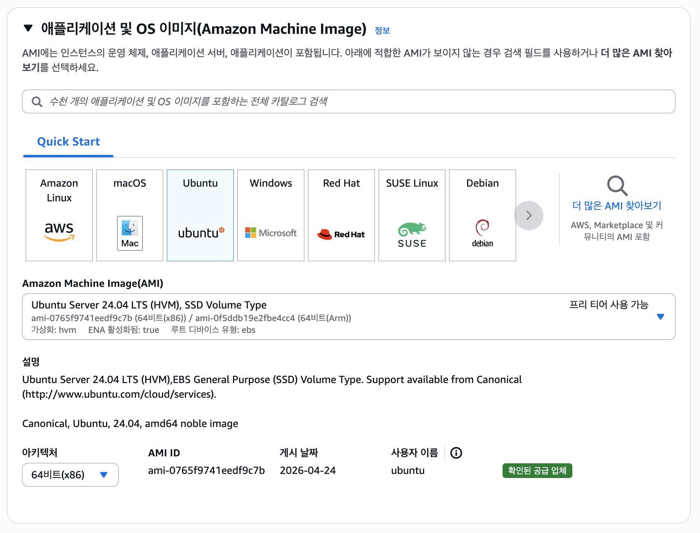

> ⚠️ Quick Start 탭에서 **`Amazon Linux`**가 기본 선택되어 있을 수 있습니다. 본 수업은 **`Ubuntu`**를 사용하므로 반드시 Ubuntu 아이콘으로 변경하세요.

> "프리 티어 사용 가능" 레이블이 보이는지 반드시 확인하세요!

Ubuntu 24.04 LTS(Noble Numbat)를 선택하는 이유:
- **LTS(Long Term Support)**: 5년간 보안 업데이트 지원 (표준 지원 종료: 2029년 5월 31일)
- 웹 개발 실습에서 가장 널리 사용되는 리눅스 배포판
- AWS 공식 프리 티어 지원

### Step 4: 인스턴스 유형 선택

```
인스턴스 유형: t3.micro
→ "프리 티어 사용 가능" 레이블 확인
```

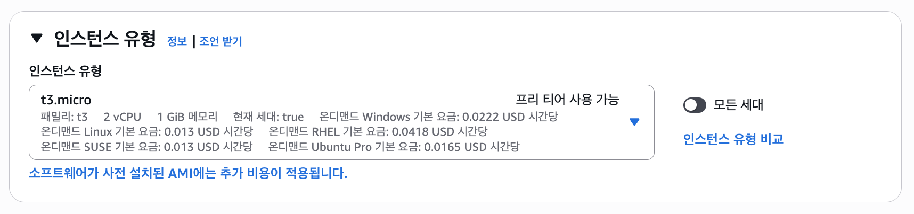


| 항목 | 값 |
|------|-----|
| 인스턴스 유형 | **t3.micro** |
| vCPU | 2개 (버스트 가능) |
| 메모리 | 1 GB |
| 비용 처리 | **신규 계정(2025.7.15~)**: Free Plan 크레딧($200)에서 차감<br>**기존 계정**: 12개월 무료 프리티어로 무료 |

> 📘 **용어 구분 (헷갈리지 마세요)**
> - **프리티어(Free Tier)** = 사용량 한도 내 무료. 기존(2025.7.15 이전) 계정의 12개월 무료가 대표적
> - **Free Plan 크레딧** = 신규 계정(2025.7.15~)에 지급되는 $200 사용권. 한도 내에서만 무료처럼 동작
> - 콘솔의 **"Free tier eligible"** 레이블은 두 경우 모두에서 권장 옵션을 의미

> 💡 **t2.micro와 차이:** 2025년 7월 15일 이후 신규 계정은 t2.micro 대신 **t3.micro**가 표준입니다. (이전 계정은 t2.micro도 가능)
> 신규 계정에서 사용 가능한 다른 옵션: `t3.small`, `t4g.micro`(ARM), `t4g.small`, `c7i-flex.large`, `m7i-flex.large`. 이 수업에서는 t3.micro를 사용합니다.

> "Free tier eligible" 표시가 없는 유형을 선택하면 크레딧이 빠르게 소진됩니다.

#### 🤔 무료로 EC2를 몇 대까지 만들 수 있나요?

수강생이 가장 자주 묻는 질문입니다. 답은 **"가입 시점·동시 가동 여부"에 따라 다릅니다.**

##### ① 신 Free Plan 가입자 (2025-07-15 이후) — **크레딧 차감 방식**

| 기준 | 한도 |
|:---|:---|
| 가입 시 크레딧 | $100 (활동 보너스 합치면 최대 **$200**) |
| t3.micro 서울 단가 | 약 **$0.0104/시간** (월 24시간 × 30일 = **약 $7.5/월**) |
| 퍼블릭 IPv4 단가 | 약 **$0.005/시간** (월 약 $3.65) — 단, **1대분 750시간/월 무료** 적용 가능 |
| **이론상 동시 가동 가능** | $200 ÷ $11/월 ≈ **약 18대·월** (1대 18개월, 또는 3대 6개월 분) |

> ⚠️ **이론과 실제는 다릅니다.** 신규 계정은 AWS의 **Service Quota(서비스 한도)** 때문에 **t3 계열 vCPU 5~10개로 제한**됩니다. t3.micro는 2 vCPU이므로 **실제로는 2~5대까지만 동시 가동** 가능합니다. 한도 증가는 Service Quotas 콘솔에서 신청 가능하나, 본 수업에선 불필요합니다.

##### ② 기존 12개월 무료 프리티어 (2025-07-15 이전 가입) — **시간 합산 방식**

| 기준 | 한도 |
|:---|:---|
| t2.micro 또는 t3.micro | **월 750시간** (가입 후 12개월간) |
| **1대 24시간 × 30일** | 720시간 → **1대 무료** |
| **2대 동시 가동** | 1440시간 → 750시간 초과분 (690시간) **과금 발생** |
| **5대를 6시간씩** | 900시간 → 150시간 과금 |

> 💡 750시간 한도는 **모든 인스턴스 시간이 합산**됩니다. 동시 가동 대수가 늘어나면 무료 한도를 빠르게 초과합니다.

##### ③ 본 수업 권장

> 🎯 **이 수업에서는 인스턴스를 1대만 만듭니다.**
> - 강사 시연도 1대 / 수강생도 각자 1대 / 수업 끝나면 즉시 **Terminate**
> - 여러 대를 만들 이유가 없으며, 만들면 크레딧·750시간 한도를 빠르게 소모
> - **여러 대 동시 실험이 필요한 경우**: 한 대씩 차례로 만들고 즉시 Terminate (중첩 가동 X)

##### ④ "Stopped" 인스턴스도 대수에 포함되나요?

| 상태 | EC2 시간 청구 | EBS 디스크 청구 |
|:---|:---:|:---:|
| **Running** | ✅ | ✅ |
| **Stopped** (중지) | ❌ | ✅ ($0.10/GB·월, 8GB면 월 약 $0.80) |
| **Terminated** (종료) | ❌ | ❌ |

> ⚠️ **Stopped 인스턴스는 EC2 시간은 차감되지 않지만 EBS 디스크 비용은 계속 청구**됩니다. 8GB 기준 월 ~$0.80로 적지만 누적되면 무시할 수 없습니다. 수업 후엔 반드시 **Terminate**.

### Step 5: 키 페어 생성

키 페어(Key Pair)는 서버에 SSH로 접속할 때 사용하는 열쇠입니다.

```
"새 키 페어 생성(Create new key pair)" 클릭
→ 키 페어 이름: my-key
→ 키 페어 유형: RSA
→ 프라이빗 키 파일 형식: .pem
→ "키 페어 생성" 클릭
→ my-key.pem 파일이 자동 다운로드됩니다
```

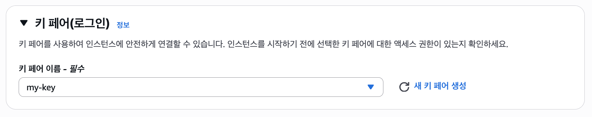

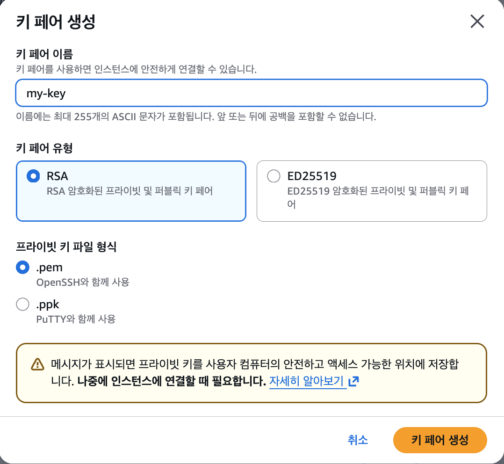

> 💡 EC2 Instance Connect(브라우저 접속)를 사용하면 키 페어 없이도 접속 가능합니다.  
> 하지만 실무 환경을 경험하기 위해 키 페어를 생성해 둡니다.  
> 🔒 **`.pem` 파일 권한 (Mac/Linux)**: 다운로드 후 `chmod 400 ~/Downloads/my-key.pem` 으로 본인만 읽을 수 있게 설정해야 SSH가 거부하지 않습니다.

### Step 6: 네트워크 설정 (보안 그룹)

```
"보안 그룹 생성(Create security group)" 선택 (기본값)
보안 그룹 이름: launch-wizard-1 (자동 생성)

아래 항목을 체크하세요:
  ☑ SSH 트래픽 허용 (Allow SSH traffic from) → 우선 "내 IP(My IP)" 선택
  ☑ 인터넷에서 HTTP 트래픽 허용 (Allow HTTP traffic from the internet)
```

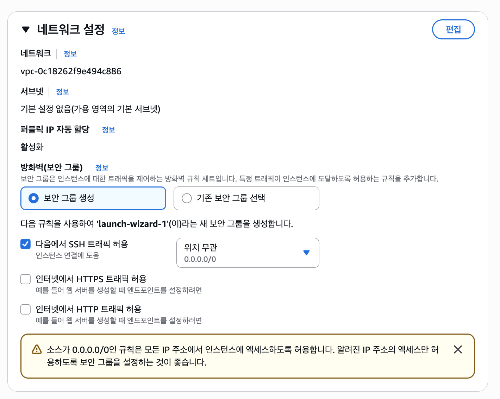

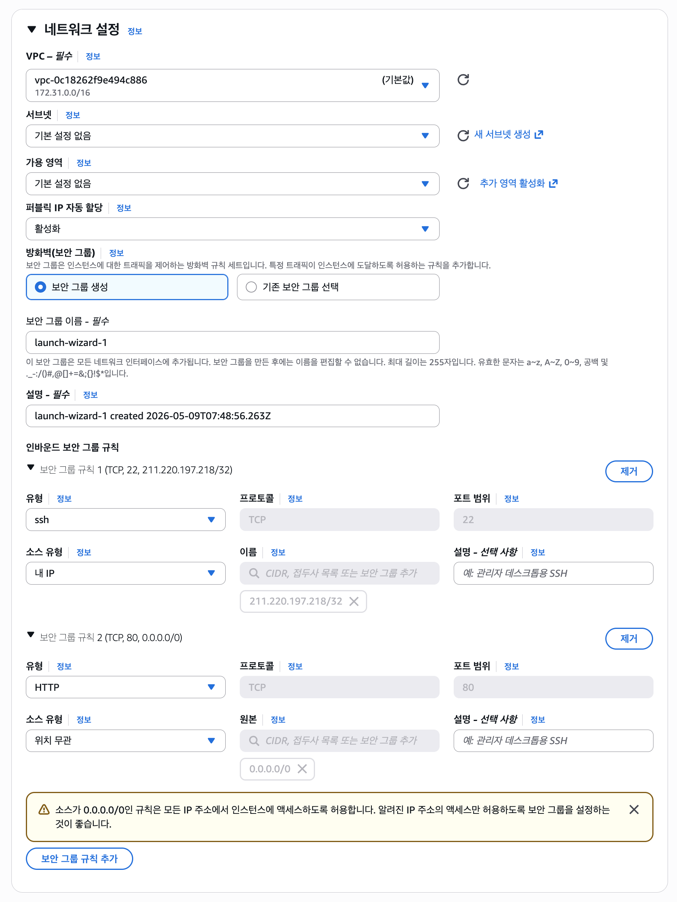

| 포트 | 용도 | 권장 소스 | 비유 |
|------|------|----------|------|
| 22 (SSH) | 서버 관리 접속 | **내 IP** | 관리자 전용 뒷문 (특정 IP만) |
| 80 (HTTP) | 웹사이트 접속 | Anywhere (0.0.0.0/0) | 손님 출입 정문 |

> ⚠️ **SSH(22번)는 반드시 "내 IP"로 제한합니다.**
> 0.0.0.0/0(모든 IP)으로 열면 전 세계 자동 스캔·무차별 대입(brute-force) 공격이 들어옵니다. **절대 0.0.0.0/0을 SSH 소스로 사용하지 마세요.**
>
> 보안 그룹은 **stateful**이라 인바운드만 허용해도 응답 트래픽은 자동으로 나갑니다. SSH 22번 인바운드 = 양방향 통신 가능.

> 💡 **EC2 Instance Connect 접속이 "내 IP"만으로 실패하는 경우** (자주 발생)
>
> 브라우저 기반 EC2 Instance Connect는 내 컴퓨터가 아니라 **AWS 서비스 IP에서 SSH로 접속**합니다. 따라서 SSH 인바운드에 추가로 prefix list를 허용해야 합니다.
>

### Step 7: 스토리지 설정

```
스토리지: 8 GiB gp3 (기본값 유지)
```

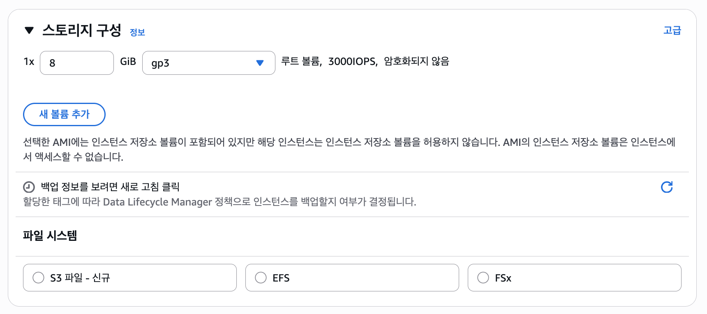

신규 Free Plan에서는 EBS 사용분도 크레딧($200 한도)에서 차감됩니다. 8GB 기준 월 약 $0.64(gp3, 서울 리전 기준)로 매우 저렴해 6개월 운영해도 크레딧 영향이 거의 없습니다. 이 수업에서는 기본값 8GB로 충분합니다.

### Step 8: 인스턴스 시작

```
오른쪽 요약 패널에서 설정 내용 확인
→ "인스턴스 시작(Launch instance)" 클릭
```

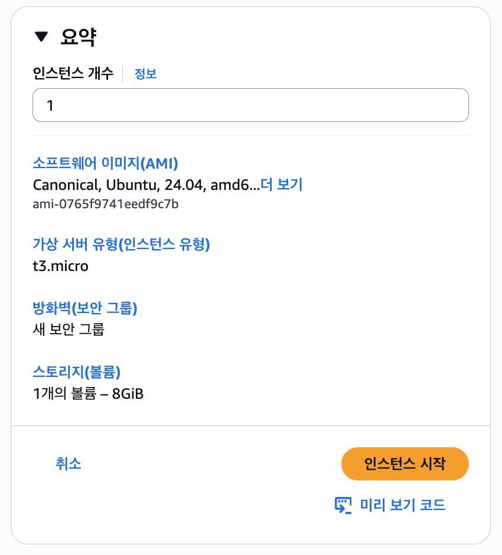

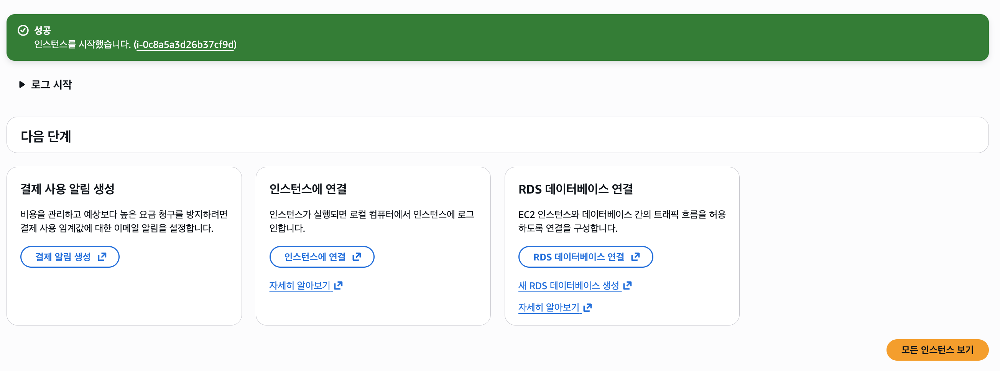

### 인스턴스 상태 확인

```
EC2 → 인스턴스 메뉴로 이동
→ 방금 만든 "my-web-server" 인스턴스 확인
→ 인스턴스 상태: pending → running (약 1~2분 소요)
→ 상태 검사(Status check): "2/2 checks passed" 확인
```
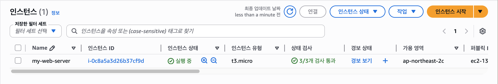

"running" 상태가 되고 상태 검사가 통과되면 서버가 준비된 것입니다.

---

<a id="part3"></a>

## 3. 보안 그룹 상세 [↑](#toc)

### 출입 통제 명단 비유

> 보안 그룹은 서버로 들어오고 나가는 트래픽을 제어하는 **건물 출입 통제 명단**입니다.
> 허용 목록에 없는 트래픽은 기본적으로 모두 차단됩니다.

### 인바운드(Inbound) vs 아웃바운드(Outbound)

| 방향 | 의미 | 기본 설정 |
|------|------|----------|
| **인바운드(Inbound)** | 외부 → 서버로 들어오는 트래픽 | 기본 차단 (명시적 허용 필요) |
| **아웃바운드(Outbound)** | 서버 → 외부로 나가는 트래픽 | 기본 모두 허용 |


### 이 수업의 인바운드 규칙

| 유형 | 프로토콜 | 포트 | 소스 | 용도 |
|------|---------|------|------|------|
| SSH | TCP | 22 | **내 IP (My IP)** | 로컬 SSH 클라이언트 접속 |
| SSH | TCP | 22 | `com.amazonaws.ap-northeast-2.ec2-instance-connect` | EC2 Instance Connect 콘솔 접속 |
| HTTP | TCP | 80 | 0.0.0.0/0 | 웹사이트 접속 |
| HTTPS | TCP | 443 | 0.0.0.0/0 | 보안 웹사이트 (선택) |

> **0.0.0.0/0**은 "모든 IP에서 접속 허용"을 의미합니다.
> SSH(22번)는 접속 방식에 맞춰 "내 IP" 또는 EC2 Instance Connect prefix list로 제한하고, 웹 트래픽(80/443)만 모두 허용합니다.

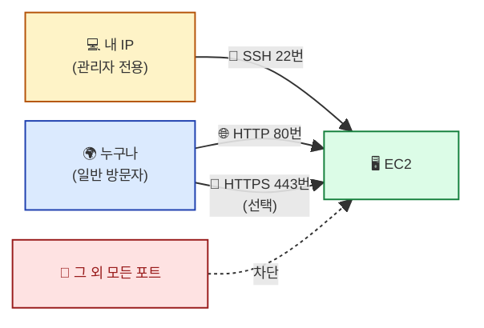

### 보안 그룹 수정 방법

나중에 포트를 추가하거나 변경하고 싶다면:

EC2 콘솔 → 보안 그룹 → 해당 그룹 선택 → **인바운드 규칙 편집**

> **EC2 Instance Connect 추가**:
>
> 1. **유형**: SSH (22) 선택
> 2. **소스 유형**: "사용자 지정" 그대로 두고, **소스** 검색창에 `ec2-instance-connect` 입력
> 3. 드롭다운에 `pl-xxxxxxxx (com.amazonaws.ap-northeast-2.ec2-instance-connect)` 형태로 prefix list가 뜨면 선택
>
> 이제 prefix list 범위(AWS 서비스 IP) 안의 EC2 Instance Connect 게이트웨이에서 들어오는 SSH도 허용됩니다.

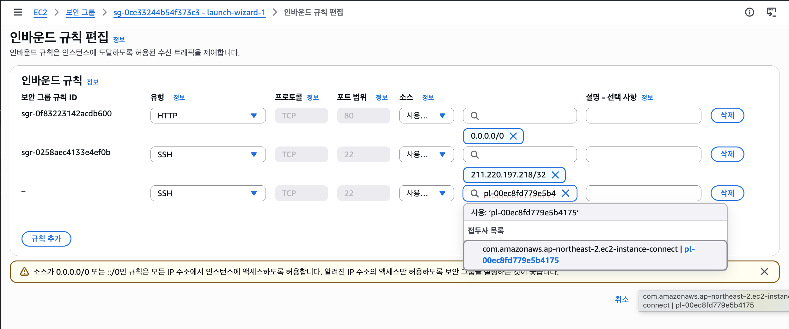

## 4. EC2 접속하기 [↑](#toc)

서버가 "running" 상태가 되면 접속할 수 있습니다.
이 수업에서는 두 가지 방법을 설명합니다.
---

<a id="part4"></a>

### 방법 1 (권장): EC2 Instance Connect

EC2 Instance Connect는 **브라우저에서 바로 서버 터미널**을 열 수 있는 AWS 기능입니다.
별도 소프트웨어 설치 없이 사용할 수 있어 가장 간편합니다.

```
EC2 대시보드 → 인스턴스 목록
→ "my-web-server" 체크박스 선택
→ 상단 "연결(Connect)" 버튼 클릭
→ "EC2 Instance Connect" 탭 선택
→ 사용자 이름: ubuntu (Ubuntu의 기본 사용자)
→ "연결(Connect)" 클릭
```

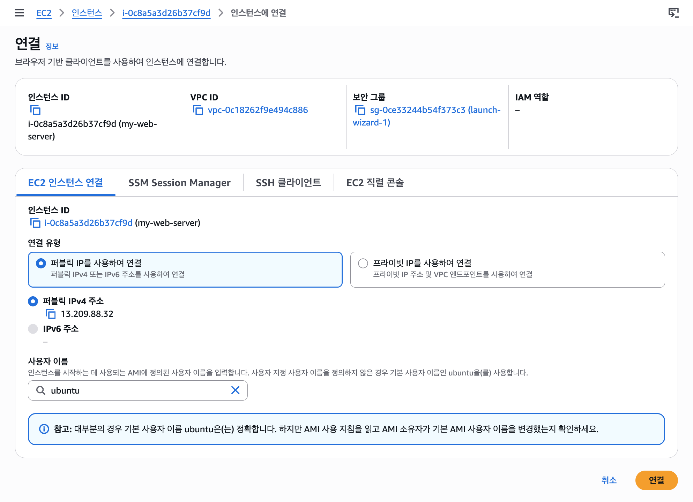

브라우저 새 탭에 터미널이 열리면 성공입니다.

```bash
ubuntu@ip-172-xx-xx-xx:~$
```
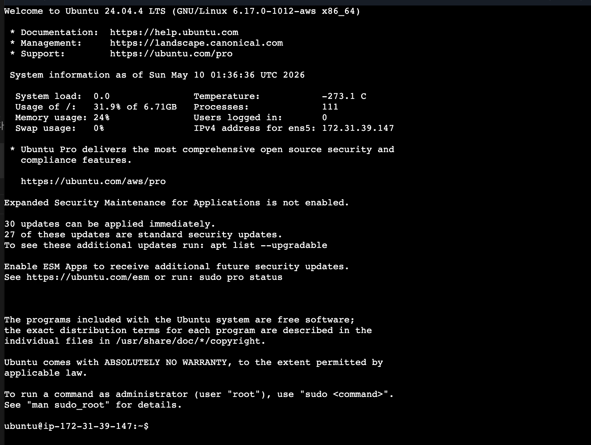

위와 같은 프롬프트가 보이면 서버에 접속한 것입니다!

- `ubuntu`: 현재 로그인한 사용자 이름
- `ip-172-xx-xx-xx`: 서버의 프라이빗 IP 기반 호스트 이름
- `~`: 현재 디렉토리 (홈 디렉토리)
- `$`: 일반 사용자 권한으로 명령어를 입력할 수 있음을 표시

### 방법 2 (참고): SSH 클라이언트

내 컴퓨터의 터미널에서 직접 서버로 접속하는 방법입니다.
다운로드된 `my-key.pem` 파일이 필요합니다.

> 💡 **접속 정보 3종**
> - 키 파일: `my-key.pem` (다운로드 폴더에 보관, 절대 외부에 공유 금지)
> - 사용자명: `ubuntu` (Ubuntu AMI 기본 계정. Amazon Linux는 `ec2-user`)
> - 서버 주소: 인스턴스 목록의 "퍼블릭 IPv4 주소" 또는 "퍼블릭 DNS"

#### 🍎 Mac / 🐧 Linux

```bash
# 1. 키 파일 권한 설정 (최초 1회)
chmod 400 my-key.pem

# 2. SSH 접속
ssh -i my-key.pem ubuntu@<인스턴스의-퍼블릭-IP>

# 접속 성공 시 표시
The authenticity of host '43.xxx.xxx.xxx' can't be established.
...
Are you sure you want to continue connecting (yes/no)? yes    ← yes 입력

ubuntu@ip-172-xx-xx-xx:~$    ← 이 프롬프트가 보이면 접속 성공
```

---

#### 🪟 Windows

Windows 10/11 에는 **OpenSSH 클라이언트가 기본 내장**되어 있어 별도 설치 없이 PowerShell 또는 Windows Terminal에서 바로 접속할 수 있습니다.

##### Windows-방법 A: PowerShell / Windows Terminal (권장)

**Step 1. OpenSSH 클라이언트 확인** (Windows 10 1809+, Windows 11은 기본 설치)

PowerShell을 열고:

```powershell
ssh -V
# 출력 예: OpenSSH_for_Windows_9.5p1 ...
```

명령을 찾을 수 없다면 [설정 → 앱 → 선택적 기능]에서 "OpenSSH 클라이언트"를 설치하세요.

**Step 2. 키 파일을 안전한 위치로 이동**

`다운로드` 폴더보다는 사용자 폴더 아래 `.ssh` 디렉터리에 두는 것이 관행입니다.

```powershell
# 사용자 폴더로 이동
cd $HOME
mkdir -Force .ssh
Move-Item "$HOME\Downloads\my-key.pem" "$HOME\.ssh\my-key.pem"
```

**Step 3. 키 파일 권한 수정** ⚠️ Windows에서 가장 자주 막히는 단계

Mac/Linux의 `chmod 400` 에 해당하는 작업입니다. Windows는 **icacls** 명령으로 ACL(접근 제어 목록) 을 직접 수정합니다.

```powershell
$key = "$HOME\.ssh\my-key.pem"

# 1) 키 파일이 상속받은 모든 권한 제거
icacls $key /inheritance:r

# 2) 현재 사용자에게만 읽기 권한 부여
icacls $key /grant:r "$($env:USERNAME):(R)"

# 결과 확인
icacls $key
# 출력에 "사용자명:(R)" 한 줄만 보이면 OK
```

> 🤔 **왜 이 단계가 필요한가?**
> SSH는 **키 파일이 너무 개방되어 있으면 보안상 이유로 접속을 거부**합니다. Windows는 새 파일이 상위 폴더(예: 다운로드) 의 ACL을 상속해 "Everyone 읽기 가능" 상태가 되는데, 이 상태로는 OpenSSH가 키를 거부합니다.

**Step 4. SSH 접속**

```powershell
ssh -i $HOME\.ssh\my-key.pem ubuntu@<인스턴스의-퍼블릭-IP>
```

접속 성공 화면은 Mac/Linux와 동일합니다.

**Step 5. (선택) `~/.ssh/config` 로 별칭 등록**

매번 긴 명령을 치기 귀찮으면 설정 파일에 단축 등록할 수 있습니다.

```powershell
notepad $HOME\.ssh\config
```

```ini
Host aws-prod
    HostName 43.xxx.xxx.xxx
    User ubuntu
    IdentityFile ~/.ssh/my-key.pem
```

이제 다음 명령만으로 접속됩니다.

```powershell
ssh aws-prod
```

---

##### Windows-방법 B: WSL (Ubuntu on Windows) 사용

WSL을 이미 쓰고 있다면, WSL의 Ubuntu 터미널에서 **Mac/Linux 방법을 그대로 사용**하는 게 가장 자연스럽습니다.

```bash
# WSL 안에서
cp /mnt/c/Users/사용자명/Downloads/my-key.pem ~/.ssh/
chmod 400 ~/.ssh/my-key.pem
ssh -i ~/.ssh/my-key.pem ubuntu@<인스턴스의-퍼블릭-IP>
```

---

##### Windows-방법 C: MobaXterm (GUI · 입문자에게 가장 권장 ⭐)

PowerShell의 `icacls` 권한 작업이 부담스럽다면 **MobaXterm**이 가장 쉬운 선택입니다.

> ✨ **MobaXterm이 편한 이유**
> - `.pem` 파일을 그대로 사용 (`.ppk` 변환 불필요 — PuTTY와의 가장 큰 차이)
> - 키 파일 권한(`icacls`) 자동 처리
> - SSH 접속과 동시에 **좌측에 SFTP 파일 탐색기가 자동으로 뜸** → 드래그&드롭으로 파일 업로드/다운로드
> - 탭으로 여러 서버 동시 접속, 세션 저장
> - **Home Edition 무료** (개인·상업 모두 사용 가능)

**Step 1. MobaXterm 설치**

1. [mobatek.net/download-mobaxterm.html](https://mobatek.net/download-mobaxterm.html) 접속
2. **MobaXterm Home Edition** 의 두 가지 중 선택:
   - **Installer edition** — 일반 설치 (권장)
   - **Portable edition** — 설치 없이 압축 풀어 바로 실행 (USB 등)
3. 다운로드 후 실행

**Step 2. 새 세션 만들기**

1. 좌측 상단 **[Session]** 버튼 클릭
2. 좌측 상단 **[SSH]** 아이콘 선택
3. 입력:
   - **Remote host**: `<인스턴스의-퍼블릭-IP>` (예: `43.201.xxx.xxx`)
   - **Specify username**: ☑ 체크 → `ubuntu` 입력  
     *(Amazon Linux면 `ec2-user`)*
4. 아래쪽 **[Advanced SSH settings]** 탭 클릭
5. **Use private key**: ☑ 체크 → 우측 폴더 아이콘 클릭 → `my-key.pem` 선택
6. (선택) **[Bookmark settings]** 탭에서 Session name 지정 → 저장 후 좌측 트리에서 더블클릭만으로 재접속 가능
7. 하단 **[OK]** 클릭

**Step 3. 접속 확인**

- 첫 접속 시 호스트 키 확인 창이 뜨면 **[Accept]**
- 정상 접속되면 우측 터미널에 `ubuntu@ip-172-xx-xx-xx:~$` 프롬프트
- **좌측 사이드바에 SFTP 파일 브라우저가 자동으로 뜸** → 파일을 드래그해서 업로드/다운로드 가능

> 💡 **파일 전송 활용 예**
> - 6장에서 다룰 Nginx 설정 파일을 로컬에서 작성해 좌측 SFTP 패널로 드래그 → 서버에 즉시 업로드
> - 서버 로그(`/var/log/nginx/access.log`)를 좌측 패널에서 우클릭 → Download 로 로컬에 내려받기

> ℹ️ **참고 (PuTTY 사용자)**
> 회사·기존 환경에서 PuTTY를 반드시 써야 한다면 **PuTTYgen** 으로 `.pem → .ppk` 로 변환한 뒤 PuTTY의 [Connection → SSH → Auth → Credentials → Private key file] 에 지정해야 합니다. 본 수업은 MobaXterm으로 진행하니 PuTTY 사용은 권장하지 않습니다.

---

##### Windows-방법 D: VS Code Remote - SSH (개발용 권장)

서버에서 코드를 직접 편집·디버깅할 거라면 VS Code의 **Remote - SSH** 확장이 가장 편합니다.

1. VS Code 좌측 확장 탭에서 "Remote - SSH" 설치 (Microsoft)
2. `F1` → "Remote-SSH: Connect to Host" → "Configure SSH Hosts" → `~/.ssh/config` 선택
3. 위 **Windows-방법 A의 Step 5** 와 동일하게 작성 후 저장
4. `F1` → "Remote-SSH: Connect to Host" → `aws-prod` 선택
5. 새 창이 열리면서 VS Code가 서버에 접속, 좌측 하단에 `SSH: aws-prod` 표시

이후 [파일 → 폴더 열기] 로 서버의 디렉터리를 그대로 편집할 수 있습니다.

---

### 접속 문제 해결

> ⚠️ **"연결 시간 초과(Connection timed out)" 에러가 나면:**
>
> 1. 보안 그룹에 SSH(22번 포트)가 인바운드 규칙에 있는지 확인
> 2. 인스턴스가 "실행 중(running)" 상태인지 확인
> 3. 콘솔 오른쪽 상단에서 리전이 "서울"인지 확인
> 4. EC2 Instance Connect 콘솔 접속이면 SSH 소스에 `com.amazonaws.ap-northeast-2.ec2-instance-connect` prefix list가 허용되어 있는지 확인
> 5. SSH 클라이언트 접속이면 키 파일 권한을 설정했는지 확인
>    - Mac/Linux: `chmod 400 my-key.pem`
>    - Windows: `icacls` 로 현재 사용자만 읽기 가능하도록 ACL 정리

> ⚠️ **(Windows) "UNPROTECTED PRIVATE KEY FILE!" / "Permission denied (publickey)" 에러가 나면:**
>
> 키 파일에 다른 사용자나 그룹이 접근 가능하다는 뜻입니다. 위 **Windows-방법 A Step 3** 의 `icacls /inheritance:r` + `icacls /grant:r` 두 명령을 다시 실행하세요. 출력에 본인 사용자명 한 줄만 남아야 합니다.

> ⚠️ **(MobaXterm) 세션 저장 후 접속이 안 되면:**
>
> 1. 좌측 트리에서 저장된 세션 우클릭 → [Edit session] → **Use private key** 경로가 맞는지 다시 확인 (파일을 다른 폴더로 옮긴 경우 자주 발생)
> 2. **Specify username** 체크박스가 켜져 있고 `ubuntu` (또는 `ec2-user`) 가 입력됐는지 확인
> 3. Remote host가 **퍼블릭 IP** 인지 확인 (프라이빗 IP를 잘못 입력한 경우 시간 초과)

> ⚠️ **(PuTTY 사용자) "PuTTY Key File Format" 에러가 나면:**
>
> PuTTY는 `.pem` 을 직접 못 읽습니다. PuTTYgen으로 `.ppk` 로 변환 필요. **수업에선 MobaXterm 사용을 권장**합니다 — `.pem` 그대로 쓸 수 있어 이런 변환 단계가 없습니다.

> ⚠️ **(공통) "Permission denied (publickey)" — 시간 초과가 아닌 거부 에러:**
>
> 1. 사용자명 확인: Ubuntu AMI는 `ubuntu`, Amazon Linux는 `ec2-user`, RHEL은 `ec2-user`
> 2. 키 파일 경로가 맞는지 확인 (`-i` 옵션의 경로)
> 3. 키 페어 이름이 인스턴스에 설정한 것과 같은지 확인 (인스턴스 상세 → 키 페어 이름)

---

<a id="part5"></a>

## 5. 퍼블릭 IP와 DNS [↑](#toc)

### 퍼블릭 IP란?

**퍼블릭 IP(Public IP)**는 인터넷에서 이 서버에 접근할 수 있는 주소입니다.
인스턴스 목록에서 "퍼블릭 IPv4 주소" 열에서 확인할 수 있습니다.

```
예시: 43.201.xxx.xxx
```

### 중요: 인스턴스를 중지하면 IP가 바뀜

> ⚠️ **인스턴스를 중지(Stop)했다가 다시 시작(Start)하면 퍼블릭 IP가 바뀝니다!**
> SSH 접속 주소나 웹사이트 주소가 변경되니 주의하세요.

이를 해결하려면 **탄력적 IP(Elastic IP)**를 사용합니다.

### 탄력적 IP(Elastic IP)

**탄력적 IP**는 인스턴스에 고정적으로 할당되는 퍼블릭 IP입니다.
인스턴스를 중지/시작해도 IP가 바뀌지 않습니다.

| 항목 | 설명 |
|------|------|
| 비용 | 일반 요금 기준 **퍼블릭 IPv4 주소 1개당 시간당 $0.005 (월 약 $3.65)** — 2024년 2월 1일부터 적용 |
| 적용 범위 | 인스턴스에 **연결되어 있어도 부과**됩니다. 미연결 상태도 동일 |
| 일반 퍼블릭 IP | EC2 인스턴스에 자동 할당되는 퍼블릭 IPv4도 동일하게 시간당 $0.005 부과 |

> ⚠️ **2024년 2월 정책 변경:** 과거에는 "인스턴스 연결 시 무료"였으나, 현재는 **연결 여부와 무관하게 모든 퍼블릭 IPv4 주소에 과금**됩니다.
> 단, EC2 Free Tier 대상 계정은 EC2와 함께 사용하는 퍼블릭 IPv4에 월 750시간 무료 사용량이 적용될 수 있고, 신규 Free Plan 계정은 크레딧으로 이 비용이 충당될 수 있습니다. 수업에서는 별도 Elastic IP를 만들지 않고, 마지막에 인스턴스를 Terminate하여 남는 IPv4 비용을 방지합니다.

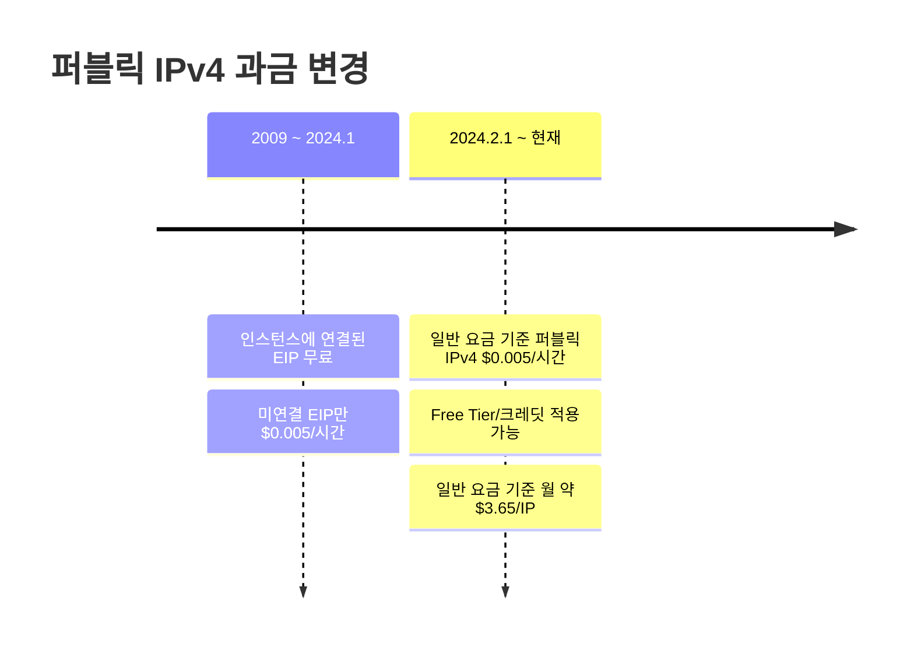

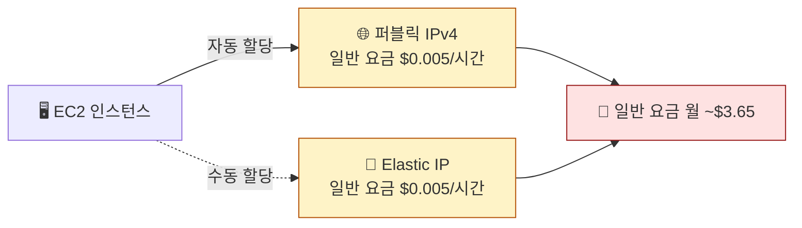

> 이 수업에서는 탄력적 IP를 사용하지 않습니다.
> 매 수업마다 새로 인스턴스를 만들기 때문에 고정 IP가 필요하지 않습니다.

### 퍼블릭 DNS

AWS는 퍼블릭 IP에 대응하는 **퍼블릭 DNS 이름**도 자동으로 제공합니다.

```
예시: ec2-43-201-xxx-xxx.ap-northeast-2.compute.amazonaws.com
```

IP 주소 대신 이 DNS 이름으로도 접속할 수 있습니다.

---

<a id="part6"></a>

## 6. 정리 [↑](#toc)

### EC2 핵심 요약

| 개념 | 설명 |
|------|------|
| EC2 인스턴스 | AWS에서 빌린 가상 서버 |
| AMI | 서버 OS가 담긴 이미지 (Ubuntu 24.04 LTS 사용) |
| t3.micro | 신규 계정 프리티어 인스턴스 유형 (2 vCPU 버스트, 1GB RAM) |
| 키 페어 | SSH 접속에 사용하는 공개키/비밀키 쌍 |
| 보안 그룹 | 서버의 방화벽 역할 (포트 단위 트래픽 제어) |
| EC2 Instance Connect | 브라우저에서 서버 터미널에 접속하는 AWS 기능 |
| 퍼블릭 IP | 인터넷에서 서버에 접근하는 주소 (중지 후 재시작 시 변경) |
| 탄력적 IP | 고정 퍼블릭 IP (이 수업에서는 미사용) |

### 보안 그룹 설정 체크리스트

| 항목 | 완료 여부 |
|------|----------|
| SSH (22번 포트) 인바운드 허용 | ☐ |
| HTTP (80번 포트) 인바운드 허용 | ☐ |

### 이 장 완료 체크리스트

| 항목 | 완료 여부 |
|------|----------|
| EC2 인스턴스 생성 (이름: my-web-server) | ☐ |
| 인스턴스 상태가 "running" 확인 | ☐ |
| 상태 검사 "2/2 checks passed" 확인 | ☐ |
| EC2 Instance Connect로 서버 접속 성공 | ☐ |
| 터미널에서 `ubuntu@ip-...` 프롬프트 확인 | ☐ |

