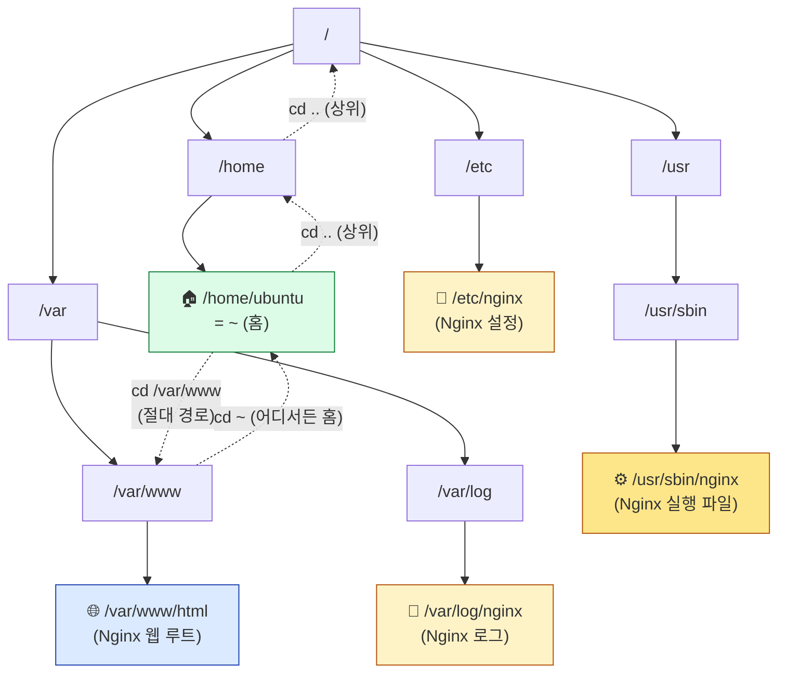
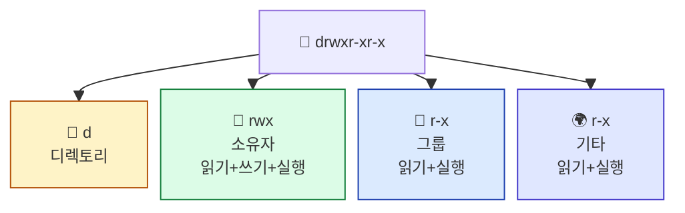
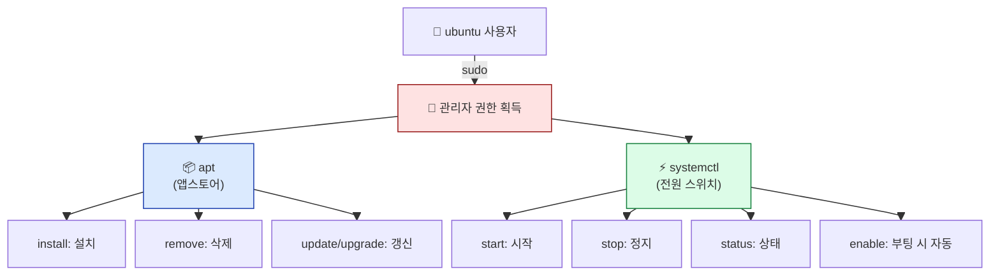

## 학습 목표

- 리눅스 터미널에서 파일/폴더를 탐색하고 관리할 수 있다
- 패키지 매니저(apt)로 소프트웨어를 설치할 수 있다
- git을 사용해 GitHub 저장소를 클론할 수 있다

> **사전 준비:** 04장에서 EC2 Instance Connect로 서버에 접속한 상태에서 진행합니다.

<a id="toc"></a>

## 진행 순서

1. [터미널이란?](#part1) - GUI vs 터미널, 프롬프트 읽는 법
2. [파일/폴더 탐색](#part2) - pwd, ls, cd 명령어
3. [파일/폴더 관리](#part3) - mkdir, touch, cp, mv, rm, nano
4. [권한과 패키지 관리](#part4) - sudo, apt, systemctl
5. [git 기초 (07장 준비)](#part5) - GitHub에서 코드 가져오기
6. [정리](#part6) - 치트시트 및 실습 과제

---

# 05장. 리눅스 기초 명령어

<a id="part1"></a>

## 1. 터미널이란? [↑](#toc)

**터미널(Terminal)**은 마우스 없이 **타이핑으로 컴퓨터에게 명령을 내리는 도구**입니다.

### 음성 비서 비유

> GUI(그래픽 인터페이스)가 "마우스로 폴더 클릭"이라면,
> **터미널은 "글자로 직접 명령"** — 음성 비서에게 타이핑으로 지시하는 것과 같습니다.

| 방식 | 예시 | 특징 |
|------|------|------|
| GUI | 폴더 아이콘 더블클릭 | 직관적, 느림 |
| **터미널** | `cd Documents` 입력 | 빠름, 자동화 가능 |

처음에는 낯설게 느껴지지만, 익숙해지면 GUI보다 훨씬 빠르고 강력합니다.

---

### 프롬프트 읽는 법

EC2에 접속하면 아래와 같은 화면이 나타납니다.

```
ubuntu@ip-172-31-10-5:~$
```

각 부분의 의미는 다음과 같습니다.

| 부분 | 의미 | 예시 값 |
|------|------|---------|
| `ubuntu` | 현재 로그인한 사용자 이름 | ubuntu |
| `ip-172-31-10-5` | 서버(호스트)의 이름 | EC2 내부 IP 기반 |
| `~` | 현재 위치한 폴더 (`~`는 홈 폴더) | `/home/ubuntu` |
| `$` | 일반 사용자 모드 (관리자는 `#`) | — |

---

### 명령어 기본 구조

```
명령어 [옵션] [대상]
```

- **명령어**: 실행할 프로그램 (예: `ls`, `cd`, `mkdir`)
- **옵션**: 동작 방식을 바꾸는 설정, `-`로 시작 (예: `-l`, `-a`)
- **대상**: 명령을 적용할 파일이나 폴더 (예: `/home`, `index.html`)

```bash
ls -la /home
# ls: 목록 보기 명령어
# -la: l(상세보기) + a(숨김파일 포함) 옵션
# /home: 확인할 폴더 경로
```

---

<a id="part2"></a>

## 2. 파일/폴더 탐색 [↑](#toc)

서버 안을 돌아다니는 기본 명령어입니다. 가장 많이 쓰는 명령어이니 손에 익을 때까지 반복 연습하세요.

| 명령어 | 설명 | 비유 | 예시 |
|--------|------|------|------|
| `pwd` | 현재 위치 확인 | "지금 내가 어디에 있지?" | `/home/ubuntu` 출력 |
| `ls` | 파일 목록 보기 | "이 방에 뭐가 있지?" | 파일/폴더 이름 나열 |
| `ls -la` | 상세 목록 (숨김 파일 포함) | "서랍 안까지 다 열어보기" | 권한·크기·날짜 표시 |
| `cd 폴더명` | 폴더 이동 | "다른 방으로 이동" | `cd /var/log` |
| `cd ..` | 상위 폴더로 이동 | "한 층 위로" | — |
| `cd ~` | 홈 폴더로 이동 | "내 방으로 돌아가기" | — |



> 💡 **리눅스 표준 디렉토리** (FHS, Filesystem Hierarchy Standard)
>
> | 경로 | 용도 |
> |:---|:---|
> | `/home/<user>` | 사용자 개인 폴더 (홈) |
> | `/etc/` | 시스템·서비스 **설정 파일** (예: `/etc/nginx/`) |
> | `/var/` | 가변 데이터 — 로그(`/var/log/`)·웹 콘텐츠(`/var/www/`) 등 |
> | `/usr/bin`, `/usr/sbin` | **실행 파일**. 일반 사용자 명령은 `/usr/bin`, 관리자(root) 명령은 `/usr/sbin` |
> | `/tmp` | 임시 파일 (재부팅 시 삭제) |
> | `/root` | root 사용자 홈 |
>
> Nginx는 **실행 파일은 `/usr/sbin/nginx`**, **설정은 `/etc/nginx/`**, **콘텐츠는 `/var/www/html/`**, **로그는 `/var/log/nginx/`** 처럼 역할별로 다른 디렉토리에 분산되어 있습니다.

---

### pwd — 현재 위치 확인

```bash
pwd
```

실행 결과:

```
/home/ubuntu
```

> `/home/ubuntu`는 ubuntu 사용자의 홈 디렉토리입니다. `~`와 동일한 경로입니다.

---

### ls — 파일 목록 보기

```bash
ls
```

실행 결과:

```
(출력 없음 — 홈 디렉토리에 일반 파일·폴더가 없습니다)
```

> 💡 새 EC2 인스턴스의 홈 디렉토리는 비어 있어 `ls`만 입력하면 아무것도 나오지 않습니다. 숨김 파일(점으로 시작)을 보려면 `ls -la`를 사용합니다.

```bash
ls -la
```

실행 결과:

```
total 24
drwxr-x--- 3 ubuntu ubuntu 4096 Jan  1 09:00 .
drwxr-xr-x 3 root   root   4096 Jan  1 08:00 ..
-rw-r--r-- 1 ubuntu ubuntu  220 Jan  1 08:00 .bash_logout
-rw-r--r-- 1 ubuntu ubuntu 3771 Jan  1 08:00 .bashrc
-rw-r--r-- 1 ubuntu ubuntu  807 Jan  1 08:00 .profile
drwx------ 2 ubuntu ubuntu 4096 Jan  1 09:00 .ssh
```

맨 앞의 `drwxr-xr-x`는 파일 권한(Permission)을 나타냅니다.

| 문자 | 의미 |
|------|------|
| `d` | 디렉토리(폴더). `-`이면 일반 파일 |
| `rwx` | 소유자 권한 (읽기·쓰기·실행) |
| `r-x` | 그룹 권한 (읽기·실행만) |
| `r-x` | 기타 사용자 권한 (읽기·실행만) |



---

### cd — 폴더 이동

```bash
cd /var
pwd
```

실행 결과:

```
/var
```

```bash
cd log
pwd
```

실행 결과:

```
/var/log
```

> 💡 `/var/www`는 06장에서 **Nginx를 설치한 뒤 자동으로 만들어지는** 폴더입니다. 지금은 아직 없으니 `/var` 안의 다른 폴더(`log`, `lib` 등)로 이동해 보세요.

```bash
cd ..
pwd
```

실행 결과:

```
/var
```

```bash
cd ~
pwd
```

실행 결과:

```
/home/ubuntu
```

> **팁:** 탭(Tab) 키를 누르면 폴더/파일 이름이 자동완성됩니다. 긴 경로를 입력할 때 매우 유용합니다.

---

<a id="part3"></a>

## 3. 파일/폴더 관리 [↑](#toc)

파일과 폴더를 만들고, 복사하고, 삭제하는 명령어입니다.

| 명령어 | 설명 | 예시 |
|--------|------|------|
| `mkdir` | 폴더 생성 | `mkdir my-website` |
| `touch` | 빈 파일 생성 | `touch index.html` |
| `cp` | 파일/폴더 복사 | `cp index.html backup.html` |
| `mv` | 이동 또는 이름 변경 | `mv old.html new.html` |
| `rm` | 파일 삭제 | `rm backup.html` |
| `rm -rf` | 폴더 통째로 삭제 | `rm -rf old-folder` |
| `cat` | 파일 내용 보기 | `cat index.html` |
| `nano` | 터미널 파일 편집기 | `nano index.html` |

---

### mkdir — 폴더 생성

```bash
mkdir my-website
ls
```

실행 결과:

```
my-website
```

---

### touch — 빈 파일 생성

```bash
cd my-website
touch index.html
ls
```

실행 결과:

```
index.html
```

---

### cp — 파일 복사

```bash
cp index.html backup.html
ls
```

실행 결과:

```
backup.html  index.html
```

---

### mv — 이동/이름 변경

```bash
# 이름 변경
mv backup.html old-backup.html
ls
```

실행 결과:

```
index.html  old-backup.html
```

```bash
# 다른 폴더로 이동 (홈 폴더로 이동)
mv old-backup.html ~/
ls ~/
```

실행 결과:

```
my-website  old-backup.html
```

---

### cat — 파일 내용 보기

```bash
cat index.html
```

아직 내용이 없으므로 아무것도 출력되지 않습니다. 내용을 추가한 후 다시 확인해보겠습니다.

---

### nano — 파일 편집

```bash
nano index.html
```

nano 편집기가 열립니다. 내용을 입력하고 저장하는 방법은 다음과 같습니다.

| 단축키 | 동작 |
|--------|------|
| 내용 입력 | 일반 타이핑 |
| `Ctrl + O` | 파일 저장 (이름 확인 후 Enter) |
| `Ctrl + X` | 편집기 종료 |
| `Ctrl + K` | 현재 줄 삭제 |
| `Ctrl + W` | 텍스트 검색 |

`Hello, Linux!`를 입력하고 저장(Ctrl+O → Enter → Ctrl+X)한 뒤 확인합니다.

```bash
cat index.html
```

실행 결과:

```
Hello, Linux!
```

---

### rm — 파일/폴더 삭제

```bash
# 파일 삭제
rm old-backup.html
ls ~/
```

실행 결과:

```
my-website
```

```bash
# 폴더 통째로 삭제 (-r: 하위 포함, -f: 확인 없이 강제)
rm -rf my-website
ls ~/
```

실행 결과:

```
(출력 없음)
```

> ⚠️ **`rm -rf`는 복구가 불가능합니다!** 삭제 전 반드시 대상을 확인하세요.
> 운영 서버에서 실수로 `rm -rf /`를 실행하면 서버 전체가 삭제됩니다.

---

<a id="part4"></a>

## 4. 권한과 패키지 관리 [↑](#toc)

### sudo — 관리자 권한으로 실행

**sudo(수도)**는 일반 사용자가 관리자(root) 권한으로 명령을 실행할 수 있게 해주는 명령어입니다.

> 비유: **마스터키 사용** — 일반 열쇠로 열 수 없는 문을 마스터키로 여는 것과 같습니다.

```bash
sudo 명령어
```

시스템 설정 변경, 소프트웨어 설치, 서비스 관리 등 민감한 작업에는 `sudo`가 필요합니다.

---

### apt — 패키지 매니저

**apt(Advanced Package Tool)**는 Ubuntu의 소프트웨어 설치/관리 도구입니다.

> 비유: **앱 스토어** — 스마트폰의 앱 스토어처럼, 검색하고 설치하고 업데이트하는 모든 것을 처리합니다.

```bash
sudo apt update          # 설치 가능한 소프트웨어 목록 최신화
sudo apt install nginx   # Nginx 웹서버 설치
sudo apt remove nginx    # Nginx 삭제
sudo apt upgrade         # 설치된 패키지 모두 업데이트
```

> `sudo apt update`는 실제로 소프트웨어를 설치하는 것이 아니라, 설치 가능한 **목록(카탈로그)** 을 최신 상태로 가져오는 명령입니다. 설치 전에 항상 먼저 실행하는 습관을 들이세요.

---

### systemctl — 서비스(데몬) 관리

**systemctl**은 서버에서 백그라운드로 실행되는 프로그램(서비스/데몬)을 시작·정지·관리하는 명령어입니다.

> 비유: **전원 스위치** — Nginx라는 웹서버를 켜고 끄고, 상태를 확인하는 스위치입니다.

```bash
sudo systemctl start nginx    # Nginx 시작
sudo systemctl stop nginx     # Nginx 정지
sudo systemctl restart nginx  # Nginx 재시작 (설정 변경 후 반영)
sudo systemctl status nginx   # Nginx 상태 확인
sudo systemctl enable nginx   # 서버 부팅 시 자동 시작 등록
sudo systemctl disable nginx  # 자동 시작 해제
```



`systemctl status nginx` 실행 결과에서 `Active: active (running)`이 보이면 정상 동작 중입니다.

```
● nginx.service - A high performance web server and a reverse proxy server
     Loaded: loaded (/lib/systemd/system/nginx.service; enabled; vendor preset: enabled)
     Active: active (running) since Mon 2026-01-01 09:05:00 UTC; 2min ago
```

---

<a id="part5"></a>

## 5. git 기초 (07장 준비) [↑](#toc)

**git**은 코드의 변경 이력을 관리하는 도구입니다. **GitHub**는 git으로 관리되는 코드를 인터넷에 저장·공유하는 서비스입니다.

### 우편 사서함 비유

> **GitHub는 코드의 우편 사서함**입니다.
> 누군가 사서함에 코드를 올려두면(`push`), 다른 사람은 사서함에서 코드를 꺼내(`clone`) 자기 컴퓨터에서 실행할 수 있습니다.

이 수업의 07장에서는 **강사가 GitHub에 올려둔 정적 사이트 코드**를 EC2 서버에서 `git clone` 으로 받아 Nginx로 서비스합니다.

---

### git 설치 확인

Ubuntu 24.04에는 git이 기본 설치되어 있습니다.

```bash
git --version
```

실행 결과:

```
git version 2.43.0
```

만약 설치되어 있지 않다면:

```bash
sudo apt update
sudo apt install git -y
```

---

### 핵심 명령어 (수업에서 사용할 것)

| 명령어 | 설명 | 예시 |
|--------|------|------|
| `git --version` | git 버전 확인 | — |
| `git clone <URL>` | 원격 저장소를 현재 폴더에 복제 | `git clone https://github.com/user/repo.git` |
| `git status` | 변경된 파일 목록 확인 | — |
| `git pull` | 원격 저장소의 최신 변경사항 받아오기 | — |

> 💡 이 수업에서는 **`git clone`만 사용**합니다. 코드를 직접 GitHub에 올리는(`push`) 과정은 다루지 않습니다.

---

### 미리 해보기: 작은 저장소 clone (선택 실습)

git이 정상 동작하는지 빠르게 확인합니다. (저장소 이름은 강사가 안내하는 URL로 대체)

```bash
cd ~
git clone https://github.com/octocat/Hello-World.git
ls
```

실행 결과:

```
Hello-World
```

```bash
cd Hello-World
ls
```

실행 결과:

```
README
```

> 07장에서는 강사가 안내하는 **본 수업용 정적 사이트 레포**를 같은 방법으로 clone 합니다.

```bash
# 테스트로 받은 폴더 정리
cd ~
rm -rf Hello-World
```

---

<a id="part6"></a>

## 6. 정리 [↑](#toc)

### 명령어 치트시트

| 분류 | 명령어 | 설명 |
|------|--------|------|
| 탐색 | `pwd` | 현재 위치 출력 |
| 탐색 | `ls` | 파일 목록 |
| 탐색 | `ls -la` | 상세 목록 (숨김 파일 포함) |
| 탐색 | `cd 경로` | 폴더 이동 |
| 탐색 | `cd ..` | 상위 폴더 이동 |
| 탐색 | `cd ~` | 홈 폴더 이동 |
| 관리 | `mkdir 이름` | 폴더 생성 |
| 관리 | `touch 파일` | 빈 파일 생성 |
| 관리 | `cp 원본 복사본` | 파일 복사 |
| 관리 | `mv 원본 대상` | 이동/이름 변경 |
| 관리 | `rm 파일` | 파일 삭제 |
| 관리 | `rm -rf 폴더` | 폴더 삭제 (⚠️ 복구 불가) |
| 관리 | `cat 파일` | 파일 내용 출력 |
| 관리 | `nano 파일` | 파일 편집 |
| 권한 | `sudo 명령어` | 관리자 권한으로 실행 |
| 패키지 | `sudo apt update` | 패키지 목록 갱신 |
| 패키지 | `sudo apt install` | 패키지 설치 |
| 패키지 | `sudo apt remove` | 패키지 삭제 |
| 서비스 | `sudo systemctl start` | 서비스 시작 |
| 서비스 | `sudo systemctl stop` | 서비스 정지 |
| 서비스 | `sudo systemctl status` | 서비스 상태 확인 |
| 서비스 | `sudo systemctl enable` | 부팅 시 자동 시작 |
| git | `git --version` | git 버전 확인 |
| git | `git clone <URL>` | GitHub 저장소 복제 |
| git | `git status` | 변경 파일 확인 |
| git | `git pull` | 원격 변경사항 받기 |

---

### 실습 과제

**기본** — 홈 디렉토리에 `my-site` 폴더를 만들고, 그 안에 `hello.txt` 파일을 생성한 뒤 `cat`으로 내용을 확인하세요.

```bash
mkdir ~/my-site
touch ~/my-site/hello.txt
cat ~/my-site/hello.txt
```

**중급** — `nano`로 `hello.txt`에 자기 이름과 오늘 날짜를 작성하고 저장하세요. 저장 후 `cat`으로 확인하세요.

```bash
nano ~/my-site/hello.txt
# 이름: 홍길동
# 날짜: 2026-01-01
# Ctrl+O → Enter → Ctrl+X
cat ~/my-site/hello.txt
```

**심화** — `ls -la ~/my-site`로 파일 권한을 확인하고, 맨 앞 10자리 (`-rw-r--r--`)의 의미를 설명하세요.

```bash
ls -la ~/my-site
# -rw-r--r-- 1 ubuntu ubuntu 30 Jan 1 09:10 hello.txt
# 소유자(ubuntu): 읽기+쓰기 / 그룹: 읽기만 / 기타: 읽기만
```
