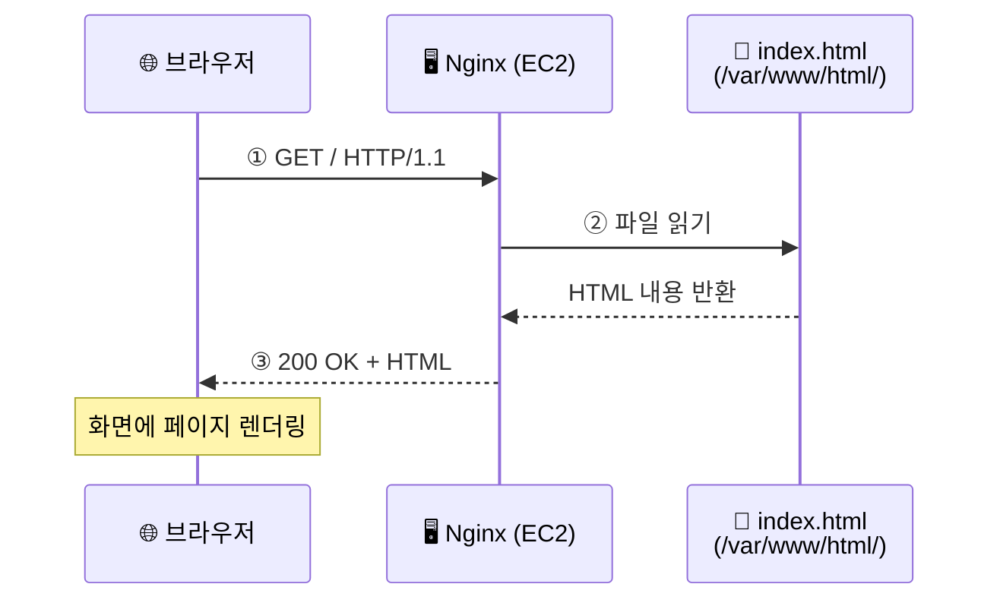
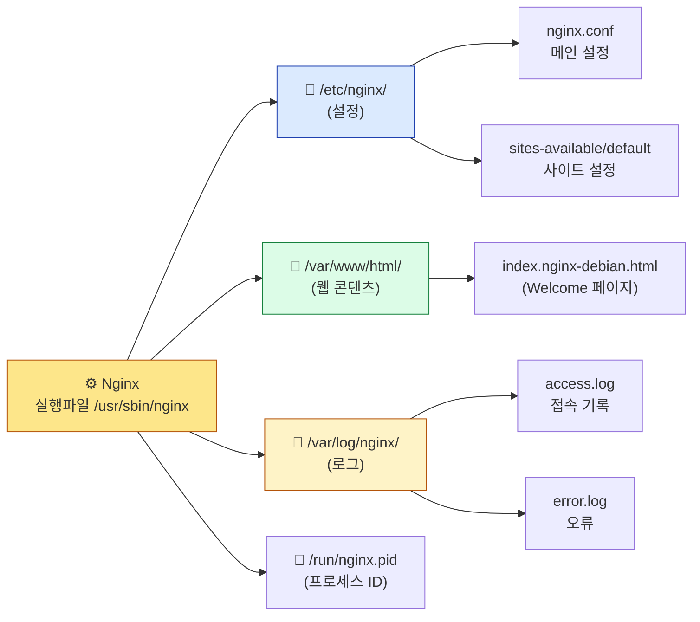
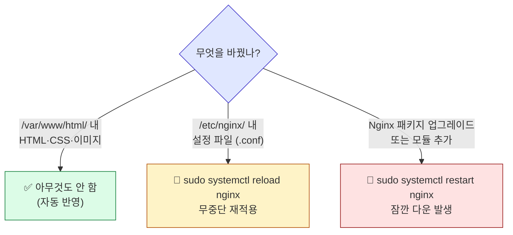

## 학습 목표

- Nginx 웹서버를 설치하고 동작 상태를 확인할 수 있다
- Nginx의 주요 파일 경로와 `systemctl` 제어 명령을 이해한다
- 브라우저에서 퍼블릭 IP로 접속하여 기본 페이지를 확인할 수 있다

<a id="toc"></a>

## 진행 순서

1. [웹서버란?](#part1) - HTTP 요청·응답, Nginx 소개
2. [Nginx 설치](#part2) - apt로 설치, systemctl status로 확인
3. [브라우저에서 동작 확인](#part3) - 퍼블릭 IP로 접속
4. [Nginx 파일 구조](#part4) - 웹 루트, 설정 파일, 로그
5. [systemctl로 Nginx 제어](#part5) - 시작/정지/재시작/상태
6. [내 페이지로 바꿔보기](#part6) - HTML 직접 작성 → 브라우저 즉시 반영
7. [정리](#part7) - 체크리스트, 트러블슈팅

---

# 06장. 웹서버 Nginx 설치

<a id="part1"></a>

## 1. 웹서버란? [↑](#toc)

**웹서버**는 브라우저(클라이언트)의 요청을 받아 HTML·CSS·이미지 같은 웹 자원을 응답으로 돌려주는 프로그램입니다.

### 안내 데스크 비유

> 방문자(브라우저)가 건물(서버)에 들어와 "문서 X 좀 주세요"라고 요청하면,
> **Nginx는 안내 데스크** — 어떤 파일을 요청했는지 확인하고 적절한 문서를 찾아 전달합니다.

### HTTP 요청·응답의 기본 흐름

```
[브라우저] ──── (1) GET / HTTP/1.1 ────▶ [EC2 서버 : Nginx]
                                              │
                                              ▼
                                        /var/www/html/index.html 읽기
                                              │
[브라우저] ◀──── (2) 200 OK + HTML ──── [EC2 서버 : Nginx]
```



### Nginx란?

**Nginx(엔진엑스)**는 전 세계에서 가장 많이 사용되는 웹서버 소프트웨어 중 하나입니다.

| 항목 | 내용 |
|------|------|
| 라이선스 | 오픈소스 (BSD 유사 라이선스 — 공식 명칭 "nginx license") |
| 처음 출시 | 2004년 |
| 대표 사용처 | Netflix, Cloudflare, GitHub 등 |
| 특징 | 가벼움, 빠름, 정적 파일 서빙에 최적화 |

> 이 수업에서는 Nginx를 **정적 파일(HTML, CSS, JS, 이미지)을 서비스하는 용도**로 사용합니다.

---

<a id="part2"></a>

## 2. Nginx 설치 [↑](#toc)

> **사전 준비:** 04장에서 EC2 Instance Connect로 서버에 접속한 상태에서 진행합니다.

### apt로 설치

```bash
sudo apt update                  # 패키지 목록 최신화
sudo apt upgrade -y              # 보안 패치 적용 (Ubuntu 24.04 기본 nginx 1.24.0의 알려진 CVE 대응)
sudo apt install nginx -y        # -y: "설치할까요?" 질문에 자동 Yes
```

> 🔒 **보안 권고**: `sudo apt upgrade -y`로 시스템 패키지의 최신 보안 패치를 먼저 적용합니다. Ubuntu 24.04의 기본 nginx 1.24.0에는 SSL 관련 CVE 등이 보고되어 있으며, `apt upgrade`가 그 패치를 가져옵니다. 운영 서버라면 `unattended-upgrades`로 자동 패치를 권장합니다 (08장 다음 학습 단계 참조).

`apt install` 실행 시 여러 줄의 설치 로그가 출력됩니다. 완료되면 자동으로 Nginx가 시작됩니다.

---

### 설치 확인

```bash
sudo systemctl status nginx
```

실행 결과 (q를 눌러 빠져나옵니다):

```
● nginx.service - A high performance web server and a reverse proxy server
     Loaded: loaded (/usr/lib/systemd/system/nginx.service; enabled; preset: enabled)
     Active: active (running) since Mon 2026-05-02 09:05:00 UTC; 10s ago
```

> **`Active: active (running)`** — 이 한 줄이 보이면 Nginx가 정상 실행 중입니다.

### Nginx 버전 확인

```bash
nginx -v
```

실행 결과 (Ubuntu 24.04 기준):

```
nginx version: nginx/1.24.0 (Ubuntu)
```

---

<a id="part3"></a>

## 3. 브라우저에서 동작 확인 [↑](#toc)

> "이 순간이 수업에서 가장 신나는 순간 중 하나입니다!"

### 퍼블릭 IP 확인

1. AWS EC2 대시보드로 이동합니다.
2. 실행 중인 인스턴스(`my-web-server`)를 클릭합니다.
3. 하단 세부 정보에서 **퍼블릭 IPv4 주소**를 복사합니다. (예: `43.200.xxx.xxx`)

### 브라우저로 접속

브라우저 주소창에 다음을 입력합니다.

```
http://43.200.xxx.xxx
```

> ⚠️ **반드시 `http://`로 접속하세요!** `https://`는 별도의 인증서 설정이 필요합니다.

**"Welcome to nginx!"** 페이지가 보이면 성공입니다. 🎉

```
Welcome to nginx!

If you see this page, the nginx web server is successfully installed and
working. Further configuration is required.
```

---

### 페이지가 안 보이면 — 결정 트리

```
브라우저 무한 로딩 / 연결 안됨
        │
        ▼
[1] 주소가 http:// 인가? (https 아님)
        │
        ▼ (Yes)
[2] AWS 콘솔 → 보안 그룹 → 인바운드 규칙에 HTTP(80) 0.0.0.0/0 있나?
        │
        ▼ (Yes)
[3] EC2 인스턴스 상태가 "running"인가?
        │
        ▼ (Yes)
[4] 서버에서 sudo systemctl status nginx — active (running)?
        │
        ▼ (Yes)
[5] 퍼블릭 IP를 정확히 입력했나? (인스턴스 재시작 후 IP가 바뀌었을 수 있음)
```

---

<a id="part4"></a>

## 4. Nginx 파일 구조 [↑](#toc)

설치 후 알아두면 유용한 경로입니다. **07장에서 GitHub 사이트를 배포할 때 사용**합니다.

| 경로 | 설명 |
|------|------|
| **`/usr/sbin/nginx`** | **Nginx 실행 파일(바이너리)** — `which nginx` 명령으로 확인 가능 |
| `/var/www/html/` | 웹 파일을 저장하는 기본 폴더 (여기에 있는 파일이 브라우저에 표시) |
| `/var/www/html/index.nginx-debian.html` | 기본 "Welcome to nginx!" 페이지 |
| `/etc/nginx/nginx.conf` | Nginx 메인 설정 파일 |
| `/etc/nginx/sites-available/default` | 기본 사이트 설정 파일 |
| `/var/log/nginx/access.log` | 접속 기록 로그 |
| `/var/log/nginx/error.log` | 오류 로그 |
| `/run/nginx.pid` | 실행 중인 Nginx 프로세스 ID 파일 |

> 💡 **`nginx` 명령은 어디서 와요?** 어느 디렉토리에서든 `nginx -v`로 버전 확인이 되는 이유는 실행 파일이 `/usr/sbin/`에 있고 이 경로가 시스템 `PATH`에 등록되어 있기 때문입니다. 직접 확인하려면:
> ```bash
> which nginx          # /usr/sbin/nginx
> ls -l /usr/sbin/nginx
> ```
> 보통은 `sudo systemctl`로 제어하므로 실행 파일을 직접 호출할 일은 거의 없습니다.



---

### 웹 루트 디렉토리 들여다보기

```bash
ls /var/www/html/
```

실행 결과:

```
index.nginx-debian.html
```

이 파일이 바로 "Welcome to nginx!" 페이지의 정체입니다.

```bash
cat /var/www/html/index.nginx-debian.html | head -20
```

`<html>`, `<body>`로 시작하는 HTML 코드가 출력됩니다.

> 07장에서 이 폴더에 있는 파일을 **GitHub에서 받은 우리 사이트의 파일**로 교체합니다.

---

### 설정 파일 위치만 확인 (수정은 하지 않음)

```bash
ls /etc/nginx/
```

실행 결과:

```
conf.d        koi-utf      modules-available  proxy_params  sites-enabled
fastcgi.conf  koi-win      modules-enabled    scgi_params   snippets
fastcgi_params  mime.types  nginx.conf       sites-available  win-utf
```

> 💡 이 수업에서는 Nginx 설정 파일을 **수정하지 않습니다.** 기본 설정 그대로 사용합니다.

---

### 로그 파일 들여다보기 (선택)

브라우저에서 접속한 기록이 access.log에 저장됩니다.

```bash
sudo tail -5 /var/log/nginx/access.log
```

실행 결과 (예시):

```
123.45.67.89 - - [02/May/2026:09:10:23 +0000] "GET / HTTP/1.1" 200 612 "-" "Mozilla/5.0 ..."
```

| 필드 | 의미 |
|------|------|
| `123.45.67.89` | 접속한 클라이언트 IP |
| `[02/May/2026:09:10:23 +0000]` | 접속 시각 |
| `GET / HTTP/1.1` | 요청 메서드와 경로 |
| `200` | HTTP 응답 코드 (200 = 성공) |
| `612` | 응답 크기(바이트) |

---

<a id="part5"></a>

## 5. systemctl로 Nginx 제어 [↑](#toc)

`systemctl`은 05장에서 배운 **서비스(데몬) 제어 명령**입니다. Nginx를 시작·정지·재시작할 수 있습니다.

### 기본 명령어

| 명령어 | 동작 |
|--------|------|
| `sudo systemctl status nginx` | 현재 상태 확인 |
| `sudo systemctl start nginx` | Nginx 시작 |
| `sudo systemctl stop nginx` | Nginx 정지 |
| `sudo systemctl restart nginx` | 재시작 (설정 변경 후) |
| `sudo systemctl reload nginx` | 설정만 다시 읽기 (무중단 재적용) |
| `sudo systemctl enable nginx` | 부팅 시 자동 시작 (기본 활성화) |
| `sudo systemctl disable nginx` | 자동 시작 해제 |

---

### 실습: 정지했다가 다시 시작

> ⚠️ 이 실습 중에는 브라우저에서 사이트가 잠시 안 보입니다.

```bash
# 1. Nginx 정지
sudo systemctl stop nginx

# 2. 상태 확인 (inactive (dead) 표시)
sudo systemctl status nginx
```

이 상태에서 브라우저를 새로고침하면 **연결할 수 없음** 에러가 발생합니다.

```bash
# 3. 다시 시작
sudo systemctl start nginx

# 4. 상태 확인 (active (running) 복귀)
sudo systemctl status nginx
```

브라우저를 새로고침하면 다시 "Welcome to nginx!" 페이지가 보입니다.

---

### restart vs reload 차이

| 항목 | `restart` | `reload` |
|------|-----------|----------|
| 동작 | 프로세스를 완전히 죽이고 다시 시작 | 설정 파일만 다시 읽음 |
| 다운타임 | 잠깐 발생 | 거의 없음 (무중단) |
| 사용 시점 | Nginx 자체 업그레이드 후 | 설정 파일 수정 후 |

> 💡 단순히 `/var/www/html/`의 파일을 교체했을 때는 **restart도 reload도 필요 없습니다.** Nginx는 요청이 올 때마다 디스크에서 파일을 읽기 때문입니다.



> 💡 **확인 팁:** 어떤 액션을 하든 직후에 `sudo systemctl status nginx`로 `active (running)`인지 확인하세요.

---

<a id="part6"></a>

## 6. 내 페이지로 바꿔보기 [↑](#toc)

설치 직후엔 Nginx가 **기본 Welcome 페이지**(`index.nginx-debian.html`)를 보여줍니다. 이걸 **내가 직접 만든 HTML로 바꿔서 브라우저에 띄워보면**, "내 서버에 내 페이지를 올렸다"는 첫 성취감을 얻을 수 있고, 다음 07장에서 GitHub 코드를 받아 배포하는 흐름도 자연스럽게 이해됩니다.

> 🎯 **이 미니 실습의 목적**
> 1. Nginx 웹 루트(`/var/www/html/`)에 파일을 직접 만들면 어떻게 되는지 체험
> 2. **파일을 바꾸기만 하면 Nginx가 자동으로 반영**한다는 핵심 동작 확인 (재시작 불필요)
> 3. 이후 07장에서 `git clone`으로 받은 사이트를 같은 폴더에 복사하는 이유 이해

### Step 1: 새 index.html 작성

웹 루트는 root 소유라 **`sudo`가 필요**합니다.

```bash
sudo nano /var/www/html/index.html
```

빈 편집기가 열리면 아래 내용을 입력하세요. (본인 이름으로 수정)

```html
<!DOCTYPE html>
<html lang="ko">
<head>
  <meta charset="UTF-8">
  <title>홍길동의 첫 클라우드 서버</title>
</head>
<body style="font-family: sans-serif; max-width: 600px; margin: 50px auto; line-height: 1.6;">
  <h1>🚀 홍길동의 첫 클라우드 서버</h1>
  <p>이 페이지는 AWS EC2(Ubuntu 24.04) 위에서 Nginx로 서비스되고 있습니다.</p>
  <ul>
    <li>퍼블릭 IP로 누구나 접속 가능</li>
    <li>다음 단계: GitHub에서 코드 받아 배포</li>
  </ul>
  <p>👋 안녕하세요!</p>
</body>
</html>
```

저장: **`Ctrl + O` → Enter** / 종료: **`Ctrl + X`**

> 💡 **`/var/www/html/index.nginx-debian.html`은 그대로 둡니다.** Nginx는 같은 폴더에 `index.html`이 있으면 그 파일을 우선합니다 (`nginx.conf`의 `index index.html index.htm index.nginx-debian.html;` 우선순위).

### Step 2: 브라우저 새로고침

브라우저에서 **`http://퍼블릭IP`** 페이지를 **`F5` 또는 `Cmd/Ctrl + Shift + R`(하드 리로드)** 로 새로고침합니다.

✅ **방금 작성한 페이지**가 표시되면 성공입니다. 🎉

> 💡 **재시작·reload 명령은 필요 없습니다.** Nginx는 요청이 올 때마다 디스크에서 파일을 읽어 응답하므로, 정적 파일(HTML·CSS·이미지)을 교체했을 때는 **별도 명령 없이 자동 반영**됩니다.

### Step 3: 한 글자 수정 → 즉시 확인

내용이 즉시 반영되는지 한 번 더 체험합니다.

```bash
sudo nano /var/www/html/index.html
```

예: `<h1>` 안의 이모지를 `🚀`에서 `🌐`로 바꾸고 저장.

브라우저 새로고침 → **즉시 변경 확인**.

### Step 4: (선택) 직접 만든 파일 vs Welcome 페이지 비교

```bash
ls /var/www/html/
```

실행 결과:

```
index.html  index.nginx-debian.html
```

두 파일이 같이 있지만 Nginx는 `index.html`을 우선 보여줍니다.

### 페이지가 안 보일 때

| 증상 | 원인 | 해결 |
|:---|:---|:---|
| 여전히 "Welcome to nginx!" | 브라우저 캐시 | **하드 리로드** (`Cmd/Ctrl + Shift + R`) 또는 시크릿 창 |
| `403 Forbidden` | 파일 권한 문제 | `sudo chmod 644 /var/www/html/index.html` |
| `500 Internal Server Error` | HTML 구문 오류 | `sudo cat /var/log/nginx/error.log` 로 원인 확인 |
| 페이지 깨짐 (한글 ?) | 인코딩 누락 | `<meta charset="UTF-8">` 들어 있는지 확인 |

### 다음 장으로 가는 다리

이 실습으로 두 가지를 배웠습니다.

1. **`/var/www/html/`에 파일을 두면 누구나 브라우저로 접근 가능**
2. **Nginx는 파일을 바꾸면 즉시 반영** (재시작·reload 불필요)

다음 07장에서는 같은 원리로 **GitHub 저장소(todoApp)의 코드를 `git clone`으로 받아 `/var/www/html/`에 복사**해 배포합니다. nano로 한 줄씩 짜는 대신, 잘 만들어진 사이트 코드를 통째로 가져오는 거예요.

> 🔄 **방금 만든 환영 페이지는 어떻게 되나요?** 07장에서 todoApp 코드로 덮어쓰면 환영 페이지는 사라집니다. 일부러 그렇게 하는 거예요 — 이게 바로 **새 코드가 이전 코드를 대체하는 실무 배포의 본질**입니다. 이번에 만든 HTML 내용은 따로 보관하고 싶다면 `cat /var/www/html/index.html > ~/welcome-backup.html` 로 홈에 백업할 수 있습니다.

---

<a id="part7"></a>

## 7. 정리 [↑](#toc)

### 이 장 완료 체크리스트

| 항목 | 확인 방법 | 정상 상태 |
|------|----------|----------|
| Nginx 설치 | `sudo systemctl status nginx` | `active (running)` |
| 버전 확인 | `nginx -v` | `nginx version: nginx/1.x.x` |
| 첫 브라우저 접속 | `http://퍼블릭IP` | "Welcome to nginx!" 페이지 |
| 웹 루트 확인 | `ls /var/www/html/` | `index.nginx-debian.html` 존재 |
| **내 페이지로 교체** | `http://퍼블릭IP` 새로고침 | 본인 이름이 표시된 페이지 |

---

### 트러블슈팅 빠른 참조

| 증상 | 해결 |
|------|------|
| 브라우저 무한 로딩 | 보안 그룹 HTTP(80) 인바운드 0.0.0.0/0 허용 확인 |
| 브라우저가 자동으로 `https://`로 전환 → `ERR_SSL_PROTOCOL_ERROR` | Chrome/Edge가 HTTPS를 자동 시도. 주소창에 **`http://` 명시**하거나 **시크릿/InPrivate 창**에서 접속 |
| `https://` 보안 경고 | `http://`로 접속 (HTTPS는 별도 인증서 필요 — 08장 §5 참조) |
| `403 Forbidden` | `/var/www/html/` 내 파일 권한 확인 |
| `nginx: command not found` | 설치 미완 — `sudo apt install nginx -y` 재실행 |

---

### 핵심 명령어 요약

```bash
# 설치
sudo apt update
sudo apt install nginx -y

# 상태/제어
sudo systemctl status nginx
sudo systemctl restart nginx
sudo systemctl reload nginx

# 파일 위치
ls /var/www/html/                     # 웹 루트
sudo tail /var/log/nginx/access.log   # 접속 로그
```

