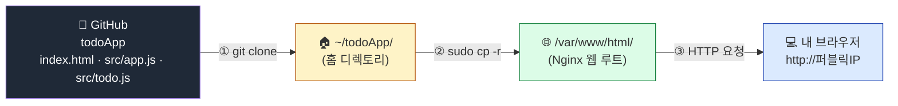
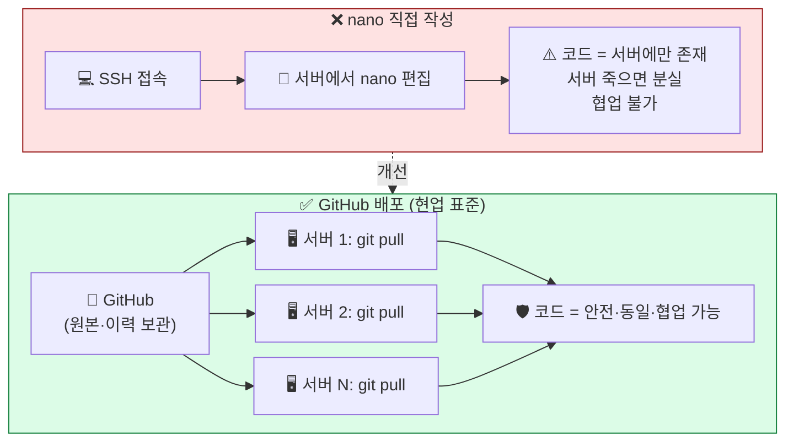

## 학습 목표

- GitHub 저장소를 EC2 서버에 `git clone`으로 받을 수 있다
- 받은 정적 사이트 파일을 Nginx 웹 루트로 복사하여 서비스할 수 있다
- 브라우저로 자신의 EC2 서버에서 동작하는 사이트를 확인할 수 있다
- 사이트의 일부를 수정하고 변경 사항이 즉시 반영되는 것을 확인한다

> ⏱ **예상 소요 시간**: 약 30분 (clone·복사 10분 + 수정·재로드 20분)

<a id="toc"></a>

## 진행 순서

1. [실습 흐름 미리보기](#part1) - 전체 그림과 강사 레포 안내
2. [GitHub에서 코드 받기 (git clone)](#part2) - 홈 디렉토리에 다운로드
3. [Nginx 웹 루트로 복사](#part3) - /var/www/html 교체
4. [브라우저에서 내 사이트 확인](#part4) - 퍼블릭 IP 새로고침
5. [HTML 한 줄 수정 → 즉시 반영](#part5) - nano로 직접 편집
6. [정리](#part7) - 체크리스트, 트러블슈팅, 다음 장 미리보기

> ℹ️ 페이지 하단의 [강사용: 레포 사전 준비](#part6) 섹션은 강사 운영 노트입니다. 수강생은 읽지 않아도 됩니다.

---

# 07장. GitHub에서 정적 사이트 배포

<a id="part1"></a>

## 1. 실습 흐름 미리보기 [↑](#toc)

지금까지 우리는 **빈 Nginx 서버**(또는 06장에서 만든 환영 페이지)를 갖고 있습니다. 이 장에서는 **강사가 GitHub에 올려둔 할 일 목록 앱 코드**를 받아 그 서버에서 서비스합니다.

### 전체 그림

```
[강사의 GitHub]
   todoApp
   ├── index.html
   └── src/
       ├── app.js
       └── todo.js
        │
        │ (1) git clone — EC2 서버의 홈 디렉토리(~)에 다운로드
        ▼
[EC2 서버: ~/todoApp/]
        │
        │ (2) sudo cp -r — Nginx 웹 루트로 복사
        ▼
[EC2 서버: /var/www/html/]
   index.html, src/
        │
        │ (3) http://퍼블릭IP — 브라우저로 접속
        ▼
[내 브라우저] → 할 일 목록 앱이 내 서버에서 동작!
```



### 강사 레포 URL

이 수업에서 사용하는 정적 사이트 코드는 아래 레포에 미리 준비되어 있습니다.

```
강사 레포 URL: https://github.com/seonjo0217/todoApp.git
```

> 받은 코드는 06장에서 띄운 환영 페이지를 대체하여 **할 일 목록 앱**으로 동작합니다. 코드를 직접 작성·수정하는 부분은 다음 과정에서 다루며, 이 장에서는 **"코드를 받아 내 서버에 띄운다"**는 흐름을 체험합니다.

---

<a id="part2"></a>

## 2. GitHub에서 코드 받기 (git clone) [↑](#toc)

### Step 1: 홈 디렉토리로 이동

```bash
cd ~
pwd
```

실행 결과:

```
/home/ubuntu
```

### Step 2: git clone 실행

```bash
git clone https://github.com/seonjo0217/todoApp.git
```

실행 결과 (예시):

```
Cloning into 'todoApp'...
remote: Enumerating objects: 7, done.
remote: Counting objects: 100% (7/7), done.
remote: Compressing objects: 100% (6/6), done.
remote: Total 7 (delta 0), reused 7 (delta 0), pack-reused 0
Receiving objects: 100% (7/7), 4.21 KiB | 4.21 MiB/s, done.
```

### Step 3: 다운로드 확인

```bash
ls
```

실행 결과:

```
todoApp
```

```bash
ls todoApp/
```

실행 결과 (예시):

```
index.html  README.md  src
```

```bash
cat todoApp/index.html | head -10
```

`<!DOCTYPE html>`로 시작하는 HTML 코드가 출력됩니다.

> 💡 받은 폴더는 단순한 디렉토리입니다. 안에 있는 `.git` 폴더가 git의 변경 이력 정보를 담고 있습니다.

---

<a id="part3"></a>

## 3. Nginx 웹 루트로 복사 [↑](#toc)

다운로드한 파일을 Nginx가 서비스하는 폴더(`/var/www/html/`)로 복사합니다.

### Step 1: 기존 기본 페이지 백업 (선택)

```bash
sudo mv /var/www/html/index.nginx-debian.html /var/www/html/index.nginx-debian.html.bak
```

> 이 단계는 생략해도 됩니다. 다음 단계에서 `index.html`을 새로 복사하면 그 파일이 우선됩니다.

### Step 2: 사이트 파일 복사

```bash
sudo cp -r ~/todoApp/* /var/www/html/
```

| 명령어 부분 | 의미 |
|------------|------|
| `sudo` | `/var/www/html/`은 관리자 권한 필요 |
| `cp -r` | 폴더(하위 포함) 통째로 복사 |
| `~/todoApp/*` | 받은 폴더 안의 **모든 파일/폴더** |
| `/var/www/html/` | 복사할 대상 위치 (Nginx 웹 루트) |

> ⚠️ `*` 뒤에 슬래시(/)가 없어야 합니다. `~/todoApp/*` 가 정확합니다.
>
> 이 방식은 입문 수업용 단순 배포입니다. 이전 배포에서 존재하던 파일이 GitHub 레포에서 삭제되어도 `/var/www/html/`에는 남을 수 있으므로, 실무에서는 배포 디렉토리를 새로 만들거나 `rsync --delete` 같은 도구로 동기화합니다.

> 💡 **`sudo`로 복사한 파일의 소유자는 `root`가 됩니다.**
> 따라서 이후 `/var/www/html/` 안의 파일을 편집할 때도 `sudo nano`처럼 sudo가 필요합니다. sudo 없이 `nano /var/www/html/index.html` 을 시도하면 저장 시 "Permission denied"가 발생합니다.

### Step 3: 복사 확인

```bash
ls /var/www/html/
```

실행 결과 (예시):

```
index.html  index.nginx-debian.html.bak  README.md  src
```

`index.html`과 `src` 폴더가 보이면 복사 성공입니다. `README.md`도 공개 웹 루트에 복사되므로, 실습용 안내 외의 비밀 정보나 내부 메모를 README에 넣지 마세요.

---

### .git 폴더는 복사되지 않음 (의도적)

`*` 와일드카드는 숨김 폴더(`.git`)를 포함하지 않습니다. **이는 의도된 동작입니다** — 웹사이트에 git 이력 정보를 노출하면 보안 사고가 됩니다.

확인:

```bash
ls -la /var/www/html/ | grep .git
```

아무 출력이 없어야 정상입니다.

> ⚠️ 웹 루트(`/var/www/html/`)에 있는 파일은 누구나 브라우저로 내려받을 수 있습니다. API 키, 비밀번호, 개인 정보, 수업 내부 자료는 이 폴더에 두지 않습니다.

---

<a id="part4"></a>

## 4. 브라우저에서 내 사이트 확인 [↑](#toc)

> "GitHub에 있던 강사 코드가 내 EC2 서버에서 서비스되는 순간!"

### 브라우저 새로고침

브라우저 주소창에 다시 퍼블릭 IP를 입력하거나, 이미 열려 있다면 **F5(새로고침)**를 누릅니다.

```
http://43.200.xxx.xxx
```

이전에 보였던 "Welcome to nginx!" 페이지(또는 06장에서 만든 환영 페이지) 대신 **할 일 목록 앱**이 표시됩니다. 🎉

직접 클릭해 보세요:

- 입력창에 텍스트를 넣고 **추가** 클릭 → 항목이 추가됩니다
- 체크박스 또는 항목 텍스트 클릭 → 완료/미완료 토글
- **삭제** 버튼 → 항목 제거
- **전체 / 미완료 / 완료** 탭 → 필터링
- 항목을 길게 잡고 위아래로 끌기 → 순서 변경

이 앱은 강사 GitHub의 코드가 **여러분의 EC2 서버**에서 그대로 실행되고 있는 것입니다.

> 💾 **데이터는 브라우저에 자동 저장됩니다.** 추가한 항목은 브라우저의 localStorage에 JSON 형식으로 저장되어, 페이지를 새로고침하거나 닫았다 다시 열어도 그대로 남아 있습니다. 단, **다른 브라우저나 다른 PC에서는 보이지 않습니다** (브라우저 단위 저장이라 그렇습니다 — 진짜 서버에 저장하려면 백엔드 + 데이터베이스가 필요한데, 이는 다음 단계 학습 주제입니다).

### 새로고침해도 옛날 페이지가 보인다면

브라우저 캐시 문제일 수 있습니다.

| 방법 | 동작 |
|------|------|
| **하드 리로드** | Mac: `Cmd + Shift + R` / Windows: `Ctrl + Shift + R` |
| **시크릿 창** | 새 시크릿/익명 창에서 다시 접속 |
| 서버에서 파일 확인 | `ls /var/www/html/` 에 `index.html`이 있는지 |

---

### Nginx가 어떻게 새 파일을 보여주는가?

`/var/www/html/`에 `index.html`이 있으면 Nginx는 이 파일을 우선 응답합니다. 우선순위는 `nginx.conf`의 `index` 지시문에 정의되어 있습니다.

```
index index.html index.htm index.nginx-debian.html;
```

`index.html`이 가장 앞에 있으므로, 같은 폴더에 둘 다 있으면 **`index.html`이 이긴다**는 뜻입니다.

---

<a id="part5"></a>

## 5. HTML 한 줄 수정 → 즉시 반영 [↑](#toc)

내 서버에서 동작하는 사이트의 일부를 직접 수정해 봅니다.

### Step 1: index.html 편집

```bash
sudo nano /var/www/html/index.html
```

nano 에디터가 열립니다. 05장에서 배운 단축키를 사용합니다.

| 단축키 | 동작 |
|--------|------|
| `Ctrl + W` | 텍스트 검색 (예: 본인 이름 넣을 위치 찾기) |
| 일반 타이핑 | 내용 수정 |
| `Ctrl + O` → Enter | 저장 |
| `Ctrl + X` | 종료 |

### Step 2: 본인 이름 / 메시지로 변경

`<h1>`이나 `<title>` 태그의 내용을 본인 이름으로 바꿔 봅니다.

```html
<!-- 변경 전 -->
<title>할 일 목록</title>
...
<h1 class="mb-4 text-2xl font-bold">할 일 목록</h1>

<!-- 변경 후 -->
<title>홍길동의 할 일 목록</title>
...
<h1 class="mb-4 text-2xl font-bold">홍길동의 할 일 목록</h1>
```

> 💡 `<h1>` 태그는 `class="mb-4 ..."` 속성을 그대로 두고 **태그 안의 글자만** 바꿉니다. 속성을 건드리면 스타일이 깨질 수 있어요.

`Ctrl + O` → Enter → `Ctrl + X` 로 저장합니다.

### Step 3: 브라우저 새로고침

브라우저에서 `F5`를 누릅니다. **수정한 내용이 즉시 반영**됩니다.

> ⚡ Nginx는 별도의 재시작 없이 디스크에서 매번 파일을 읽어 응답합니다. `sudo systemctl reload nginx` 같은 명령은 **필요하지 않습니다.**

---

### 비교: 기존 방식과의 차이

| 방식 | 흐름 | 단점 |
|------|------|------|
| **GitHub 배포 (이 장)** | 코드를 GitHub에 두고 서버에서 `git clone`/`git pull` | 추가 학습 필요 |
| nano로 직접 작성 | 서버에 SSH로 들어가 nano로 한 줄씩 입력 | 코드가 서버에만 존재, 분실 위험, 협업 불가 |

> 💡 **현업에서는 GitHub 배포가 표준**입니다. 코드를 한 곳(GitHub)에서 관리하고, 여러 서버에서 동일한 코드를 받는 구조이기 때문입니다.



---

<a id="part6"></a>

## 6. 강사용: 레포 사전 준비 [↑](#toc)

> 이 섹션은 **강사가 수업 전에 확인할 사항**입니다. 수강생은 읽지 않아도 됩니다.

### 사용 레포

```
https://github.com/seonjo0217/todoApp.git
```

### 레포 구성 (이미 푸시됨)

```
todoApp/
├── index.html       ← 메인 페이지 (Tailwind CSS CDN)
├── src/
│   ├── app.js       ← DOM 연결 코드
│   └── todo.js      ← 순수 함수 (추가/토글/삭제/필터/정렬)
├── README.md        ← 수강생용 1페이지 안내
└── .gitignore
```

### 수업 1주 전 점검 체크리스트

1. **레포가 public 인지 확인** — Settings → General → Danger Zone에서 visibility 확인
2. **테스트용 EC2에서 실제 배포 검증**
   ```bash
   cd ~ && git clone https://github.com/seonjo0217/todoApp.git
   sudo cp -r ~/todoApp/* /var/www/html/
   ```
   브라우저에서 `http://[퍼블릭IP]` 접속하여:
   - [ ] 페이지 로드 정상
   - [ ] 항목 추가 동작 (← `crypto.randomUUID()` 대체 처리되어 있는지가 핵심)
   - [ ] 체크 / 삭제 / 필터 / 드래그 정상
3. **Tailwind CDN 응답 확인** — 브라우저 개발자 도구 Network 탭에서 `cdn.tailwindcss.com` 200 응답 확인

### 코드 변경이 필요할 때

레포를 수정한 경우, 수강생 측에서는 다음 명령으로 최신화합니다.

```bash
cd ~/todoApp && git pull
sudo cp -r ~/todoApp/* /var/www/html/
```

---

<a id="part7"></a>

## 7. 정리 [↑](#toc)

### 이 장 완료 체크리스트

| 항목 | 확인 방법 | 정상 상태 |
|------|----------|----------|
| 강사 레포 clone | `ls ~/todoApp/` | `index.html`, `src/` 존재 |
| 웹 루트 복사 | `ls /var/www/html/` | `index.html`, `src/`가 보임 |
| 브라우저 접속 | `http://퍼블릭IP` 새로고침 | 할 일 목록 앱 표시 |
| 앱 동작 확인 | 항목 추가 / 체크 / 삭제 | 모두 정상 동작 |
| HTML 수정 반영 | nano로 `<h1>` 수정 후 새로고침 | 변경 내용 즉시 반영 |

---

### 트러블슈팅

| 증상 | 원인 | 해결 |
|------|------|------|
| `git clone`이 멈춤 | 인터넷 연결 또는 잘못된 URL | `ping github.com`, URL 재확인 |
| `Permission denied`로 cp 실패 | sudo 누락 | `sudo cp -r ...` 로 다시 |
| 브라우저에 옛 페이지가 그대로 | 캐시 또는 cp 미실행 | 하드 리로드 + `ls /var/www/html` 재확인 |
| 페이지는 뜨는데 스타일이 깨짐 | Tailwind CDN 일시 장애 | 잠시 후 재시도, 또는 강사에게 확인 |
| 페이지는 뜨는데 항목 추가가 안 됨 | `src/` 폴더 누락 | `ls /var/www/html/src/`로 `app.js`, `todo.js` 확인 후 재복사 |
| 빈 화면만 보임 | 자바스크립트 로딩 실패 | `ls /var/www/html/src/` 재확인, 브라우저 시크릿 창에서 재접속 |
| 새 강사 코드를 배포했는데 옛 데이터가 그대로 | localStorage 캐시 | F12 → Application → Local Storage → `todoApp.state.v1` 삭제 후 새로고침 |
| 한글이 깨짐 | meta charset 누락 | `<meta charset="UTF-8">` 확인 |
| 레포에서 지운 파일이 계속 보임 | `cp -r`은 기존 파일을 삭제하지 않음 | 웹 루트에서 불필요한 파일을 직접 삭제하거나 다음 배포 때 `rsync --delete` 방식 검토 |

---

### 핵심 명령어 요약

```bash
# 1) GitHub에서 받기
cd ~
git clone https://github.com/seonjo0217/todoApp.git

# 2) 웹 루트로 복사
sudo cp -r ~/todoApp/* /var/www/html/
# 입문 수업용 단순 복사입니다. 기존에 남은 파일은 자동 삭제되지 않습니다.

# 3) 직접 수정 (예: <h1> 제목 변경)
sudo nano /var/www/html/index.html

# 4) (선택) 강사가 레포를 업데이트한 경우 최신화
cd ~/todoApp
git pull
sudo cp -r ~/todoApp/* /var/www/html/
```

---

### 다음 장 미리보기

축하합니다! 여러분은 **GitHub의 코드를 받아 자신의 EC2 서버에서 서비스하는 전 과정**을 완성했습니다.

**08장 리소스 정리와 다음 단계**에서는:

- 오늘 만든 인프라의 전체 그림을 정리합니다
- ⚠️ **수업 후 절대 잊으면 안 되는 EC2 Terminate 절차**를 진행합니다
- 도메인 연결, Docker, RDS, S3, CI/CD 등 다음 학습 단계를 안내합니다

> ⚠️ 08장의 Terminate 실습을 빠뜨리면 Free Plan 기간과 크레딧을 불필요하게 소모합니다. Paid Plan으로 전환한 계정이라면 종량제 청구 위험도 있으니 반드시 끝까지 함께하세요.

---

[↑ 목차로](#toc)
