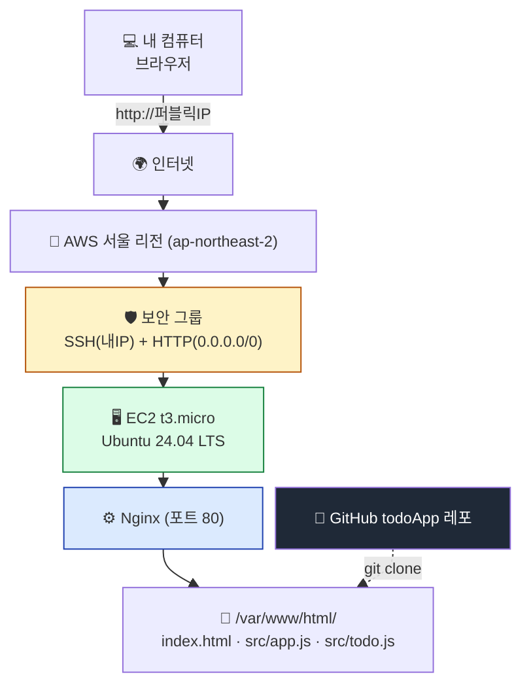
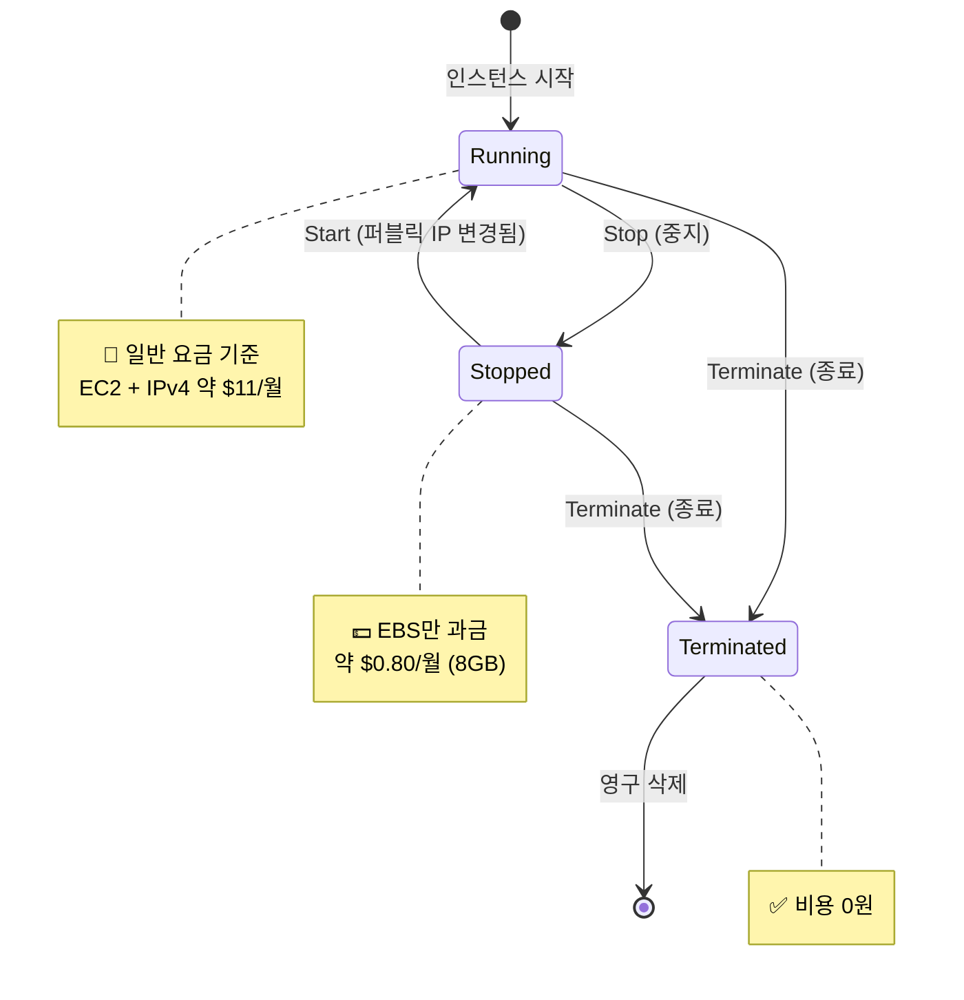
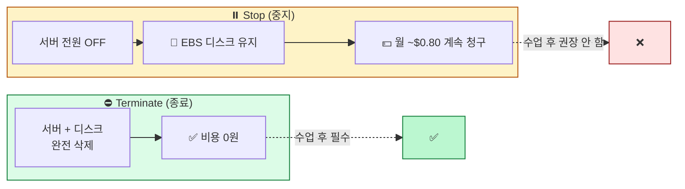
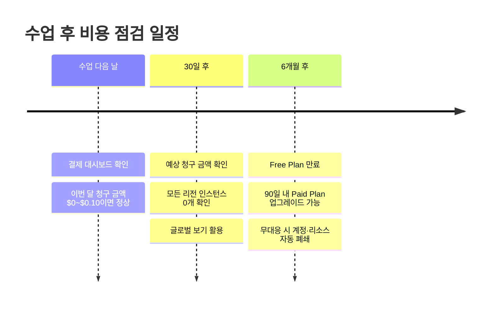
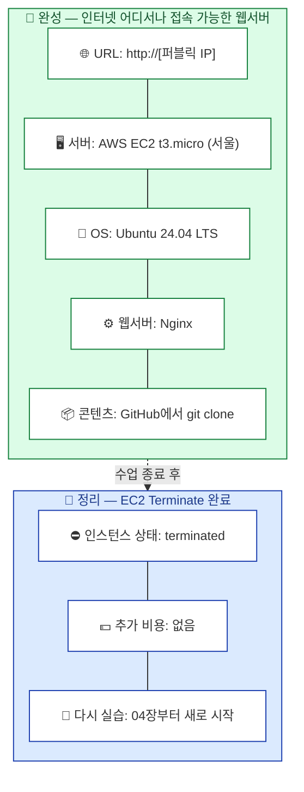

## 학습 목표

- 오늘 만든 인프라의 전체 아키텍처를 그림으로 설명할 수 있다
- EC2 인스턴스를 안전하게 종료(Terminate)하여 과금을 방지할 수 있다
- Stop과 Terminate의 차이를 이해하고 올바르게 선택할 수 있다
- 다음 학습 주제(도메인·Docker·RDS·S3·CI/CD)를 알고 있다

> ⏱ **예상 소요 시간**: 약 30분 (정리 + Terminate 20분 + 다음 학습 10분)
> 강사는 **Terminate에 최소 20분을 사수**하세요. 04~07장이 늦어지더라도 본 챕터의 종료 작업은 줄이지 말 것.

<a id="toc"></a>

## 진행 순서

1. [수업 완료 — 오늘 만든 것](#part1) - 전체 아키텍처 정리
2. [⚠️ 리소스 정리 (가장 중요!)](#part2) - EC2 Terminate 절차
3. [Stop vs Terminate 다시 짚기](#part3) - 청구 사고 예방
4. [수업 후 비용 점검 일정](#part4) - 다음 날 / 30일 / 6개월
5. [정리](#part5) - 1일 총정리

---

# 08장. 리소스 정리와 다음 단계

<a id="part1"></a>

## 1. 수업 완료 — 오늘 만든 것 [↑](#toc)

수업을 통해 구축한 전체 아키텍처를 확인합니다.

```
[내 컴퓨터/브라우저]
        │
        │ http://[퍼블릭IP]
        ▼
[인터넷]
        │
        ▼
[AWS 서울 리전 (ap-northeast-2)]
        │
        ▼
[보안 그룹: SSH(내IP) + HTTP(0.0.0.0/0)]
        │
        ▼
[EC2 인스턴스 — t3.micro]
        ├── Ubuntu 24.04 LTS (운영체제)
        ├── Nginx (웹서버, 포트 80)
        └── /var/www/html/  ← GitHub에서 git clone한 todoApp
                ├── index.html
                ├── src/app.js
                ├── src/todo.js
                └── README.md
```



**여러분은 지금 전 세계 누구나 접속할 수 있는 웹 서버를 운영하고 있습니다!**

| 구성 요소 | 역할 | 오늘 사용한 도구 |
|----------|------|----------------|
| AWS 계정 (Free Plan) | 클라우드 자원 사용 권한 | 03장 |
| Zero-Spend Budget | $0.01 과금 시 알림 | 03장 |
| EC2 인스턴스 (t3.micro) | 가상 서버(컴퓨터) | 04장 |
| Ubuntu 24.04 | 서버 운영체제 | 03~05장 |
| 보안 그룹 | 방화벽 (포트 단위 제어) | 04장 |
| 리눅스 명령어 | 서버 관리 | 05장 |
| git | GitHub에서 코드 받기 | 04, 07장 |
| Nginx | 웹서버 (HTTP 응답) | 06장 |
| GitHub 정적 사이트 | 배포한 콘텐츠 | 07장 |

---

<a id="part2"></a>

## 2. ⚠️ 리소스 정리 (가장 중요!) [↑](#toc)

> 이 섹션은 **수업에서 가장 중요한 부분**입니다. 절대 생략하지 마세요.

### 왜 정리해야 하나?

EC2 인스턴스는 **실행 중인 시간만큼 비용**이 발생합니다.

- t3.micro 서울 리전 온디맨드 요금: 약 **$0.0104/시간** (2026년 기준, 변동 가능)
- 24시간 × 30일 = 720시간 → **월 약 $7.5 (USD)**
- 일반 요금 기준으로 여기에 **퍼블릭 IPv4 시간당 $0.005** (월 약 $3.65)가 추가될 수 있습니다 → 합계 **월 약 $11**

> 💡 EC2 Free Tier 대상 계정은 EC2와 함께 쓰는 퍼블릭 IPv4에 월 750시간 무료 사용량이 적용될 수 있고, 신규 Free Plan 계정은 크레딧으로 비용이 충당될 수 있습니다. 그래도 리소스를 남겨두면 크레딧과 무료 기간을 소모하므로 수업 후 Terminate가 원칙입니다.

> ⚠️ **Free Plan은 "$200 크레딧 소진" 또는 "6개월 경과" 중 먼저 도래하는 시점에 만료됩니다.**
> 인스턴스를 24시간 켜두면 크레딧이 계속 소모되고, 크레딧이 남아 있어도 **6개월 시점에 Free Plan이 종료**됩니다. 종료 후에는 90일 안에 Paid Plan으로 업그레이드해야 계정과 리소스에 계속 접근할 수 있습니다.
>
> **수업이 끝나도 인스턴스를 끄지 않으면 Free Plan 기간과 크레딧을 불필요하게 소모합니다.** 직접 Paid Plan으로 전환하거나 자동 업그레이드 조건에 해당한 계정이라면 종량제 청구 위험도 생깁니다.

### EC2 인스턴스 종료(Terminate) 절차

```
Step 1: AWS 콘솔 → 검색창 "EC2" → EC2 대시보드
Step 2: 왼쪽 메뉴 "인스턴스(Instances)" 클릭
Step 3: 종료할 인스턴스(my-web-server) 체크박스 선택
Step 4: 상단 "인스턴스 상태(Instance state)" 드롭다운 클릭
Step 5: "인스턴스 종료(Terminate instance)" 선택
Step 6: 확인 팝업에서 "종료(Terminate)" 클릭
Step 7: 인스턴스 상태가 "shutting-down" → "terminated"로 변경되는 것 확인
```

> 상태가 `terminated`로 표시된 인스턴스는 **수십 분~1시간 후 목록에서 자동으로 사라집니다.** 사라지지 않아도 정상입니다.

### 강사 체크포인트

> 강사는 수강생 한 명 한 명이 자신의 인스턴스 상태가 `terminated`로 변경된 것을 직접 확인해야 합니다. 화면을 들어 보여주거나, 강사가 옆에서 같이 확인합니다.

---

<a id="part3"></a>

## 3. Stop vs Terminate 다시 짚기 [↑](#toc)

수강생이 가장 자주 헷갈리는 부분입니다. **다음 표를 외우세요.**

| 구분 | 중지 (Stop) | **종료 (Terminate)** |
|------|------------|------------------|
| 인스턴스 상태 | 일시 정지 (재시작 가능) | **영구 삭제** |
| EBS 디스크 | 유지 → **비용 계속 발생** | 삭제 → 비용 없음 |
| 퍼블릭 IP | 해제됨 | 해제됨 |
| 메모리/실행 중이던 프로세스 | 사라짐 | 사라짐 |
| 다시 실행 | 가능 | 불가능 (새로 만들어야 함) |
| **수업 후 권장** | ❌ 비추천 | **✅ 필수** |

> ⚠️ **"Stop만 하면 무료다"는 잘못된 정보입니다.** Stop 상태에서도 EBS 디스크 요금($0.10/GB·월 정도)은 계속 청구됩니다. 8GB면 월 $0.80 정도지만 누적되면 가벼운 금액이 아닙니다.





---

### Stop이 적절한 경우는 언제인가?

수업 끝난 후가 아니라 **다음 날 다시 같은 환경으로 이어 실습**하고 싶을 때 잠시 사용할 수 있습니다.
하지만 이 수업의 1일 강의 종료 시점에는 **반드시 Terminate**를 사용합니다.

---

<a id="part4"></a>

## 4. 수업 후 비용 점검 일정 [↑](#toc)

Terminate를 마쳤더라도, 다음 일정으로 비용을 한 번 더 점검하세요.

### 📅 다음 날 (수업 다음 날 아침)

```
AWS 콘솔 → 우측 상단 계정 이름 → "결제 및 비용 관리(Billing and Cost Management)"
→ "결제 대시보드(Billing Dashboard)"
→ "이번 달 청구 금액(Month-to-Date Spend)" 확인
```

| 정상 | 이상 |
|------|------|
| $0.00 ~ $0.10 (크레딧 적용 후) | $1 이상이 보이면 |
| | → 어떤 서비스에서 발생했는지 "비용 탐색기(Cost Explorer)" 확인 |
| | → Elastic IP 미해제, 다른 리전 인스턴스 등 점검 |

### 📅 30일 후

```
다시 결제 대시보드 → "예상 청구 금액" 확인
EC2 대시보드 → 좌측 "글로벌 보기(Global View)" → 모든 리전에서 실행 중 인스턴스 0개인지
```

### 📅 6개월 후 (Free Plan 만료 시점)

Free Plan은 6개월 또는 크레딧 소진 중 먼저 도래하는 시점에 종료됩니다. 계정을 계속 사용하려면 90일 안에 Paid Plan으로 업그레이드해야 합니다.



| 선택지 | 설명 |
|--------|------|
| 계정 유지 (Paid Plan 전환) | 계속 학습할 계획이면 이쪽 |
| 계정 폐쇄 | 더 이상 사용할 계획 없으면 콘솔에서 계정 폐쇄 |
| 무대응 | 만료 후 90일 경과 시 계정과 관련 리소스가 자동 폐쇄·삭제될 수 있음 |

> 📧 AWS는 Free Plan 만료가 임박하면 가입 이메일로 알림을 보냅니다. 가입 이메일을 잃지 않도록 관리하세요.

---

### 추가 정리 체크리스트

수업 후 아래 항목을 모두 확인하세요.

- [ ] EC2 인스턴스 상태가 `terminated`인지 확인 (서울 리전)
- [ ] **모든 리전 확인** — EC2 → 글로벌 보기에서 다른 리전에 실행 중인 인스턴스가 없는지
- [ ] **Elastic IP / 퍼블릭 IPv4** 할당받은 것이 있다면 해제 — 일반 요금 기준 시간당 $0.005 (월 약 $3.65) 부과 가능 (이 수업에서는 별도 Elastic IP를 할당하지 않음)
- [ ] **AWS Billing 대시보드**에서 예상 청구 금액 확인
- [ ] Zero-Spend Budget 알림 이메일이 안 왔는지 확인 (왔다면 어디서 과금됐는지 추적)

> 💡 **잔여 리소스 (선택, 비용 없음)**: 보안 그룹(`launch-wizard-1`)과 키 페어(`my-key`)는 인스턴스를 Terminate해도 **자동 삭제되지 않습니다**. 비용은 발생하지 않으므로 그대로 둬도 무방하나, 계정을 깔끔히 정리하려면 EC2 → 보안 그룹 / 키 페어 메뉴에서 삭제하면 됩니다.

---

<a id="part5"></a>

## 5.  1일 총정리 [↑](#toc)

오늘 하루 동안 배운 내용을 정리합니다.

| 교시 | 장 | 핵심 내용 | 키워드 |
|------|---|----------|--------|
| 1 | 01. 클라우드와 AWS 소개 | 클라우드 = 서버 대여 | IaaS, 리전, 신 Free Plan |
| 2 | 02. AWS 가입 따라하기 | Free Plan 계정 생성 + MFA | $200 크레딧, 루트 MFA |
| 3 | 03. AWS 콘솔과 비용 관리 | 콘솔 둘러보기 + Zero-Spend Budget | 서울 리전, IAM, Budgets |
| 4 | 04. EC2 생성과 접속 | 내 서버 탄생 | t3.micro, Ubuntu 24.04, 보안 그룹 |
| 5 | 05. 리눅스 기초 명령어 | 터미널에서 서버 둘러보기 | pwd/ls/cd/cat/nano, FHS |
| 6 | 06. 웹서버 Nginx 설치 | "Welcome to nginx!" → 내 환영 페이지 | apt, systemctl, /var/www/html |
| 7 | 07. GitHub 정적 사이트 배포 | todoApp이 내 서버에서 동작 | git clone, sudo cp -r, localStorage |
| 8 | 08. 리소스 정리 | **Terminate 완료** | Stop vs Terminate, 6개월 점검 |

---

### 오늘 우리가 만들고 → 안전하게 정리한 것




> 🟢 **녹색 박스**: 만든 것 / 🔵 **파란 박스**: 정리한 것 → **둘 다 끝나야 수업이 완성**됩니다.

---

### 실습 과제 (집에서 혼자 해보기)

**기본 — 다음 날 다시 EC2 만들기**

오늘 배운 03~07장을 처음부터 다시 따라해 보세요. 한 번 더 하면 손에 익습니다.

**중급 — index.html을 본인 사이트로 변경**

- 자기소개, 포트폴리오, 학습 일지 등 본인의 콘텐츠로 `index.html`을 채워 보세요.
- 본인의 GitHub 레포로 만들어 `git clone` 으로 배포해 보세요.

**심화 — 도메인 연결 (가비아·후이즈에서 도메인 구매 후 Route 53 연결)**

- 도메인 구매 (1년 약 1~2만원)
- Route 53에 호스팅 영역 생성 → A 레코드를 EC2 퍼블릭 IP에 연결
- `mysite.com`으로 본인 사이트 접속

---

### 마치며

> **수고하셨습니다!** 오늘 한 일은 단순한 따라하기가 아니라,
> 실제 회사에서 웹 서비스를 배포하는 흐름의 **축소판**입니다.
>
> - 클라우드 계정 → 서버 생성 → OS 환경 구성 → 웹서버 → 코드 배포 → 운영 정리
>
> 이 흐름을 이해했다는 것은, 더 큰 규모의 시스템도 같은 원리로 확장하면 된다는 뜻입니다.
>
> 오늘 배운 내용이 여러분의 클라우드 첫 걸음이 되길 바랍니다.
> **리소스 정리(Terminate) 꼭 완료하셨나요?** 마지막으로 한 번 더 확인해 주세요.

---

[↑ 목차로](#toc)
