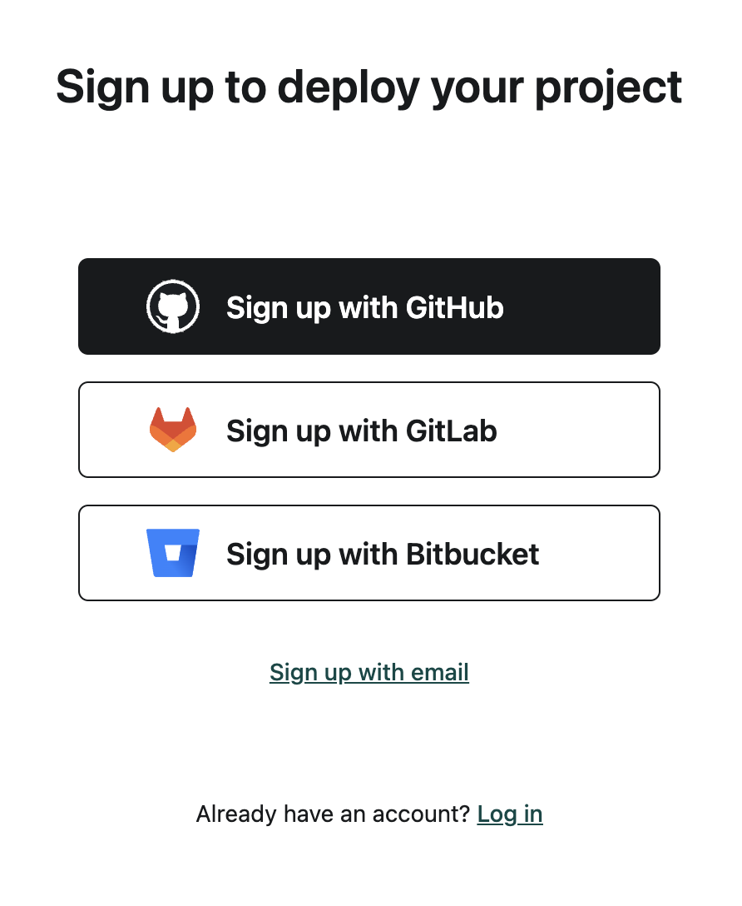
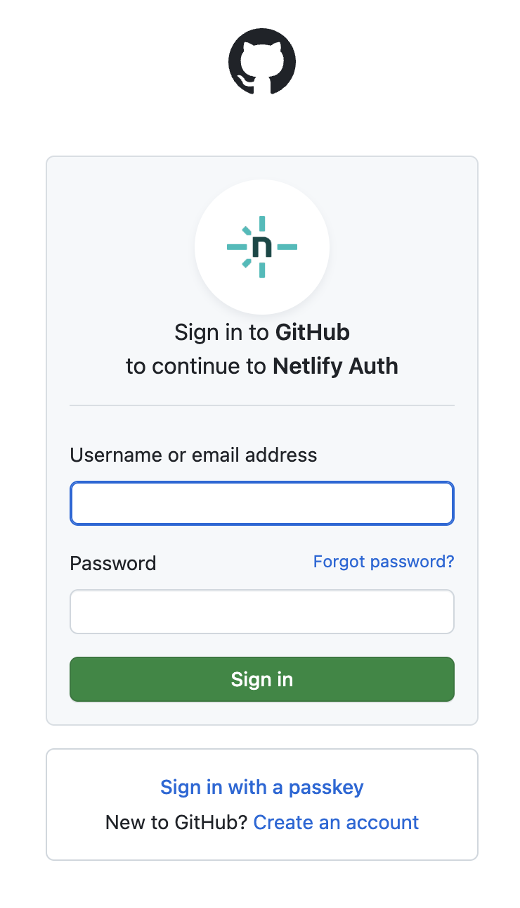
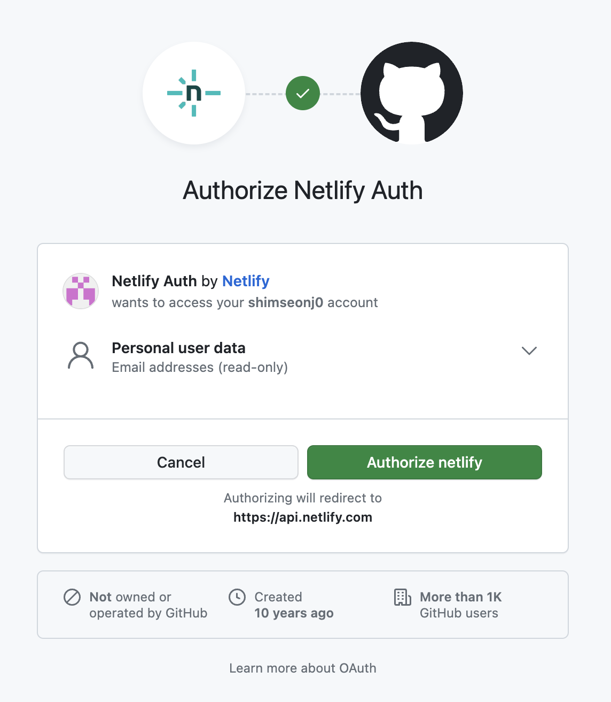
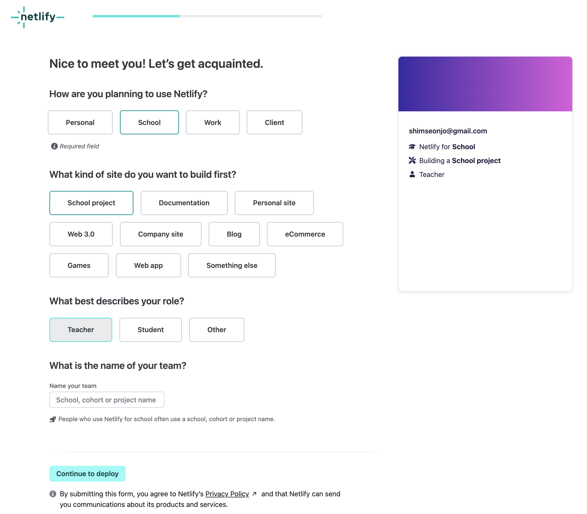
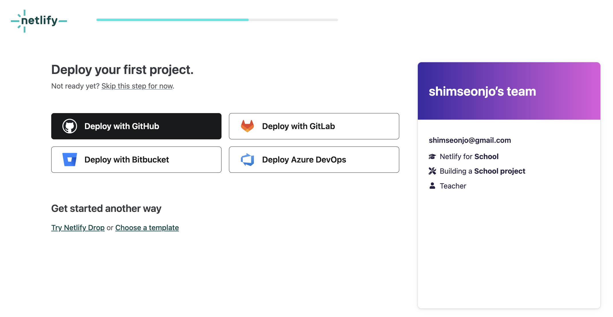
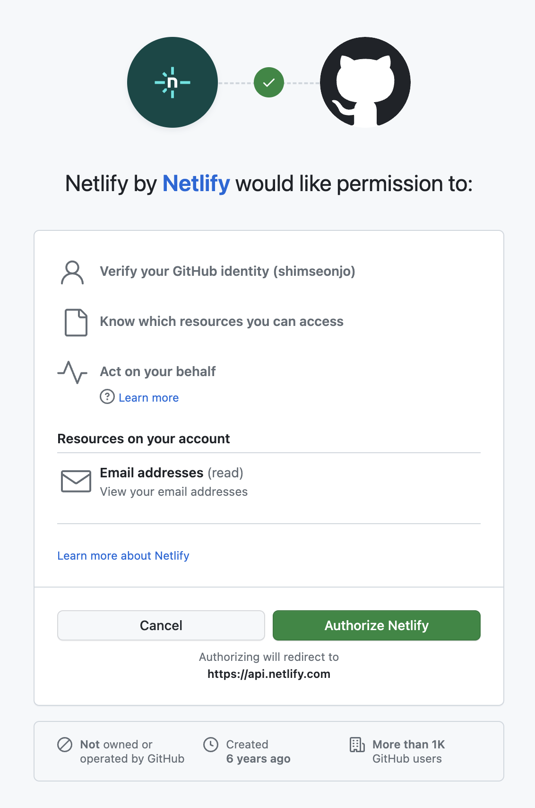
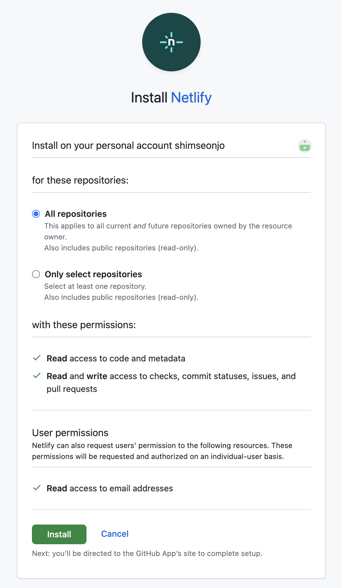
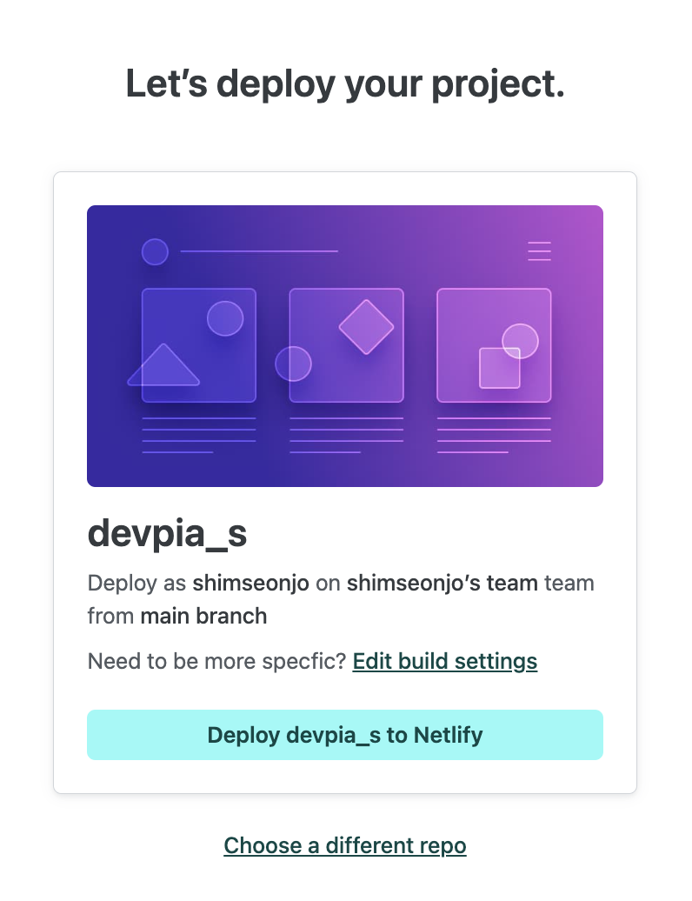

# Netlify Deploy
## 1. netlify 사이트 로그인

## 2. github로 사이트 가입

## 3. github 계정과 비밀번호 입력

## 4. "Authorize netlify" 클릭

## 5. 조직명 입력

## 6. 해당 내용 선택하고 "Contiune to deploy" 클릭

## 7. "Deploy with GitHub" 클릭

## 8. "Authorize netlify" 클릭

## 8. "install" 클릭

## 9. "Deploy 레파지토리 이름 to Netlify" 

