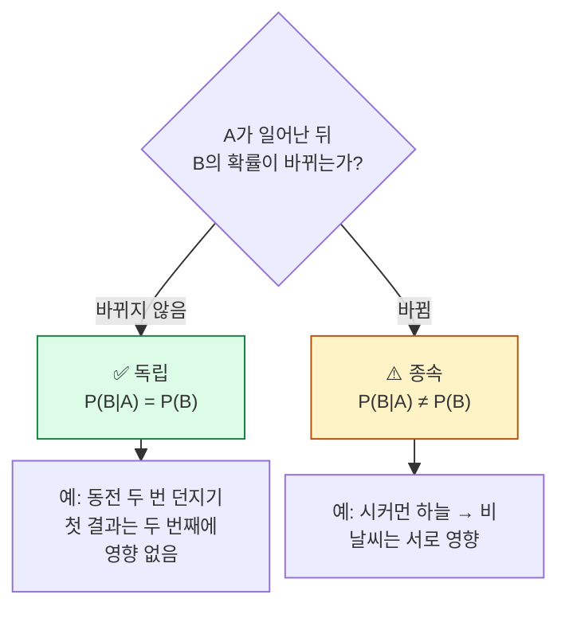
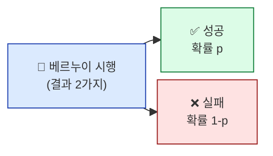

## 학습 목표

- 확률이 무엇이고 ML에서 어떻게 쓰이는지 비유로 설명할 수 있다
- **조건부확률**, **덧셈정리**, **곱셈정리**의 의미를 안다
- **독립**과 **종속**의 차이를 일상 예로 구분할 수 있다
- 이산확률분포(베르누이·이항)의 모양과 의미를 이해한다

<a id="toc"></a>

## 진행 순서

1. [확률이란 무엇인가](#part1) - 일기예보부터 ML 모델 출력까지
2. [조건부확률과 독립](#part2) - "이미 알고 있을 때" 확률
3. [덧셈정리와 곱셈정리](#part3) - 확률 계산의 기본 규칙
4. [이산확률분포 — 베르누이와 이항](#part4) - 동전 던지기에서 ML 분류까지
5. [실습 — 아이템 강화 시뮬레이션](#part5) - 표본을 직접 뽑아 확률 검증
6. [ML/DL 연결](#part6) - 분류 모델의 출력이 곧 확률

---

# 01장. 확률 기초

<a id="part1"></a>

## 1. 확률이란 무엇인가 [↑](#toc)

### 일기예보 비유

> "내일 비 올 확률 60%" — 이 한 문장이 우리가 아는 가장 친숙한 확률입니다.
> **확률은 "일어날 가능성을 0~1 사이의 숫자로 표현한 것"**입니다.

| 표현 | 의미 |
|------|------|
| 확률 = 0 | 절대 일어나지 않음 (불가능) |
| 확률 = 0.5 | 반반 |
| 확률 = 1 | 반드시 일어남 (확실) |

### 어디서 마주치게 되나?

- **스팸 메일 필터**: "이 메일이 스팸일 확률 87%"
- **얼굴 인식**: "이 사진이 본인일 확률 95%"
- **추천 시스템**: "당신이 이 영화를 좋아할 확률 73%"
- **자율주행**: "앞에 사람이 있을 확률 99.8%"

> 💡 **ML 모델이 출력하는 숫자는 거의 모두 확률**입니다. 그래서 ML을 이해하려면 확률을 알아야 합니다.

### 용어 정리 — 짧고 명확하게

| 용어 | 한 줄 설명 | 예 |
|------|----------|------|
| **시행(trial)** | 결과가 나오는 한 번의 행위 | 동전 1번 던지기 |
| **사건(event)** | 시행에서 우리가 관심 있는 결과 | "앞면이 나옴" |
| **표본공간(sample space)** | 가능한 모든 결과의 모음 | 동전: {앞, 뒤} |
| **확률 P(A)** | 사건 A가 일어날 가능성 | P(앞면) = 0.5 |

---

<a id="part2"></a>

## 2. 조건부확률과 독립 [↑](#toc)

### 우산 비유

> 아침에 일어나서 창밖을 봅니다.
> - **그냥** "비 올 확률"은 30%라고 합시다.
> - 그런데 **하늘이 시커멓다는 걸 본 다음에** "비 올 확률"은 80%로 올라갑니다.
>
> **새로운 정보가 들어오면 확률이 바뀝니다.** 이게 바로 **조건부확률**입니다.

```
P(B | A) = "A가 일어났다는 조건 하에서, B가 일어날 확률"

읽기: P(비 | 시커먼 하늘) = 0.8
       └─ "시커먼 하늘을 본 다음에 비가 올 확률"
```

> 📌 `|`(파이프) 기호는 "~라는 조건 하에"로 읽습니다. 수직선처럼 보이는 그 기호입니다.

### 독립 vs 종속 — 한 사건이 다른 사건에 영향을 주는가



| 상황 | 독립? 종속? | 이유 |
|------|------------|------|
| 동전 던지기 두 번 | **독립** | 첫 번째 결과가 두 번째에 영향 없음 |
| 카드를 뽑고 돌려놓지 않고 또 뽑기 | **종속** | 첫 카드가 두 번째 풀에 영향 |
| 출근 길 비 / 점심 메뉴 | **독립** | 서로 관계없음 |
| 어제 비 / 오늘 비 | **종속** | 날씨는 연속성이 있음 |

> 💡 **ML 모델은 "각 데이터(샘플)가 서로 독립이다"라는 가정을 자주 사용**합니다. 이 가정이 깨지면(예: 시계열) 다른 종류의 모델을 써야 합니다.

---

<a id="part3"></a>

## 3. 덧셈정리와 곱셈정리 [↑](#toc)

확률 계산의 두 가지 기본 규칙입니다. 둘 다 일상 직관과 일치합니다.

### 덧셈정리 — "또는(OR)"의 확률

> "주사위를 굴려서 **1 또는 6이 나올 확률**은?"
>
> 1이 나올 확률 1/6, 6이 나올 확률 1/6 → **합치면 2/6**.

```
P(A 또는 B) = P(A) + P(B) — A와 B가 동시에 일어날 수 없을 때 (배반)

P(A 또는 B) = P(A) + P(B) - P(A 그리고 B) — 동시에 일어날 수 있을 때
                              └─ 중복 빼기
```

**중복 빼기 예시**: 어떤 반에서 "수학 좋아하는 학생 또는 영어 좋아하는 학생"의 확률을 구할 때, **둘 다 좋아하는 학생을 한 번 빼야** 정확합니다.

### 곱셈정리 — "그리고(AND)"의 확률

> "동전을 **두 번 던져 모두 앞면이 나올 확률**은?"
>
> 첫 번째 앞면 1/2, 두 번째도 앞면 1/2 → **곱하면 1/4**.

```
P(A 그리고 B) = P(A) × P(B|A)

독립일 때:
P(A 그리고 B) = P(A) × P(B)  — 곱하기만 하면 됨
```

> 💡 **곱셈정리는 ML의 핵심 도구**입니다. 데이터가 N개 있을 때 "모든 데이터가 이 모델에서 나왔을 확률" = 각 데이터의 확률을 모두 곱한 값 → 이것이 **우도(likelihood)** 입니다. 모듈 7에서 다시 만납니다.

---

<a id="part4"></a>

## 4. 이산확률분포 — 베르누이와 이항 [↑](#toc)

### 확률분포란?

> **"어떤 사건이 어떤 확률로 일어나는지 정리한 표"** 라고 생각하면 됩니다.

| 동전 결과 | 확률 |
|----------|------|
| 앞면 | 0.5 |
| 뒷면 | 0.5 |

이게 바로 **확률분포**입니다. 모든 가능한 결과와 각각의 확률을 짝지어 놓은 것.

> 📌 결과가 셀 수 있는 점들(앞/뒤, 1~6, 0~10명...)이면 **이산(discrete)**, 매끄럽게 이어지면 **연속(continuous)**. 모듈 3에서 연속분포를 자세히 다룹니다.

### 베르누이 분포 — "성공이냐 실패냐" 1번

가장 단순한 분포. **결과가 단 두 가지인 시행**의 확률분포입니다.



| 예시 | 성공 | 실패 | 성공 확률 p |
|------|------|------|------------|
| 동전 던지기 1번 | 앞 | 뒤 | 0.5 |
| 환자 검사 1명 | 양성 | 음성 | 검사 정확도에 따라 |
| 이메일 1개 | 스팸 | 정상 | 스팸 비율 |
| **ML 이진분류 1개 샘플** | **클래스 1** | **클래스 0** | **모델이 출력한 확률** |

> 💡 **로지스틱 회귀는 본질적으로 베르누이 분포의 확률 p를 추정하는 모델**입니다. 모듈 6에서 만납니다.

### 이항 분포 — 베르누이를 N번 반복

베르누이 시행을 **N번 반복했을 때, 성공이 k번 나올 확률**의 분포.

```
예: 동전을 10번 던졌을 때, 앞면이 정확히 6번 나올 확률은?
    → P(X = 6) ≈ 0.205
```

**이항분포의 모양 (N=10, p=0.5)**:

```
횟수 k │ 확률 P(X=k)
   0   │ ▏0.001
   1   │ ▎0.010
   2   │ ▆ 0.044
   3   │ ████ 0.117
   4   │ ████████ 0.205
   5   │ █████████ 0.246  ← 가장 자주 나옴 (기댓값 = N×p = 5)
   6   │ ████████ 0.205
   7   │ ████ 0.117
   8   │ ▆ 0.044
   9   │ ▎0.010
  10   │ ▏0.001
```

> 💡 **N이 매우 커지면 이항분포는 정규분포 모양**에 가까워집니다 (모듈 3의 중심극한정리).

---

<a id="part5"></a>

## 5. 실습 — 아이템 강화 시뮬레이션 [↑](#toc)

게임에서 **+9 → +10 강화 성공 확률 10%**라고 합시다. 1000명이 시도하면 몇 명이 성공할까요?

### Step 1: 라이브러리 불러오기

```python
import numpy as np
from scipy import stats
```

### Step 2: 시뮬레이션 — 1000명이 한 번씩 시도

```python
n_players = 1000
success_prob = 0.10  # 강화 성공 확률 10%

# 베르누이 시행 1000번 (1 = 성공, 0 = 실패)
results = np.random.binomial(n=1, p=success_prob, size=n_players)
print(f"성공한 사람 수: {results.sum()}명")
print(f"성공률: {results.mean():.3f}")
```

**예상 출력 (난수라 매번 다름)**:
```
성공한 사람 수: 96명
성공률: 0.096
```

### Step 3: 결과 해석

| 항목 | 값 | 의미 |
|------|---|------|
| 이론 성공 확률 | 0.10 | 게임이 약속한 확률 |
| 실측 성공률 | 0.096 | 실제 시뮬레이션 결과 |
| 차이 | 0.004 | 표본 크기가 작아서 생기는 오차 |

> 💡 **표본이 적으면 확률은 흔들립니다.** 10명만 시도하면 0명이 성공할 수도 있고, 3명이 성공할 수도 있습니다. **표본이 클수록 실측값이 이론 확률에 가까워집니다** (대수의 법칙).

### Step 4: 이항분포로 "정확히 100명이 성공할 확률"

```python
# N=1000, p=0.1일 때 정확히 100번 성공할 확률
exact_100 = stats.binom.pmf(k=100, n=1000, p=0.1)
print(f"정확히 100명 성공 확률: {exact_100:.4f}")

# 90명 이상 110명 이하로 성공할 확률
range_prob = stats.binom.cdf(110, 1000, 0.1) - stats.binom.cdf(89, 1000, 0.1)
print(f"90~110명 성공 확률: {range_prob:.4f}")
```

**예상 출력**:
```
정확히 100명 성공 확률: 0.0421
90~110명 성공 확률: 0.7501
```

| 함수 | 의미 |
|------|------|
| `stats.binom.pmf(k, n, p)` | "정확히 k번 성공할 확률" |
| `stats.binom.cdf(k, n, p)` | "k번 이하 성공할 확률" (누적) |

> 💡 **해석 포인트**: "정확히 100명이 성공할 확률이 4.2%밖에 안 된다"는 직관에 어긋날 수 있습니다. 한 점(정확히 100)에 모일 확률은 낮고, **범위(90~110)** 로 보면 75%로 훨씬 자연스럽습니다. 확률은 **점이 아니라 범위로 사고**해야 합니다.

---

<a id="part6"></a>

## 6. ML/DL 연결 [↑](#toc)

> 🔗 **이 모듈이 ML/DL에서 어떻게 쓰이나**

### 1) 분류 모델의 출력 = 확률

```python
# 가상의 ML 분류 결과
model.predict_proba([email])  # → [[0.13, 0.87]]
                              #     정상  스팸
```

이 `0.87`이 바로 **확률**입니다. 이 모델은 "이 메일은 스팸일 확률이 87%"라고 말하고 있습니다.

### 2) 독립 가정 = ML 학습의 전제

대부분의 ML 모델은 **"각 데이터(샘플)가 독립이다"** 라고 가정합니다. 이 가정이:

- ✅ **성립**: 일반 분류·회귀 → 표준 모델 OK
- ⚠️ **깨짐**: 시계열, 텍스트(단어 순서), 시퀀스 → RNN/LSTM/Transformer 같은 시계열 모델 필요

### 3) 곱셈정리 → 우도 → 손실함수

**N개 데이터가 모두 이 모델에서 나왔을 확률** = 각 데이터 확률의 곱
→ 이것이 **우도(likelihood)** → 로그 씌우면 **로그 우도** → 음수 씌우면 **손실함수**

```
P(전체 데이터 | 모델) = P(d₁) × P(d₂) × ... × P(dN)
                          ↓ log
log P(전체 데이터 | 모델) = log P(d₁) + log P(d₂) + ...
                          ↓ 음수
손실(Loss) = -log 우도
```

> 모듈 7에서 이 흐름을 본격적으로 다룹니다. 지금은 **"확률을 곱하고 로그를 씌우면 ML 손실이 된다"** 정도만 기억하면 됩니다.

### 4) 베르누이 → 로지스틱 회귀 → 단일 뉴런

```
베르누이 분포 (성공 확률 p)
       ↓ p를 입력으로부터 추정
로지스틱 회귀 (모듈 6)
       ↓ 같은 구조
신경망의 뉴런 1개 (DL 과정)
```

**이진분류 모델은 모두 베르누이 분포의 후예**입니다.

---

## 7. 정리

### 이 장 한 줄 요약
> 확률은 **0~1 사이의 가능성 점수**이고, ML 모델은 거의 모두 이 점수를 출력하거나 학습한다.

### 자가 진단 체크리스트

| 항목 | 확인 |
|------|:---:|
| "조건부확률"의 `|` 기호를 읽을 수 있다 | ☐ |
| 독립과 종속을 일상 예로 구분할 수 있다 | ☐ |
| 덧셈정리(OR)와 곱셈정리(AND)를 구분한다 | ☐ |
| `np.random.binomial`로 시뮬레이션을 돌릴 수 있다 | ☐ |
| `stats.binom.pmf`와 `stats.binom.cdf` 의 차이를 안다 | ☐ |
| **"분류 모델 출력 = 확률"** 을 이해한다 | ☐ |

### 핵심 용어

| 용어 | 한 줄 의미 |
|------|----------|
| 시행 / 사건 | 한 번 해보기 / 관심 있는 결과 |
| 조건부확률 `P(B|A)` | A를 알고 있을 때의 B 확률 |
| 독립 | 한 사건이 다른 사건에 영향 없음 |
| 베르누이 분포 | 결과가 2가지인 1회 시행 |
| 이항 분포 | 베르누이를 N번 반복 |
| **우도** | "데이터가 이 모델에서 나왔을 가능성" (모듈 7) |
