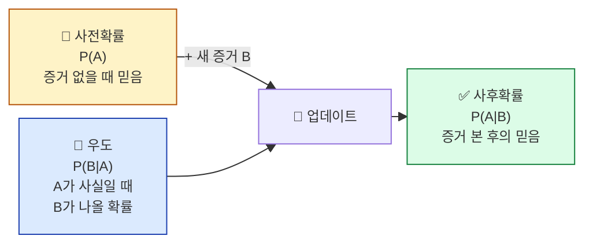
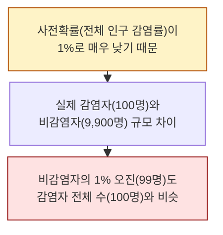

## 학습 목표

- **베이즈 정리**의 직관을 일상 비유로 설명할 수 있다
- **사전확률 / 우도 / 사후확률**의 의미를 구분할 수 있다
- 새로운 증거가 들어오면 확률이 어떻게 **업데이트**되는지 안다
- Naive Bayes 스팸 필터의 동작 원리를 설명할 수 있다

<a id="toc"></a>

## 진행 순서

1. [핵심 직관 — "정보가 들어오면 믿음을 업데이트한다"](#part1)
2. [베이즈 정리 — 식의 의미만](#part2)
3. [코로나 검사 역설 — 가장 유명한 예](#part3)
4. [스팸 필터 — Naive Bayes의 직관](#part4)
5. [실습 — Naive Bayes로 메일 분류](#part5)
6. [ML/DL 연결](#part6)
7. [정리](#part7)

---

# 02장. 베이지안 사고

<a id="part1"></a>

## 1. 핵심 직관 — 정보가 들어오면 믿음을 업데이트한다 [↑](#toc)

### 탐정 비유

> **셜록 홈즈가 사건 현장에 도착했습니다.** 처음에는 용의자 5명에 대해 똑같이 "각 20% 확률로 범인일 것"이라고 생각합니다.
>
> 그런데 **단서가 하나씩 발견될 때마다**:
> - 용의자 A의 옷에서 혈흔 발견 → A가 범인일 확률 ↑
> - 용의자 B는 알리바이가 입증됨 → B가 범인일 확률 ↓
>
> **새 증거가 들어올 때마다 각 용의자에 대한 확률(믿음)을 조정**합니다. 이게 바로 **베이지안 사고**입니다.

### 베이지안 vs 일반 통계

| 관점 | 빈도주의(전통 통계) | 베이지안 |
|------|------------------|---------|
| 확률의 의미 | "장기 반복 시 비율" | "현재의 믿음 정도" |
| 비유 | 동전을 1만 번 던져서 측정 | 정보가 모일 때마다 의견을 수정 |
| ML 활용 | t검정, 신뢰구간 | Naive Bayes, 베이지안 신경망 |

> 💡 **둘 다 옳습니다.** 다만 **ML/DL에서는 베이지안 사고가 훨씬 자주 쓰입니다.** 데이터가 추가될 때마다 모델의 믿음을 업데이트하는 것이 곧 학습이기 때문입니다.

---

<a id="part2"></a>

## 2. 베이즈 정리 — 식의 의미만 [↑](#toc)

### 식

```
P(A | B) = P(B | A) × P(A) / P(B)
  └ 사후    └ 우도   └ 사전   └ 정규화
```

**겁먹지 마세요.** 우리는 식을 외우지 않고 **각 부분의 이름과 의미**만 알면 됩니다.

### 각 부분의 이름



| 이름 | 한 줄 의미 | 탐정 비유 |
|------|----------|---------|
| **사전(Prior) P(A)** | 증거 보기 전에 가진 믿음 | 처음엔 5명 모두 20% |
| **우도(Likelihood) P(B|A)** | "A가 진짜라면 B 증거가 나올 가능성" | "범인이라면 옷에 혈흔이 묻었을 가능성?" |
| **사후(Posterior) P(A|B)** | 증거 본 후의 업데이트된 믿음 | 혈흔 본 뒤 "A가 범인일 확률 65%" |
| 정규화 P(B) | 모든 가능성을 더해 1로 맞춤 | (수학적 보정, 직관적 의미는 작음) |

> 💡 **핵심 직관**: 사전 × 우도 ∝ 사후. **현재의 믿음에 새 증거를 곱하면 새 믿음이 된다.**

---

<a id="part3"></a>

## 3. 코로나 검사 역설 — 가장 유명한 예 [↑](#toc)

> **상황**: 인구의 1%가 실제 감염자입니다. 검사 키트는 정확도가 **99%** 입니다.
> 양성 판정을 받은 사람이 **실제 감염일 확률**은 얼마일까요?

직관: "99% 정확하니까 양성이면 99% 감염!" — **틀렸습니다.**

### 계산 (식보다 표로 이해)

10,000명을 검사한다고 가정합시다.

| 구분 | 실제 감염 (1%) | 실제 비감염 (99%) | 합계 |
|------|-------------|-----------------|------|
| 검사 양성 | **99명** (감염자 중 99%) | **99명** (비감염자 중 1% 오류) | 198명 |
| 검사 음성 | 1명 | 9,801명 | 9,802명 |

```
양성 판정 198명 중에서
  → 실제 감염: 99명
  → 실제 비감염(오진): 99명

P(감염 | 양성) = 99 / 198 = 50%
```

**충격 결과**: 검사 정확도가 99%여도, **양성 판정이 실제 감염일 확률은 단 50%**!

### 왜 그런가?



> 💡 **핵심 교훈**: **사전확률(전체 발병률)이 낮으면, 검사의 정확도가 높아도 양성의 의미가 약해진다.** 이는 ML 분류 모델에서 **클래스 불균형 문제**와 정확히 같은 구조입니다 (모듈 8에서 다시).

---

<a id="part4"></a>

## 4. 스팸 필터 — Naive Bayes의 직관 [↑](#toc)

이메일 한 통이 들어왔습니다. 본문에 **"무료", "당첨", "지금"** 같은 단어가 있다면 스팸일 가능성이 큽니다.

### 베이지안 스팸 필터의 단순한 논리

```
P(스팸 | "무료") = P("무료" | 스팸) × P(스팸) / P("무료")
   사후          ←        우도          ×    사전
```

| 부분 | 어떻게 구하나? |
|------|--------------|
| P(스팸) | 받은 메일 중 스팸 비율 (예: 30%) |
| P("무료" | 스팸) | 스팸 메일 중 "무료"가 들어있는 비율 |
| P("무료") | 전체 메일 중 "무료"가 들어있는 비율 |

### "Naive"한 이유

**여러 단어가 있을 때**:
```
P(스팸 | "무료", "당첨", "지금")
= P(스팸) × P("무료"|스팸) × P("당첨"|스팸) × P("지금"|스팸) / ...
```

각 단어가 **독립**이라고 가정하고 그냥 곱합니다. 실제로는 단어 간 의존성이 있지만(예: "당첨"이 있으면 "지금"도 있을 확률 ↑), **이 단순한 가정만으로도 매우 잘 작동**합니다. 그래서 "Naive(순진한)" Bayes입니다.

> 💡 **데이터가 많을수록 가정의 불완전함을 데이터가 보완**합니다. 모듈 1의 곱셈정리(독립일 때)와 직접 연결됩니다.

---

<a id="part5"></a>

## 5. 실습 — Naive Bayes로 메일 분류 [↑](#toc)

### Step 1: 라이브러리 + 가상 데이터

```python
from sklearn.feature_extraction.text import CountVectorizer
from sklearn.naive_bayes import MultinomialNB
from sklearn.pipeline import make_pipeline

# 학습용 메일 (한국어 가정. 실무는 더 큰 데이터셋)
mails = [
    "지금 무료 당첨 클릭하세요",  # 스팸
    "한정 특가 무료 배송",        # 스팸
    "할인 쿠폰 당첨 안내",        # 스팸
    "회의 자료 첨부합니다",       # 정상
    "내일 점심 약속 확인",        # 정상
    "프로젝트 진행 현황 공유",    # 정상
]
labels = [1, 1, 1, 0, 0, 0]  # 1=스팸, 0=정상
```

### Step 2: 모델 학습 (베이즈 식이 내부에서 자동 계산됨)

```python
model = make_pipeline(CountVectorizer(), MultinomialNB())
model.fit(mails, labels)
```

### Step 3: 새 메일 분류 + 확률 출력

```python
new_mails = [
    "지금 무료 쿠폰 받으세요",
    "회의 일정 변경 안내",
]
predictions = model.predict(new_mails)
probabilities = model.predict_proba(new_mails)

for mail, pred, prob in zip(new_mails, predictions, probabilities):
    label = "스팸" if pred == 1 else "정상"
    print(f"[{label}] '{mail}'")
    print(f"  정상 확률: {prob[0]:.3f} / 스팸 확률: {prob[1]:.3f}")
```

**예상 출력**:
```
[스팸] '지금 무료 쿠폰 받으세요'
  정상 확률: 0.018 / 스팸 확률: 0.982
[정상] '회의 일정 변경 안내'
  정상 확률: 0.872 / 스팸 확률: 0.128
```

### 결과 해석

| 출력 | 의미 |
|------|------|
| `predict()` | 가장 확률이 높은 클래스 (예측 라벨) |
| `predict_proba()` | **각 클래스에 대한 사후확률** |
| 0.982 | "이 메일은 98.2% 확률로 스팸이다" → 베이즈 정리의 P(스팸 | 단어들) |

> 💡 **`predict_proba`가 출력하는 두 숫자**가 바로 사후확률 P(클래스 | 단어)입니다. ML 모델의 출력은 모두 이런 식의 베이지안 업데이트의 결과로 볼 수 있습니다.

---

<a id="part6"></a>

## 6. ML/DL 연결 [↑](#toc)

> 🔗 **이 모듈이 ML/DL에서 어떻게 쓰이나**

### 1) "학습 = 베이지안 업데이트"

모델이 데이터를 보기 전엔 가중치(파라미터)가 무작위입니다 = **사전**. 데이터를 한 배치씩 보면서 가중치를 조정합니다 = **사후 업데이트**. 모든 ML 학습은 본질적으로 **데이터를 보고 모델의 믿음을 업데이트하는 과정**입니다.

### 2) 분류기 출력 = 사후확률

| 함수 | 의미 |
|------|------|
| `model.predict()` | 사후확률이 가장 큰 클래스를 선택 |
| `model.predict_proba()` | 클래스별 사후확률 자체 |

GPT 같은 언어 모델도 마찬가지 — **"다음 단어로 X가 나올 사후확률"** 을 출력합니다.

### 3) 코로나 검사 역설 = 클래스 불균형

- 사전확률(병에 걸린 비율)이 낮으면 → 양성도 신뢰도 낮음
- ML에서 **불균형 데이터**(스팸 vs 정상이 1:99) 학습 시 모델이 "모두 정상"이라고만 해도 정확도 99%
- 그래서 정밀도/재현율(precision/recall)이라는 다른 지표를 봅니다 (모듈 8)

### 4) 베이즈 정리 → 베이지안 네트워크 → 베이지안 신경망

베이즈 정리는 그래프 모델(베이지안 네트워크)과 베이지안 신경망(BNN)의 출발점. 최근에는 **불확실성을 추정하는 LLM**(예: "이 답에 80% 자신 있음")에서 부활하고 있습니다.

---

<a id="part7"></a>

## 7. 정리 [↑](#toc)

### 이 장 한 줄 요약
> **베이지안 사고 = "정보가 들어올 때마다 믿음을 업데이트한다"**. ML 학습이 곧 이 과정이다.

### 자가 진단 체크리스트

| 항목 | 확인 |
|------|:---:|
| 사전·우도·사후의 의미를 말로 설명할 수 있다 | ☐ |
| 코로나 검사 역설이 왜 50%인지 설명할 수 있다 | ☐ |
| "Naive"가 왜 Naive인지 안다 | ☐ |
| `predict_proba`의 출력이 사후확률임을 안다 | ☐ |
| ML 학습 = 베이지안 업데이트 비유를 이해한다 | ☐ |
