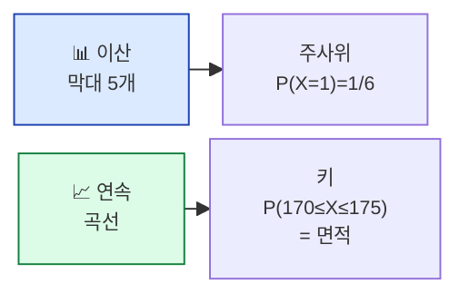
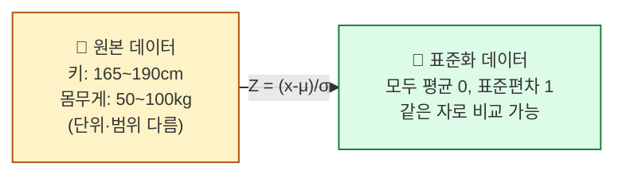

## 학습 목표

- **이산분포**와 **연속분포**의 차이를 안다
- **정규분포(종 모양)** 의 의미와 ML에서 왜 중요한지 안다
- **표준화(Standardization)** 가 무엇이고 왜 하는지 설명할 수 있다
- **중심극한정리(CLT)** 의 직관을 이해한다

<a id="toc"></a>

## 진행 순서

1. [이산 vs 연속 — 분포의 두 종류](#part1)
2. [정규분포 — 세상의 절반은 종 모양](#part2)
3. [표준화 — 다른 단위를 같은 자로 재기](#part3)
4. [중심극한정리 — 통계의 마법](#part4)
5. [실습 — 표준화와 정규성 확인](#part5)
6. [ML/DL 연결](#part6)
7. [정리](#part7)

---

# 03장. 확률분포와 정규분포

<a id="part1"></a>

## 1. 이산 vs 연속 — 분포의 두 종류 [↑](#toc)

### 비교 한 표로

| 구분 | 이산(Discrete) | 연속(Continuous) |
|------|--------------|-----------------|
| 결과 | 셀 수 있는 점 | 매끄럽게 이어진 값 |
| 예시 | 동전 결과, 주사위, 자식 수 | 키, 몸무게, 온도, 시간 |
| 그래프 | 막대그래프 | 곡선 |
| "확률" | 각 점의 높이 | 곡선 아래 **면적** |

> 💡 **연속분포의 핵심**: "키가 정확히 173.0000cm일 확률"은 0입니다(점). 대신 **"170~175cm 사이일 확률"** (면적)을 말합니다.



---

<a id="part2"></a>

## 2. 정규분포 — 세상의 절반은 종 모양 [↑](#toc)

### 어디서나 보이는 종 모양

- 사람의 키 / 몸무게
- 시험 점수
- 측정 오차
- IQ 점수
- 회귀 모델의 잔차

이런 데이터는 **양쪽 꼬리는 드물고 가운데가 가장 많은** 종(bell) 모양을 띕니다. 이것이 **정규분포(Normal Distribution)** 입니다.

```
          ▒▒▒▒▒
       ▒▒▒▒▒▒▒▒▒▒▒              ← 평균(μ) 주변에 가장 많이 몰림
    ▒▒▒▒▒▒▒▒▒▒▒▒▒▒▒
  ▒▒▒▒▒▒▒▒▒▒▒▒▒▒▒▒▒▒▒
▒▒▒▒▒▒▒▒▒▒▒▒▒▒▒▒▒▒▒▒▒▒▒
─────┬─────────┬─────
     μ-σ       μ+σ        ← 표준편차(σ)가 폭을 결정
```

### 정규분포를 결정하는 두 숫자

| 기호 | 이름 | 의미 |
|------|------|------|
| **μ (뮤)** | 평균 | 종의 가운데 위치 |
| **σ (시그마)** | 표준편차 | 종의 좌우 폭 (퍼짐 정도) |

표기: `N(μ, σ²)` — "평균 μ, 분산 σ²인 정규분포"

### 68-95-99.7 법칙

```
μ ± 1σ 범위 안에 ─ 약 68% 데이터
μ ± 2σ 범위 안에 ─ 약 95% 데이터
μ ± 3σ 범위 안에 ─ 약 99.7% 데이터
```

> 💡 **시험 점수가 N(70, 10²)인 반에서 90점 이상은 상위 2.5%** (μ+2σ 초과). 이 직관 하나가 통계의 절반입니다.

### 정규분포가 중요한 이유

1. **자연 현상이 자주 따른다** — 키, 측정 오차 등
2. **여러 분포의 합은 정규에 가까워진다** (중심극한정리, §4)
3. **ML 모델의 수많은 가정**이 정규분포를 전제 (선형회귀 잔차, 가중치 초기화 등)

---

<a id="part3"></a>

## 3. 표준화 — 다른 단위를 같은 자로 재기 [↑](#toc)

### 비유: 시험 점수 환산

> 두 학생을 비교합시다.
> - A: 수학(100점 만점) 80점
> - B: 영어(50점 만점) 45점
>
> **누가 더 잘했나요?** 만점이 다르니 직접 비교 불가능합니다.

해결: 각 시험의 **평균과 표준편차**로 환산하면 같은 자로 잴 수 있습니다.

```
Z = (값 - 평균) / 표준편차
    └ "평균에서 표준편차 몇 개만큼 떨어졌나?"
```

| 학생 | 원점수 | 평균 | 표준편차 | Z 점수 |
|------|------|-----|--------|------|
| A (수학) | 80 | 70 | 10 | +1.0 |
| B (영어) | 45 | 30 | 5 | **+3.0** |

→ **B가 훨씬 잘 했습니다.** (반 평균 대비 3시그마 위 = 상위 0.15%)

### 표준화 (Z-score 변환)의 효과



### ML에서 표준화가 필수인 경우

| 알고리즘 | 표준화 필요? | 이유 |
|---------|------------|------|
| 선형회귀·로지스틱 | 권장 | 계수 비교 용이, 정규화(L1/L2) 정상 작동 |
| KNN, SVM | **필수** | 거리 기반 — 단위 큰 변수가 결과 지배 |
| 신경망(DL) | **필수** | 가중치 초기화·학습 안정성에 직결 |
| 트리(Random Forest, XGBoost) | 불필요 | 분기 기반 — 단위와 무관 |

> 💡 **표준화는 ML 전처리의 첫 단계**입니다. `sklearn.preprocessing.StandardScaler`가 정확히 위 식을 수행합니다.

---

<a id="part4"></a>

## 4. 중심극한정리 — 통계의 마법 [↑](#toc)

### 한 줄 요약

> **어떤 분포를 따르는 데이터든, 충분한 크기의 표본을 뽑아 평균을 내면, 그 평균들은 정규분포를 따른다.**

### 직관 — 주사위 1000번 굴리기

- 주사위 한 번 결과 → **균등분포** (1~6 각 1/6, 종 모양 아님)
- 주사위 30번 굴려서 **평균** 내기 → 약 3.5 근처
- 이걸 1000번 반복하면, **평균값 1000개의 분포는 정규분포**


### 왜 중요한가?

1. **원본 분포 몰라도 OK**: 모집단 분포를 몰라도 표본평균은 정규분포 → 통계적 추론 가능
2. **모든 검정의 근거**: t검정·신뢰구간이 가능한 이유 (모듈 8)
3. **이상치(outlier) 탐지**: 종 모양에서 멀리 떨어지면 이상

> 💡 **CLT 덕분에 우리는 "충분히 큰 표본"만 있으면 정규분포의 도구들(Z, 신뢰구간 등)을 거의 모든 곳에 쓸 수 있습니다.**

---

<a id="part5"></a>

## 5. 실습 — 표준화와 정규성 확인 [↑](#toc)

### Step 1: 가상 데이터 생성

```python
import numpy as np
import pandas as pd
from sklearn.preprocessing import StandardScaler

np.random.seed(42)
df = pd.DataFrame({
    "height_cm": np.random.normal(170, 8, 200),    # 키: 평균 170, 표준편차 8
    "weight_kg": np.random.normal(65, 12, 200),    # 몸무게: 평균 65, 표준편차 12
    "income_man": np.random.normal(5000, 1500, 200), # 월소득(만 원)
})
print(df.describe().round(1))
```

**예상 출력**:
```
       height_cm  weight_kg  income_man
mean       169.9       64.4      4926.4
std          7.9       12.1      1474.8
```

### Step 2: 표준화 — 평균 0, 표준편차 1

```python
scaler = StandardScaler()
df_std = pd.DataFrame(
    scaler.fit_transform(df),
    columns=df.columns
)
print(df_std.describe().round(3))
```

**예상 출력**:
```
       height_cm  weight_kg  income_man
mean       -0.0       -0.0       -0.0   ← 평균 0
std         1.0        1.0        1.0   ← 표준편차 1
```

### Step 3: 정규성 시각 확인 (간단)

```python
import matplotlib.pyplot as plt

fig, axes = plt.subplots(1, 2, figsize=(10, 3))
axes[0].hist(df["height_cm"], bins=20)
axes[0].set_title("원본: 키(cm)")
axes[1].hist(df_std["height_cm"], bins=20)
axes[1].set_title("표준화: Z-score")
plt.tight_layout()
plt.show()
```

**해석 포인트**:
- 모양은 그대로 종 모양
- **x축 단위만** cm → 표준편차 개수(σ 단위)로 바뀜

### Step 4: 통계 검정으로 정규성 확인

```python
from scipy import stats

# Shapiro-Wilk 검정 — 정규성을 따르는가?
stat, p_value = stats.shapiro(df["height_cm"])
print(f"통계량: {stat:.4f}, p-value: {p_value:.4f}")

if p_value > 0.05:
    print("✅ 정규분포로 볼 수 있다 (p > 0.05)")
else:
    print("⚠️ 정규분포와 차이가 있다 (p ≤ 0.05)")
```

**예상 출력**:
```
통계량: 0.9947, p-value: 0.6892
✅ 정규분포로 볼 수 있다 (p > 0.05)
```

### 결과 해석 — p-value의 의미만

| p-value | 의미 |
|---------|------|
| > 0.05 | "정규분포가 아니라고 말할 근거가 부족" → 정규로 봐도 OK |
| ≤ 0.05 | "정규분포와 명확히 다르다" → 로그 변환·비정규 모델 고려 |

> 💡 **p-value의 깊은 해석은 모듈 8**에서 다룹니다. 지금은 "0.05 임계값" 정도만 기억하세요.

---

<a id="part6"></a>

## 6. ML/DL 연결 [↑](#toc)

> 🔗 **이 모듈이 ML/DL에서 어떻게 쓰이나**

### 1) StandardScaler = 모든 ML 파이프라인의 1단계

```python
from sklearn.preprocessing import StandardScaler
X_train_scaled = StandardScaler().fit_transform(X_train)
```
KNN, SVM, 로지스틱, 신경망 — 단위 차이를 없애야 모델이 정상 학습합니다.

### 2) 신경망 가중치 초기화 = 정규분포

```python
# PyTorch / Keras 모두 기본 초기화는 정규분포 기반
W ~ N(0, σ²)  # Xavier / He 초기화의 핵심
```
**왜 정규분포?** 학습 시작 시점에 가중치가 평균 0 근처에서 무작위로 흩어져야 다양한 특징을 학습할 수 있기 때문.

### 3) 회귀 모델의 가정 = "잔차가 정규분포"

`y_예측 - y_실제` (잔차)가 정규분포면 모델이 잘 맞은 것. 한쪽으로 치우치면 모델에 문제가 있는 신호 (모듈 8).

### 4) 중심극한정리 = 부트스트래핑·앙상블의 근거

랜덤 포레스트가 여러 트리의 평균을 취하면 정확해지는 이유. **여러 평균은 정규분포로 수렴 → 분산 감소**.

### 5) 정규분포 → MSE 손실 (모듈 7 떡밥)

회귀 모델이 **MSE(평균 제곱 오차)** 를 손실로 쓰는 이유 = **잔차가 정규분포라고 가정한 MLE의 결과**. 자세히는 모듈 7에서.

---

<a id="part7"></a>

## 7. 정리 [↑](#toc)

### 이 장 한 줄 요약
> **정규분포는 ML의 기본 토대**. 표준화로 단위를 맞추고, 종 모양은 거의 모든 통계 도구의 출발점.

### 자가 진단 체크리스트

| 항목 | 확인 |
|------|:---:|
| 이산과 연속의 차이를 한 문장으로 설명 가능 | ☐ |
| 정규분포의 μ와 σ의 역할을 안다 | ☐ |
| 68-95-99.7 법칙을 외울 수 있다 | ☐ |
| 표준화 공식 Z = (x-μ)/σ의 직관을 안다 | ☐ |
| `StandardScaler`가 어떤 일을 하는지 안다 | ☐ |
| 중심극한정리의 한 줄 의미를 말할 수 있다 | ☐ |
