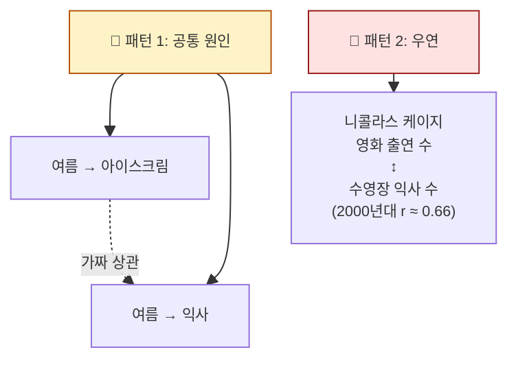

## 학습 목표

- **평균·분산·표준편차** 의 의미를 비유로 설명할 수 있다
- **평균의 함정**(아웃라이어)을 이해하고 중앙값과 구분한다
- **공분산과 상관계수**의 차이를 안다
- ML에서 EDA(탐색적 데이터 분석)와 피처 선택에 이를 활용한다

<a id="toc"></a>

## 진행 순서

1. [평균과 중앙값 — 어디가 중심인가](#part1)
2. [분산과 표준편차 — 데이터가 얼마나 흩어졌나](#part2)
3. [공분산과 상관계수 — 두 변수의 관계](#part3)
4. [상관 ≠ 인과](#part4)
5. [실습 — 데이터를 한눈에 파악하기](#part5)
6. [ML/DL 연결](#part6)
7. [정리](#part7)

---

# 04장. 기술통계와 상관

<a id="part1"></a>

## 1. 평균과 중앙값 — 어디가 중심인가 [↑](#toc)

### 평균의 함정

> **한 회사의 평균 연봉이 1억 원**이라고 들었습니다. 좋아 보이죠?
>
> 알고 보니: 직원 10명 중 9명은 5천만 원, **사장 1명이 55억**.
> 평균 = (5,000만 × 9 + 55억) / 10 = **1억**
>
> 평균은 진실을 말하고 있지만, **체감과는 완전히 다릅니다.**


### 중심을 측정하는 세 가지

| 척도 | 정의 | 강점 | 약점 |
|------|------|------|------|
| **평균(mean)** | 모든 값의 합 / 개수 | 직관적 | **아웃라이어에 취약** |
| **중앙값(median)** | 줄 세웠을 때 한가운데 값 | 아웃라이어 영향 적음 | 정보 일부 손실 |
| **최빈값(mode)** | 가장 자주 등장하는 값 | 범주형 데이터에 유용 | 연속 데이터엔 의미 약함 |

> 💡 **데이터가 종 모양(정규)** 이면 셋이 거의 같습니다. **한쪽으로 치우치면** 평균이 휘둘립니다. ML에서 **로그 변환**으로 보정하는 이유이기도 합니다.

---

<a id="part2"></a>

## 2. 분산과 표준편차 — 데이터가 얼마나 흩어졌나 [↑](#toc)

### 두 반 비교 비유

> A반: {70, 70, 70, 70, 70} — 평균 70
> B반: {30, 50, 70, 90, 110} — 평균 70
>
> **평균은 같지만**, A반은 모두 똑같고 B반은 천차만별. **이 흩어짐 정도를 측정**하는 것이 분산·표준편차.

### 식의 의미만

```
분산 = 각 값이 평균에서 얼마나 떨어졌는지를 제곱해서 평균낸 값
       └─ 제곱하는 이유: +/-가 상쇄되지 않도록

표준편차 = √분산
           └─ 단위를 원래 데이터로 되돌림
```

| 반 | 분산 | 표준편차 | 의미 |
|----|------|--------|------|
| A | 0 | 0 | 완전히 같음 |
| B | 800 | 28.3 | 평균에서 ±28점 정도 흩어짐 |

> 💡 **표준편차는 "평균에서 얼마나 떨어지는 게 보통인지"** 를 말해줍니다. 정규분포의 68-95-99.7 법칙(모듈 3)이 바로 이 표준편차를 단위로 합니다.

### 분산 식의 약속

```
모집단 분산: σ² = Σ(x - μ)² / N
표본 분산:   s² = Σ(x - x̄)² / (N - 1)
                                └─ "베셀 보정"
                                    데이터가 표본일 땐 N 대신 N-1
```

> 📌 numpy/pandas의 `var()`는 기본이 N-1 (표본 분산). ML 실무에서는 거의 항상 표본 분산을 사용합니다. 깊은 유도는 통계학 전공 영역.

---

<a id="part3"></a>

## 3. 공분산과 상관계수 — 두 변수의 관계 [↑](#toc)

### 비유: 키와 몸무게

> 키가 큰 사람이 대체로 몸무게도 무겁다 → **두 변수가 같이 움직인다.**
> 이런 관계를 **공분산(covariance)** 과 **상관계수(correlation)** 로 측정합니다.

### 공분산의 직관

```
공분산 > 0: 한쪽이 커지면 다른쪽도 커짐 (정의 관계)
공분산 < 0: 한쪽이 커지면 다른쪽은 작아짐 (역의 관계)
공분산 = 0: 관계 없음
```

문제: **단위에 따라 값이 천차만별**. 키(cm) × 몸무게(kg)의 공분산은 30, 키(m) × 몸무게(g)의 공분산은 30,000. 같은 데이터인데도.

### 상관계수 — 공분산을 표준화

```
상관계수 r = 공분산 / (표준편차_X × 표준편차_Y)
              └─ -1 ~ +1 범위로 보정됨
```

| r 값 | 의미 | 그래프 모양 |
|------|------|-----------|
| +1.0 | 완벽한 양의 관계 | 우상향 직선 |
| +0.7 | 강한 양의 관계 | 우상향 점들 |
| 0.0 | 관계 없음 | 흩어진 점 |
| -0.7 | 강한 음의 관계 | 우하향 점들 |
| -1.0 | 완벽한 음의 관계 | 우하향 직선 |


> 💡 **상관계수 r은 두 변수 사이의 관계 강도를 0~1 사이의 절댓값으로 알려주는 단일 수치**입니다. ML 피처 선택의 1차 도구.

---

<a id="part4"></a>

## 4. 상관 ≠ 인과 [↑](#toc)

가장 자주 듣는 통계 격언입니다. **두 변수가 같이 움직인다고 해서 한쪽이 다른쪽의 원인은 아닙니다.**

### 유명한 사례

- **아이스크림 판매량 ↑ ↔ 익사 사고 ↑** — 둘 다 "여름"이라는 공통 원인 때문
- **신발 크기 ↑ ↔ 어휘력 ↑** — 둘 다 "나이"라는 공통 원인 때문

### 가짜 상관의 두 패턴



> 💡 **ML 모델은 인과를 모릅니다.** 상관만 봅니다. 그래서 "이 피처가 모델 정확도에 기여한다"고 해서 그 피처가 **원인**은 아닐 수 있습니다. 의료·정책 분야에서 ML을 쓸 때 가장 위험한 함정.

---

<a id="part5"></a>

## 5. 실습 — 데이터를 한눈에 파악하기 [↑](#toc)

### Step 1: 데이터 불러오기

```python
import pandas as pd
import seaborn as sns

# 유명한 iris 데이터셋
df = sns.load_dataset("iris")
print(df.head())
```

### Step 2: 한 줄로 보는 기술통계

```python
df.describe()
```

**예상 출력**:
```
       sepal_length  sepal_width  petal_length  petal_width
count    150.00        150.00       150.00        150.00
mean       5.84          3.06         3.76          1.20
std        0.83          0.44         1.77          0.76
min        4.30          2.00         1.00          0.10
25%        5.10          2.80         1.60          0.30
50%        5.80          3.00         4.35          1.30   ← 중앙값
75%        6.40          3.30         5.10          1.80
max        7.90          4.40         6.90          2.50
```

### Step 3: 결과 해석

| 컬럼 | 평균 | 중앙값(50%) | 의미 |
|------|------|-----------|------|
| sepal_length | 5.84 | 5.80 | 거의 같음 → 정규분포에 가까움 |
| petal_length | 3.76 | 4.35 | 다름 → 분포가 한쪽으로 치우침 |

> 💡 **평균과 중앙값이 크게 다르면 분포가 비대칭(skewed)** 입니다. 로그 변환을 고려해볼 신호.

### Step 4: 상관 행렬과 히트맵

```python
import matplotlib.pyplot as plt

corr = df.select_dtypes(include="number").corr()
print(corr.round(2))

sns.heatmap(corr, annot=True, cmap="coolwarm", center=0)
plt.show()
```

**예상 출력**:
```
              sepal_length  sepal_width  petal_length  petal_width
sepal_length         1.00        -0.12          0.87         0.82
sepal_width         -0.12         1.00         -0.43        -0.37
petal_length         0.87        -0.43          1.00         0.96  ← 매우 강함
petal_width          0.82        -0.37          0.96         1.00
```

### 결과 해석

| 발견 | 의미 | ML 활용 |
|------|------|--------|
| petal_length ↔ petal_width = 0.96 | 거의 같은 정보 | **피처 하나는 제거** 고려 |
| sepal_width ↔ 나머지 = 음의 약한 상관 | 독립적 정보 | 모델에 도움될 가능성 |
| 다중공선성 가능 | 회귀 모델이 불안정해질 수 있음 | 모듈 8에서 정규화로 해결 |

> 💡 **EDA(탐색적 데이터 분석)** 의 핵심은 "데이터의 모양을 먼저 보는 것". `describe()` + `corr()` + `seaborn` 시각화가 시작 도구.

---

<a id="part6"></a>

## 6. ML/DL 연결 [↑](#toc)

> 🔗 **이 모듈이 ML/DL에서 어떻게 쓰이나**

### 1) EDA의 1차 도구

```python
df.describe()       # 평균·표준편차·사분위 한 번에
df.corr()           # 상관 행렬
```
모델 학습 **전** 반드시 거치는 단계. 이상한 분포·아웃라이어·결측치를 미리 발견.

### 2) 평균·표준편차 = 표준화의 재료

`StandardScaler`(모듈 3)는 결국 `(x - mean) / std`. 이 모듈의 식이 그대로 사용됩니다.

### 3) 상관 분석 → 피처 선택

```python
# 타겟과 상관이 강한 피처만 선택
top_features = df.corr()["target"].abs().sort_values(ascending=False)
```

### 4) 다중공선성 발견 → 정규화로 대응

상관이 매우 높은 피처가 여러 개면 회귀가 불안정해짐 → Ridge/Lasso로 해결 (모듈 8).

### 5) 신경망의 입력 정규화

신경망은 입력의 평균·분산에 매우 민감 → BatchNorm, LayerNorm 같은 기법이 분산을 1로 강제.

---

<a id="part7"></a>

## 7. 정리 [↑](#toc)

### 이 장 한 줄 요약
> **데이터의 중심(평균/중앙값)과 흩어짐(표준편차), 두 변수의 관계(상관계수)를 한눈에 파악하는 도구들.** ML EDA의 기본.

### 자가 진단 체크리스트

| 항목 | 확인 |
|------|:---:|
| 평균과 중앙값의 차이와 함정을 설명할 수 있다 | ☐ |
| 표준편차의 의미를 일상어로 말할 수 있다 | ☐ |
| 공분산과 상관계수의 차이를 안다 | ☐ |
| `df.describe()`와 `df.corr()`의 출력을 해석할 수 있다 | ☐ |
| 상관 ≠ 인과의 예를 들 수 있다 | ☐ |
