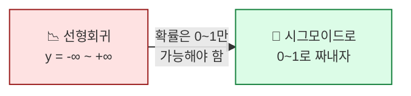
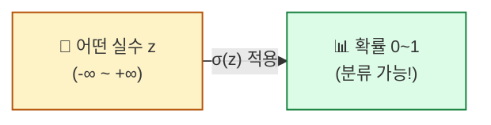
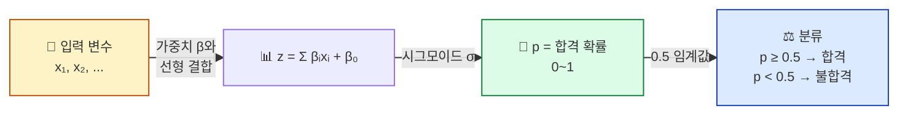
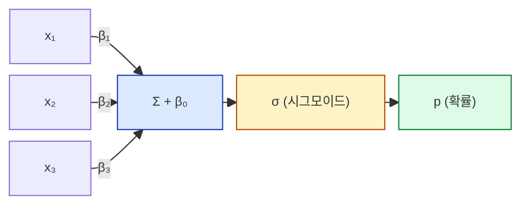

## 학습 목표

- **선형회귀로 분류가 안 되는 이유**를 안다
- **시그모이드 함수**가 어떤 모양이고 왜 분류에 적합한지 이해한다
- **로지스틱 회귀**의 출력을 확률로 해석할 수 있다
- "로지스틱 회귀 = 단일 뉴런"이라는 **DL 연결**을 안다

<a id="toc"></a>

## 진행 순서

1. [왜 선형회귀로는 분류가 안 되는가](#part1)
2. [시그모이드 — S 모양 곡선의 마법](#part2)
3. [로지스틱 회귀의 구조](#part3)
4. [결정 경계 — 어디서 클래스가 갈리나](#part4)
5. [실습 — sklearn으로 로지스틱 + 결과 해석](#part5)
6. [ML/DL 연결 — 단일 뉴런 = 로지스틱 회귀](#part6)
7. [정리](#part7)

---

# 06장. 로지스틱 회귀

<a id="part1"></a>

## 1. 왜 선형회귀로는 분류가 안 되는가 [↑](#toc)

### 시험 합격/불합격 비유

> 공부시간(x)에 따라 시험에 합격(y=1)/불합격(y=0)했다고 합시다.
>
> 선형회귀 `y = β₀ + β₁x`로 그어보면:
> - 공부 20시간 → 예측값 = **1.8** (?!)
> - 공부 -5시간 → 예측값 = **-0.3** (?!)
>
> **확률은 0~1 사이여야 하는데, 선형회귀는 범위가 무제한**. 분류엔 안 맞습니다.



### 필요한 도구

> 어떤 실수 입력이 들어와도 **0~1 사이로 짜내주는 함수**가 필요합니다.

그게 바로 **시그모이드(sigmoid)** 입니다.

---

<a id="part2"></a>

## 2. 시그모이드 — S 모양 곡선의 마법 [↑](#toc)

### 식과 모양

```
σ(z) = 1 / (1 + e^(-z))
```

겁먹지 마세요. **모양만** 기억하면 됩니다.

```
σ(z)
 1.0 │             ┄┄┄┄┄┄┄┄┄┄
     │         ┄┄┄
 0.5 │     ┄┄┄          ← z=0일 때 σ=0.5
     │ ┄┄┄
 0.0 │┄┄┄┄┄┄┄┄┄┄┄┄┄┄┄┄┄┄┄┄┄
     │   -5   0   +5      ← z (입력)
```

| z 입력 | σ(z) 출력 | 직관 |
|------|---------|------|
| -∞ | 0 | 확실히 0 (불합격) |
| -3 | 0.05 | 거의 0 |
| 0 | **0.5** | 반반 |
| +3 | 0.95 | 거의 1 |
| +∞ | 1 | 확실히 1 (합격) |

### 시그모이드의 핵심 특성

1. **출력이 항상 0~1 사이** → 확률로 해석 가능
2. **S 모양** → 0과 1 사이에서 부드럽게 전환
3. **z=0에서 0.5** → 의사결정의 분기점
4. **미분이 깔끔** → 신경망 역전파에 적합 (DL 과정)



---

<a id="part3"></a>

## 3. 로지스틱 회귀의 구조 [↑](#toc)

### 두 단계

```
1단계: z = β₀ + β₁x₁ + β₂x₂ + ...    ← 선형회귀와 똑같음
2단계: p = σ(z) = 1 / (1 + e^(-z))   ← 시그모이드로 0~1로 짜냄
```

**해석**: p = "y=1(예: 합격)일 사후확률"



### 계수 β의 해석은 다름

선형회귀: "x 1↑ → y 얼마 변하나"
로지스틱: "x 1↑ → **로짓(odds의 로그)** 얼마 변하나"

> 📌 ML 실무에서는 계수의 부호와 상대 크기만 보고 깊은 해석은 잘 안 합니다. **"양수면 합격에 도움, 음수면 불합격에 기여"** 정도면 충분.

---

<a id="part4"></a>

## 4. 결정 경계 — 어디서 클래스가 갈리나 [↑](#toc)

### 임계값 0.5의 의미

> 모델이 출력한 확률 p가
> - **p ≥ 0.5** → 클래스 1 (합격)
> - **p < 0.5** → 클래스 0 (불합격)

p = 0.5인 지점이 **결정 경계(decision boundary)**.

### 결정 경계는 직선

피처가 2개인 경우 그래프 위에 **직선**으로 그려집니다. 선 위쪽은 클래스 1, 아래쪽은 클래스 0.

```
공부시간 ↑
  │  ●●●●●  ← 모두 합격 (p > 0.5)
  │  ●●●●
  │ ●●●●  ┄┄┄┄┄ 결정 경계 (p = 0.5)
  │      ┄
  │   ○○○┄    ← 모두 불합격 (p < 0.5)
  │ ○○○○
  └─────── 학원수강 →
```

### 임계값 조정

```python
y_pred = (model.predict_proba(X)[:, 1] >= 0.5).astype(int)
                                          └─ 이걸 0.3이나 0.7로 바꿀 수도
```

- **임계값 0.3**: 더 많이 "합격"으로 분류 → 재현율(recall) ↑
- **임계값 0.7**: 더 엄격 → 정밀도(precision) ↑

> 💡 의료 진단처럼 **놓치면 안 되는 경우** → 임계값 ↓ (재현율 우선). 모듈 8에서 다시.

---

<a id="part5"></a>

## 5. 실습 — sklearn으로 로지스틱 + 결과 해석 [↑](#toc)

### Step 1: 데이터 준비

```python
import numpy as np
import pandas as pd
from sklearn.linear_model import LogisticRegression
from sklearn.model_selection import train_test_split
from sklearn.preprocessing import StandardScaler

np.random.seed(42)
n = 200
df = pd.DataFrame({
    "study_hours": np.random.uniform(0, 12, n),
    "private_classes": np.random.randint(0, 5, n),
})
# 실제 관계: z가 양수면 합격
z = -3 + 0.5*df["study_hours"] + 0.8*df["private_classes"] + np.random.normal(0, 1, n)
df["passed"] = (z > 0).astype(int)
print(df["passed"].value_counts())  # 합격/불합격 분포
```

### Step 2: 표준화 + 학습/테스트 분할

```python
X = df[["study_hours", "private_classes"]]
y = df["passed"]
X_train, X_test, y_train, y_test = train_test_split(X, y, test_size=0.3, random_state=42)

scaler = StandardScaler()
X_train_s = scaler.fit_transform(X_train)
X_test_s = scaler.transform(X_test)
```

### Step 3: 모델 학습 + 예측

```python
model = LogisticRegression()
model.fit(X_train_s, y_train)

print("절편:", model.intercept_)
print("계수:", model.coef_)
print("학습 정확도:", model.score(X_train_s, y_train))
print("테스트 정확도:", model.score(X_test_s, y_test))
```

**예상 출력**:
```
절편: [0.32]
계수: [[1.58 0.96]]
학습 정확도: 0.886
테스트 정확도: 0.867
```

### Step 4: 확률 vs 예측 라벨

```python
probs = model.predict_proba(X_test_s)
preds = model.predict(X_test_s)

# 처음 5개 샘플
for i in range(5):
    print(f"샘플 {i}: 불합격 확률 {probs[i, 0]:.3f} / 합격 확률 {probs[i, 1]:.3f} → 예측 {preds[i]}")
```

**예상 출력**:
```
샘플 0: 불합격 확률 0.082 / 합격 확률 0.918 → 예측 1
샘플 1: 불합격 확률 0.751 / 합격 확률 0.249 → 예측 0
샘플 2: 불합격 확률 0.512 / 합격 확률 0.488 → 예측 0  ← 애매!
샘플 3: 불합격 확률 0.034 / 합격 확률 0.966 → 예측 1
샘플 4: 불합격 확률 0.892 / 합격 확률 0.108 → 예측 0
```

### 결과 해석

| 출력 | 의미 |
|------|------|
| `coef_` | 표준화된 변수의 영향력 (양수 = 합격에 기여) |
| `predict_proba` | **각 클래스에 대한 사후확률** (모듈 1·2와 같음) |
| `predict` | 가장 확률 높은 클래스 (기본 임계값 0.5) |
| 0.488 같은 애매한 값 | 임계값 부근 → 모델이 확신 못함 |

### Step 5: 혼동행렬(Confusion Matrix)

```python
from sklearn.metrics import confusion_matrix, classification_report

cm = confusion_matrix(y_test, preds)
print(cm)
print(classification_report(y_test, preds))
```

**예상 출력**:
```
[[28  4]    ← 실제 불합격 32명 중, 28명 정확 / 4명 합격으로 오분류
 [ 4 24]]   ← 실제 합격 28명 중, 24명 정확 / 4명 불합격으로 오분류

              precision    recall  f1-score
           0       0.88      0.88      0.88
           1       0.86      0.86      0.86
    accuracy                           0.87
```

| 지표 | 의미 |
|------|------|
| Accuracy 0.87 | 전체 87% 정확 |
| Precision (1) 0.86 | "합격이라 예측한 것 중 진짜 합격" 86% |
| Recall (1) 0.86 | "진짜 합격 중 모델이 잡아낸 것" 86% |

> 💡 분류 모델 평가는 **정확도 하나로 끝나지 않습니다**. 데이터 불균형(클래스 분포가 한쪽으로 쏠림) 시 정확도는 속이기 쉬움 → precision/recall를 함께 봅니다 (모듈 8).

---

<a id="part6"></a>

## 6. ML/DL 연결 — 단일 뉴런 = 로지스틱 회귀 [↑](#toc)

> 🔗 **이 모듈은 DL의 출발점입니다.**

### 1) 신경망의 가장 작은 단위 = 뉴런 1개

```
입력 ─→ 가중치와 곱하기 ─→ 합치기 ─→ 활성화 함수(시그모이드) ─→ 출력
                                       └─ 이게 정확히 로지스틱 회귀!
```



> 💡 **이 그림이 곧 뉴런 1개의 구조**입니다. 신경망 = 이런 뉴런이 여러 층으로 쌓인 것.

### 2) 시그모이드 → 다른 활성화 함수

| 함수 | 모양 | 어디 쓰나 |
|------|------|---------|
| 시그모이드 | S, 0~1 | 이진분류 출력층 |
| Softmax | 시그모이드의 다중 클래스 버전 | 다중분류 출력층 |
| ReLU | 음수 0, 양수 그대로 | 신경망 은닉층 (학습 빠름) |
| Tanh | S, -1~1 | RNN |

### 3) 손실함수 — Cross-Entropy

로지스틱 회귀의 손실은 **MSE가 아니라 Cross-Entropy(또는 Log Loss)** 입니다. 왜 다른지는 모듈 7에서 다룹니다. 미리 한 줄: **베르누이 분포의 MLE 결과**.

### 4) "로지스틱 회귀 → 신경망"의 연속성

```
로지스틱 회귀 (이 모듈)
  ↓ 가운데에 은닉층을 추가
얕은 신경망
  ↓ 은닉층을 여러 겹
딥러닝
```

> 💡 **딥러닝은 로지스틱 회귀를 여러 번 쌓은 것**입니다. 이 한 문장이 본 통계 과정과 DL 과정을 잇는 가장 강한 다리.

---

<a id="part7"></a>

## 7. 정리 [↑](#toc)

### 이 장 한 줄 요약
> **로지스틱 회귀 = 선형회귀 + 시그모이드**. 출력이 확률이라 분류 가능. **DL의 뉴런 1개**.

### 자가 진단 체크리스트

| 항목 | 확인 |
|------|:---:|
| 선형회귀가 분류에 안 맞는 이유를 안다 | ☐ |
| 시그모이드 모양을 그릴 수 있다 | ☐ |
| 로지스틱 회귀의 두 단계 구조를 안다 | ☐ |
| `predict_proba`의 두 컬럼 의미를 안다 | ☐ |
| precision/recall이 정확도와 다른 이유를 안다 | ☐ |
| **"단일 뉴런 = 로지스틱 회귀"** 를 설명할 수 있다 | ☐ |
