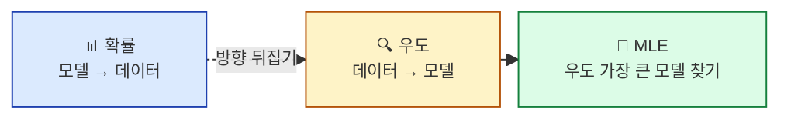
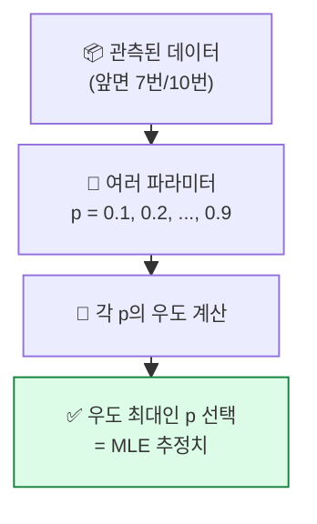
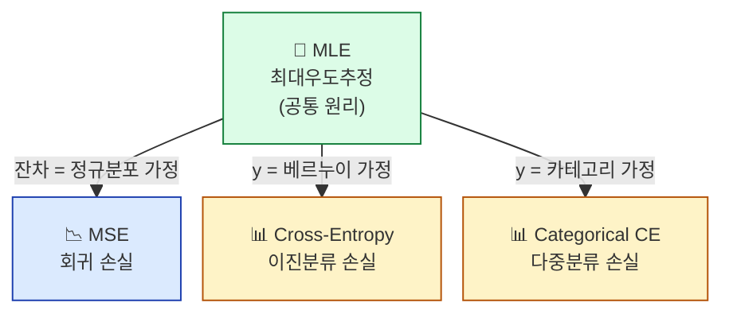

## 학습 목표

- **우도(Likelihood)** 가 무엇이고 확률과 어떻게 다른지 안다
- **MLE(최대우도추정)** 의 직관을 탐정 비유로 설명할 수 있다
- **MSE 손실 = 정규분포 가정의 MLE** 임을 이해한다
- **Cross-Entropy 손실 = 베르누이 분포 가정의 MLE** 임을 안다

<a id="toc"></a>

## 진행 순서

1. [우도란 — "데이터가 이 모델에서 나올 가능성"](#part1)
2. [MLE — 가장 그럴듯한 파라미터 찾기](#part2)
3. [왜 로그를 취하는가](#part3)
4. [MLE → MSE / Cross-Entropy](#part4)
5. [실습 — 우도함수 직접 그려보기](#part5)
6. [ML/DL 연결 — DL 손실함수의 기원](#part6)
7. [정리](#part7)

---

# 07장. MLE와 손실함수

<a id="part1"></a>

## 1. 우도란 — "데이터가 이 모델에서 나올 가능성" [↑](#toc)

### 확률 vs 우도 — 무엇이 다른가?

> **확률**: 모델(파라미터)이 정해진 상태에서 **어떤 데이터가 나올 가능성**.
> **우도**: 데이터가 정해진 상태에서 **이 모델(파라미터)이 맞을 가능성**.

**같은 식인데 무엇이 변수냐가 다릅니다.**

| | 확률 P(데이터 | 파라미터) | 우도 L(파라미터 | 데이터) |
|---|------|---------|
| **고정** | 파라미터 | 데이터 |
| **변수** | 데이터 | 파라미터 |
| **질문** | "이 동전(p=0.5)에서 앞 7번 나올 확률?" | "앞 7번 나왔다. 이 동전의 p는 얼마일까?" |



### 탐정 비유

> 사건 현장에 증거(데이터)가 있습니다.
> 탐정은 가능한 범인(파라미터)들 중에서:
>
> **"이 범인이 진짜라면, 이 증거가 나올 가능성이 가장 큰가?"**
>
> 그 가능성이 가장 큰 범인을 지목합니다. **이게 MLE입니다.**

---

<a id="part2"></a>

## 2. MLE — 가장 그럴듯한 파라미터 찾기 [↑](#toc)

### 동전 예시

> 동전을 10번 던져서 **앞면이 7번** 나왔습니다.
> 이 동전의 앞면 확률 p는 얼마일까요?

각 p에 대해 "p가 진짜라면, 앞 7번 나올 확률"을 계산:

| p (가설) | 우도 L(p | 데이터) | 그럴듯한가? |
|---------|------------------|------------|
| 0.3 | 0.009 | 매우 작음 ❌ |
| 0.5 | 0.117 | 중간 |
| **0.7** | **0.267** | **최대 ✅** |
| 0.9 | 0.057 | 작음 |

→ **p = 0.7일 때 우도가 가장 크다** → **MLE 추정치 = 0.7**

### MLE의 한 줄 정의

> **"데이터를 가장 잘 설명하는 파라미터" = 우도를 최대화하는 파라미터**



> 💡 **ML 학습의 본질**: 데이터를 이미 갖고 있고, 모델 파라미터(가중치 β)를 모릅니다. **우도를 최대로 만드는 β를 찾는 게 학습**입니다.

---

<a id="part3"></a>

## 3. 왜 로그를 취하는가 [↑](#toc)

### 문제 — 곱셈이 너무 많다

데이터 N개의 우도:
```
L(β | 데이터) = P(d₁|β) × P(d₂|β) × ... × P(dN|β)
```

데이터가 1000개면 **1000개의 작은 확률(0~1)이 곱해짐**. 컴퓨터로는:
- 결과가 너무 작아 **언더플로우** (예: 10^-300, 0이 됨)
- 곱셈이 미분하기 까다로움

### 해결 — 로그 씌우기

```
log L = log P(d₁) + log P(d₂) + ... + log P(dN)
        └─ 곱셈이 덧셈으로 변환!
```

**로그의 마법 두 가지**:
1. **곱셈 → 덧셈**: 컴퓨터 친화적
2. **단조 증가**: L이 최대인 곳 = log L이 최대인 곳 (답이 같음)

> 💡 ML/DL에서 **로그 우도(log-likelihood)** 가 등장하는 모든 곳이 사실 이 이유입니다.

### 음수 씌우기 = 손실(loss)

```
ML 관습: "최대화" 대신 "최소화"가 표준
→ 음수 로그 우도(Negative Log Likelihood)를 최소화

손실(Loss) = -log L
```

| 관점 | 표현 | 같은 의미 |
|------|------|---------|
| 통계 | 우도 최대화 | "데이터를 가장 잘 설명" |
| ML/DL | 손실 최소화 | "예측이 가장 정확" |

---

<a id="part4"></a>

## 4. MLE → MSE / Cross-Entropy [↑](#toc)

> 🔥 **이 절이 본 과정의 정점입니다.** 회귀의 MSE 손실과 분류의 Cross-Entropy 손실이 모두 MLE에서 나온다는 것.

### MSE는 정규분포의 MLE

**가정**: "잔차(y - 예측)는 평균 0인 정규분포를 따른다"

```
P(yᵢ | xᵢ, β) ∝ exp(-(yᵢ - 예측ᵢ)² / 2σ²)
                       └─ 잔차의 제곱이 식 안에!

→ -log L = (1/2σ²) × Σ (yᵢ - 예측ᵢ)² + 상수
                     └─ 이게 정확히 MSE!
```

| ML 손실 | 통계적 가정 |
|---------|------------|
| **MSE** | y - 예측이 **정규분포** |

> 💡 회귀 모델이 MSE를 쓰는 이유는 그냥 "오차 제곱이 직관적"이라서가 아니라, **정규분포 잔차 가정 하의 MLE**이기 때문입니다.

### Cross-Entropy는 베르누이의 MLE

**가정**: "y는 베르누이 분포 (0 또는 1) — 성공 확률 p는 모델이 출력"

```
P(yᵢ | xᵢ, β) = p^yᵢ × (1-p)^(1-yᵢ)
                └─ y=1일 때 p, y=0일 때 1-p

→ -log L = -Σ [yᵢ log p + (1-yᵢ) log(1-p)]
            └─ 이게 정확히 Cross-Entropy!
```

| ML 손실 | 통계적 가정 |
|---------|------------|
| **Cross-Entropy (Log Loss)** | y는 **베르누이 분포** |
| **Categorical Cross-Entropy** | y는 **카테고리 분포** (다중 클래스) |

### 통합 그림



> 💡 **ML/DL의 모든 표준 손실함수는 어떤 확률분포 가정 하의 MLE입니다.** 이 한 문장이 본 통계 과정 전체의 핵심 메시지.

---

<a id="part5"></a>

## 5. 실습 — 우도함수 직접 그려보기 [↑](#toc)

### Step 1: 동전 데이터 (앞면 7번/10번)

```python
import numpy as np
import matplotlib.pyplot as plt
from scipy import stats

data = [1, 1, 1, 1, 1, 1, 1, 0, 0, 0]  # 7번 앞, 3번 뒤
```

### Step 2: 여러 p 가설에 대한 우도 계산

```python
p_grid = np.linspace(0.01, 0.99, 100)  # 0.01부터 0.99까지 100개 후보

# 각 p에서의 우도 = p^7 × (1-p)^3
likelihood = [(p**7) * ((1-p)**3) for p in p_grid]
log_likelihood = [7 * np.log(p) + 3 * np.log(1-p) for p in p_grid]
```

### Step 3: 우도함수 그래프

```python
fig, axes = plt.subplots(1, 2, figsize=(12, 4))

axes[0].plot(p_grid, likelihood)
axes[0].axvline(0.7, color="red", linestyle="--", label="MLE = 0.7")
axes[0].set_xlabel("p (가설)")
axes[0].set_ylabel("우도 L(p)")
axes[0].set_title("우도함수")
axes[0].legend()

axes[1].plot(p_grid, log_likelihood)
axes[1].axvline(0.7, color="red", linestyle="--", label="MLE = 0.7")
axes[1].set_xlabel("p (가설)")
axes[1].set_ylabel("log L(p)")
axes[1].set_title("로그 우도함수")
axes[1].legend()

plt.tight_layout()
plt.show()
```

**관찰 포인트**:
- 두 곡선 모두 **p=0.7에서 최대값** — MLE 추정치
- 로그 우도는 더 부드러운 종 모양 — 미분하기 좋음

### Step 4: 수치 최적화로 직접 MLE 찾기

```python
from scipy.optimize import minimize_scalar

# 손실(음의 로그 우도) 정의
def neg_log_likelihood(p):
    return -(7 * np.log(p) + 3 * np.log(1-p))

result = minimize_scalar(neg_log_likelihood, bounds=(0.01, 0.99), method="bounded")
print(f"MLE 추정치: p = {result.x:.4f}")
print(f"분석적 정답: 7/10 = 0.7000")
```

**예상 출력**:
```
MLE 추정치: p = 0.7000
분석적 정답: 7/10 = 0.7000
```

### 결과 해석

| 발견 | 의미 |
|------|------|
| 수치 최적화 ≈ 분석 정답 | MLE가 잘 작동함을 확인 |
| 로그 우도가 더 부드러움 | ML 학습에서 로그 쓰는 이유 |
| **음의 로그 우도 최소화 = 우도 최대화** | "손실 최소화"의 통계적 의미 |

> 💡 신경망의 학습도 본질적으로 이 작업입니다. 단지 파라미터가 1개(p)가 아니라 수백만 개(가중치)이고, 분석 정답이 없어 **경사하강법**으로 반복적으로 찾아갑니다.

---

<a id="part6"></a>

## 6. ML/DL 연결 — DL 손실함수의 기원 [↑](#toc)

> 🔗 **본 모듈은 통계와 DL을 잇는 가장 굵은 다리입니다.**

### 1) "학습 = MLE"

| 과정 | 통계 언어 | ML/DL 언어 |
|------|---------|----------|
| 시작 | 모델 가정 + 데이터 | 모델 구조 + 데이터 |
| 학습 | **우도 최대화** | **손실 최소화** |
| 결과 | MLE 추정 파라미터 | 학습된 가중치 |
| 같음 | -log 우도 = 손실 |

### 2) 각 ML 모델의 손실함수 기원

| 모델 | 손실함수 | MLE 가정 |
|------|---------|--------|
| 선형회귀 | MSE | 잔차 정규분포 |
| 로지스틱 회귀 | Binary CE | y 베르누이 |
| 다중 분류 신경망 | Categorical CE | y 카테고리 |
| 푸아송 회귀 | Poisson Loss | y 푸아송 |
| 변분 오토인코더 | KL + 재구성 | 다양한 가정 |

### 3) "그냥 외워" → "이유가 있어"

수업에서 "MSE를 써야 한다"고 들을 때 의문이 들었다면:
- 이제 답할 수 있습니다 — **"잔차가 정규분포라고 가정했기 때문"**

### 4) 모듈 10 떡밥 — Cross-Entropy의 또 다른 얼굴

Cross-Entropy는 **정보이론의 엔트로피**와도 직접 연결됩니다. "놀라움의 평균" 비유로 모듈 10에서 다룹니다.

---

<a id="part7"></a>

## 7. 정리 [↑](#toc)

### 이 장 한 줄 요약
> **MLE = "데이터를 가장 잘 설명하는 파라미터 찾기"**. ML/DL의 모든 손실함수가 이 원리에서 나왔다.

### 자가 진단 체크리스트

| 항목 | 확인 |
|------|:---:|
| 확률과 우도의 차이를 한 문장으로 말할 수 있다 | ☐ |
| MLE의 한 줄 정의를 안다 | ☐ |
| 로그를 씌우는 두 가지 이유를 안다 | ☐ |
| **MSE = 정규분포 가정의 MLE** 를 안다 | ☐ |
| **Cross-Entropy = 베르누이 가정의 MLE** 를 안다 | ☐ |
| "학습 = MLE" 비유를 설명할 수 있다 | ☐ |
