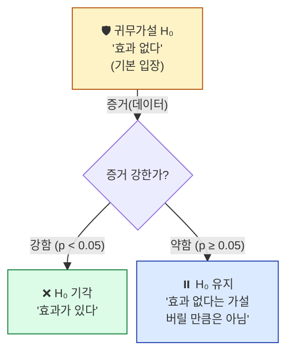
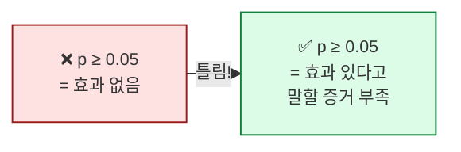
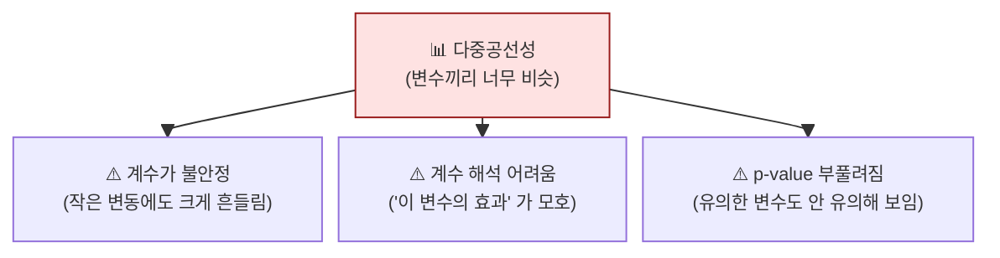

## 학습 목표

- **귀무가설/대립가설**과 **p-value**의 의미를 법정 비유로 설명할 수 있다
- **1종 오류 / 2종 오류**의 차이를 안다
- **t검정**의 결과(p-value, 신뢰구간)를 해석할 수 있다
- **다중공선성**이 무엇이고 왜 **Ridge/Lasso**가 해결책인지 안다

<a id="toc"></a>

## 진행 순서

1. [가설검정 — 법정 비유](#part1)
2. [p-value — 가장 오해받는 숫자](#part2)
3. [1종 오류 vs 2종 오류](#part3)
4. [t검정 — 두 집단 비교](#part4)
5. [다중공선성 → Ridge/Lasso](#part5)
6. [실습 — t검정과 VIF](#part6)
7. [ML/DL 연결](#part7)
8. [정리](#part8)

---

# 08장. 가설검정과 정규화

<a id="part1"></a>

## 1. 가설검정 — 법정 비유 [↑](#toc)

### 법정 시스템과 같다

> 형사 재판에서:
> - **귀무가설(H₀)**: "피고는 **무죄**" (기본 입장)
> - **대립가설(H₁)**: "피고는 유죄"
> - 검사가 **충분한 증거**를 보여야만 무죄 추정을 뒤집습니다.
> - 증거 부족이면 **무죄 유지** (유죄 입증 실패 = 무죄 확정은 아님)



### 통계의 귀무가설 예

| 상황 | H₀ | H₁ |
|------|----|----|
| 새 약이 효과 있나? | 효과 없음 | 효과 있음 |
| 두 광고 클릭률 다른가? | 같음 | 다름 |
| 회귀계수 β가 의미 있나? | β = 0 | β ≠ 0 |

> 💡 **통계의 출발점은 항상 "효과 없음"** 입니다. 데이터로 그걸 뒤집어야 "효과 있다"고 말할 수 있습니다.

---

<a id="part2"></a>

## 2. p-value — 가장 오해받는 숫자 [↑](#toc)

### 한 줄 정의

> **p-value = "H₀가 진짜라면, 이 데이터(또는 더 극단적인 것)가 나올 확률"**

### 직관

- p가 **작으면**: "H₀가 진짜라면 이런 데이터는 나올 가능성 매우 낮음" → **H₀ 의심**
- p가 **크면**: "H₀로도 이 정도 데이터는 그럭저럭 나옴" → **H₀ 유지**

### 임계값 0.05의 관습

```
p < 0.05 → "통계적으로 유의함" → H₀ 기각
p ≥ 0.05 → 유의하지 않음 → H₀ 유지
```

> 📌 0.05는 **관습**이지 자연 법칙이 아닙니다. 분야에 따라 0.01, 0.001을 쓰기도 합니다.

### ⚠️ p-value의 흔한 오해

| 잘못된 해석 | 올바른 해석 |
|-----------|-----------|
| ❌ "H₀가 진짜일 확률" | p는 **데이터에 대한** 확률이지 가설에 대한 확률이 아님 |
| ❌ "p=0.04니까 효과가 큼" | p는 **유의함 여부**만 말함. 효과 크기는 별개 (계수 크기로 봄) |
| ❌ "p≥0.05니까 효과 없음 증명" | "효과 있다고 말할 증거 부족"일 뿐. 효과 자체가 없다는 증명은 아님 |



> 💡 **법정 비유**: 무죄 판결 ≠ 무고함 증명. 단지 유죄 입증이 부족했을 뿐.

---

<a id="part3"></a>

## 3. 1종 오류 vs 2종 오류 [↑](#toc)

### 네 가지 가능성

|  | H₀ 진짜 (무죄) | H₀ 거짓 (유죄) |
|---|--------------|--------------|
| **H₀ 기각 (유죄 선고)** | ❌ 1종 오류 (무고한 사람 유죄) | ✅ 정답 |
| **H₀ 유지 (무죄 선고)** | ✅ 정답 | ❌ 2종 오류 (진범 풀려남) |

### 1종 vs 2종 — 어느 쪽이 더 나쁠까?

| 상황 | 1종 오류의 비용 | 2종 오류의 비용 |
|------|-------------|-------------|
| 형사재판 | **무고한 사람 처벌** (큼) | 진범 풀려남 |
| 신약 승인 | 효과 없는 약 승인 | **효과 있는 약 못 씀** (큼) |
| 의료 진단 | 건강한데 환자라 오진 | **암 환자 놓침** (큼) |
| 스팸 필터 | 정상 메일 스팸 분류 | 스팸을 못 잡음 |

> 💡 **상황마다 어느 오류를 더 피해야 하는지가 다릅니다.** 임계값(0.05나 0.01) 선택의 본질.

### ML의 정밀도/재현율과 연결

| 통계 | ML |
|-----|-----|
| 1종 오류 = False Positive | "비스팸을 스팸이라고 잘못 본 것" |
| 2종 오류 = False Negative | "스팸을 못 잡은 것" |
| 정밀도(precision) | 1 - (1종 오류율) |
| 재현율(recall) | 1 - (2종 오류율) |

---

<a id="part4"></a>

## 4. t검정 — 두 집단 비교 [↑](#toc)

### 비유: 두 광고 클릭률

> 광고 A의 클릭률 12%, 광고 B의 클릭률 15%.
> **B가 더 좋아 보이지만**, 이게 진짜 차이일까 아니면 우연일까?
>
> → **t검정**으로 통계적 유의성 판단.

### t검정의 직관

```
t값 = (집단 평균 차이) / (표준오차)
        └─ 시그널        └─ 노이즈

t값 클수록 차이가 우연이라기엔 너무 큼 → p-value 작아짐
```

### t검정 종류

| 종류 | 언제 쓰나 |
|------|---------|
| **1표본 t검정** | 한 집단의 평균이 특정 값과 다른가 |
| **독립표본 t검정** | 두 독립된 집단의 평균 비교 |
| **대응표본 t검정** | 같은 대상의 전후 비교 (다이어트 전/후) |

### 회귀에서의 t검정

회귀 결과의 `P>|t|` 컬럼이 바로 t검정 결과입니다:
```
H₀: β = 0 (이 변수의 효과 없음)
H₁: β ≠ 0
```
p < 0.05면 "이 변수는 통계적으로 유의하다".

---

<a id="part5"></a>

## 5. 다중공선성 → Ridge/Lasso [↑](#toc)

### 다중공선성이란

> 회귀의 변수들이 **서로 강하게 상관**되어 있는 상태.
> 예: 키(cm), 키(인치) — 두 변수가 사실상 같은 정보.

### 왜 문제인가?



### VIF (분산팽창인자) — 다중공선성 측정

```
VIF < 5  : 양호
5 ≤ VIF < 10 : 의심
VIF ≥ 10 : 심각 (대책 필요)
```

### 해결책 — 정규화(Regularization)

회귀 손실에 **"계수 크기 페널티"** 를 더합니다:

```
일반 회귀 손실:     SSE = Σ (y - 예측)²
Ridge (L2):       SSE + λ × Σ β²       ← 큰 계수에 제곱 페널티
Lasso (L1):       SSE + λ × Σ |β|      ← 큰 계수에 절댓값 페널티
                       └─ λ가 페널티 강도
```

### Ridge vs Lasso

| 방법 | 페널티 | 효과 | ML 활용 |
|------|------|------|---------|
| **Ridge (L2)** | Σ β² | 모든 계수를 **작게** | 다중공선성 완화, 안정성 ↑ |
| **Lasso (L1)** | Σ \|β\| | 일부 계수를 **0으로** | **자동 변수 선택** |
| **ElasticNet** | L1 + L2 혼합 | 둘의 절충 | 실무 표준 |

> 💡 **다중공선성 → Ridge/Lasso는 통계와 ML의 가장 자연스러운 다리**입니다. 통계학에서는 "다중공선성 문제"라고 부르고, ML에서는 "정규화"라고 부르지만 같은 해결책.

---

<a id="part6"></a>

## 6. 실습 — t검정과 VIF [↑](#toc)

### Step 1: 두 집단 t검정

```python
import numpy as np
from scipy import stats

# 광고 A, B의 클릭 수 (1000명씩)
np.random.seed(42)
ad_a = np.random.binomial(1, 0.12, 1000)  # 클릭률 12%
ad_b = np.random.binomial(1, 0.15, 1000)  # 클릭률 15%

t_stat, p_value = stats.ttest_ind(ad_a, ad_b)
print(f"t값: {t_stat:.3f}, p-value: {p_value:.4f}")
print(f"A 평균: {ad_a.mean():.3f}, B 평균: {ad_b.mean():.3f}")
```

**예상 출력**:
```
t값: -2.347, p-value: 0.0190
A 평균: 0.119, B 평균: 0.151
```

### 결과 해석

| 출력 | 의미 |
|------|------|
| p-value = 0.0190 | < 0.05 → **유의함**. 두 광고의 클릭률 차이는 우연이 아니다 |
| t값 = -2.35 | 음수: A 평균이 B보다 작음 (방향) |

### Step 2: VIF로 다중공선성 확인

```python
import pandas as pd
from statsmodels.stats.outliers_influence import variance_inflation_factor

# 가상 데이터: 키(cm)와 키(inch)는 사실상 같은 정보
np.random.seed(42)
n = 100
df = pd.DataFrame({
    "height_cm": np.random.normal(170, 8, n),
})
df["height_inch"] = df["height_cm"] / 2.54   # 다중공선성 만들기
df["weight_kg"] = np.random.normal(65, 12, n)
df["score"] = 0.5 * df["height_cm"] + 1.2 * df["weight_kg"] + np.random.normal(0, 5, n)

X = df[["height_cm", "height_inch", "weight_kg"]]
vif = pd.DataFrame({
    "변수": X.columns,
    "VIF": [variance_inflation_factor(X.values, i) for i in range(X.shape[1])]
})
print(vif)
```

**예상 출력**:
```
        변수            VIF
0  height_cm    1.234e+15  ← 극단적 다중공선성
1  height_inch  1.234e+15
2  weight_kg    1.001
```

### Step 3: Ridge / Lasso 적용

```python
from sklearn.linear_model import LinearRegression, Ridge, Lasso
from sklearn.preprocessing import StandardScaler

X = df[["height_cm", "height_inch", "weight_kg"]]
y = df["score"]
X_s = StandardScaler().fit_transform(X)

for name, model in [
    ("일반 회귀", LinearRegression()),
    ("Ridge (L2)", Ridge(alpha=1.0)),
    ("Lasso (L1)", Lasso(alpha=0.1)),
]:
    model.fit(X_s, y)
    print(f"{name}: 계수 {model.coef_.round(3)}")
```

**예상 출력**:
```
일반 회귀: 계수 [ 1.2e+14 -1.2e+14   14.5]   ← 거대한 양·음수, 불안정!
Ridge (L2): 계수 [  3.95   3.95   14.5]     ← 안정적
Lasso (L1): 계수 [  7.89   0.00   14.5]     ← height_inch를 0으로
```

### 결과 해석

| 모델 | 동작 |
|------|------|
| **일반 회귀** | 다중공선성에 완전히 무너짐 (조합으로 무한히 큰 계수) |
| **Ridge** | 비슷한 두 변수에 영향력을 나눠 가짐. 안정 |
| **Lasso** | 둘 중 하나(height_inch)를 **자동으로 제거** → 변수 선택 |

> 💡 **이것이 통계의 "다중공선성"과 ML의 "정규화"가 같은 문제·같은 해결책임을 보여주는 실증**입니다.

---

<a id="part7"></a>

## 7. ML/DL 연결 [↑](#toc)

> 🔗 **이 모듈이 ML/DL에서 어떻게 쓰이나**

### 1) p-value → 피처 선택의 1차 기준

회귀 출력의 `P>|t|`가 큰 변수는 모델에 기여가 약함. 제거 후보.

### 2) 1종/2종 오류 → 정밀도/재현율

분류 모델 평가에서 둘 중 어느 쪽을 더 피해야 하는지가 비즈니스 결정.

### 3) 다중공선성 → 정규화

**ML의 정규화(L1/L2)는 통계의 다중공선성 해결책**. Ridge/Lasso/ElasticNet은 거의 모든 회귀 ML 모델의 기본 옵션.

### 4) 신경망의 정규화

DL에서도 같은 개념:
- **L2 정규화 (weight decay)**: 가중치 제곱 페널티
- **Dropout**: 무작위로 뉴런을 0으로 (Lasso의 신경망 버전 같은 효과)
- **Early stopping**: 과적합 전에 학습 중단

### 5) A/B 테스트 = t검정

웹사이트의 두 디자인 비교, 두 광고 비교 — 모두 t검정.
ML 모델 두 버전 비교도 같은 방식.

---

<a id="part8"></a>

## 8. 정리 [↑](#toc)

### 이 장 한 줄 요약
> **가설검정 = 법정**. p-value < 0.05면 유죄(효과 있음). **다중공선성 → Ridge/Lasso**는 통계와 ML의 같은 처방.

### 자가 진단 체크리스트

| 항목 | 확인 |
|------|:---:|
| 귀무가설과 대립가설의 차이 | ☐ |
| p-value의 올바른 해석 (오해 3가지 피하기) | ☐ |
| 1종/2종 오류의 차이와 비용 비교 | ☐ |
| t검정의 결과(t값, p-value) 해석 | ☐ |
| VIF가 무엇이고 어느 값부터 위험 | ☐ |
| **Ridge vs Lasso 차이** | ☐ |
| 정규화가 ML에서 왜 필요한지 | ☐ |
