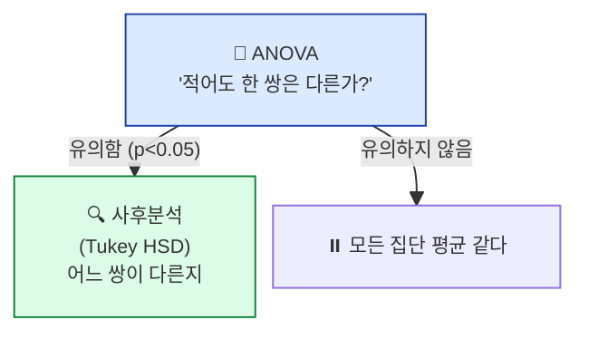
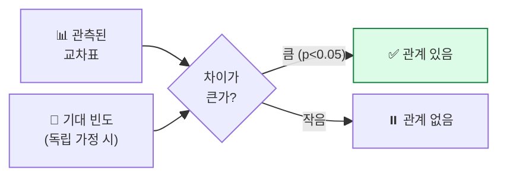

## 학습 목표

- **ANOVA**가 t검정과 어떻게 다른지 안다 (왜 3집단 이상일 때 t검정을 못 쓰나)
- **카이제곱 독립성 검정**으로 범주형 변수의 관계를 본다
- ML에서 **피처 선택 (SelectKBest)** 에 이 두 검정을 활용한다

<a id="toc"></a>

## 진행 순서

1. [ANOVA — 셋 이상 집단 비교](#part1)
2. [F값과 분산 분해](#part2)
3. [카이제곱 독립성 검정 — 범주형 변수의 관계](#part3)
4. [실습 — ANOVA, 카이제곱, 피처 선택](#part4)
5. [ML/DL 연결](#part5)
6. [정리](#part6)

---

# 09장. ANOVA와 카이제곱

<a id="part1"></a>

## 1. ANOVA — 셋 이상 집단 비교 [↑](#toc)

### 왜 t검정으로는 안 되나?

> 반 A, B, C, D 네 반의 시험 평균을 비교하고 싶습니다.
>
> t검정으로 두 반씩 짝지어 비교하면: AB, AC, AD, BC, BD, CD = **6번 검정**.

문제: **검정을 여러 번 하면 우연히 유의해질 확률이 누적**됩니다.
```
한 번 1종 오류 확률: 5%
6번 모두 안 틀릴 확률: (0.95)^6 ≈ 0.735
6번 중 한 번이라도 1종 오류: 26.5% ← 너무 높음!
```

### ANOVA의 해결

ANOVA = **Analysis of Variance** (분산 분석). **한 번의 검정**으로 "여러 집단의 평균이 다 같은가?" 판단.

```
H₀: μ_A = μ_B = μ_C = μ_D    (모든 평균 같음)
H₁: 적어도 하나는 다르다
```

> 💡 **ANOVA가 유의(p<0.05)하면**: "어딘가 차이가 있다" — 어디인지는 모름.
> → 사후분석 (Tukey HSD 등)으로 어느 쌍이 다른지 추가 분석.



---

<a id="part2"></a>

## 2. F값과 분산 분해 [↑](#toc)

### F값의 직관

```
F = 집단 간 분산 / 집단 내 분산
       └─ 시그널        └─ 노이즈

F 크면: 집단 평균들이 멀리 떨어짐 (집단 간 ↑) vs 한 집단 안에서는 비슷 (집단 내 ↓) → 차이 있음
F 작으면: 집단 평균 차이가 집단 내 흩어짐 수준 → 차이 없음
```

### 비유

> 반 A 평균 60점, B 평균 80점, C 평균 70점.
>
> - 각 반 내에서 점수가 ±2점만 흩어진다면 → **반 간 차이가 명확** → F 큼
> - 각 반 내에서 점수가 ±20점씩 흩어진다면 → 반 차이가 노이즈에 묻힘 → F 작음

---

<a id="part3"></a>

## 3. 카이제곱 독립성 검정 — 범주형 변수의 관계 [↑](#toc)

### 비유: 성별과 선호 색깔

> 남녀 1000명에게 좋아하는 색을 물었습니다.
> **성별과 색깔 선호가 관계 있나?**

| | 빨강 | 파랑 | 초록 |
|---|------|------|------|
| 남 | 80 | 250 | 170 |
| 여 | 200 | 150 | 150 |

### 카이제곱 검정의 직관

```
1. 두 변수가 독립이라면 어떤 분포가 나올지 (기대 빈도) 계산
2. 실제 관측 빈도와 비교
3. 차이가 크면 → "독립이 아니다 (관계 있다)"
```

```
카이제곱 통계량 χ² = Σ (관측 - 기대)² / 기대
```



### 카이제곱 검정의 3가지 변종

| 종류 | 용도 |
|------|------|
| **독립성 검정** | 두 범주형 변수가 관계 있나? (위 예) |
| **적합도 검정** | 데이터가 특정 분포(예: 균등)를 따르나? |
| **동질성 검정** | 여러 집단의 분포가 같은가? |

> 💡 ML 실무에서 가장 자주 쓰는 건 **독립성 검정** — "이 범주형 피처가 타겟과 관계 있나?".

---

<a id="part4"></a>

## 4. 실습 — ANOVA, 카이제곱, 피처 선택 [↑](#toc)

### Step 1: ANOVA로 세 집단 비교

```python
import numpy as np
from scipy import stats

np.random.seed(42)
group_a = np.random.normal(60, 10, 100)   # 평균 60
group_b = np.random.normal(70, 10, 100)   # 평균 70
group_c = np.random.normal(65, 10, 100)   # 평균 65

f_stat, p_value = stats.f_oneway(group_a, group_b, group_c)
print(f"F값: {f_stat:.3f}, p-value: {p_value:.4f}")
```

**예상 출력**:
```
F값: 26.842, p-value: 0.0000
```

### Step 2: 사후분석 (Tukey HSD)

```python
import pandas as pd
from statsmodels.stats.multicomp import pairwise_tukeyhsd

df = pd.DataFrame({
    "score": np.concatenate([group_a, group_b, group_c]),
    "group": ["A"]*100 + ["B"]*100 + ["C"]*100
})

tukey = pairwise_tukeyhsd(df["score"], df["group"], alpha=0.05)
print(tukey)
```

**예상 출력**:
```
Multiple Comparison of Means - Tukey HSD, FWER=0.05
====================================================
group1 group2 meandiff p-adj  lower  upper  reject
----------------------------------------------------
     A      B  10.234 0.000   6.812 13.656   True
     A      C   5.182 0.001   1.760  8.604   True
     B      C  -5.052 0.002  -8.474 -1.630   True
```

### 결과 해석

| 출력 | 의미 |
|------|------|
| ANOVA p < 0.05 | 어딘가 차이 있음 |
| Tukey의 모든 쌍 reject=True | 세 집단이 **서로 다 다름** |
| meandiff = 10.23 (A-B) | B가 A보다 평균 10점 높음 |

### Step 3: 카이제곱 독립성 검정

```python
# 성별 × 색깔 교차표
observed = np.array([
    [ 80, 250, 170],   # 남
    [200, 150, 150],   # 여
])

chi2, p, dof, expected = stats.chi2_contingency(observed)
print(f"카이제곱 통계량: {chi2:.3f}")
print(f"p-value: {p:.6f}")
print(f"자유도: {dof}")
print(f"기대 빈도:\n{expected.round(1)}")
```

**예상 출력**:
```
카이제곱 통계량: 89.726
p-value: 0.000000
자유도: 2
기대 빈도:
[[140.  200.  160. ]
 [140.  200.  160. ]]
```

### 결과 해석

| 출력 | 의미 |
|------|------|
| p < 0.05 | **성별과 색깔 선호는 관계 있음** |
| 기대 vs 관측 차이 | 남자는 파랑↑, 여자는 빨강↑ — 실제 차이 |

### Step 4: ML 피처 선택에 활용

```python
from sklearn.datasets import load_iris
from sklearn.feature_selection import SelectKBest, f_classif

iris = load_iris()
X, y = iris.data, iris.target

# ANOVA F-test로 상위 2개 피처 선택
selector = SelectKBest(score_func=f_classif, k=2)
X_new = selector.fit_transform(X, y)

print("각 피처의 F값:")
for name, score in zip(iris.feature_names, selector.scores_):
    print(f"  {name}: F = {score:.2f}")
```

**예상 출력**:
```
각 피처의 F값:
  sepal length (cm): F = 119.26
  sepal width (cm) : F = 49.16
  petal length (cm): F = 1180.16  ← 가장 강력
  petal width (cm) : F = 960.01
```

### 결과 해석

| 발견 | 의미 |
|------|------|
| petal length, petal width의 F값 매우 큼 | iris 품종 분류에 가장 중요 |
| sepal width의 F값 가장 작음 | 품종 분류에 덜 중요 |
| `SelectKBest(k=2)` | 상위 2개만 자동 선택 |

> 💡 **이게 바로 통계의 ANOVA가 ML의 피처 선택으로 직접 활용되는 모습**입니다. `f_classif`는 ANOVA F-test, 범주형 타겟에 대한 수치형 피처 선택의 표준 도구.

---

<a id="part5"></a>

## 5. ML/DL 연결 [↑](#toc)

> 🔗 **이 모듈이 ML/DL에서 어떻게 쓰이나**

### 1) 피처 선택의 1차 도구

| 피처 유형 | 타겟 유형 | 선택 도구 |
|---------|---------|---------|
| 수치형 | 수치형 | 피어슨 상관계수 (모듈 4) |
| 수치형 | 범주형 | **ANOVA F-test (`f_classif`)** |
| 범주형 | 범주형 | **카이제곱 (`chi2`)** |

```python
from sklearn.feature_selection import f_classif, chi2, SelectKBest
```

### 2) 클래스 불균형 분석

- ANOVA로 "각 클래스 그룹의 피처 분포가 다른가?" 확인
- 카이제곱으로 "범주형 피처가 타겟과 독립인가?" 확인

### 3) 모델 비교

여러 ML 모델의 정확도가 다를 때, **그 차이가 통계적으로 유의한가?** ANOVA로 검정. (k-fold 교차검증 결과들을 비교)

### 4) A/B/n 테스트

A/B 테스트는 t검정, **A/B/C/D 테스트는 ANOVA**.

---

<a id="part6"></a>

## 6. 정리 [↑](#toc)

### 이 장 한 줄 요약
> **3집단 이상 평균 비교는 ANOVA, 범주형 변수의 관계는 카이제곱.** 둘 다 ML 피처 선택의 핵심 도구.

### 자가 진단 체크리스트

| 항목 | 확인 |
|------|:---:|
| 왜 t검정으로 3집단을 비교하면 안 되는지 안다 | ☐ |
| F값의 분자/분모 의미를 안다 | ☐ |
| Tukey HSD의 역할을 안다 | ☐ |
| 카이제곱 독립성 검정의 직관(기대 vs 관측)을 안다 | ☐ |
| `f_classif`와 `chi2`의 활용 차이를 안다 | ☐ |
| `SelectKBest`가 어떻게 동작하는지 안다 | ☐ |
