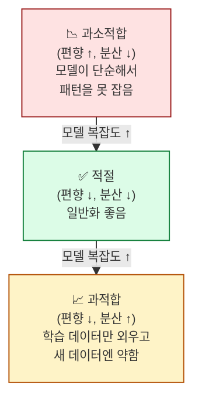
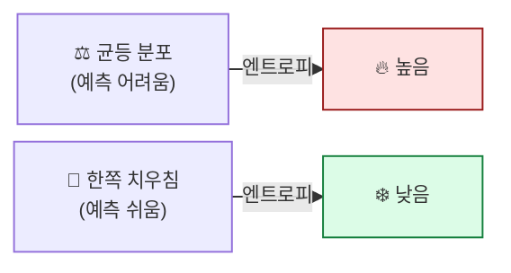
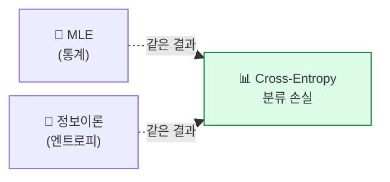
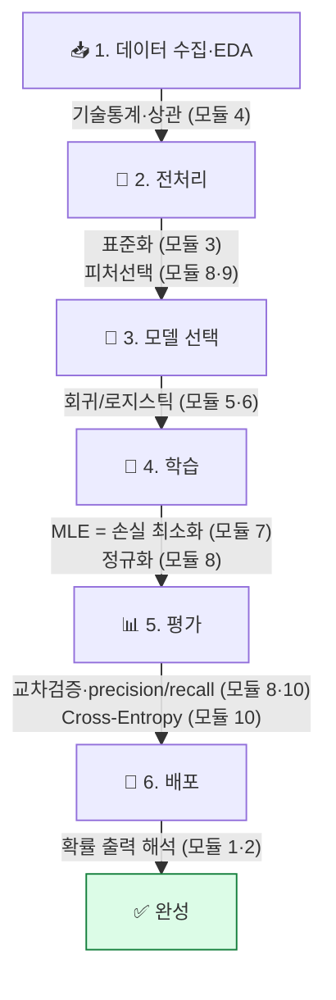

## 학습 목표

- **편향-분산 트레이드오프**의 직관을 안다 (과적합/과소적합)
- **교차검증(k-fold)** 의 필요성과 동작을 안다
- **엔트로피**와 **Cross-Entropy**의 의미를 "놀라움의 평균" 비유로 이해한다
- 본 과정 전체를 ML 파이프라인 한 장 그림으로 조감한다

<a id="toc"></a>

## 진행 순서

1. [편향-분산 트레이드오프](#part1)
2. [교차검증 — 모델 평가의 표준](#part2)
3. [엔트로피 — 놀라움의 평균](#part3)
4. [Cross-Entropy 다시 보기](#part4)
5. [실습 — 미니 ML 파이프라인](#part5)
6. [ML/DL 전체 조감 — 통계가 ML 어디에 쓰이나](#part6)
7. [정리 — 본 과정 졸업](#part7)

---

# 10장. 통계에서 ML로

<a id="part1"></a>

## 1. 편향-분산 트레이드오프 [↑](#toc)

### 다트 비유

> 다트판에 다섯 번 던졌습니다.
>
> | 결과 | 편향 | 분산 |
> |------|------|------|
> | 다섯 다 정중앙 부근 모임 | 낮음 ✅ | 낮음 ✅ |
> | 다섯 다 한쪽 구석 모임 | 높음 ❌ | 낮음 ✅ |
> | 사방에 흩어졌지만 평균이 정중앙 | 낮음 ✅ | 높음 ❌ |
> | 사방에 흩어지고 평균도 빗나감 | 높음 ❌ | 높음 ❌ |



### ML 용어 매핑

| 통계 | ML |
|-----|-----|
| 편향(bias) | 과소적합(underfitting) |
| 분산(variance) | 과적합(overfitting) |
| 둘 다 낮음 | 일반화(generalization) 잘 됨 |

### 트레이드오프

> 모델을 복잡하게 만들면 편향은 줄지만 분산이 늘어납니다.
> 단순하게 만들면 그 반대.
> **둘의 합이 최소인 지점**이 최적.

> 💡 정규화(L1/L2, 모듈 8)와 교차검증(이 모듈 §2)이 이 트레이드오프를 다루는 두 핵심 도구입니다.

---

<a id="part2"></a>

## 2. 교차검증 — 모델 평가의 표준 [↑](#toc)

### 단순 분할의 한계

```
학습 데이터 (70%) → 모델 학습
테스트 데이터 (30%) → 평가
```

문제: **테스트 데이터를 어떻게 자르느냐**에 따라 결과가 들쭉날쭉.

### k-fold 교차검증

데이터를 k개의 조각(fold)으로 나누고, 각 조각을 한 번씩 테스트로 쓰는 방식.

```
전체 데이터 → 5조각: [▒▒▒▒▒]

회차 1: [▣▒▒▒▒]  ▣=테스트, ▒=학습
회차 2: [▒▣▒▒▒]
회차 3: [▒▒▣▒▒]
회차 4: [▒▒▒▣▒]
회차 5: [▒▒▒▒▣]

→ 5번 평가의 평균 = 더 안정적인 성능 추정
```


> 💡 **중심극한정리(모듈 3)와 같은 원리**입니다 — 여러 측정의 평균이 더 안정적. ML에서는 이걸 **모델 평가**에 씁니다.

### Stratified k-fold

분류 문제에서 **각 fold의 클래스 비율을 원본과 동일하게 유지**. 불균형 데이터에 필수.

---

<a id="part3"></a>

## 3. 엔트로피 — 놀라움의 평균 [↑](#toc)

### 비유: 두 동전

> **동전 A**: 앞 50% / 뒤 50% — 결과 예측 어려움 → **놀라움 큼**
> **동전 B**: 앞 99% / 뒤 1% — 거의 앞면 → **놀라움 작음**

엔트로피는 **"평균적인 놀라움" 또는 "불확실성의 양"** 을 수치화합니다.

```
엔트로피 H = - Σ p × log p
              └─ 확률 p가 작을수록 log p는 큰 음수 → 놀라움 큼
                 그 합을 평균낸 게 엔트로피
```

| 분포 | 엔트로피 | 의미 |
|------|--------|------|
| 동전 A (50:50) | 1.0 bit | 최대 불확실성 |
| 동전 B (99:1) | 0.08 bit | 거의 확실 |
| 주사위 (1/6 균등) | 2.58 bit | 균등 분포 = 최대 엔트로피 |



> 💡 정보이론에서 엔트로피는 **"이 분포의 결과를 표현하는 데 필요한 평균 비트 수"**. 이걸 ML로 가져온 게 다음 §4.

---

<a id="part4"></a>

## 4. Cross-Entropy 다시 보기 [↑](#toc)

### 두 분포 비교

> 한 분포 P(진실)와 다른 분포 Q(모델 예측)가 있을 때:
>
> **Cross-Entropy H(P, Q) = "P의 결과를, Q를 기준으로 표현할 때 평균 비트"**

```
H(P, Q) = - Σ P(x) × log Q(x)
```

### 분류 모델에서의 의미

- **P(진실)**: 실제 라벨 (one-hot: 정답이면 1, 아니면 0)
- **Q(예측)**: 모델 출력 확률

```
정답 클래스가 0번이고 P = [1, 0, 0]
모델 출력 Q = [0.8, 0.1, 0.1]

Cross-Entropy = -log(0.8) ≈ 0.22  (예측 좋음 → 낮음)

모델이 Q = [0.1, 0.7, 0.2]였다면
Cross-Entropy = -log(0.1) ≈ 2.30  (예측 나쁨 → 높음)
```

> 💡 **Cross-Entropy 손실 = "모델이 정답에 얼마나 확신을 못 주는가"**.
> 정답 클래스의 예측 확률이 1에 가까우면 → 손실 ↓.
> 정답 클래스의 예측 확률이 0에 가까우면 → 손실 ↑↑ (로그가 -∞).

### MLE 관점과 일치

모듈 7에서 본 "베르누이 분포 MLE = Cross-Entropy"가 정보이론 관점에서도 같은 것:
- **MLE 시각**: "데이터를 가장 잘 설명하는 분포 찾기"
- **정보이론 시각**: "두 분포의 거리(KL 발산) 최소화"
- **결과식**: 동일 — 분류 모델의 Cross-Entropy 손실



> 💡 **언어 모델(LLM)의 학습도 Cross-Entropy**. "다음 단어 예측의 정답 분포 vs 모델 분포"의 cross-entropy를 최소화하는 것이 GPT 학습의 전부.

---

<a id="part5"></a>

## 5. 실습 — 미니 ML 파이프라인 [↑](#toc)

### Step 1: 본 과정에서 배운 도구 모두 사용

```python
import numpy as np
import pandas as pd
from sklearn.datasets import load_breast_cancer
from sklearn.model_selection import train_test_split, cross_val_score
from sklearn.preprocessing import StandardScaler
from sklearn.linear_model import LogisticRegression
from sklearn.metrics import classification_report, log_loss

# 유방암 진단 데이터
data = load_breast_cancer()
X, y = data.data, data.target
print(f"샘플 수: {X.shape[0]}, 피처 수: {X.shape[1]}")
print(f"클래스 분포: {pd.Series(y).value_counts().tolist()}")
```

### Step 2: 본 과정의 4단계 적용

```python
# (모듈 3) 표준화
scaler = StandardScaler()
X_s = scaler.fit_transform(X)

# 학습/테스트 분할
X_train, X_test, y_train, y_test = train_test_split(X_s, y, test_size=0.2, random_state=42)

# (모듈 6) 로지스틱 회귀 + (모듈 8) L2 정규화
model = LogisticRegression(penalty="l2", C=1.0, max_iter=1000)
model.fit(X_train, y_train)

# (모듈 10) 교차검증
cv_scores = cross_val_score(model, X_s, y, cv=5)
print(f"\n5-fold 교차검증 정확도: {cv_scores.mean():.3f} ± {cv_scores.std():.3f}")

# (모듈 6) 분류 결과 평가
y_pred = model.predict(X_test)
y_prob = model.predict_proba(X_test)
print(f"\n테스트 정확도: {model.score(X_test, y_test):.3f}")
print(classification_report(y_test, y_pred, target_names=data.target_names))

# (모듈 7·10) Cross-Entropy 손실
ce_loss = log_loss(y_test, y_prob)
print(f"Cross-Entropy 손실: {ce_loss:.4f}")
```

**예상 출력**:
```
샘플 수: 569, 피처 수: 30
클래스 분포: [212, 357]

5-fold 교차검증 정확도: 0.974 ± 0.012

테스트 정확도: 0.974
              precision    recall  f1-score
   malignant       0.98      0.95      0.97
      benign       0.97      0.99      0.98

Cross-Entropy 손실: 0.0823
```

### 결과 해석 — 어디서 통계가 쓰였나

| 단계 | 사용한 통계 개념 | 모듈 |
|------|-------------|------|
| 표준화 | Z-score, μ/σ | 모듈 3, 4 |
| 로지스틱 회귀 | 시그모이드, MLE | 모듈 6, 7 |
| L2 정규화 | 다중공선성 → Ridge | 모듈 8 |
| 5-fold 교차검증 | 표본분포, 중심극한정리 | 모듈 3, 10 |
| precision/recall | 1종/2종 오류 | 모듈 8 |
| Cross-Entropy | 베르누이 MLE = 엔트로피 | 모듈 7, 10 |

> 💡 **이 짧은 코드 안에 본 과정의 거의 모든 개념이 들어있습니다.** 통계는 ML의 모든 단계에 스며들어 있습니다.

---

<a id="part6"></a>

## 6. ML/DL 전체 조감 — 통계가 ML 어디에 쓰이나 [↑](#toc)

### 본 과정 → ML/DL 파이프라인 매핑



### 통계 ↔ ML/DL 용어 사전

| 통계 용어 | ML/DL 용어 | 같음 의미 |
|---------|----------|---------|
| 표본 추출 | 데이터 분할 | 일부만 보고 전체 추정 |
| 회귀계수 | 가중치(weight) | 학습되는 파라미터 |
| 잔차 | 오차 | y - 예측 |
| 최소제곱법 | MSE 최소화 | 같은 식 |
| 베르누이 MLE | Cross-Entropy 최소화 | 같은 식 |
| 다중공선성 | 다중공선성 | (그대로) → 해결책: L1/L2 정규화 |
| 1종 오류 | False Positive | 잘못 양성 |
| 2종 오류 | False Negative | 잘못 음성 |
| 가설검정 | A/B 테스트 | 두 그룹 차이 검증 |
| ANOVA F-test | f_classif (피처 선택) | 같음 |
| 카이제곱 | chi2 (피처 선택) | 같음 |
| 중심극한정리 | 부트스트래핑, 앙상블 | 평균이 안정 |
| 베이지안 사후 | predict_proba | 같음 |

---

<a id="part7"></a>

## 7. 정리 — 본 과정 졸업 [↑](#toc)

### 본 과정 전체 한 줄 요약
> **ML/DL의 모든 핵심 개념은 통계의 도구로부터 나왔다.** 이제 ML 과정에서 "왜?"를 알고 있는 채로 코드를 만난다.

### 다음 단계

| 다음 자료 | 본 과정의 어느 모듈이 직접 연결되나 |
|---------|------------------------------|
| **ML 입문 (06_MachineLearning)** | 모듈 4(EDA), 5(회귀), 6(로지스틱), 8(정규화), 10(교차검증) |
| **Deep Learning (07_DeepLearning)** | 모듈 3(정규분포→가중치 초기화), 6(시그모이드→뉴런), 7(MLE→손실함수) |
| **LLM (08_llm)** | 모듈 7(MLE), 10(Cross-Entropy = 언어모델 학습의 본질) |
| **RAG System (15_RAG_System)** | 모듈 2(베이지안), 4(임베딩 유사도 = 상관) |

### 졸업 체크리스트

| 항목 | 확인 |
|------|:---:|
| 분류 모델 출력 = 확률임을 안다 (모듈 1) | ☐ |
| ML 학습 = 베이지안 업데이트임을 안다 (모듈 2) | ☐ |
| 정규분포가 ML 어디에 쓰이는지 5가지 든다 (모듈 3) | ☐ |
| EDA 두 줄 코드(`describe`, `corr`)를 짤 수 있다 (모듈 4) | ☐ |
| 선형회귀의 출력(R², coef, p-value)을 해석한다 (모듈 5) | ☐ |
| "단일 뉴런 = 로지스틱 회귀"를 그릴 수 있다 (모듈 6) | ☐ |
| **MSE = 정규 MLE, CE = 베르누이 MLE** (모듈 7) | ☐ |
| 다중공선성 → Ridge/Lasso 연결을 안다 (모듈 8) | ☐ |
| `SelectKBest(f_classif)`와 `chi2` 활용 시점을 안다 (모듈 9) | ☐ |
| 편향-분산 트레이드오프와 교차검증 (모듈 10) | ☐ |
| **엔트로피·Cross-Entropy로 LLM까지의 다리를 그릴 수 있다** (모듈 10) | ☐ |

### 마지막 한 마디

> **통계는 ML의 언어입니다.** 이 과정에서 익힌 비유와 직관이 앞으로 만날 ML/DL 자료에서 "그 식이 어디서 왔는지" 알아보는 눈이 되기를 바랍니다.
>
> 다음 자료(`/ml`, `/deeplearning`)에서 만나요.
