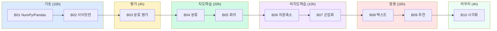



# 파이썬 머신러닝 완벽 가이드(개정2판) — 수업 자료

> 권철민 저, 위키북스, 2022 (개정2판). 본 자료는 책의 10개 장 구조를 그대로 따르며, Colab 실습 노트북과 1:1 매핑됩니다.

---

## 수업 운영 방식

- **교재**: 『파이썬 머신러닝 완벽 가이드 (개정2판)』 (724쪽)
- **실습 환경**: Google Colab (`data/pymlrev2-main/`의 `*_colab.ipynb` 파일)
- **자료 구성**: 강의노트(이 폴더의 `B01.md`~`B10.md`) + Colab 노트북
- **권장 진행**: 강의노트로 개념 설명 → Colab 노트북으로 실습 → 도전 과제

## 전체 커리큘럼 (책 10장 / 약 64시간)

| 장 | 제목 | 핵심 학습 내용 | 분량 | 강의 시간 |
|---|---|---|---|---|
| [B01](/ml-book/ch01) | 파이썬 ML 생태계 | NumPy, Pandas, 시각화 도구 | 50쪽 | 4h |
| [B02](/ml-book/ch02) | 사이킷런 시작 | fit/predict, train/test, 전처리, 교차검증 | 70쪽 | 6h |
| [B03](/ml-book/ch03) | 평가 | 정확도/정밀도/재현율/F1/ROC-AUC | 50쪽 | 4h |
| [B04](/ml-book/ch04) | 분류 | 트리/앙상블/RF/GBM/XGBoost/LightGBM/HyperOpt/스태킹 | 150쪽 | 12h |
| [B05](/ml-book/ch05) | 회귀 | 경사하강법/선형/규제/로지스틱/회귀트리 | 100쪽 | 8h |
| [B06](/ml-book/ch06) | 차원 축소 | PCA / LDA / SVD / NMF | 50쪽 | 4h |
| [B07](/ml-book/ch07) | 군집화 | KMeans / MeanShift / GMM / DBSCAN | 70쪽 | 6h |
| [B08](/ml-book/ch08) | 텍스트 분석 | BOW/TF-IDF/감성/토픽/문서군집/한글/Mercari | 120쪽 | 10h |
| [B09](/ml-book/ch09) | 추천 시스템 | 콘텐츠/협업/잠재요인/Surprise | 60쪽 | 6h |
| [B10](/ml-book/ch10) | 시각화 | Matplotlib / Seaborn 실전 | 30쪽 | 4h |
| 부록 | KNN과 SVM | 책 범위 외, 분류 보조 알고리즘 | - | 2h (선택) |

**합계: 약 64시간 + Q&A/프로젝트 16시간 = 80시간**

---

## 학습 흐름 (한눈에)

---

## 자료 사용 가이드

### 강사
1. 강의 전: 해당 `BNN.md` 의 "학습 목표"·"진행 순서" 확인
2. 강의 중: 노트의 절 순서대로 진행, "실습 가이드" 표에 따라 Colab 셀 매핑
3. 강의 후: "정리와 체크리스트"로 학생 자기평가

### 학생
1. 노트의 **학습 목표 먼저 확인** — "오늘 끝나면 이걸 할 수 있어야 한다"
2. 노트의 본문 → 해당 Colab 셀 실행 → 결과 비교
3. "정리와 체크리스트"로 자기 점검
4. **흔한 오해 모음** 꼭 읽고 넘어가기

---

## Colab 실습 환경 준비

모든 `_colab.ipynb` 파일은 다음을 첫 셀에서 자동 처리합니다.
- Python·numpy·pandas·sklearn 버전 출력
- (8장) NLTK 리소스 다운로드
- (8.9장) KoNLPy + JDK + NanumGothic 설치
- (9.8장) scikit-surprise 설치 안내

데이터 파일은 Colab에 직접 업로드하거나 Google Drive 마운트로 사용합니다(각 노트북 첫 셀 안내 참고).

---

## 다중 페르소나 비판 검토 (자료 설계 시 적용한 원칙)

| 페르소나 | 적용 원칙 |
|---|---|
| 현업 강사 | 노트는 개념·도식 중심, 코드는 미니샘플만 |
| 학생 | 책+Colab+노트 3개 동시 보기 부담 → 명확한 앵커 표시 |
| 콘텐츠 작가 | 책 본문 표현 보존 + 직관 비유 강화 |
| 교육공학자 | 단위 표준: 학습목표→도입→본론→실습→정리 |
| 데블스 애드버킷 | M11 KNN/SVM은 책 범위 외 → 부록 |

자세한 매핑/설계 의도는 [`_STRUCTURE.md`](/ml-book/structure) 참조.


