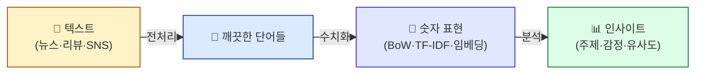

# Text Mining
{: .no_toc }

**텍스트를 데이터로 다루는 법.** 한국어 뉴스·리뷰를 분석해 의미를 뽑아내는 4일 입문 과정.
{: .fs-6 .fw-300 }

---

## 이 과정은 누구를 위한 것인가요?

- **파이썬 잘 모르는 비전공자** (변수·for문 정도 들어본 수준)
- "텍스트 데이터로 뭔가 해보고 싶다"는 분석/마케팅/기획 직군
- ChatGPT 시대에 **그 안에 들어 있는 기초**를 알고 싶은 사람
- 한국어 뉴스·리뷰·SNS 데이터를 다루고 싶은 분

> 💡 본 과정은 **머신러닝/딥러닝 과정의 선수 트랙**입니다. ML/DL을 배우기 전 **텍스트라는 데이터 형태**를 다루는 법을 익힙니다.

---

## 전체 그림 — 텍스트마이닝이 뭐 하는 건가?



**비유 한 줄**: 텍스트마이닝은 **"텍스트 광산에서 의미를 채굴(mining)"** 하는 작업입니다.

---

## 학습 목표

이 과정을 마치면 다음을 할 수 있습니다.

1. 한국어 텍스트를 **형태소 단위로 쪼개고** 불용어를 제거할 수 있다
2. **정규표현식**으로 전화번호·이메일 등 패턴을 찾고 정제할 수 있다
3. **빈도분석 + 시각화**(워드클라우드·트리맵)로 텍스트를 한눈에 본다
4. **TF-IDF**로 문서별 핵심 단어를 뽑을 수 있다
5. **Word2Vec 임베딩**으로 단어 간 유사도를 계산할 수 있다
6. **LDA 토픽 모델링**으로 문서를 자동 분류할 수 있다
7. **감성분석**으로 리뷰의 긍정/부정을 판별할 수 있다

---

## 과정 구성 (4일 · 9개 모듈)

| 일차 | # | 모듈 | 핵심 개념 | 노트북 |
|:----:|:-:|------|----------|:-----:|
| **1일차** | 00 | 텍스트마이닝 소개 (본 페이지) | 환경 셋업, Colab | — |
| | 01 | [형태소분석과 전처리](/textmining/morpheme) | NLTK·Okt·Kiwi | `01` |
| | 02 | [정규표현식](/textmining/regex) | 패턴 매칭 | `02` |
| **2일차** | 03 | [빈도분석과 시각화](/textmining/frequency) | Counter, 트리맵, 워드클라우드 | `03` |
| | 04 | [BoW와 원핫 인코딩](/textmining/bow) | Bag of Words, One-hot, N-gram | `05*` |
| | 05 | [TF-IDF](/textmining/tfidf) | 문서별 핵심 단어 | `04` |
| **3일차** | 06 | [워드 임베딩](/textmining/embedding) | Word2Vec, Doc2Vec | `06` |
| | 07 | [(중간정리) Local vs Distributed](/textmining/representation) | 표현 방식 비교 | — |
| **4일차** | 08 | [LDA 토픽 모델링](/textmining/lda) | 잠재 디리클레 할당 | `07` |
| | 09 | [감성분석](/textmining/sentiment) | 긍정/부정 판별 | 신규 |
| | 10 | [종합 프로젝트](/textmining/project) | 전체 파이프라인 | 신규 |

> 📌 **노트북 컬럼**의 번호는 `docs/06_AI/03_TextMining/notebook/(완)*.ipynb` 의 번호입니다. **이 마크다운 자료가 이론·비유·도식**이고, **노트북이 실습**입니다.

---

## 0. 환경 셋업 — Colab으로 시작하기

**왜 Colab인가?**
- 설치 0분 (브라우저만 있으면 됨)
- KoNLPy의 **Java 설치 문제 회피** (수업 첫 시간이 날아가는 1위 함정)
- 한글 폰트 한 줄로 설정
- 무료 GPU (Word2Vec 학습 시 유용)

### 첫 노트북 셀에 항상 붙일 환경 셋업

```python
# === Colab 환경 셋업 (모든 노트북 첫 셀) ===
# 1) 패키지 설치
!pip install -q kiwipiepy konlpy wordcloud squarify gensim nltk

# 2) KoNLPy를 위한 Java 설치
!apt-get -qq install -y default-jdk fonts-nanum > /dev/null

# 3) NLTK 데이터
import nltk
nltk.download("punkt", quiet=True)
nltk.download("punkt_tab", quiet=True)
nltk.download("averaged_perceptron_tagger", quiet=True)
nltk.download("averaged_perceptron_tagger_eng", quiet=True)
nltk.download("stopwords", quiet=True)
nltk.download("wordnet", quiet=True)

# 4) 한글 폰트 설정 (그래프에서 한글 깨짐 방지)
import matplotlib.pyplot as plt
import matplotlib as mpl
mpl.rcParams["font.family"] = "NanumGothic"
mpl.rcParams["axes.unicode_minus"] = False

print("✅ 환경 셋업 완료")
```

> ⚠️ **위 셀 실행 후 폰트가 안 보이면** `런타임(Runtime) → 세션 다시 시작(Restart session)` 후 다시 실행하세요. (Colab이 새 폰트를 인식하려면 재시작 필요)

### 로컬(Anaconda)을 쓸 경우

본 과정은 **Colab 기준**으로 진행됩니다. 로컬 환경은 학생마다 OS·버전 차이로 트러블슈팅이 많아져 수업 진행이 어렵습니다.
- Windows는 KoNLPy 설치 시 JDK 설치 + 환경변수 등록이 필요
- Mac은 Apple Silicon에서 일부 패키지 호환성 이슈

---

## 자료 활용 방법

각 모듈은 두 가지 자료로 구성됩니다.

| 자료 | 역할 | 어디서 |
|------|------|--------|
| **마크다운 강의자료** (이 사이트) | 이론·비유·도식·"왜 배우는가" | 본 사이트 좌측 메뉴 |
| **노트북 (`.ipynb`)** | 실습 코드 한 줄씩 따라하기 + 결과 해석 | `notebook/` 폴더 |

**권장 학습 흐름**:
```
1. 마크다운 강의자료 읽기 (5~10분) — 개념과 비유 익히기
2. 노트북 열고 셀 순서대로 실행 (20~40분) — 손으로 직접 해보기
3. 마크다운 끝의 "✅ 자가 진단 체크리스트" — 이해 확인
```

> 💡 **셀 실행 순서가 가장 중요합니다.** Jupyter 노트북은 셀을 임의 순서로 실행할 수 있어 보이지만, **위에서 아래로 차례로 실행**해야 변수가 제대로 정의됩니다. `NameError`의 90%는 이전 셀을 안 돌린 탓.

---

## 선수 학습

- **필수**: 파이썬 변수·문자열·리스트·for문 (1일차 오전에 빠르게 복습)
- **권장**: 없음
- **함께 보면 좋은**:
  - 📖 [`Statistics for ML`](/statistics) — 빈도·분포 개념이 텍스트마이닝과 직결
  - 📖 [`Machine Learning`](/machinelearning) — 본 과정 이후 다음 단계

---

## 다음 과정

본 과정 수료 후 진입하기 좋은 자료:

- 📖 [**Machine Learning**](/machinelearning) — 텍스트 분류·감성분석을 ML로
- 📖 [**Deep Learning**](/deeplearning) — RNN·Transformer로 텍스트 처리
- 📖 [**LLM**](/llm) — ChatGPT 같은 언어모델의 기초가 본 과정의 임베딩
- 📖 [**RAG System**](/rag-system) — 본 과정의 임베딩이 검색·질의응답으로

---

## 강사 운영 노트
{: .text-grey-dk-000 }

> 이 섹션은 강사용 운영 메모입니다. 수강생은 읽지 않아도 됩니다.

- 환경 셋업에 1.5시간 이상 확보 (KoNLPy/Java 함정 회피용 Colab 정착 시간 포함)
- 1일차 오전 파이썬 복습은 형태소 분석에 필요한 최소한만 (문자열 메서드 + 리스트 + for + 함수)
- 4일차 종합 프로젝트는 팀별 3~4명, 발표 시간 포함하여 4시간 권장
- 노트북 원본은 `notebook/(완)*.ipynb`. 학생용 빈 양식은 별도 노트북(`(완)` 접두어 없는 파일) 사용
