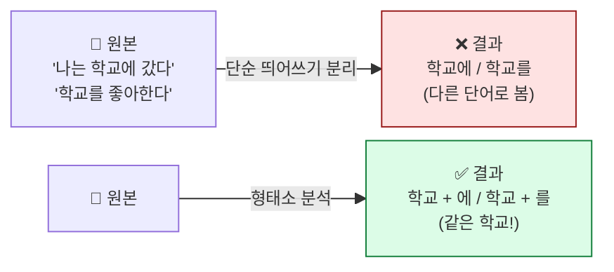
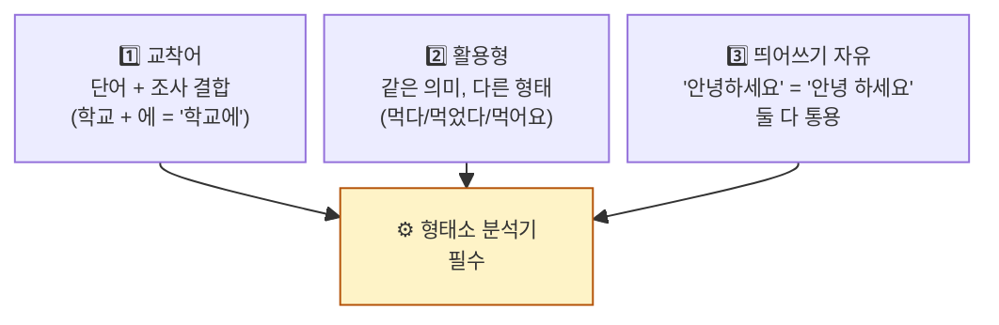

## 학습 목표

- **형태소(morpheme)** 가 무엇이고 왜 분석해야 하는지 안다
- **한국어가 영어보다 어려운 이유**를 설명할 수 있다
- **NLTK / Okt / Kiwi** 세 도구의 차이와 선택 기준을 안다
- **불용어(stopword)** 의 개념과 제거 방법을 익힌다

<a id="toc"></a>

## 진행 순서

1. [형태소가 뭐예요?](#part1)
2. [한국어가 어려운 이유](#part2)
3. [NLTK — 영어 형태소 분석](#part3)
4. [Okt(KoNLPy) — 한국어 표준 도구](#part4)
5. [Kiwi — 띄어쓰기 보정에 강한 신예](#part5)
6. [불용어 — 분석에서 빼야 할 단어들](#part6)
7. [실습 노트북 안내](#part7)
8. [정리](#part8)

---

# 01장. 형태소분석과 전처리

<a id="part1"></a>

## 1. 형태소가 뭐예요? [↑](#toc)

### 레고 블록 비유

> 텍스트는 **레고 작품**이고, 형태소는 그것을 이루는 **레고 블록 하나하나**입니다.
>
> 작품을 분석하려면 어떤 블록이 어떻게 조립됐는지 봐야 합니다.

**형태소(morpheme)** = **의미를 가지는 가장 작은 단위**.

| 문장 | 형태소 단위 분해 |
|------|----------------|
| `나는 학교에 간다` | `나` + `는` + `학교` + `에` + `간다` |
| `먹었습니다` | `먹` + `었` + `습니다` |
| `친구들과` | `친구` + `들` + `과` |

> 💡 **"가다", "갔다", "간다", "갈게요"** — 모두 같은 의미(go)지만 형태가 다릅니다. 형태소 분석기는 이걸 **`가다`라는 기본형(lemma)** 으로 묶어줍니다.

### 왜 형태소를 분석해야 할까?



> **핵심**: 형태소 분석 없이 띄어쓰기만으로 단어를 자르면 **"학교에" ≠ "학교를"** 로 봅니다. 분석기를 거치면 둘 다 **"학교"** 로 통일.

---

<a id="part2"></a>

## 2. 한국어가 어려운 이유 [↑](#toc)

### 영어 vs 한국어 — 같은 문장, 다른 난이도

| 문장 | 띄어쓰기로 자르기 | 결과 |
|------|----------------|------|
| `I love you` | 공백으로 자르기 | `I` / `love` / `you` → **끝!** |
| `나는너를사랑해` | (띄어쓰기도 없음) | ??? |

영어는 **띄어쓰기만 잘하면** 단어가 분리됩니다.
한국어는 다음 3가지 어려움이 동시에 있습니다.

### 한국어 처리의 3대 함정



| 함정 | 예 | 해결책 |
|------|---|--------|
| **교착어** | `학교에` `학교를` `학교에서` | 단어 + 조사 분리 |
| **활용형** | `먹다` `먹었다` `먹어요` `먹습니다` | 기본형으로 정규화(lemmatization) |
| **띄어쓰기 자유** | `안녕하세요` vs `안녕 하세요` | 띄어쓰기 보정 (Kiwi의 강점) |

> 💡 **그래서 한국어는 영어보다 처리하기 어렵습니다.** 영어용 도구(NLTK)만 가지고는 한국어를 못 다루고, 한국어 전용 도구(KoNLPy, Kiwi)가 따로 있습니다.

---

<a id="part3"></a>

## 3. NLTK — 영어 형태소 분석 [↑](#toc)

### NLTK는?

> **NLTK(Natural Language Toolkit)** — 영어 NLP의 표준. 2001년부터 사용된 노장. 한국어는 제한적.

본 과정에서는 **영어 텍스트 처리에만** 사용합니다.

### 핵심 함수 4가지만

| 함수 | 역할 | 예 |
|------|------|---|
| `word_tokenize(text)` | 단어 단위 분리 | `"I love you"` → `["I", "love", "you"]` |
| `pos_tag(words)` | 품사 태깅 | `("love", "VB")` (동사) |
| `WordNetLemmatizer().lemmatize()` | 기본형 변환 | `"loved"` → `"love"` |
| `PorterStemmer().stem()` | 어간 추출 | `"running"` → `"run"` |

### 코드 한 눈에

```python
import nltk
nltk.download("punkt")
nltk.download("averaged_perceptron_tagger")

text = "The little yellow dog barked at the Persian cat"
words = nltk.word_tokenize(text)
tagged = nltk.pos_tag(words)
print(tagged)
# [('The', 'DT'), ('little', 'JJ'), ('yellow', 'JJ'), ('dog', 'NN'), ...]
```

| 결과 의미 | 품사 |
|----------|------|
| `DT` | 한정사 (the, a) |
| `JJ` | 형용사 |
| `NN` | 명사 |
| `VB` | 동사 |

> 💡 영어 품사 태그는 **40여 개**. 처음 보면 외계어 같지만, 분석에 자주 쓰는 건 명사(NN), 동사(VB), 형용사(JJ) 정도.

---

<a id="part4"></a>

## 4. Okt(KoNLPy) — 한국어 표준 도구 [↑](#toc)

### KoNLPy는?

> **KoNLPy** = 여러 한국어 분석기를 파이썬에서 쓸 수 있게 묶은 패키지.
> 그 중 **Okt(구 Twitter 분석기)** 가 가장 친근하고 많이 쓰입니다.

### Okt의 4대 메서드

| 메서드 | 역할 | 예 |
|------|------|---|
| `.morphs(text)` | 형태소 단위로 자르기 | `"나는 학교에 간다"` → `["나", "는", "학교", "에", "간다"]` |
| `.pos(text)` | 품사 태깅 | `("나", "Noun")`, `("는", "Josa")` |
| `.nouns(text)` | 명사만 추출 | `["나", "학교"]` |
| `.normalize(text)` | 정규화 (오타·축약 보정) | `"안냐세욬"` → `"안녕하세요"` |

### 코드 한 눈에

```python
from konlpy.tag import Okt
okt = Okt()

text = "나는 학교에 갔다가 친구들과 노올아"

# ① 형태소 분리
print(okt.morphs(text))
# ['나', '는', '학교', '에', '갔다가', '친구', '들', '과', '노올아']

# ② 품사 태깅
print(okt.pos(text))
# [('나', 'Noun'), ('는', 'Josa'), ('학교', 'Noun'), ('에', 'Josa'), ...]

# ③ 명사만 (분석에 가장 자주 씀)
print(okt.nouns(text))
# ['나', '학교', '친구']

# ④ 정규화 (구어체·오타 보정)
print(okt.normalize(text))
# '나는 학교에 갔다가 친구들과 놀아'
#                            └ '노올아' → '놀아' 로 보정
```

> 💡 **`nouns()`가 가장 자주 쓰입니다.** 텍스트 분석은 보통 **명사 중심**이고, 조사·어미는 제거하는 게 표준.

### Okt 옵션 — `stem=True`

`okt.morphs(text, stem=True)` 또는 `okt.pos(text, stem=True)` 로 호출하면 **어간 추출**까지 한 번에:
```
"먹었다" → "먹다"  (stem=True 시)
"갔다가" → "가다"
```

### Okt 품사 태그 (자주 쓰는 것만)

| 태그 | 의미 | 예 |
|------|------|---|
| Noun | 명사 | 학교, 친구 |
| Verb | 동사 | 가다, 먹다 |
| Adjective | 형용사 | 좋다, 빠르다 |
| Josa | 조사 | 는, 을, 에서 |
| Eomi | 어미 | 다, 습니다 |
| Punctuation | 문장부호 | . , ! ? |

> 📌 **분석할 때 보통 Noun + Verb + Adjective만 남기고** 나머지(조사·어미·문장부호)는 버립니다.

---

<a id="part5"></a>

## 5. Kiwi — 띄어쓰기 보정에 강한 신예 [↑](#toc)

### Kiwi의 강점

> **Kiwi** = 2020년대 등장한 한국어 분석기. **띄어쓰기가 엉망인 텍스트에 강함** + 속도가 빠름.

| 도구 | 강점 | 약점 |
|------|------|------|
| **Okt** | 친숙, 안정, 정규화 기능 | 띄어쓰기 보정 약함 |
| **Kiwi** | **띄어쓰기 보정**, 빠름, 사용자 사전 | 품사 태그가 더 복잡 |

### 핵심 사용법 — `space()` 와 `tokenize()`

```python
from kiwipiepy import Kiwi
kiwi = Kiwi()

# ① 띄어쓰기 보정 — Kiwi의 킬러 기능
text = "오늘날씨가너무좋아서산책나왔어요"
print(kiwi.space(text))
# '오늘 날씨가 너무 좋아서 산책 나왔어요'

# ② 형태소 분석
result = kiwi.tokenize("나는 학교에 간다")
for token in result:
    print(token.form, token.tag)
# 나   NP    (대명사)
# 는   JX    (보조사)
# 학교  NNG   (일반명사)
# 에   JKB   (부사격조사)
# 가   VV    (동사)
# ㄴ다  EF    (종결어미)
```

### Kiwi 품사 태그 — 표준 한국어 품사 (세종 태그셋)

| 태그 | 의미 |
|------|------|
| **NNG** | 일반명사 (가장 자주 추출) |
| **NNP** | 고유명사 (사람·지명) |
| **VV** | 동사 |
| **VA** | 형용사 |
| **MAG** | 일반부사 |
| **JKB** | 부사격조사 (예: 에, 에서) |
| **JX** | 보조사 (예: 는, 도) |

> 💡 **Kiwi의 NNG/NNP** ≈ **Okt의 Noun**. 더 세분화되어 있다는 차이.

### 명사만 추출 — Kiwi 방식

```python
nouns = [token.form for token in kiwi.tokenize(text)
         if token.tag in ("NNG", "NNP")]
print(nouns)
# ['학교']
```

> 💡 Okt의 `.nouns()` 같은 단축 메서드가 없어서 직접 필터링. 대신 **NNG/NNP를 구분**해서 고유명사만 따로 뽑을 수도 있어 더 유연.

---

<a id="part6"></a>

## 6. 불용어 — 분석에서 빼야 할 단어들 [↑](#toc)

### 신문 헤드라인 비유

> 한국어 텍스트에서 가장 많이 나오는 단어는 무엇일까요?
>
> 답: **"이", "그", "수", "있다", "하다"** 같은 단어들. 거의 모든 문장에 나옵니다.
>
> 이런 단어를 빈도분석에 포함하면 **"이"가 1위, "그"가 2위** 같은 무의미한 결과가 나옵니다.

→ 이런 단어를 **불용어(stopword)** 라고 합니다. 분석에서 빼야 할 단어.

### 불용어의 종류

| 분류 | 예 |
|------|---|
| **조사** | 은/는/이/가/을/를/에/에서 |
| **어미** | -다, -습니다, -아요 |
| **대명사** | 이/그/저/나/너/우리 |
| **일반동사** | 하다, 있다, 되다 |
| **분야별 흔한 말** | 뉴스: 기자/오늘/입니다 |

### 불용어 제거 코드

```python
# 한국어 불용어 사전 파일 (ko-stopwords.csv) 사용
import pandas as pd

stopwords_df = pd.read_csv("ko-stopwords.csv")
stopwords = set(stopwords_df["stopwords"])

# 형태소 분석 결과에서 불용어 제거
words = okt.nouns("오늘 날씨가 너무 좋아서 학교에 갔다")
filtered = [w for w in words if w not in stopwords and len(w) > 1]
print(filtered)
# ['오늘', '날씨', '학교']  (1글자 단어도 추가 필터링)
```

| 처리 단계 | 결과 |
|---------|------|
| 원본 | `오늘 날씨가 너무 좋아서 학교에 갔다` |
| 형태소 분석 (명사만) | `오늘, 날씨, 학교` |
| 불용어 제거 | (불용어 사전에 없으면 그대로 유지) |
| 1글자 단어 제거 | `오늘, 날씨, 학교` |

> 💡 **불용어 사전은 분야마다 다릅니다.** 뉴스 분석에는 "기자/속보" 추가, 영화 리뷰에는 "영화/이거" 추가하는 식으로 **데이터에 맞게 보강**합니다.

### Kiwi와 불용어 결합 — 1줄로 깔끔

```python
def kiwi_nouns(text, stopwords=set()):
    tokens = kiwi.tokenize(kiwi.space(text))  # 띄어쓰기 보정 + 토큰화
    return [t.form for t in tokens
            if t.tag in ("NNG", "NNP")        # 명사만
            and t.form not in stopwords        # 불용어 제거
            and len(t.form) > 1]               # 1글자 제거
```

> 💡 이 함수 하나가 **본 과정 전체에서 가장 많이 쓰이는 전처리 함수**입니다. 머리에 새기세요.

---

<a id="part7"></a>

## 7. 실습 노트북 안내 [↑](#toc)

### 노트북 위치

```
docs/06_AI/03_TextMining/notebook/(완)01_형태소분석(NLTK,Konlpy,Kiwi)_쥬피터_실습.ipynb
```

### 노트북에서 다룰 내용

1. **NLTK 영어 형태소 분석** — `word_tokenize`, `pos_tag`, `WordNetLemmatizer`, `PorterStemmer`
2. **Okt 한국어 형태소 분석** — `.morphs()`, `.pos()`, `.nouns()`, `.normalize()`, `stem=True` 옵션
3. **Kiwi 한국어 형태소 분석** — `.space()` 띄어쓰기 보정, `.tokenize()`, 명사 필터링

### 실습 전 체크

| 체크 | 어떻게 |
|------|------|
| Colab 환경 셋업 셀 실행 | 노트북 첫 셀 (00장의 셋업 스크립트) |
| 한글 폰트 적용 확인 | `import matplotlib; matplotlib.rcParams["font.family"]` 출력이 "NanumGothic" |
| Java 설치 확인 (KoNLPy용) | 환경 셋업 셀에서 `apt-get install default-jdk` 포함 |

### 실습 후 직접 해보기 (선택)

본인이 좋아하는 한국어 문장을 골라:
```python
my_text = "여기에 본인 텍스트 입력"
print("Okt 명사:", okt.nouns(my_text))
print("Kiwi 명사:", [t.form for t in kiwi.tokenize(kiwi.space(my_text))
                   if t.tag in ("NNG", "NNP")])
```

**관찰 포인트**: 두 도구가 잘라낸 명사가 어떻게 다른가? 본인 텍스트에서 어느 쪽이 더 자연스러운가?

---

<a id="part8"></a>

## 8. 정리 [↑](#toc)

### 이 장 한 줄 요약

> **형태소 분석 = 문장을 의미 있는 레고 블록으로 분해.** 한국어는 조사/어미/띄어쓰기 때문에 전용 도구(Okt/Kiwi)가 필수.

### 자가 진단 체크리스트

| 항목 | 확인 |
|------|:---:|
| 형태소가 무엇인지 한 문장으로 설명 가능 | ☐ |
| 한국어가 영어보다 어려운 이유 3가지를 든다 | ☐ |
| Okt의 `.nouns()`와 `.normalize()`의 역할을 안다 | ☐ |
| Kiwi의 `.space()`가 무엇을 하는지 안다 | ☐ |
| 불용어가 무엇이고 왜 제거하는지 안다 | ☐ |
| Okt vs Kiwi의 선택 기준을 안다 (띄어쓰기 ↔ 친근함) | ☐ |
| 노트북에서 명사 추출 + 불용어 제거 함수를 짤 수 있다 | ☐ |

### 다음 모듈 미리보기

**[02. 정규표현식](/textmining/regex)** — 전화번호·이메일·HTML 태그 같은 **패턴**을 찾고 정제하는 기술. 형태소 분석 전 1차 정리 단계.
