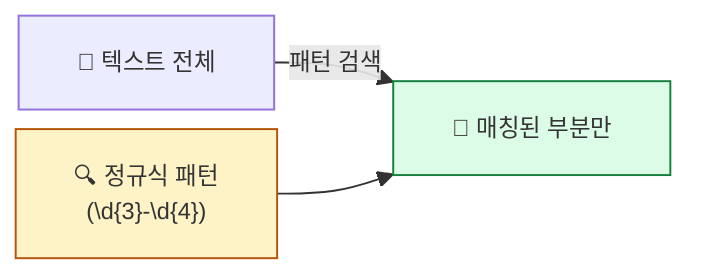
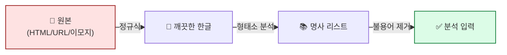

## 학습 목표

- **정규표현식(regex)** 이 무엇이고 언제 쓰는지 안다
- 기본 메타문자(`.`, `*`, `+`, `\d`, `\w` 등)의 의미를 이해한다
- 한국어 텍스트 전처리에 정규식을 활용할 수 있다
- `re` 모듈의 4가지 핵심 함수를 구분해서 쓴다

<a id="toc"></a>

## 진행 순서

1. [정규표현식이 뭐예요?](#part1)
2. [메타문자 — 정규식의 어휘](#part2)
3. [re 모듈의 4가지 핵심 함수](#part3)
4. [실전 패턴 모음 (전화·이메일·HTML 등)](#part4)
5. [한국어 전처리에 쓰기](#part5)
6. [실습 노트북 안내](#part6)
7. [정리](#part7)

---

# 02장. 정규표현식

<a id="part1"></a>

## 1. 정규표현식이 뭐예요? [↑](#toc)

### Ctrl+F의 강화판 비유

> 워드/한글에서 **Ctrl+F**로 단어를 찾아본 적 있죠? 정규표현식은 그 **강화판**입니다.
>
> 단어 하나가 아니라 **패턴**을 찾습니다. 예를 들면:
> - "숫자 3개 – 숫자 4개" 같은 패턴 → **전화번호**
> - "영문자@영문자.com" 같은 패턴 → **이메일**



### 텍스트마이닝에서 왜 쓰나?

1. **노이즈 제거** — HTML 태그, URL, 이모티콘, 특수문자 제거
2. **패턴 추출** — 전화번호·이메일·날짜 뽑기
3. **개인정보 마스킹** — 주민번호 뒷자리 `*`로 가리기
4. **구분자 처리** — 여러 공백/줄바꿈을 하나로 통일

> 💡 **형태소 분석 전 1차 정리**가 정규식의 주요 역할. 깨끗하지 않은 텍스트는 분석기도 망가집니다.

---

<a id="part2"></a>

## 2. 메타문자 — 정규식의 어휘 [↑](#toc)

정규식은 **알파벳 같은 메타문자**로 패턴을 표현합니다. 자주 쓰는 것만 외우면 됩니다.

### 가장 자주 쓰는 10개

| 메타문자 | 의미 | 예 |
|---------|------|---|
| `.` | **아무 문자 1개** | `a.c` → `abc`, `axc` 매칭 |
| `*` | 직전 패턴 **0번 이상** | `ab*` → `a`, `ab`, `abb` |
| `+` | 직전 패턴 **1번 이상** | `ab+` → `ab`, `abb` (a는 안 됨) |
| `?` | 직전 패턴 **0번 or 1번** | `colou?r` → `color`, `colour` |
| `^` | 문장의 **시작** | `^안녕` → "안녕..."으로 시작 |
| `$` | 문장의 **끝** | `다$` → "...다"로 끝 |
| `[abc]` | a, b, c 중 **하나** | `[가-힣]` → 모든 한글 |
| `\d` | **숫자 1개** (`[0-9]` 와 같음) | `\d\d` → 두 자리 숫자 |
| `\w` | **단어 글자** (영문/숫자/`_`) | `\w+` → 단어 하나 |
| `\s` | **공백** (스페이스·탭·줄바꿈) | `\s+` → 여러 공백 |

### 수량자

```
{n}     ← 정확히 n번
{n,}    ← n번 이상
{n, m}  ← n번에서 m번 사이
```

| 패턴 | 의미 |
|------|------|
| `\d{3}` | 숫자 정확히 3개 (예: `010`) |
| `\d{2,4}` | 숫자 2~4개 (예: `02`, `031`, `1234`) |
| `[가-힣]+` | 한글 1글자 이상 |

### 한 줄로 보는 한국어 한글 매칭

```python
[가-힣]   # 완성형 한글 1글자
[ㄱ-ㅎ]    # 자음만
[ㅏ-ㅣ]    # 모음만
```

> 💡 **`[가-힣]+`** — 본 과정에서 가장 자주 쓰는 한국어 추출 패턴. "한글로 된 단어 하나" 라는 뜻.

---

<a id="part3"></a>

## 3. re 모듈의 4가지 핵심 함수 [↑](#toc)

파이썬에서 정규식을 쓰려면 `re` 모듈을 import 합니다. **4개 함수**만 알면 90%는 끝.

```python
import re
```

### 함수 비교표

| 함수 | 역할 | 반환값 | 언제 쓰나 |
|------|------|--------|---------|
| `re.search(p, t)` | 텍스트에서 **첫 번째** 패턴 찾기 | Match 객체 (없으면 None) | 한 개만 찾으면 됨 |
| `re.findall(p, t)` | 텍스트에서 **모든** 패턴 찾기 | 리스트 | 다 뽑고 싶을 때 |
| `re.sub(p, repl, t)` | 패턴을 **다른 문자로 교체** | 새 문자열 | 노이즈 제거·치환 |
| `re.split(p, t)` | 패턴 기준으로 **분리** | 리스트 | 구분자 처리 |

### 코드 비교

```python
text = "전화: 02-123-4567, 010-9876-5432"

# ① search — 첫 번째만
m = re.search(r"\d{2,3}-\d{3,4}-\d{4}", text)
print(m.group())   # '02-123-4567'

# ② findall — 모두
print(re.findall(r"\d{2,3}-\d{3,4}-\d{4}", text))
# ['02-123-4567', '010-9876-5432']

# ③ sub — 교체
masked = re.sub(r"\d{4}", "****", text)
print(masked)
# '전화: 02-123-****, 010-****-****'

# ④ split — 분리
parts = re.split(r"[,:]\s*", text)
print(parts)
# ['전화', '02-123-4567', '010-9876-5432']
```

> 📌 **`r"..."`** 의 의미: **raw 문자열**. `\d` 같은 백슬래시가 escape되지 않게. **정규식은 항상 `r""`로 쓰는 게 안전**.

---

<a id="part4"></a>

## 4. 실전 패턴 모음 [↑](#toc)

자주 쓰는 패턴 10개를 표로 정리합니다. **복붙해 쓰세요.**

| 목적 | 패턴 | 예시 매칭 |
|------|------|---------|
| **한국 전화** (서울) | `r"02-\d{3,4}-\d{4}"` | `02-123-4567` |
| **한국 휴대폰** | `r"01[016789]-\d{3,4}-\d{4}"` | `010-1234-5678` |
| **이메일** | `r"[\w.+-]+@[\w-]+\.[\w.-]+"` | `hong@gmail.com` |
| **URL** | `r"https?://[^\s]+"` | `https://naver.com` |
| **한글 단어** | `r"[가-힣]+"` | `안녕하세요` |
| **HTML 태그** | `r"<[^>]+>"` | `<p>`, `<div class="x">` |
| **숫자 (정수·소수)** | `r"\d+\.?\d*"` | `123`, `3.14` |
| **이모티콘 (간단)** | `r"[ㅋㅎㅠㅜ]+"` | `ㅋㅋㅋ`, `ㅠㅠ` |
| **여러 공백** | `r"\s+"` | 스페이스/탭/줄바꿈 연속 |
| **특수문자만** | `r"[^\w가-힣\s]"` | `!@#$%^&*` |

### 한국어 전처리 1줄 함수 — 본 과정 단골

```python
def clean_korean(text):
    text = re.sub(r"<[^>]+>", " ", text)              # HTML 태그 제거
    text = re.sub(r"https?://[^\s]+", " ", text)      # URL 제거
    text = re.sub(r"[^\w가-힣\s]", " ", text)         # 특수문자 제거
    text = re.sub(r"\s+", " ", text)                  # 여러 공백 → 하나
    return text.strip()
```

| 입력 | 출력 |
|------|------|
| `"<p>딥시크가 https://x.io 에서 ‘혁신’이래요!!! 😀</p>"` | `"딥시크가 에서 혁신이래요"` |

> 💡 **이 함수가 형태소 분석 전에 거의 항상 호출**됩니다. 1번 모듈의 `okt.nouns()` 직전 단계.

---

<a id="part5"></a>

## 5. 한국어 전처리에 쓰기 [↑](#toc)

### 시나리오: 뉴스 댓글에서 명사 뽑기

```python
import re
from konlpy.tag import Okt

okt = Okt()

raw = """
<p>딥시크 진짜 대박이네요!!! ㅋㅋㅋㅋ
링크 보세요 → https://news.naver.com/abc
근데 미국 빅테크는 어쩌나... 010-1234-5678 로 연락주세요</p>
"""

# 1) 정규식으로 1차 정리
clean = re.sub(r"<[^>]+>", " ", raw)
clean = re.sub(r"https?://[^\s]+", " ", clean)
clean = re.sub(r"\d{2,3}-\d{3,4}-\d{4}", "[전화]", clean)  # 마스킹
clean = re.sub(r"[^\w가-힣\s]", " ", clean)
clean = re.sub(r"\s+", " ", clean).strip()
print("[1차 정리]")
print(clean)
# '딥시크 진짜 대박이네요 ㅋㅋㅋㅋ 링크 보세요 근데 미국 빅테크는 어쩌나 전화 로 연락주세요'

# 2) 형태소 분석으로 명사만
nouns = okt.nouns(clean)
print("[명사 추출]")
print(nouns)
# ['딥시크', '진짜', '대박', '링크', '미국', '빅테크', '전화', '연락']
```



> 💡 **순서가 중요합니다.** 형태소 분석 전에 정규식으로 정리해야지, 안 그러면 분석기가 HTML/URL/이모티콘을 이상한 형태소로 잘라냅니다.

### 자주 쓰는 마스킹 (개인정보 보호)

```python
# 전화번호 뒷자리 가리기
text = "010-1234-5678"
re.sub(r"(\d{3,4})$", "****", text)
# '010-1234-****'

# 이메일 ID 가리기
re.sub(r"^[\w.+-]+", "***", "hong.gildong@gmail.com")
# '***@gmail.com'

# 주민번호 뒷자리
re.sub(r"-\d{7}", "-*******", "900101-1234567")
# '900101-*******'
```

> 💡 데이터 분석 보고서나 외부 공유 자료에서 **필수**. 한 번 새 나가면 돌이킬 수 없음.

---

<a id="part6"></a>

## 6. 실습 노트북 안내 [↑](#toc)

### 노트북 위치

```
docs/06_AI/03_TextMining/notebook/(완)02_정규표현식_공용_실습용.ipynb
```

### 노트북에서 다룰 내용

1. `re.compile`, `re.search`, `re.findall` 사용법
2. 전화번호 추출 (서울/휴대폰)
3. 이메일 추출
4. HTML 태그 제거
5. 특수문자 제거

### 실습 후 도전 과제 (선택)

본인 SNS 게시글 또는 댓글을 가져와서:
```python
my_text = "여기에 본인 텍스트"
clean = clean_korean(my_text)
print("Before:", my_text)
print("After :", clean)
```

**관찰 포인트**: 어떤 문자가 사라졌는가? 의도와 다른 게 사라지진 않았는가?

---

<a id="part7"></a>

## 7. 정리 [↑](#toc)

### 이 장 한 줄 요약

> **정규표현식 = 패턴으로 텍스트를 찾고 정리하는 도구.** 형태소 분석 전 1차 정리의 필수 단계.

### 자가 진단 체크리스트

| 항목 | 확인 |
|------|:---:|
| `.`, `+`, `*`, `\d`, `\w`, `[가-힣]`의 의미를 안다 | ☐ |
| `re.search` vs `re.findall` 차이를 안다 | ☐ |
| `re.sub`로 텍스트를 정리할 수 있다 | ☐ |
| HTML 태그 / URL / 특수문자 제거 패턴을 외운다 | ☐ |
| `r"..."` (raw string)을 쓰는 이유를 안다 | ☐ |
| 정규식 → 형태소 분석 순서를 안다 | ☐ |

### 다음 모듈 미리보기

**[03. 빈도분석과 시각화](/textmining/frequency)** — 깨끗하게 정리된 명사 리스트로 단어 빈도를 세고, 트리맵·워드클라우드로 한눈에 보기.
