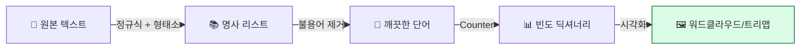
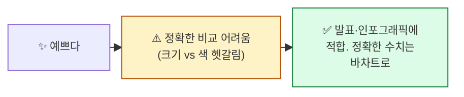

## 학습 목표

- **빈도분석**의 개념과 의미를 안다
- `Counter`로 단어 빈도를 셀 수 있다
- **워드클라우드 / 트리맵 / 바차트** 시각화 차이를 안다
- 한국어 텍스트에 맞게 한글 폰트를 설정한다

<a id="toc"></a>

## 진행 순서

1. [빈도분석 — 단어 출석부](#part1)
2. [Counter — 가장 단순하고 강력한 도구](#part2)
3. [시각화 1: 바차트 — 막대그래프](#part3)
4. [시각화 2: 워드클라우드 — 크기로 빈도 표현](#part4)
5. [시각화 3: 트리맵 — 면적으로 빈도 표현](#part5)
6. [한글 폰트 설정 — Colab 가이드](#part6)
7. [실습 노트북 안내](#part7)
8. [정리](#part8)

---

# 03장. 빈도분석과 시각화

<a id="part1"></a>

## 1. 빈도분석 — 단어 출석부 [↑](#toc)

### 학교 출석부 비유

> 한 반의 출석부를 보면 "철수: 20일 출석, 영희: 18일, 민수: 5일..." 식으로 정리됩니다.
> **빈도분석**은 텍스트의 "단어 출석부"입니다 — **어느 단어가 몇 번 나왔는지** 세는 것.

| 단어 | 빈도 |
|------|------|
| 딥시크 | 34 |
| AI | 28 |
| 인공지능 | 19 |
| 중국 | 12 |
| 기술 | 8 |

→ **이 표 하나로 문서의 주제가 보입니다.** "딥시크와 AI 기술에 대한 중국 관련 기사."

### 빈도분석에서 알 수 있는 것

1. **문서의 핵심 주제** — 가장 자주 나오는 단어 = 주제
2. **시간 변화** — 매월/매주 단어 빈도 추이
3. **집단 비교** — 두 그룹의 텍스트 비교 (예: 청년 vs 노년)
4. **이상 탐지** — 평소엔 안 나오던 단어가 갑자기 → 트렌드

### 빈도분석 전체 흐름



---

<a id="part2"></a>

## 2. Counter — 가장 단순하고 강력한 도구 [↑](#toc)

`collections.Counter`는 파이썬 기본 라이브러리. **딕셔너리의 통계 강화판**.

### 핵심 사용법

```python
from collections import Counter

words = ["딥시크", "AI", "딥시크", "중국", "AI", "딥시크", "기술", "AI", "딥시크"]

counter = Counter(words)
print(counter)
# Counter({'딥시크': 4, 'AI': 3, '중국': 1, '기술': 1})

# 상위 3개
print(counter.most_common(3))
# [('딥시크', 4), ('AI', 3), ('중국', 1)]
```

### 자주 쓰는 메서드 5가지

| 메서드 | 역할 | 예 |
|------|------|---|
| `Counter(리스트)` | 빈도 카운트 | `Counter([...])` |
| `.most_common(n)` | 상위 n개 (튜플 리스트) | `c.most_common(10)` |
| `c["단어"]` | 특정 단어 빈도 | `c["딥시크"]` → 4 |
| `c.update(리스트)` | 기존 카운터에 추가 | `c.update(new_words)` |
| `list(c.items())` | 모든 항목 (단어, 빈도) | `list(c.items())` |

### 전체 파이프라인 — 노트북 03번 코드 흐름

```python
import re
from kiwipiepy import Kiwi
from collections import Counter
import pandas as pd

kiwi = Kiwi()
stopwords = set(pd.read_csv("ko-stopwords.csv")["stopwords"])

texts = [text1, text2, text3]   # 뉴스 기사 3개
all_nouns = []

for text in texts:
    # 1) 정규식 정리
    text = re.sub(r"[^\w가-힣\s]", " ", text)
    # 2) Kiwi로 명사 추출
    nouns = [t.form for t in kiwi.tokenize(kiwi.space(text))
             if t.tag in ("NNG", "NNP")
             and t.form not in stopwords
             and len(t.form) > 1]
    all_nouns.extend(nouns)

counter = Counter(all_nouns)
top10 = counter.most_common(10)
print(top10)
```

**예상 결과 (딥시크 기사 3건 기준)**:
```
[('딥시크', 23), ('AI', 18), ('미국', 12), ('중국', 11), ('인공지능', 9),
 ('기술', 8), ('빅테크', 7), ('투자', 6), ('모델', 5), ('한국', 4)]
```

> 💡 **상위 10개 단어만 봐도** 문서의 주제·맥락이 거의 다 보입니다.

---

<a id="part3"></a>

## 3. 시각화 1: 바차트 — 막대그래프 [↑](#toc)

### 가장 기본, 가장 정확

```python
import matplotlib.pyplot as plt

words, counts = zip(*top10)
plt.barh(words[::-1], counts[::-1])   # 위에서 아래로 큰 순
plt.title("뉴스 기사 상위 10개 단어")
plt.xlabel("빈도")
plt.tight_layout()
plt.show()
```

```
딥시크   ████████████████████████ 23
AI      ███████████████████ 18
미국    ████████████ 12
중국    ███████████ 11
인공지능 ██████████ 9
기술    █████████ 8
빅테크  ████████ 7
투자    ██████ 6
모델    █████ 5
한국    ████ 4
```

| 장점 | 단점 |
|------|------|
| 정확한 숫자 비교 | 디자인이 단조로움 |
| 어디서나 통함 | 50개 이상은 보기 어려움 |
| 보고서·논문에 적합 | 발표용으로는 임팩트 약함 |

> 💡 **데이터 분석 보고서의 기본**. 임팩트는 워드클라우드, 정확성은 바차트.

---

<a id="part4"></a>

## 4. 시각화 2: 워드클라우드 — 크기로 빈도 표현 [↑](#toc)

### "단어 구름" 비유

> 단어를 **글자 크기**로 빈도를 표현하는 시각화. 큰 단어 = 자주 나오는 단어.
>
> SNS 마케팅 보고서·기사에서 자주 봤을 그 시각화.

### 기본 코드

```python
from wordcloud import WordCloud

wc = WordCloud(
    font_path="/usr/share/fonts/truetype/nanum/NanumGothic.ttf",  # Colab 기준
    background_color="white",
    width=800, height=400,
).generate_from_frequencies(dict(counter))

plt.figure(figsize=(12, 6))
plt.imshow(wc)
plt.axis("off")
plt.show()
```

### 옵션 — 자주 쓰는 것들

| 옵션 | 의미 | 예 |
|------|------|---|
| `font_path` | 한글 폰트 (필수) | `NanumGothic.ttf` |
| `background_color` | 배경색 | `"white"`, `"black"` |
| `width / height` | 크기 (픽셀) | 800, 400 |
| `max_words` | 최대 단어 수 | 100 |
| `colormap` | 색상 테마 | `"viridis"`, `"plasma"` |
| `mask` | 마스크 이미지 (모양 적용) | numpy array |

### 마스크 (이미지 모양) 적용

```python
import numpy as np
from PIL import Image

mask = np.array(Image.open("heart.png"))
wc = WordCloud(font_path="...", mask=mask, ...).generate_from_frequencies(...)
```

> 💡 **하트 / 별 / 캐릭터 모양 워드클라우드** = 마스크 이미지 활용. 발표에서 인기.

### 워드클라우드의 함정



---

<a id="part5"></a>

## 5. 시각화 3: 트리맵 — 면적으로 빈도 표현 [↑](#toc)

### 부동산 면적 비유

> 트리맵은 **단어를 직사각형 면적**으로 표현. 큰 사각형 = 자주 나오는 단어.
>
> 워드클라우드는 글자 크기, 트리맵은 면적 — 면적이 비교에 더 정확합니다.

### 코드 — squarify 사용

```python
import squarify

words, counts = zip(*counter.most_common(15))

plt.figure(figsize=(12, 6))
squarify.plot(
    sizes=counts,
    label=[f"{w}\n({c})" for w, c in zip(words, counts)],
    color=plt.cm.tab20.colors,
    text_kwargs={"fontsize": 10}
)
plt.title("뉴스 기사 단어 빈도 트리맵")
plt.axis("off")
plt.show()
```

**결과 (글로 묘사)**:
```
┌────────────────┬───────────┬──────┐
│                │           │ 빅테크│
│   딥시크 (23)   │   AI(18)  ├──────┤
│                │           │ 투자  │
├────────┬───────┴────┬──────┼──────┤
│ 미국   │  중국       │ 인공  │ 한국 │
│ (12)   │  (11)       │ 지능  ├──────┤
│        │             │ (9)  │ 모델 │
└────────┴─────────────┴──────┴──────┘
```

| 시각화 | 강점 | 약점 |
|--------|------|------|
| 바차트 | 정확 | 단조 |
| 워드클라우드 | 임팩트 | 정확도 떨어짐 |
| **트리맵** | **임팩트 + 비교적 정확** | 단어 수 많으면 작은 사각형 글자 안 보임 |

> 💡 **본 과정 권장**: 보고서엔 바차트, 발표엔 트리맵, 인포그래픽엔 워드클라우드.

---

<a id="part6"></a>

## 6. 한글 폰트 설정 — Colab 가이드 [↑](#toc)

### 가장 흔한 함정: matplotlib에서 한글이 □□□ 로 깨짐

원인: 기본 폰트(DejaVu Sans)가 한글을 못 그림.

### Colab 표준 설정

```python
# (00장 환경 셋업 셀에 포함됨. 만약 그래도 깨지면 아래 추가 실행)

# 1) 폰트 설치 (셋업 셀에서 이미 했다면 생략)
!apt-get -qq install fonts-nanum

# 2) matplotlib 캐시 새로고침
import matplotlib.font_manager as fm
fm._load_fontmanager(try_read_cache=False)

# 3) 적용
import matplotlib.pyplot as plt
plt.rcParams["font.family"] = "NanumGothic"
plt.rcParams["axes.unicode_minus"] = False  # 음수 부호 깨짐 방지

# 4) 확인
plt.plot([1, 2, 3], [4, 5, 6])
plt.title("한글이 보이나요?")
plt.show()
```

### 워드클라우드용 폰트 경로

```python
font_path = "/usr/share/fonts/truetype/nanum/NanumGothic.ttf"   # Colab
# font_path = "C:/Windows/Fonts/malgun.ttf"                       # Windows
# font_path = "/Library/Fonts/AppleSDGothicNeo.ttc"               # Mac
```

> 💡 **Colab을 다시 시작했을 때** 폰트 설정이 풀린다면, 00장의 환경 셋업 셀을 한 번 더 실행하세요.

---

<a id="part7"></a>

## 7. 실습 노트북 안내 [↑](#toc)

### 노트북 위치

```
docs/06_AI/03_TextMining/notebook/(완)03_빈도분석_트리맵_쥬피터_실습.ipynb
```

### 노트북에서 다룰 내용

1. 한국어 뉴스 기사 3개로 명사 추출
2. `Counter`로 빈도 계산 + `most_common(10)`
3. 바차트 시각화
4. 워드클라우드 (마스크 적용 포함)
5. 트리맵 시각화

### 실습 후 도전 과제 (선택)

본인이 관심 있는 분야의 텍스트(블로그 글 3개, 뉴스 5개 등)를 모아:

```python
my_texts = ["...", "...", "..."]

# 전처리 + Counter
# 본인만의 워드클라우드 만들기
```

**관찰 포인트**: 본인 텍스트의 상위 단어가 의미 있는가? 불용어로 추가할 단어는?

---

<a id="part8"></a>

## 8. 정리 [↑](#toc)

### 이 장 한 줄 요약

> **빈도분석 = 단어 출석부.** Counter로 세고, 트리맵/워드클라우드/바차트로 한눈에.

### 자가 진단 체크리스트

| 항목 | 확인 |
|------|:---:|
| `Counter`와 `.most_common()`을 쓸 수 있다 | ☐ |
| 바차트·워드클라우드·트리맵의 차이를 안다 | ☐ |
| Colab에서 한글 폰트 깨짐을 고칠 수 있다 | ☐ |
| 워드클라우드에 마스크를 적용할 수 있다 | ☐ |
| 상위 단어로 문서의 주제를 추정할 수 있다 | ☐ |

### 다음 모듈 미리보기

**[04. BoW와 원핫 인코딩](/textmining/bow)** — 단어를 컴퓨터가 이해할 수 있는 **숫자 표현**으로 바꾸는 첫 단계. 빈도 카운트의 확장판.
