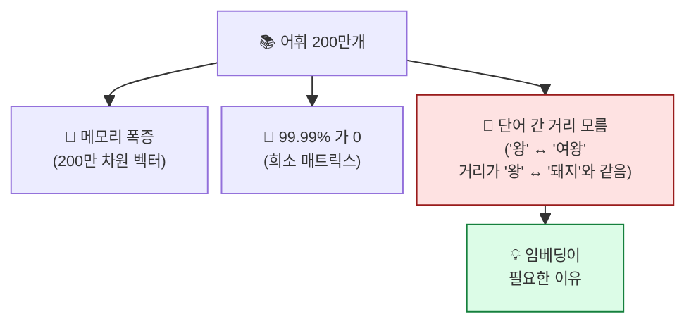

## 학습 목표

- "컴퓨터는 숫자만 이해한다"는 출발점을 이해한다
- **BoW(Bag of Words)** 의 직관과 한계를 안다
- **원핫 인코딩**이 무엇이고 왜 차원 문제가 생기는지 안다
- **N-gram**이 단어 순서 정보를 어떻게 보존하는지 안다

<a id="toc"></a>

## 진행 순서

1. [컴퓨터는 숫자만 이해한다](#part1)
2. [BoW — 단어들을 가방에 담는다](#part2)
3. [원핫 인코딩 — 단어를 0과 1로](#part3)
4. [차원의 저주](#part4)
5. [N-gram — 단어 순서 살리기](#part5)
6. [실습 노트북 안내](#part6)
7. [정리](#part7)

---

# 04장. BoW와 원핫 인코딩

<a id="part1"></a>

## 1. 컴퓨터는 숫자만 이해한다 [↑](#toc)

### 번역기 비유

> 외국인과 대화하려면 **번역기**가 필요합니다.
> 컴퓨터는 한글·영어를 직접 이해 못 하고 **숫자**만 다룹니다.
> 텍스트마이닝의 핵심 단계: **"텍스트를 숫자로 바꾸는 것"**.


### "단어 → 숫자"의 4가지 방법 (앞으로 배울 것)

| 방법 | 특징 | 모듈 |
|------|------|------|
| **BoW** | 단어 등장 횟수 카운트 | 본 모듈 |
| **One-hot** | 한 단어는 한 자리에 1 | 본 모듈 |
| **TF-IDF** | BoW + 희귀 단어 가중치 | 다음 모듈 |
| **Word2Vec** | 단어를 좌표로 (의미 보존) | 모듈 6 |

> 💡 **앞 3개(BoW, One-hot, TF-IDF)** 는 **Local Representation** (단어를 직접 표시).
> **Word2Vec**부터는 **Distributed Representation** (단어를 의미 좌표로).

---

<a id="part2"></a>

## 2. BoW — 단어들을 가방에 담는다 [↑](#toc)

### 책가방 비유

> 어떤 문서의 단어들을 **모두 가방에 넣고**, 가방 안에서 단어를 하나씩 꺼내 세는 것.
> **순서는 무시**합니다. 단어가 몇 번 들어있는지만.

```
문서: "고양이가 사료를 먹는다 고양이가 좋아한다"

전체 단어 사전: [고양이, 사료, 먹다, 좋아하다]
                  0      1      2       3
BoW 벡터:        [  2,    1,     1,      1 ]
                  └─ "고양이"가 2번 등장
```

### 코드 — sklearn 사용

```python
from sklearn.feature_extraction.text import CountVectorizer

docs = [
    "고양이 사료 먹다 고양이 좋아하다",
    "강아지 산책 좋아하다",
    "고양이 강아지 친구",
]

cv = CountVectorizer()
bow = cv.fit_transform(docs).toarray()

print("어휘 사전:", cv.get_feature_names_out())
# ['강아지', '고양이', '먹다', '사료', '산책', '좋아하다', '친구']

print("BoW 행렬:")
print(bow)
# [[0 2 1 1 0 1 0]   ← 문서 1
#  [1 0 0 0 1 1 0]   ← 문서 2
#  [1 1 0 0 0 0 1]]  ← 문서 3
```

### BoW 행렬 한눈에

| | 강아지 | 고양이 | 먹다 | 사료 | 산책 | 좋아하다 | 친구 |
|---|:----:|:----:|:----:|:----:|:----:|:----:|:----:|
| 문서 1 | 0 | **2** | 1 | 1 | 0 | 1 | 0 |
| 문서 2 | 1 | 0 | 0 | 0 | 1 | 1 | 0 |
| 문서 3 | 1 | 1 | 0 | 0 | 0 | 0 | 1 |

### BoW의 장점과 한계

| 장점 | 한계 |
|------|------|
| 단순·빠름 | **단어 순서 무시** ("사료 먹는다" vs "먹는다 사료" 똑같음) |
| 직관적 | **희소(sparse)** — 대부분 0인 거대한 벡터 |
| 다른 모델의 기초 | **의미 못 잡음** ("좋다" ≈ "굿"이라는 걸 모름) |

> 💡 BoW의 한계가 후속 기법(TF-IDF, 임베딩)의 등장 이유. **순서·의미·희소** 세 문제.

---

<a id="part3"></a>

## 3. 원핫 인코딩 — 단어를 0과 1로 [↑](#toc)

### 좌석 번호 비유

> 영화관 좌석 100개 중 본인의 좌석만 1, 나머지는 0.
> 한 단어 = 한 좌석. 단어를 표현할 때 **그 좌석만 1, 나머지는 0**.

```
어휘: [고양이, 강아지, 사료, 산책, 친구]
        0       1      2      3      4

"고양이" → [1, 0, 0, 0, 0]
"강아지" → [0, 1, 0, 0, 0]
"사료"   → [0, 0, 1, 0, 0]
```

### BoW vs One-hot 차이

| | BoW | One-hot |
|---|------|--------|
| 단위 | **문서 전체** | **단어 1개** |
| 값 | 등장 횟수 | 0 또는 1 |
| 합 | 단어 수만큼 | 항상 1 |
| 용도 | 문서 비교 | 단어 식별 (DL 입력) |

### 코드

```python
from sklearn.preprocessing import OneHotEncoder
import numpy as np

vocab = np.array(["고양이", "강아지", "사료", "산책", "친구"]).reshape(-1, 1)
encoder = OneHotEncoder(sparse_output=False)
onehot = encoder.fit_transform(vocab)

print(onehot)
# [[1. 0. 0. 0. 0.]   ← 고양이
#  [0. 1. 0. 0. 0.]   ← 강아지
#  ...
```

> 💡 **DL에서 자주 쓰는 입력 형식**. 분류 모델의 정답(y)을 만들 때도 원핫: 정답이 1번이면 `[0, 1, 0]`.

---

<a id="part4"></a>

## 4. 차원의 저주 [↑](#toc)

### 어휘가 커지면?

한국어 위키백과 어휘는 약 **200만 단어**. 한 단어를 원핫으로 표현하면:
```
[0, 0, 0, ..., 1, ..., 0]
└── 200만 개 슬롯 중 1개만 1
```

### 문제점



| 문제 | 의미 |
|------|------|
| 메모리 폭증 | 단어 1개당 200만 차원 |
| 희소(sparse) | 거의 모두 0 → 비효율 |
| **의미 무시** | 단어 간 유사도 표현 불가능 — 가장 큰 문제 |

> 💡 **"왕"과 "여왕"이 비슷한 의미라는 걸 컴퓨터가 알게 하려면?** → **임베딩(모듈 6)** 등장 배경.

---

<a id="part5"></a>

## 5. N-gram — 단어 순서 살리기 [↑](#toc)

### 순서 정보의 중요성

```
"강아지가 사람을 물었다"
"사람이 강아지를 물었다"
```

BoW에서는 **같은 단어 집합** = 같은 벡터. 그러나 의미는 정반대.

### N-gram이란?

**N개의 연속된 단어**를 하나의 단위로 보는 것.

```
원문: "고양이 사료 먹다 좋아하다"

1-gram (unigram): [고양이, 사료, 먹다, 좋아하다]            ← BoW와 같음
2-gram (bigram):  [고양이 사료, 사료 먹다, 먹다 좋아하다]    ← 두 단어씩 묶음
3-gram (trigram): [고양이 사료 먹다, 사료 먹다 좋아하다]    ← 세 단어씩 묶음
```

### sklearn에서 N-gram

```python
from sklearn.feature_extraction.text import CountVectorizer

cv = CountVectorizer(ngram_range=(1, 2))  # unigram + bigram 모두
bow = cv.fit_transform(["고양이 사료 먹다 좋아하다"])

print(cv.get_feature_names_out())
# ['고양이' '고양이 사료' '먹다' '먹다 좋아하다' '사료' '사료 먹다' '좋아하다']
```

| `ngram_range` | 의미 |
|--------------|------|
| `(1, 1)` | unigram만 (기본, BoW와 같음) |
| `(1, 2)` | unigram + bigram |
| `(2, 2)` | bigram만 |
| `(1, 3)` | uni + bi + tri |

### N-gram의 효과와 비용

| N | 효과 | 비용 |
|---|------|------|
| 1 | 단어만 본다 (BoW) | 작음 |
| 2 | **"강아지가 물었다"** vs "물었다 강아지"** 구분 가능 | 어휘 폭증 |
| 3+ | 더 긴 표현 | 어휘 더 폭증 + 희소화 |

> 💡 **실무 표준**: `ngram_range=(1, 2)` 또는 `(1, 3)` 사용. 너무 큰 N은 차원이 폭발.

---

<a id="part6"></a>

## 6. 실습 노트북 안내 [↑](#toc)

### 노트북 위치

```
docs/06_AI/03_TextMining/notebook/(완)05_bow&one_hot&n-gram_쥬피터_실습.ipynb
```

### 노트북에서 다룰 내용

1. `CountVectorizer`로 BoW 만들기
2. 한국어 형태소 분석 + BoW 결합
3. 불용어 사전 사용
4. `OneHotEncoder`로 단어 원핫 인코딩
5. `ngram_range`로 N-gram 추출

### 실습 후 도전 과제 (선택)

본인 텍스트 3개를 가지고:

```python
my_docs = ["...", "...", "..."]

# BoW 만들기
# 각 문서에서 가장 빈도 높은 bigram 3개씩 추출
```

**관찰 포인트**: bigram이 unigram보다 문서의 의미를 더 잘 잡는가?

---

<a id="part7"></a>

## 7. 정리 [↑](#toc)

### 이 장 한 줄 요약

> **BoW = 단어 횟수 카운트 / One-hot = 단어를 0과 1로.**
> 단순하지만 의미·순서를 못 잡는다는 한계 → TF-IDF·임베딩이 등장.

### 자가 진단 체크리스트

| 항목 | 확인 |
|------|:---:|
| BoW의 직관(가방 비유)을 안다 | ☐ |
| BoW의 3가지 한계를 안다 (순서·희소·의미) | ☐ |
| 원핫 인코딩이 무엇인지 안다 | ☐ |
| 차원의 저주가 왜 생기는지 안다 | ☐ |
| N-gram이 순서를 어떻게 살리는지 안다 | ☐ |
| `CountVectorizer(ngram_range=(1,2))`를 쓸 수 있다 | ☐ |

### 다음 모듈 미리보기

**[05. TF-IDF](/textmining/tfidf)** — BoW의 "흔한 단어가 너무 많이 카운트되는" 한계를 해결. **희귀 단어**에 가중치를 더 주는 방법.
