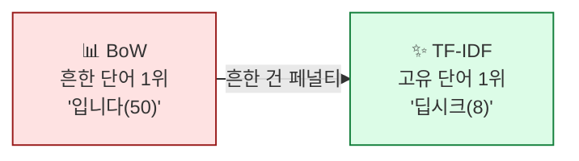
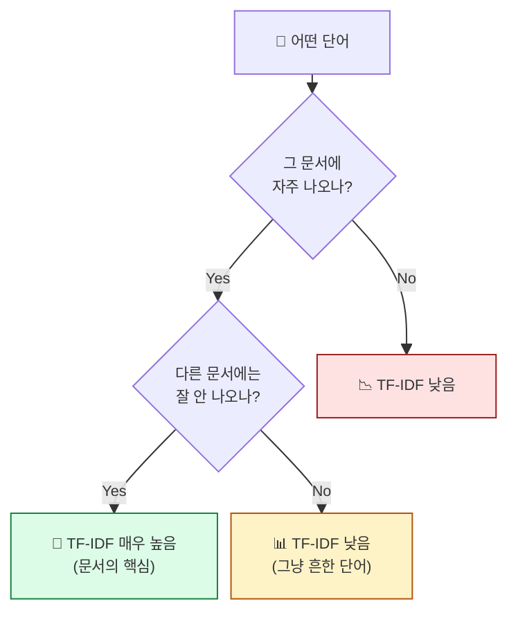

## 학습 목표

- **TF-IDF**의 직관을 비유로 설명할 수 있다
- TF와 IDF가 각각 무엇을 측정하는지 안다
- BoW와 TF-IDF의 차이를 안다
- sklearn으로 TF-IDF를 계산하고 결과를 해석한다

<a id="toc"></a>

## 진행 순서

1. [BoW의 한계 — 흔한 단어 문제](#part1)
2. [TF-IDF의 직관 — "그 문서만의 단어"](#part2)
3. [TF, IDF, TF-IDF — 식의 의미만](#part3)
4. [실전 예시 — 어떻게 계산되나](#part4)
5. [sklearn으로 TF-IDF + 결과 해석](#part5)
6. [실습 노트북 안내](#part6)
7. [정리](#part7)

---

# 05장. TF-IDF

<a id="part1"></a>

## 1. BoW의 한계 — 흔한 단어 문제 [↑](#toc)

### 신문 비유

> 신문 기사 100개를 빈도 분석했더니 상위 단어가:
> **"기자, 오늘, 입니다, 했다, 그리고..."**
>
> **알맹이가 없습니다.** 모든 기사에 나오는 단어들. 이 기사의 **고유한 주제**는 안 보입니다.

→ BoW는 흔한 단어와 희귀 단어를 똑같이 카운트합니다. **흔한 단어가 더 자주 나오니** 상위를 차지.

### 해결책: 흔한 단어에 페널티



**TF-IDF의 한 줄 요약**:
> "이 문서에는 자주 나오지만 **다른 문서에는 잘 안 나오는 단어**가 그 문서의 핵심"

---

<a id="part2"></a>

## 2. TF-IDF의 직관 — "그 문서만의 단어" [↑](#toc)

### 학교 비유

> 두 단어를 비교해봅시다.
>
> **단어 A "학교"**: 우리 반 학생 모두가 좋아함 → 우리 반의 특징을 못 잡음
> **단어 B "코딩"**: 우리 반에서만 인기, 다른 반은 관심 없음 → **우리 반의 진짜 특징**
>
> TF-IDF는 **단어 B에 높은 점수**, 단어 A에 낮은 점수를 줍니다.

### TF-IDF의 동작 원리

```
TF-IDF = TF (그 문서 안 빈도) × IDF (다른 문서엔 잘 안 나옴 점수)

TF 높음 + IDF 높음 = TF-IDF 매우 높음 → 그 문서의 핵심 단어 ✨
TF 높음 + IDF 낮음 = "그냥 흔한 단어"   → 점수 낮음
TF 낮음 + IDF 높음 = 잠깐 등장한 희귀어 → 중간 정도
```

---

<a id="part3"></a>

## 3. TF, IDF, TF-IDF — 식의 의미만 [↑](#toc)

식 자체보다 **각 부분의 의미**를 이해하면 됩니다.

### TF (Term Frequency) — 단어 빈도

```
TF(단어, 문서) = 그 문서 안에서 단어가 등장한 횟수
                  (또는 비율: 단어 등장 / 문서 단어 수)
```

| 단어 | 문서 1 TF | 문서 2 TF |
|------|----------|----------|
| 학교 | 3 | 1 |
| 코딩 | 2 | 0 |
| 입니다 | 5 | 4 |

### IDF (Inverse Document Frequency) — 단어 희귀도

```
IDF(단어) = log(전체 문서 수 / 단어가 등장한 문서 수)

→ 많은 문서에 나오면 IDF 작음 (흔한 단어)
→ 적은 문서에 나오면 IDF 큼 (희귀 단어)
```

| 단어 | 등장 문서 / 전체 | IDF |
|------|---------------|------|
| 입니다 | 100 / 100 | 0 (모든 문서에 있음) |
| 학교 | 30 / 100 | log(100/30) ≈ 0.52 |
| 코딩 | 3 / 100 | log(100/3) ≈ 1.52 |
| 딥시크 | 1 / 100 | log(100/1) ≈ 2.00 |

> 💡 **log를 쓰는 이유**: 극단적 차이를 완화. log 없으면 1번 등장 단어와 100번 등장 단어 차이가 너무 큼.

### TF-IDF = TF × IDF

```
문서 1의 "코딩": TF=2, IDF=1.52 → TF-IDF = 3.04
문서 1의 "입니다": TF=5, IDF=0  → TF-IDF = 0
```

**결과**: "입니다"는 TF가 가장 높았는데 **TF-IDF는 0**. 흔한 단어는 0이 됩니다.



---

<a id="part4"></a>

## 4. 실전 예시 — 어떻게 계산되나 [↑](#toc)

3개 뉴스 기사를 분석한다고 합시다.

| 단어 | 문서1 TF | 문서2 TF | 문서3 TF | 등장 문서 수 | IDF |
|------|---------|---------|---------|------------|------|
| 딥시크 | 8 | 0 | 0 | 1/3 | log(3) ≈ 1.10 |
| AI | 5 | 6 | 4 | 3/3 | log(1) = 0 |
| 빅테크 | 0 | 3 | 0 | 1/3 | 1.10 |
| 입니다 | 4 | 5 | 3 | 3/3 | 0 |
| 중국 | 2 | 0 | 5 | 2/3 | log(1.5) ≈ 0.40 |

→ **TF-IDF 계산**:

| 단어 | 문서1 TF-IDF | 문서2 TF-IDF | 문서3 TF-IDF |
|------|------------|------------|------------|
| 딥시크 | **8.80 ★** | 0 | 0 |
| AI | 0 | 0 | 0 |
| 빅테크 | 0 | **3.30 ★** | 0 |
| 입니다 | 0 | 0 | 0 |
| 중국 | 0.80 | 0 | **2.00 ★** |

**해석**:
- 문서 1의 핵심 = **딥시크**
- 문서 2의 핵심 = **빅테크**
- 문서 3의 핵심 = **중국**
- "AI", "입니다" 같은 흔한 단어는 모두 0 (모든 문서에 등장 → IDF=0)

> 💡 **TF-IDF가 0이 된 단어 = 그 문서의 특징이 아닌 단어**. 빈도가 높아도 다른 문서에 다 있으면 가치 없음.

---

<a id="part5"></a>

## 5. sklearn으로 TF-IDF + 결과 해석 [↑](#toc)

### 기본 코드

```python
from sklearn.feature_extraction.text import TfidfVectorizer
from kiwipiepy import Kiwi
import pandas as pd

kiwi = Kiwi()

def kiwi_join(text):
    """문서를 명사만 공백 구분으로 변환"""
    return " ".join(t.form for t in kiwi.tokenize(kiwi.space(text))
                    if t.tag in ("NNG", "NNP") and len(t.form) > 1)

docs = [news1, news2, news3]   # 뉴스 기사 3개
docs_processed = [kiwi_join(d) for d in docs]

vectorizer = TfidfVectorizer()
tfidf = vectorizer.fit_transform(docs_processed)

# DataFrame으로 보기
df = pd.DataFrame(
    tfidf.toarray(),
    columns=vectorizer.get_feature_names_out(),
    index=[f"문서{i+1}" for i in range(len(docs))]
)
print(df.round(3))
```

### 문서별 핵심 단어 추출

```python
# 각 문서의 TF-IDF 상위 5개
for i, doc_name in enumerate(df.index):
    top5 = df.iloc[i].sort_values(ascending=False).head(5)
    print(f"\n[{doc_name}] 핵심 단어")
    print(top5)
```

**예상 출력**:
```
[문서1] 핵심 단어
딥시크       0.621
업체         0.231
중국         0.198
기술         0.142
모델         0.118

[문서2] 핵심 단어
빅테크       0.578
혁신         0.301
효율성       0.215
미국         0.187
영향         0.142
```

### TfidfVectorizer 옵션 — 자주 쓰는 것

| 옵션 | 역할 | 예 |
|------|------|---|
| `min_df` | 최소 N개 문서에 등장한 단어만 | `min_df=2` (드물게 1번만 나온 단어 제외) |
| `max_df` | 최대 N% 문서에 등장한 단어만 | `max_df=0.95` (95% 이상 문서에 나오는 단어 제외) |
| `ngram_range` | N-gram 적용 | `(1, 2)` (uni + bi) |
| `max_features` | 어휘 상위 N개만 | `max_features=1000` |
| `stop_words` | 불용어 리스트 | `["입니다", "그리고", ...]` |

### TF-IDF 결과 시각화

```python
# 문서별 상위 단어로 워드클라우드
for i, doc_name in enumerate(df.index):
    top_words = df.iloc[i].sort_values(ascending=False).head(20).to_dict()
    wc = WordCloud(font_path="...", background_color="white").generate_from_frequencies(top_words)
    plt.figure(figsize=(6, 3))
    plt.imshow(wc)
    plt.title(doc_name)
    plt.axis("off")
    plt.show()
```

> 💡 **빈도분석 vs TF-IDF 비교**: 같은 데이터로 두 워드클라우드를 나란히 그려보면 **"흔한 단어가 사라지고 고유 단어가 부각"** 되는 효과가 시각적으로 드러납니다.

---

<a id="part6"></a>

## 6. 실습 노트북 안내 [↑](#toc)

### 노트북 위치

```
docs/06_AI/03_TextMining/notebook/(완)04_TF-IDF_쥬피터_실습.ipynb
```

### 노트북에서 다룰 내용

1. Kiwi로 명사 추출 + 공백 join
2. `TfidfVectorizer`로 TF-IDF 행렬 만들기
3. 각 문서의 핵심 단어 상위 N개 뽑기
4. TF-IDF 기반 워드클라우드
5. 빈도분석 vs TF-IDF 비교

### 실습 후 도전 과제 (선택)

```python
my_docs = [
    "본인 분야 문서 1",
    "본인 분야 문서 2",
    "전혀 다른 분야 문서 3",  # 비교용
]

# 1) 빈도분석 상위 10개
# 2) TF-IDF 상위 10개
# 3) 차이 비교 표 작성
```

**관찰 포인트**: 빈도에서는 보이던 흔한 단어가 TF-IDF에서 어떻게 사라지나? 본인이 분류하고 싶었던 핵심 단어가 TF-IDF에서 잘 잡히나?

---

<a id="part7"></a>

## 7. 정리 [↑](#toc)

### 이 장 한 줄 요약

> **TF-IDF = "그 문서에만 자주 나오는 단어"** 를 찾는 가중치. 흔한 단어 페널티로 BoW의 한계 극복.

### 자가 진단 체크리스트

| 항목 | 확인 |
|------|:---:|
| BoW의 흔한 단어 문제를 안다 | ☐ |
| TF와 IDF가 각각 무엇을 측정하나 | ☐ |
| IDF에 log를 쓰는 이유를 안다 | ☐ |
| `TfidfVectorizer`의 결과를 DataFrame으로 본다 | ☐ |
| `min_df`, `max_df`, `ngram_range`의 효과를 안다 | ☐ |
| TF-IDF로 문서별 핵심 단어를 뽑는다 | ☐ |

### 다음 모듈 미리보기

**[06. 워드 임베딩](/textmining/embedding)** — 단어를 **숫자 벡터(좌표)** 로 변환. "왕 - 남자 + 여자 = 여왕" 같은 연산이 가능해지는 마법.
