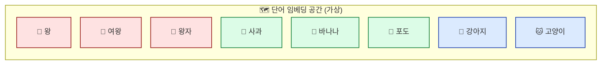
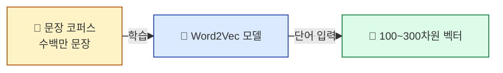
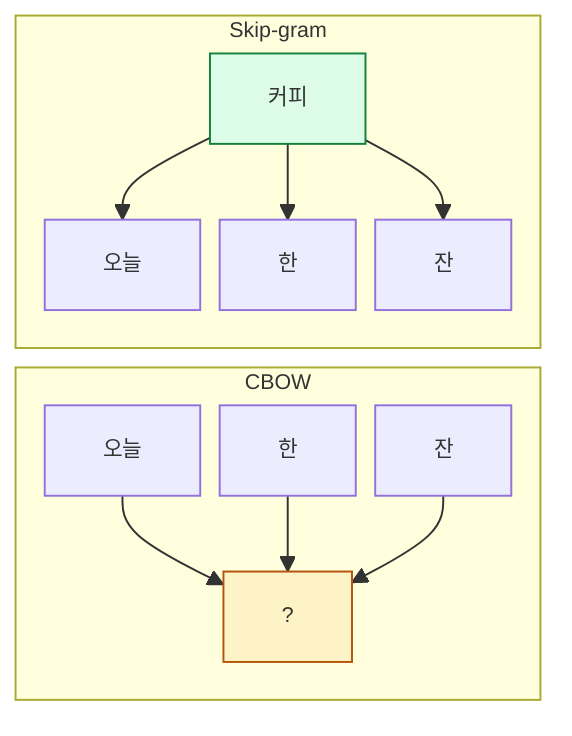

## 학습 목표

- **임베딩(embedding)** 이 단어를 어떻게 표현하는지 안다
- **Word2Vec** 의 직관 ("주변 친구를 보면 그 사람을 안다")을 안다
- CBOW와 Skip-gram의 차이를 안다
- gensim으로 Word2Vec을 학습하고 단어 유사도를 계산한다

<a id="toc"></a>

## 진행 순서

1. [원핫의 한계 — 의미를 못 잡는다](#part1)
2. [임베딩 — 단어를 좌표로](#part2)
3. [Word2Vec — 주변 친구 비유](#part3)
4. [CBOW vs Skip-gram](#part4)
5. [gensim 실습 — 유사도와 단어 연산](#part5)
6. [Doc2Vec — 문서 단위 임베딩](#part6)
7. [실습 노트북 안내](#part7)
8. [정리](#part8)

---

# 06장. 워드 임베딩

<a id="part1"></a>

## 1. 원핫의 한계 — 의미를 못 잡는다 [↑](#toc)

### 좌석 번호 비유 (다시)

> 모듈 4에서 원핫은 "좌석 번호"라고 했습니다.
> 5번 좌석과 6번 좌석은 **번호가 다르다**는 것만 알지, **둘이 비슷한 사람인지**는 모릅니다.
>
> "왕"과 "여왕"이 비슷한 단어라는 걸 원핫은 표현 못합니다.

```
원핫:
  왕   = [0, 0, 1, 0, 0, 0, 0, ..., 0]
  여왕 = [0, 0, 0, 0, 0, 1, 0, ..., 0]
  돼지 = [0, 0, 0, 0, 0, 0, 0, ..., 1]

거리:
  왕 - 여왕 = √2   (단순히 다름)
  왕 - 돼지 = √2   (똑같이 다름)
                    └─ 의미 차이를 표현 못함
```

### 우리가 원하는 것

```
왕    = [+0.8, +0.9, +0.1, +0.7, ...]
여왕  = [+0.7, +0.8, +0.1, +0.6, ...]   ← 왕과 가까운 좌표
돼지  = [-0.5, -0.3, +0.2, -0.1, ...]   ← 왕과 먼 좌표
```

**"비슷한 단어는 가까운 좌표, 다른 단어는 먼 좌표"** — 이것이 **임베딩**.

---

<a id="part2"></a>

## 2. 임베딩 — 단어를 좌표로 [↑](#toc)

### 지도 비유

> 임베딩은 단어를 **지도 위의 좌표**로 변환합니다.
> 비슷한 의미의 단어들은 가까운 지역에, 다른 의미는 먼 지역에 위치.



### 차원 수의 의미

원핫: 어휘 크기만큼 (200만 차원). 99.99%가 0.
임베딩: **고정 차원** (보통 100~300). 거의 모든 값이 의미 있는 숫자.

| | 원핫 | 임베딩 |
|---|------|------|
| 차원 | 어휘 크기 (수십만~수백만) | 100~300 |
| 값 | 0 또는 1 | 실수 (-1 ~ +1 정도) |
| 0의 비율 | 거의 100% | 거의 0% |
| 단어 간 유사도 | 표현 불가 | 거리·각도로 표현 |
| 의미 보존 | ❌ | ✅ |

> 💡 **"고차원 희소"를 "저차원 밀집"으로 변환** = 임베딩의 본질.

---

<a id="part3"></a>

## 3. Word2Vec — 주변 친구 비유 [↑](#toc)

### 핵심 아이디어 (Distributional Hypothesis)

> **"단어의 의미는 그 단어가 함께 등장하는 단어들로 결정된다"**
> — J. R. Firth (1957)

```
"오늘 ___ 마셨다"
"___ 한 잔 더 주세요"
"___ 카페에서 일하기 좋다"

___ 자리에 들어갈 단어: 커피? 차? 음료?
→ 비슷한 자리에 자주 나타나는 단어들은 비슷한 의미!
```

### Word2Vec의 학습 방식



**학습 결과**: 모든 단어가 고정 차원 벡터를 갖게 됨. 비슷한 맥락에서 자주 등장한 단어들은 비슷한 벡터.

### Word2Vec의 마법 — 단어 연산

```
vec("왕") - vec("남자") + vec("여자") ≈ vec("여왕")
vec("파리") - vec("프랑스") + vec("일본") ≈ vec("도쿄")
```

**의미가 좌표 차이로 표현**됩니다. "왕"에서 "남성성"을 빼고 "여성성"을 더하면 "여왕"이 나오는 셈.

> 💡 이 발견이 2013년 ML/NLP 세계를 흔들었습니다. **단어가 진짜 의미를 가진 벡터가 된 것**.

---

<a id="part4"></a>

## 4. CBOW vs Skip-gram [↑](#toc)

Word2Vec에는 두 가지 학습 방식이 있습니다. **반대 방향으로 학습**.

### CBOW (Continuous Bag of Words)

> **주변 단어로 가운데 단어 맞추기**

```
입력: "오늘 ___ 한 잔"  (주변 단어들)
정답: "커피"            (가운데 단어)
```

### Skip-gram

> **가운데 단어로 주변 단어 맞추기**

```
입력: "커피"             (가운데 단어)
정답: "오늘", "한", "잔"  (주변 단어들)
```



### 둘의 비교

| 방식 | 속도 | 희귀 단어 처리 |
|------|------|------|
| **CBOW** | 빠름 | 약함 |
| **Skip-gram** | 느림 | **강함** (소량 데이터에 유리) |

> 💡 **데이터가 크면 CBOW, 작으면 Skip-gram** 이 일반적 선택. gensim 기본값은 CBOW (`sg=0`), Skip-gram은 `sg=1`.

---

<a id="part5"></a>

## 5. gensim 실습 — 유사도와 단어 연산 [↑](#toc)

### 학습 전 — 데이터 준비

```python
import nltk
import pandas as pd
from kiwipiepy import Kiwi

# 영어 데이터 (NLTK)
nltk.download("punkt", quiet=True)

# 한국어 데이터 예시 — 토큰화된 문장 리스트
sentences = [
    ["고양이", "사료", "먹다"],
    ["강아지", "산책", "좋아하다"],
    ["고양이", "강아지", "친구"],
    ...  # 수백~수천 문장
]
```

> 📌 Word2Vec은 **토큰화된 문장 리스트**(`list[list[str]]`)를 입력으로 받습니다.

### 학습 — 한 줄

```python
from gensim.models import Word2Vec

model = Word2Vec(
    sentences=sentences,
    vector_size=100,    # 임베딩 차원
    window=5,           # 주변 단어 범위
    min_count=5,        # 최소 N번 등장한 단어만
    sg=1,               # 1=Skip-gram, 0=CBOW
    epochs=10           # 학습 반복 횟수
)
```

### 단어 벡터 가져오기

```python
vec = model.wv["고양이"]
print(vec.shape)        # (100,)
print(vec[:5])          # [0.32, -0.18, 0.05, ...]
```

### 유사한 단어 찾기

```python
model.wv.most_similar("고양이", topn=5)
# [('강아지', 0.821), ('애완동물', 0.785), ('털', 0.752), ...]
```

### 단어 연산

```python
# 왕 - 남자 + 여자 = ?
result = model.wv.most_similar(
    positive=["왕", "여자"],
    negative=["남자"],
    topn=3
)
print(result)
# [('여왕', 0.812), ('공주', 0.745), ('왕비', 0.701)]
```

### 결과 시각화 — 2D 산점도

고차원 벡터는 그대로 그릴 수 없으니 **t-SNE / PCA**로 2D로 줄입니다.

```python
from sklearn.manifold import TSNE
import matplotlib.pyplot as plt

target_words = ["왕", "여왕", "왕자", "공주", "사과", "바나나", "포도", "고양이", "강아지"]
vectors = [model.wv[w] for w in target_words]

xy = TSNE(n_components=2, perplexity=2).fit_transform(vectors)

plt.figure(figsize=(8, 6))
plt.scatter(xy[:, 0], xy[:, 1])
for word, (x, y) in zip(target_words, xy):
    plt.annotate(word, (x, y), fontsize=12)
plt.title("단어 임베딩 t-SNE 시각화")
plt.show()
```

**기대 결과**:
- 왕/여왕/왕자/공주가 같은 영역
- 사과/바나나/포도가 다른 영역
- 고양이/강아지가 또 다른 영역

> 💡 본 모듈의 백미. 이 시각화 한 장이 **"단어가 진짜 의미를 가졌다"** 를 직관적으로 보여줍니다.

---

<a id="part6"></a>

## 6. Doc2Vec — 문서 단위 임베딩 [↑](#toc)

### Word2Vec의 확장

Word2Vec은 **단어 1개**를 벡터로 표현합니다.
Doc2Vec은 **문서(문단) 전체**를 하나의 벡터로 표현.

```python
from gensim.models.doc2vec import Doc2Vec, TaggedDocument

# 데이터: (단어 리스트, 태그) 페어
tagged_docs = [
    TaggedDocument(words=["고양이", "사료"], tags=["doc1"]),
    TaggedDocument(words=["강아지", "산책"], tags=["doc2"]),
    ...
]

model = Doc2Vec(tagged_docs, vector_size=100, epochs=20)

# 문서 벡터
print(model.dv["doc1"])
```

### 어디 쓰나?

| 활용 | 예 |
|------|----|
| 문서 유사도 | "이 글과 비슷한 글 추천" |
| 클러스터링 | 비슷한 문서 자동 그룹핑 |
| 분류 입력 | 문서를 벡터로 → ML 분류 모델에 입력 |

> 💡 **Word2Vec → Doc2Vec → Sentence-Transformers(BERT 기반)** 가 최신 흐름. 본 과정은 Word2Vec/Doc2Vec까지, 그 위는 ML/DL/LLM 과정에서.

---

<a id="part7"></a>

## 7. 실습 노트북 안내 [↑](#toc)

### 노트북 위치

```
docs/06_AI/03_TextMining/notebook/(완)06_word_embedding_쥬피터_실습.ipynb
```

### 노트북에서 다룰 내용

1. 영어 데이터 전처리 (NLTK)
2. Word2Vec 학습 (gensim)
3. 단어 유사도 (`most_similar`)
4. 단어 연산 (positive/negative)
5. t-SNE 2D 시각화
6. (선택) Doc2Vec 간단 실습

> ⚠️ 기존 노트북 06번 FastText 섹션에 `tagged_pos_docuemnt` 오타가 있어 NameError 발생. 본 과정에서는 FastText는 다루지 않으며, Word2Vec 중심으로 진행합니다.

### 실습 후 도전 과제 (선택)

본인이 좋아하는 한국어 텍스트(소설·뉴스 모음·블로그 글)를 코퍼스로:

```python
# 1) 텍스트 모으기 (수천 문장 권장)
# 2) Kiwi로 형태소 분리 → list[list[str]]
# 3) Word2Vec 학습
# 4) most_similar로 흥미로운 단어 관계 발견
```

**관찰 포인트**: 본인 도메인에서 의미적으로 가까운 단어들이 정말 가깝게 나오나? 어떤 단어 쌍이 예상 밖이었나?

---

<a id="part8"></a>

## 8. 정리 [↑](#toc)

### 이 장 한 줄 요약

> **임베딩 = 단어를 의미가 보존된 좌표로 변환.** Word2Vec은 "주변 친구"로 의미를 학습.

### 자가 진단 체크리스트

| 항목 | 확인 |
|------|:---:|
| 원핫과 임베딩의 차이를 한 표로 설명 | ☐ |
| Word2Vec의 핵심 가정(주변 친구)을 안다 | ☐ |
| CBOW vs Skip-gram의 방향 차이를 안다 | ☐ |
| `model.wv.most_similar(...)` 결과를 해석한다 | ☐ |
| 단어 연산(왕-남자+여자) 의미를 안다 | ☐ |
| t-SNE 시각화의 직관(고차원→2D)을 안다 | ☐ |
| Doc2Vec이 Word2Vec과 어떻게 다른지 안다 | ☐ |

### 다음 모듈 미리보기

**[07. Local vs Distributed 정리](/textmining/representation)** — 지금까지 배운 4가지 표현 방식(BoW/원핫/TF-IDF/Word2Vec)을 한 표로 정리. **다음 단계는 어디로?**
