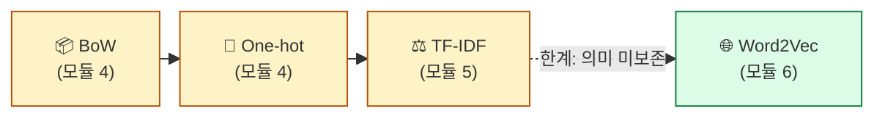
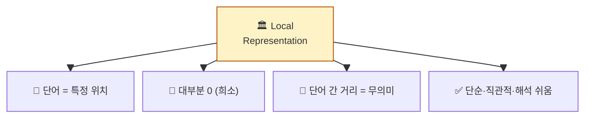
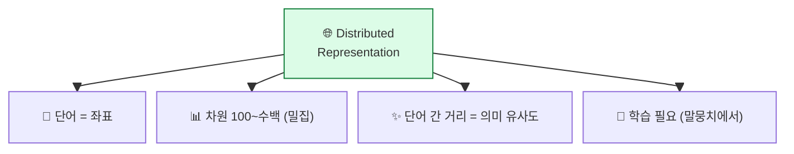
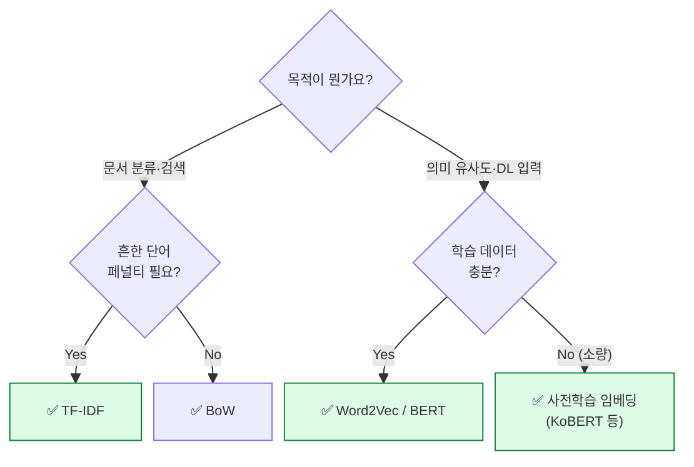
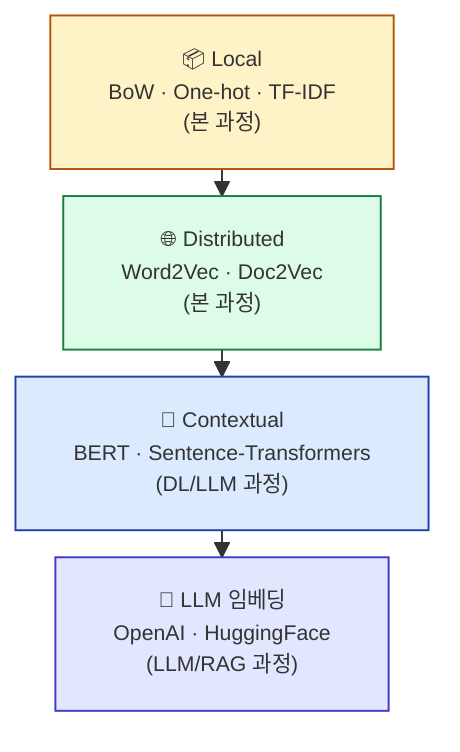

## 학습 목표

- 지금까지 배운 4가지 표현 방식을 한 표로 정리한다
- **Local Representation vs Distributed Representation**의 차이를 안다
- 각 방식을 **언제 쓰면 좋은지** 판단할 수 있다
- 다음 단계(BERT, Sentence-Transformers)로의 다리를 그린다

<a id="toc"></a>

## 진행 순서

1. [지금까지의 여정 — 텍스트 표현 4단계](#part1)
2. [Local Representation](#part2)
3. [Distributed Representation](#part3)
4. [언제 어떤 방법을 쓰나?](#part4)
5. [다음 단계 — BERT, Sentence-Transformers](#part5)

---

# 07장. (중간정리) Local vs Distributed

<a id="part1"></a>

## 1. 지금까지의 여정 — 텍스트 표현 4단계 [↑](#toc)



| 단계 | 방식 | 핵심 아이디어 | 한계 |
|------|------|--------------|------|
| 1 | **BoW** | 단어 등장 횟수를 가방에 담기 | 순서·의미 무시 |
| 2 | **One-hot** | 단어를 좌석 번호로 (0/1) | 차원 폭증, 의미 무시 |
| 3 | **TF-IDF** | 흔한 단어 페널티 | 여전히 의미 무시 |
| 4 | **Word2Vec** | 의미 좌표 (주변 친구) | 단어 1개 단위 |

---

<a id="part2"></a>

## 2. Local Representation [↑](#toc)

### 핵심 특징

> 각 단어를 **독립적인 슬롯**에 배치. 단어와 슬롯이 1:1 대응.

| 방식 | 단어 표현 | 특징 |
|------|----------|------|
| BoW | `[2, 0, 1, ...]` | 횟수, 문서 단위 |
| One-hot | `[0, 0, 1, 0, ...]` | 단어 1개 = 1 슬롯 |
| TF-IDF | `[0.5, 0.0, 1.2, ...]` | 가중치 적용 |

### Local의 특성



### 언제 쓰면 좋은가?

- ✅ **문서 분류 / 검색**: TF-IDF는 정보 검색의 표준
- ✅ **소규모 데이터**: 학습 없이 바로 계산 가능
- ✅ **해석이 중요할 때**: "어떤 단어가 영향" 명확
- ❌ 의미 유사도, 비슷한 단어 추천에는 부적합

---

<a id="part3"></a>

## 3. Distributed Representation [↑](#toc)

### 핵심 특징

> 단어의 의미가 **여러 차원에 분산**되어 표현. 단어와 차원의 1:1 매핑이 없음.

```
"왕" = [0.32, -0.18, 0.84, 0.05, ..., -0.41]
        └ 모든 차원이 의미의 일부를 담당
```

### Distributed의 특성



### 언제 쓰면 좋은가?

- ✅ **단어 유사도 / 유사 문서 추천**
- ✅ **DL 모델 입력**: 신경망은 밀집 벡터를 선호
- ✅ **번역·생성**: 의미 보존이 핵심
- ❌ 해석 어려움 (각 차원이 무엇을 의미하는지 불명확)
- ❌ 학습 데이터 필요 (말뭉치 양이 많아야 좋은 임베딩)

---

<a id="part4"></a>

## 4. 언제 어떤 방법을 쓰나? [↑](#toc)

### 의사결정 트리



### 실무 권장 조합

| 상황 | 추천 |
|------|------|
| 한국어 뉴스 키워드 추출 | TF-IDF |
| 영화 리뷰 분류 (ML 모델) | TF-IDF 또는 Word2Vec |
| 챗봇 의도 분류 | Word2Vec 또는 사전학습 임베딩 |
| 비슷한 상품 추천 | Doc2Vec / Sentence-Transformers |
| LLM 시대의 검색 (RAG) | OpenAI/HuggingFace 임베딩 |

---

<a id="part5"></a>

## 5. 다음 단계 — BERT, Sentence-Transformers [↑](#toc)

### Word2Vec의 한계

```
문장 1: "은행에 돈을 맡겼다"
문장 2: "강변 은행에 앉았다"

→ Word2Vec에서 "은행"은 두 문장 모두 같은 벡터
→ 실제 의미는 완전히 다름 (금융기관 vs 강가)
```

**Word2Vec은 문맥을 못 잡습니다.** 한 단어 = 한 벡터.

### BERT — 문맥 임베딩

```
문장 1의 "은행" → 벡터 A (금융 맥락)
문장 2의 "은행" → 벡터 B (자연 맥락)
                  └─ 같은 단어인데 다른 벡터!
```

**문맥에 따라 벡터가 바뀝니다.** 2018년 등장 이후 NLP의 표준이 됨.

### Sentence-Transformers

문장 전체를 하나의 벡터로 만들어, 문장 간 유사도를 계산. 챗봇·검색·추천의 현대 표준.

```python
from sentence_transformers import SentenceTransformer

model = SentenceTransformer("jhgan/ko-sroberta-multitask")  # 한국어 모델
sentences = ["오늘 날씨가 좋네요", "오늘 비가 와요"]
embeddings = model.encode(sentences)
# 두 문장의 의미 유사도를 코사인으로 측정
```

> 💡 본 과정 다음 단계로는:
> - **`Machine Learning`** 과정에서 TF-IDF/Word2Vec을 분류 모델 입력으로
> - **`Deep Learning`** 과정에서 BERT 기반 처리
> - **`LLM`** 과정에서 ChatGPT/Sentence-Transformers 활용
> - **`RAG System`** 과정에서 임베딩 검색 실전

### 큰 그림



---

## 6. 자가 진단 체크리스트

| 항목 | 확인 |
|------|:---:|
| BoW/One-hot/TF-IDF/Word2Vec를 한 줄씩 설명할 수 있다 | ☐ |
| Local vs Distributed의 차이를 안다 | ☐ |
| 상황별로 어떤 표현을 쓸지 결정할 수 있다 | ☐ |
| Word2Vec의 한계(문맥 미보존)를 안다 | ☐ |
| BERT가 왜 등장했는지 안다 | ☐ |

### 다음 모듈 미리보기

**[08. LDA 토픽 모델링](/textmining/lda)** — 수백·수천 문서를 자동으로 **주제별 그룹으로 분류**하는 비지도 학습 기법.
